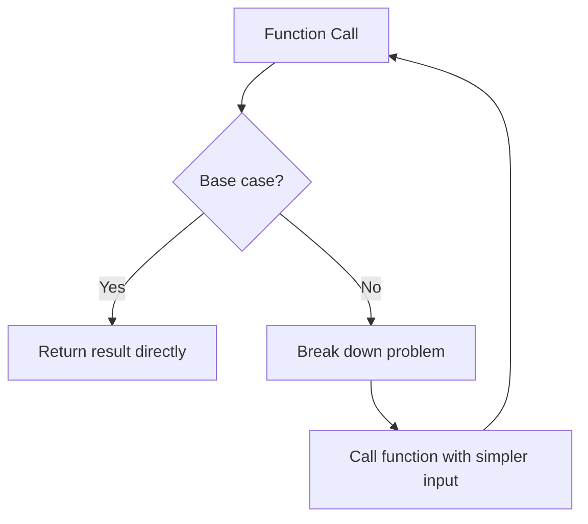
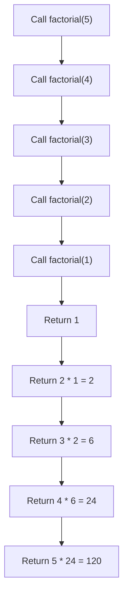
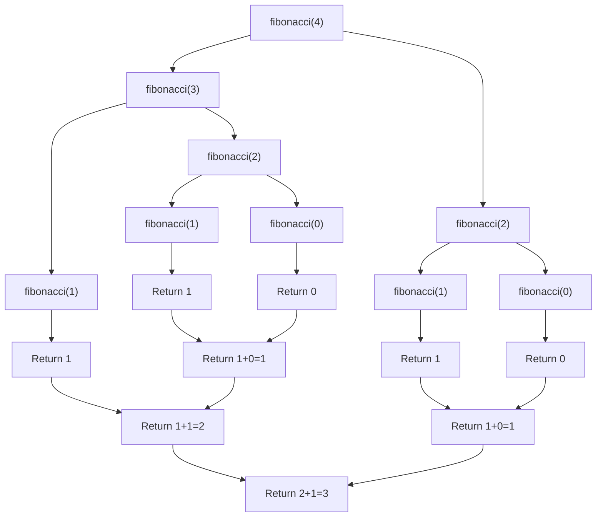

# Recursion Fundamentals

## Introduction

Recursion is a powerful technique in programming where a function calls itself to solve a problem. Think of it as a way to break down complex problems into simpler versions of the same problem. It's like looking at a reflection in two facing mirrors - you see the same image repeated over and over, becoming smaller each time.

Recursion is fundamental to many algorithms and can often provide elegant solutions to problems that would otherwise require complex iterative approaches. In this tutorial, we'll explore the core concepts of recursion, examine how it works under the hood, and look at practical examples to solidify your understanding.

## The Anatomy of Recursion

Every recursive solution has two essential components:

1. **Base case(s)**: The simplest scenario that can be solved directly without further recursion. This is our "exit condition" that prevents infinite recursion.

2. **Recursive case(s)**: The scenario where the function calls itself with a simpler version of the original problem.

Let's visualize this structure:



## Your First Recursive Function

Let's start with a classic example: calculating the factorial of a number.

The factorial of a number n (written as n!) is the product of all positive integers less than or equal to n. For example:
- 5! = 5 × 4 × 3 × 2 × 1 = 120
- 3! = 3 × 2 × 1 = 6

Here's how we implement it recursively:

```javascript
function factorial(n) {
  // Base case: factorial of 0 or 1 is 1
  if (n === 0 || n === 1) {
    return 1;
  }
  
  // Recursive case: n! = n × (n-1)!
  return n * factorial(n - 1);
}

console.log(factorial(5)); // Output: 120
```

### How It Works

Let's trace through the execution of `factorial(5)`:

1. Is 5 equal to 0 or 1? No, so we calculate `5 * factorial(4)`
2. For `factorial(4)`: Is 4 equal to 0 or 1? No, so we calculate `4 * factorial(3)`
3. For `factorial(3)`: Is 3 equal to 0 or 1? No, so we calculate `3 * factorial(2)`
4. For `factorial(2)`: Is 2 equal to 0 or 1? No, so we calculate `2 * factorial(1)`
5. For `factorial(1)`: Is 1 equal to 0 or 1? Yes! Return 1
6. Now we can complete the calculations:
   - `2 * factorial(1)` = `2 * 1` = `2`
   - `3 * factorial(2)` = `3 * 2` = `6`
   - `4 * factorial(3)` = `4 * 6` = `24`
   - `5 * factorial(4)` = `5 * 24` = `120`

The final result is 120.

## The Call Stack

To understand recursion better, it's important to know how the call stack works. When a function calls itself recursively, each call is added to the call stack, and the system remembers where to return to after each function completes.

Let's visualize the call stack for `factorial(5)`:



This process of "unwinding" the call stack is what gives us our final answer.

## Another Example: Fibonacci Sequence

The Fibonacci sequence is a classic example where recursion shines. The sequence starts with 0 and 1, and each subsequent number is the sum of the two preceding ones: 0, 1, 1, 2, 3, 5, 8, 13, ...

Mathematically, the nth Fibonacci number is defined as:
- F(0) = 0
- F(1) = 1
- F(n) = F(n-1) + F(n-2) for n > 1

Here's a recursive implementation:

```python
def fibonacci(n):
    # Base cases
    if n == 0:
        return 0
    if n == 1:
        return 1
    
    # Recursive case
    return fibonacci(n - 1) + fibonacci(n - 2)

# Test the function
for i in range(10):
    print(f"F({i}) = {fibonacci(i)}")
```

Output:
```
F(0) = 0
F(1) = 1
F(2) = 1
F(3) = 2
F(4) = 3
F(5) = 5
F(6) = 8
F(7) = 13
F(8) = 21
F(9) = 34
```

### Tracing Fibonacci

Let's trace `fibonacci(4)` to see the recursive calls:



Note the inefficiency here: we calculate `fibonacci(2)` twice! This is where techniques like memoization (storing previously calculated results) come in handy for optimization.

## Recursion vs. Iteration

Recursion isn't always the best solution. Here's a comparison:

| Aspect | Recursion | Iteration |
|--------|-----------|-----------|
| Code clarity | Often clearer for problems with recursive structure | Better for simpler problems |
| Memory usage | Uses more memory (call stack) | Usually more memory efficient |
| Performance | Can be slower due to function call overhead | Generally faster |
| Infinite loops | Stack overflow errors | Infinite loops without crashes |

Often, problems that can be solved recursively can also be solved iteratively. For example, here's an iterative version of factorial:

```javascript
function factorialIterative(n) {
  let result = 1;
  for (let i = 2; i <= n; i++) {
    result *= i;
  }
  return result;
}

console.log(factorialIterative(5)); // Output: 120
```

## Common Recursive Patterns

### 1. Linear Recursion

In linear recursion, each function makes at most one recursive call. Examples include factorial and simple list traversal.

```python
def sum_list(arr):
    # Base case: empty list
    if len(arr) == 0:
        return 0
    
    # Recursive case: first element + sum of rest
    return arr[0] + sum_list(arr[1:])

print(sum_list([1, 2, 3, 4, 5]))  # Output: 15
```

### 2. Binary Recursion

In binary recursion, each function makes two recursive calls. The Fibonacci function above is an example.

### 3. Tail Recursion

Tail recursion is a special form where the recursive call is the last operation in the function. This can be optimized by many compilers.

```python
def factorial_tail(n, accumulator=1):
    # Base case
    if n == 0 or n == 1:
        return accumulator
    
    # Tail recursive call
    return factorial_tail(n - 1, n * accumulator)

print(factorial_tail(5))  # Output: 120
```

## Practical Applications

### 1. Directory Traversal

Recursion is perfect for traversing nested structures like file systems:

```javascript
function listAllFiles(directory) {
  let files = [];
  
  // Get all files and subdirectories
  const items = fs.readdirSync(directory);
  
  for (const item of items) {
    const fullPath = path.join(directory, item);
    const stats = fs.statSync(fullPath);
    
    if (stats.isFile()) {
      // Base case: it's a file
      files.push(fullPath);
    } else if (stats.isDirectory()) {
      // Recursive case: it's a directory
      files = files.concat(listAllFiles(fullPath));
    }
  }
  
  return files;
}
```

### 2. Sorting Algorithms

Many efficient sorting algorithms use recursion, including QuickSort and MergeSort:

```python
def quicksort(arr):
    # Base case: arrays of length 0 or 1 are already sorted
    if len(arr) <= 1:
        return arr
    
    # Choose pivot and partition array
    pivot = arr[len(arr) // 2]
    left = [x for x in arr if x < pivot]
    middle = [x for x in arr if x == pivot]
    right = [x for x in arr if x > pivot]
    
    # Recursive case: sort each partition and combine
    return quicksort(left) + middle + quicksort(right)

print(quicksort([3, 6, 8, 10, 1, 2, 1]))  # Output: [1, 1, 2, 3, 6, 8, 10]
```

### 3. Tree Traversal

Trees are naturally recursive structures, making recursion ideal for traversing them:

```javascript
class TreeNode {
  constructor(value) {
    this.value = value;
    this.left = null;
    this.right = null;
  }
}

// In-order traversal
function inOrderTraversal(node, result = []) {
  if (node === null) {
    return result;
  }
  
  // Visit left subtree
  inOrderTraversal(node.left, result);
  
  // Visit current node
  result.push(node.value);
  
  // Visit right subtree
  inOrderTraversal(node.right, result);
  
  return result;
}
```

## Common Pitfalls and How to Avoid Them

### 1. Missing Base Case

Without a proper base case, your recursion will continue indefinitely until a stack overflow occurs:

```javascript
// DON'T DO THIS
function infiniteRecursion(n) {
  return n + infiniteRecursion(n - 1);  // No base case!
}
```

Always ensure you have a well-defined base case.

### 2. Not Approaching the Base Case

Even with a base case, if your recursive calls don't move towards it, you'll still have an infinite recursion:

```javascript
// DON'T DO THIS
function badFactorial(n) {
  if (n === 0) return 1;
  return n * badFactorial(n);  // n never decreases!
}
```

Make sure each recursive call brings you closer to the base case.

### 3. Stack Overflow

For deeply nested recursion, you may encounter a stack overflow:

```javascript
// May cause stack overflow for large n
function recursiveSum(n) {
  if (n <= 0) return 0;
  return n + recursiveSum(n - 1);
}

recursiveSum(100000);  // Stack overflow!
```

Consider using tail recursion or converting to an iterative solution for very deep recursions.

## Advanced Concepts

### 1. Mutual Recursion

Mutual recursion occurs when two or more functions call each other recursively:

```javascript
function isEven(n) {
  if (n === 0) return true;
  return isOdd(n - 1);
}

function isOdd(n) {
  if (n === 0) return false;
  return isEven(n - 1);
}

console.log(isEven(4));  // Output: true
console.log(isOdd(3));   // Output: true
```

### 2. Memoization

Remember the inefficiency in our Fibonacci example? We can optimize it using memoization - storing previously calculated results:

```python
def fibonacci_memoized(n, memo={}):
    # Check if we've already calculated this
    if n in memo:
        return memo[n]
    
    # Base cases
    if n == 0:
        return 0
    if n == 1:
        return 1
    
    # Calculate and store result
    memo[n] = fibonacci_memoized(n - 1, memo) + fibonacci_memoized(n - 2, memo)
    return memo[n]

print(fibonacci_memoized(100))  # This would be impossibly slow without memoization
```

## Summary

Recursion is a powerful technique that allows us to solve complex problems by breaking them down into simpler subproblems. Key points to remember:

1. Every recursive solution needs at least one base case and a recursive case.
2. The recursive case must eventually reach the base case to avoid infinite recursion.
3. Recursion uses the call stack, which has memory implications.
4. Many problems can be solved both recursively and iteratively.
5. Recursion shines when dealing with naturally recursive structures (trees, nested directories) or when it simplifies the solution.

As you continue your programming journey, you'll develop an intuition for when recursion is the right tool for the job. Practice with diverse problems to build this intuition!

## Exercises

1. Implement a recursive function to calculate the sum of the first n natural numbers.
2. Write a recursive function to determine if a string is a palindrome.
3. Implement a recursive binary search algorithm.
4. Create a recursive solution for the Tower of Hanoi puzzle.
5. Write a recursive function to flatten a nested list.

## Additional Resources

- "Introduction to Algorithms" by Cormen, Leiserson, Rivest, and Stein (Chapter on Recursion)
- "Think Like a Programmer" by V. Anton Spraul (Chapter on Recursion)
- [Recursion Practice Problems on LeetCode](https://leetcode.com/tag/recursion/)
- [Visualizing Recursion](https://recursion.vercel.app/) - Interactive tool for seeing recursion in action

Happy coding, and remember: to understand recursion, you must first understand recursion! 😉