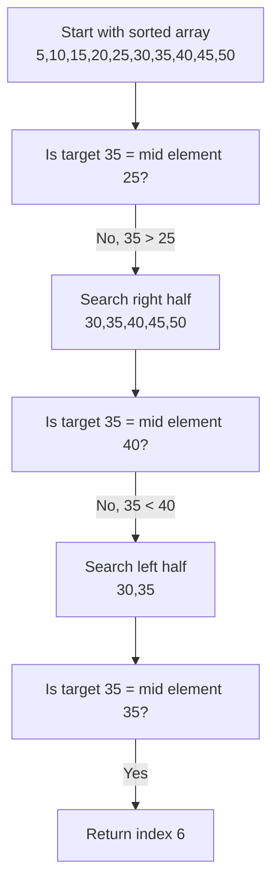

# Searching Algorithms

## Introduction

Searching is one of the most fundamental operations in computer science. Whether you're looking up a contact in your phone, finding a document on your computer, or searching for a product on an e-commerce website, searching algorithms power these operations.

In this tutorial, we'll explore various searching algorithms, understand how they work, analyze their efficiency, and see how they're applied in real-world scenarios. By the end, you'll have a solid foundation in searching algorithms and be able to choose the right algorithm for your specific needs.

## What is a Searching Algorithm?

A searching algorithm is a step-by-step procedure used to locate a specific item within a collection of items. The goal is to find whether a particular element exists in a dataset and, if it does, determine its location.

## Linear Search

Linear search (also known as sequential search) is the simplest searching algorithm. It works by examining each element in the dataset one by one until the target element is found or the end of the dataset is reached.

### How Linear Search Works

1. Start from the leftmost element of the dataset.
2. Compare each element with the target value.
3. If the element matches the target, return its position.
4. If the element doesn't match, move to the next element.
5. If no match is found after checking all elements, return -1 or indicate that the element is not present.

### Linear Search Implementation in Python

```python
def linear_search(arr, target):
    """
    Perform linear search to find target in array
    
    Parameters:
    arr (list): The input list to search through
    target: The value to search for
    
    Returns:
    int: Index of target if found, -1 otherwise
    """
    for i in range(len(arr)):
        if arr[i] == target:
            return i  # Found the target, return its index
    
    return -1  # Target not found
```

### Example

```python
# Example usage
numbers = [5, 10, 15, 20, 25, 30, 35]
result = linear_search(numbers, 20)
print(f"Element found at index: {result}")  # Output: Element found at index: 3

result = linear_search(numbers, 40)
print(f"Element found at index: {result}")  # Output: Element found at index: -1
```

### Complexity Analysis

- **Time Complexity**: O(n) in the worst case, where n is the number of elements in the dataset. In the worst case, we might need to check every element.
- **Space Complexity**: O(1) as we only use a constant amount of extra space.

### When to Use Linear Search

- When the dataset is small.
- When the dataset is unsorted.
- When you need to search for an element just once.
- When simplicity is more important than efficiency.

## Binary Search

Binary search is a more efficient search algorithm that works on sorted arrays. It repeatedly divides the search interval in half, significantly reducing the number of elements to check.

### How Binary Search Works

1. Start with the middle element of the sorted array.
2. If the target value equals the middle element, return the index.
3. If the target value is less than the middle element, search in the left half.
4. If the target value is greater than the middle element, search in the right half.
5. Repeat steps 1-4 until the target is found or the search interval is empty.

### Binary Search Implementation in Python

```python
def binary_search(arr, target):
    """
    Perform binary search to find target in a sorted array
    
    Parameters:
    arr (list): The sorted input list to search through
    target: The value to search for
    
    Returns:
    int: Index of target if found, -1 otherwise
    """
    left = 0
    right = len(arr) - 1
    
    while left <= right:
        mid = (left + right) // 2
        
        # Check if target is present at mid
        if arr[mid] == target:
            return mid
        
        # If target is greater, ignore left half
        elif arr[mid] < target:
            left = mid + 1
        
        # If target is smaller, ignore right half
        else:
            right = mid - 1
    
    # Element not present in array
    return -1
```

### Recursive Implementation

```python
def binary_search_recursive(arr, target, left, right):
    """
    Recursive implementation of binary search
    
    Parameters:
    arr (list): The sorted input list to search through
    target: The value to search for
    left (int): Left boundary of search interval
    right (int): Right boundary of search interval
    
    Returns:
    int: Index of target if found, -1 otherwise
    """
    # Base case: element not found
    if left > right:
        return -1
    
    mid = (left + right) // 2
    
    # If element is at mid
    if arr[mid] == target:
        return mid
    
    # If element is smaller than mid, search in left subarray
    elif arr[mid] > target:
        return binary_search_recursive(arr, target, left, mid - 1)
    
    # If element is larger than mid, search in right subarray
    else:
        return binary_search_recursive(arr, target, mid + 1, right)
```

### Example

```python
# Example usage
sorted_numbers = [5, 10, 15, 20, 25, 30, 35, 40, 45, 50]
result = binary_search(sorted_numbers, 35)
print(f"Element found at index: {result}")  # Output: Element found at index: 6

result = binary_search(sorted_numbers, 42)
print(f"Element found at index: {result}")  # Output: Element found at index: -1

# Using recursive implementation
result = binary_search_recursive(sorted_numbers, 25, 0, len(sorted_numbers) - 1)
print(f"Element found at index: {result}")  # Output: Element found at index: 4
```

### Visualizing Binary Search



### Complexity Analysis

- **Time Complexity**: O(log n) in the worst case, where n is the number of elements. Each step divides the search interval in half.
- **Space Complexity**: O(1) for iterative implementation, O(log n) for recursive implementation due to the call stack.

### When to Use Binary Search

- When the dataset is sorted.
- When the dataset is large and you need efficiency.
- When you're searching multiple times in the same dataset.
- When memory usage is a concern (iterative approach).

## Jump Search

Jump search is an algorithm that works on sorted arrays. It jumps ahead by fixed steps and then uses linear search to find the exact location.

### How Jump Search Works

1. Determine a block size to jump (typically √n where n is the array size).
2. Jump from index 0 to block size, then to 2*block size, and so on until finding a block where the element is less than or equal to the target.
3. Perform a linear search in this block to find the exact location of the target.

### Jump Search Implementation in Python

```python
import math

def jump_search(arr, target):
    """
    Perform jump search to find target in a sorted array
    
    Parameters:
    arr (list): The sorted input list to search through
    target: The value to search for
    
    Returns:
    int: Index of target if found, -1 otherwise
    """
    n = len(arr)
    # Finding block size to be jumped
    step = int(math.sqrt(n))
    
    # Finding the block where element is present (if it is present)
    prev = 0
    while arr[min(step, n) - 1] < target:
        prev = step
        step += int(math.sqrt(n))
        if prev >= n:
            return -1
    
    # Doing a linear search for target in block
    while arr[prev] < target:
        prev += 1
        
        # If we reached next block or end of array, element is not present
        if prev == min(step, n):
            return -1
    
    # If element is found
    if arr[prev] == target:
        return prev
    
    return -1
```

### Complexity Analysis

- **Time Complexity**: O(√n) in the worst case.
- **Space Complexity**: O(1) as it uses a constant amount of extra space.

## Interpolation Search

Interpolation search improves binary search by estimating the position of the target value. It works well for uniformly distributed data.

### How Interpolation Search Works

1. Instead of always checking the middle element like in binary search, interpolation search estimates the likely position of the target based on its value and the range of values in the array.
2. The formula used to calculate the position is:
   pos = low + ((target - arr[low]) * (high - low)) / (arr[high] - arr[low])
3. This is similar to how we might search for a name in a phone book - we'd open the book closer to 'A' for names starting with 'A' and closer to 'Z' for names starting with 'Z'.

### Interpolation Search Implementation in Python

```python
def interpolation_search(arr, target):
    """
    Perform interpolation search to find target in a sorted array
    
    Parameters:
    arr (list): The sorted input list to search through
    target: The value to search for
    
    Returns:
    int: Index of target if found, -1 otherwise
    """
    low = 0
    high = len(arr) - 1
    
    while low <= high and target >= arr[low] and target <= arr[high]:
        if low == high:
            if arr[low] == target:
                return low
            return -1
        
        # Estimate position using interpolation formula
        pos = low + int(((target - arr[low]) * (high - low)) / (arr[high] - arr[low]))
        
        if arr[pos] == target:
            return pos
        
        if arr[pos] < target:
            low = pos + 1
        else:
            high = pos - 1
    
    return -1
```

### Complexity Analysis

- **Time Complexity**: O(log log n) for uniformly distributed data, O(n) in the worst case.
- **Space Complexity**: O(1) as it uses a constant amount of extra space.

## Hash-Based Searching

Hashing is a technique that uses a hash function to map keys to array indices, allowing for very fast searches.

### How Hash-Based Searching Works

1. A hash function transforms the search key into an array index.
2. The element is stored at this index in a hash table.
3. To search for an element, compute its hash and directly access that index.
4. Handle collisions (when two different keys hash to the same index) using methods like chaining or open addressing.

### Example: Using Python's Dictionary for Hash-Based Searching

```python
def hash_search_example():
    # Creating a hash table (Python dictionary)
    phone_book = {
        "Alice": "555-1234",
        "Bob": "555-5678",
        "Charlie": "555-9012",
        "David": "555-3456",
        "Eve": "555-7890"
    }
    
    # Searching for a phone number
    name = "Charlie"
    if name in phone_book:
        print(f"{name}'s phone number is {phone_book[name]}")
    else:
        print(f"No phone number found for {name}")
        
    # Another search
    name = "Frank"
    if name in phone_book:
        print(f"{name}'s phone number is {phone_book[name]}")
    else:
        print(f"No phone number found for {name}")
```

### Complexity Analysis

- **Time Complexity**: O(1) on average for search, insert, and delete operations, O(n) in the worst case (when all keys hash to the same index).
- **Space Complexity**: O(n) where n is the number of elements.

## Real-World Applications

### 1. Database Indexing

Databases use binary search trees and hash-based searching to quickly locate records.

```python
# Simplified example of a database query with an index
def query_database(database, index, target_id):
    """
    Uses an index to quickly locate a record in a database
    """
    if target_id in index:
        record_position = index[target_id]
        return database[record_position]
    else:
        return "Record not found"
```

### 2. Search Engines

Search engines use complex algorithms derived from basic search techniques to find relevant web pages.

### 3. Spell Checkers

Spell checkers use algorithms like binary search on a sorted dictionary to quickly verify if a word exists.

### 4. Autocomplete Feature

When you type in a search bar, the autocomplete feature uses search algorithms to find matching suggestions.

```python
def autocomplete(prefix, word_list):
    """
    Finds all words in word_list that start with the given prefix
    """
    suggestions = []
    for word in word_list:
        if word.startswith(prefix):
            suggestions.append(word)
    return suggestions
```

### 5. Finding Elements in Sorted Data

Binary search is commonly used in finding elements in sorted arrays, for example in phone contacts or a sorted list of products.

## Choosing the Right Searching Algorithm

Here's a comparison to help you choose the right algorithm for your needs:

| Algorithm | Time Complexity | Space Complexity | Best Used When |
|-----------|----------------|-----------------|----------------|
| Linear Search | O(n) | O(1) | Dataset is small or unsorted |
| Binary Search | O(log n) | O(1) | Dataset is sorted and large |
| Jump Search | O(√n) | O(1) | Dataset is sorted and binary search is too complex |
| Interpolation Search | O(log log n) average | O(1) | Dataset is sorted and uniformly distributed |
| Hash-Based | O(1) average | O(n) | Fast access is needed and space isn't a concern |

## Summary

In this tutorial, we've explored several essential searching algorithms:

- **Linear Search**: The simplest approach, checking each element one by one.
- **Binary Search**: A divide-and-conquer approach that works efficiently on sorted arrays.
- **Jump Search**: A compromise between linear and binary search.
- **Interpolation Search**: An improvement over binary search for uniformly distributed data.
- **Hash-Based Searching**: Using hash functions for constant-time lookups.

Understanding these algorithms and their characteristics helps you make informed decisions about which one to use based on your specific requirements, data structure, and performance needs.

## Exercises

1. Implement a linear search function that returns all occurrences of a target value in an array.
2. Modify the binary search algorithm to find the first occurrence of a target value in a sorted array with duplicates.
3. Compare the performance of linear search and binary search on arrays of different sizes.
4. Implement a phone book application that allows searching by name using hash-based searching.
5. Write a function that uses binary search to find the square root of a number to a given precision.

## Additional Resources

- "Introduction to Algorithms" by Thomas H. Cormen, Charles E. Leiserson, Ronald L. Rivest, and Clifford Stein
- "Algorithms, 4th Edition" by Robert Sedgewick and Kevin Wayne
- "The Art of Computer Programming, Volume 3: Sorting and Searching" by Donald E. Knuth
- Online platforms like LeetCode, HackerRank, and GeeksforGeeks provide practice problems focused on searching algorithms