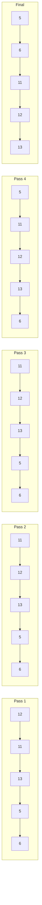
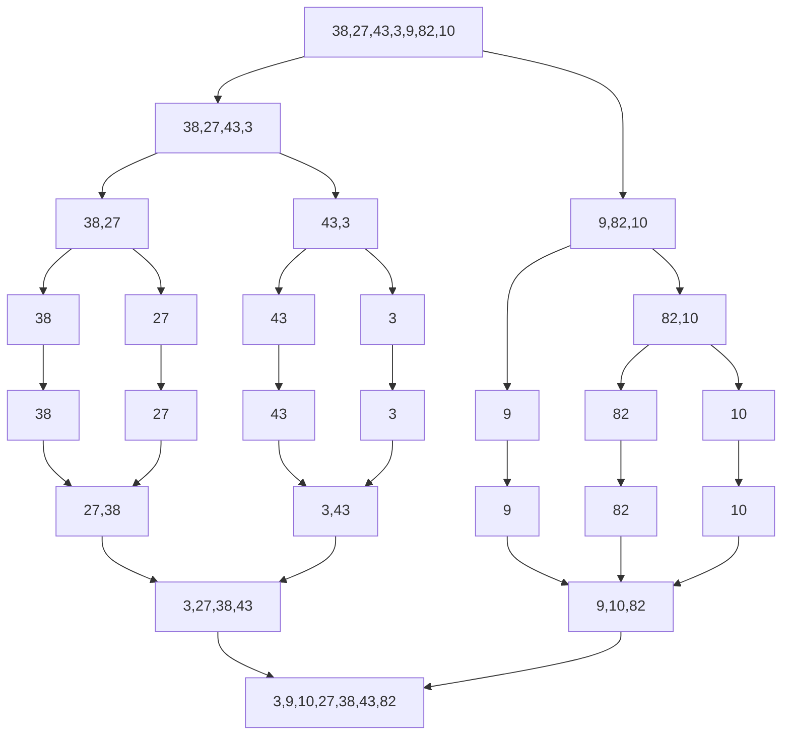

# Sorting Algorithms

## Introduction

Sorting is a fundamental operation in computer science that arranges elements in a specific order, typically ascending or descending. Efficient sorting is crucial for optimizing other algorithms that require sorted input data.

In this tutorial, we'll explore various sorting algorithms, understand how they work, analyze their performance characteristics, and see where they're used in real-world applications.

## Why Learn Sorting Algorithms?

You might wonder, "Why should I learn different sorting techniques when programming languages already have built-in sort functions?" Here's why:

1. **Understanding fundamentals**: Sorting algorithms teach essential algorithmic concepts like divide-and-conquer, recursion, and in-place operations.
2. **Algorithm analysis**: They provide excellent examples for learning about time and space complexity.
3. **Interview preparation**: Sorting algorithms are common topics in technical interviews.
4. **Optimization knowledge**: Knowing which algorithm to use in different scenarios can significantly impact your application's performance.

## Common Sorting Algorithms

Let's dive into some of the most important sorting algorithms:

### Bubble Sort

Bubble Sort is one of the simplest sorting algorithms. It repeatedly steps through the list, compares adjacent elements, and swaps them if they're in the wrong order.

#### How It Works

1. Compare each pair of adjacent elements.
2. If they are in the wrong order, swap them.
3. Continue until no more swaps are needed.

#### Implementation

```javascript
function bubbleSort(arr) {
  const n = arr.length;
  
  for (let i = 0; i < n; i++) {
    // Flag to optimize if array is already sorted
    let swapped = false;
    
    // Last i elements are already sorted
    for (let j = 0; j < n - i - 1; j++) {
      // Compare adjacent elements
      if (arr[j] > arr[j + 1]) {
        // Swap them if they are in the wrong order
        [arr[j], arr[j + 1]] = [arr[j + 1], arr[j]];
        swapped = true;
      }
    }
    
    // If no swapping occurred in this pass, array is sorted
    if (!swapped) break;
  }
  
  return arr;
}
```

#### Example

```javascript
const numbers = [64, 34, 25, 12, 22, 11, 90];
console.log("Original array:", numbers);
console.log("Sorted array:", bubbleSort([...numbers]));

// Output:
// Original array: [64, 34, 25, 12, 22, 11, 90]
// Sorted array: [11, 12, 22, 25, 34, 64, 90]
```

#### Time Complexity
- **Best Case**: O(n) - when the array is already sorted
- **Average Case**: O(n²)
- **Worst Case**: O(n²)

#### Space Complexity
- O(1) - Bubble Sort is an in-place sorting algorithm

### Selection Sort

Selection Sort divides the input list into two parts: a sorted sublist and an unsorted sublist. It repeatedly finds the minimum element from the unsorted sublist and moves it to the end of the sorted sublist.

#### How It Works

1. Find the minimum element in the unsorted part.
2. Swap it with the element at the beginning of the unsorted part.
3. Move the boundary between sorted and unsorted subarrays one element to the right.

#### Implementation

```javascript
function selectionSort(arr) {
  const n = arr.length;
  
  for (let i = 0; i < n - 1; i++) {
    // Find the minimum element in the unsorted array
    let minIndex = i;
    
    for (let j = i + 1; j < n; j++) {
      if (arr[j] < arr[minIndex]) {
        minIndex = j;
      }
    }
    
    // Swap the found minimum element with the first element
    if (minIndex !== i) {
      [arr[i], arr[minIndex]] = [arr[minIndex], arr[i]];
    }
  }
  
  return arr;
}
```

#### Example

```javascript
const numbers = [64, 25, 12, 22, 11];
console.log("Original array:", numbers);
console.log("Sorted array:", selectionSort([...numbers]));

// Output:
// Original array: [64, 25, 12, 22, 11]
// Sorted array: [11, 12, 22, 25, 64]
```

#### Time Complexity
- **Best Case**: O(n²)
- **Average Case**: O(n²)
- **Worst Case**: O(n²)

#### Space Complexity
- O(1) - Selection Sort is an in-place sorting algorithm

### Insertion Sort

Insertion Sort builds the final sorted array one item at a time. It's efficient for small data sets and is often used as part of more sophisticated algorithms.

#### How It Works

1. Start with the second element (assume the first element is sorted).
2. Compare the current element with the previous elements.
3. If the previous element is greater, move it one position up.
4. Repeat until the correct position for the current element is found.
5. Repeat steps 2-4 for all elements.

#### Implementation

```javascript
function insertionSort(arr) {
  const n = arr.length;
  
  for (let i = 1; i < n; i++) {
    // Store the current element
    let current = arr[i];
    
    // Find position to insert current element
    let j = i - 1;
    while (j >= 0 && arr[j] > current) {
      arr[j + 1] = arr[j];
      j--;
    }
    
    // Insert at the correct position
    arr[j + 1] = current;
  }
  
  return arr;
}
```

#### Example

```javascript
const numbers = [12, 11, 13, 5, 6];
console.log("Original array:", numbers);
console.log("Sorted array:", insertionSort([...numbers]));

// Output:
// Original array: [12, 11, 13, 5, 6]
// Sorted array: [5, 6, 11, 12, 13]
```

#### Visualization



#### Time Complexity
- **Best Case**: O(n) - when the array is already sorted
- **Average Case**: O(n²)
- **Worst Case**: O(n²)

#### Space Complexity
- O(1) - Insertion Sort is an in-place sorting algorithm

### Merge Sort

Merge Sort is an efficient, stable sorting algorithm that uses the divide-and-conquer strategy. It divides the input array into two halves, recursively sorts them, and then merges the sorted halves.

#### How It Works

1. Divide the unsorted list into n sublists, each containing one element.
2. Repeatedly merge sublists to produce new sorted sublists until there is only one sublist remaining.

#### Implementation

```javascript
function mergeSort(arr) {
  // Base case: array with 0 or 1 element is already sorted
  if (arr.length <= 1) {
    return arr;
  }
  
  // Divide the array into two halves
  const middle = Math.floor(arr.length / 2);
  const left = arr.slice(0, middle);
  const right = arr.slice(middle);
  
  // Recursively sort both halves
  return merge(
    mergeSort(left),
    mergeSort(right)
  );
}

function merge(left, right) {
  let result = [];
  let leftIndex = 0;
  let rightIndex = 0;
  
  // Compare elements from both arrays and add the smaller one to result
  while (leftIndex < left.length && rightIndex < right.length) {
    if (left[leftIndex] < right[rightIndex]) {
      result.push(left[leftIndex]);
      leftIndex++;
    } else {
      result.push(right[rightIndex]);
      rightIndex++;
    }
  }
  
  // Add remaining elements
  return result.concat(left.slice(leftIndex)).concat(right.slice(rightIndex));
}
```

#### Example

```javascript
const numbers = [38, 27, 43, 3, 9, 82, 10];
console.log("Original array:", numbers);
console.log("Sorted array:", mergeSort([...numbers]));

// Output:
// Original array: [38, 27, 43, 3, 9, 82, 10]
// Sorted array: [3, 9, 10, 27, 38, 43, 82]
```

#### Visualization



#### Time Complexity
- **Best Case**: O(n log n)
- **Average Case**: O(n log n)
- **Worst Case**: O(n log n)

#### Space Complexity
- O(n) - Merge Sort requires additional space for merging

### Quick Sort

Quick Sort is another divide-and-conquer algorithm that picks an element as a pivot and partitions the array around the pivot.

#### How It Works

1. Choose a pivot element from the array.
2. Partition: reorder the array so that all elements less than the pivot come before it, and all elements greater than the pivot come after it.
3. Recursively apply the above steps to the sub-arrays formed by the partition.

#### Implementation

```javascript
function quickSort(arr, low = 0, high = arr.length - 1) {
  if (low < high) {
    // Find the partition index
    const partitionIndex = partition(arr, low, high);
    
    // Sort elements before and after partition
    quickSort(arr, low, partitionIndex - 1);
    quickSort(arr, partitionIndex + 1, high);
  }
  
  return arr;
}

function partition(arr, low, high) {
  // Choose the rightmost element as pivot
  const pivot = arr[high];
  
  // Index of smaller element
  let i = low - 1;
  
  for (let j = low; j < high; j++) {
    // If current element is smaller than the pivot
    if (arr[j] < pivot) {
      i++;
      // Swap arr[i] and arr[j]
      [arr[i], arr[j]] = [arr[j], arr[i]];
    }
  }
  
  // Swap arr[i+1] and arr[high] (or pivot)
  [arr[i + 1], arr[high]] = [arr[high], arr[i + 1]];
  
  return i + 1;
}
```

#### Example

```javascript
const numbers = [10, 7, 8, 9, 1, 5];
console.log("Original array:", numbers);
console.log("Sorted array:", quickSort([...numbers]));

// Output:
// Original array: [10, 7, 8, 9, 1, 5]
// Sorted array: [1, 5, 7, 8, 9, 10]
```

#### Time Complexity
- **Best Case**: O(n log n)
- **Average Case**: O(n log n)
- **Worst Case**: O(n²) - when the pivot selection is poor

#### Space Complexity
- O(log n) - for recursion stack

### Heap Sort

Heap Sort uses a binary heap data structure to sort elements. It first builds a max heap and then repeatedly extracts the maximum element.

#### How It Works

1. Build a max heap from the input data.
2. Swap the root (maximum element) with the last element and reduce the heap size by 1.
3. Heapify the root of the tree.
4. Repeat steps 2 and 3 until the heap size is 1.

#### Implementation

```javascript
function heapSort(arr) {
  const n = arr.length;
  
  // Build max heap
  for (let i = Math.floor(n / 2) - 1; i >= 0; i--) {
    heapify(arr, n, i);
  }
  
  // Extract elements from heap one by one
  for (let i = n - 1; i > 0; i--) {
    // Move current root to end
    [arr[0], arr[i]] = [arr[i], arr[0]];
    
    // Call max heapify on the reduced heap
    heapify(arr, i, 0);
  }
  
  return arr;
}

function heapify(arr, n, i) {
  let largest = i;
  const left = 2 * i + 1;
  const right = 2 * i + 2;
  
  // If left child is larger than root
  if (left < n && arr[left] > arr[largest]) {
    largest = left;
  }
  
  // If right child is larger than largest so far
  if (right < n && arr[right] > arr[largest]) {
    largest = right;
  }
  
  // If largest is not root
  if (largest !== i) {
    // Swap
    [arr[i], arr[largest]] = [arr[largest], arr[i]];
    
    // Recursively heapify the affected sub-tree
    heapify(arr, n, largest);
  }
}
```

#### Example

```javascript
const numbers = [12, 11, 13, 5, 6, 7];
console.log("Original array:", numbers);
console.log("Sorted array:", heapSort([...numbers]));

// Output:
// Original array: [12, 11, 13, 5, 6, 7]
// Sorted array: [5, 6, 7, 11, 12, 13]
```

#### Time Complexity
- **Best Case**: O(n log n)
- **Average Case**: O(n log n)
- **Worst Case**: O(n log n)

#### Space Complexity
- O(1) - Heap Sort is an in-place sorting algorithm

## Comparison of Sorting Algorithms

This table summarizes the performance characteristics of the sorting algorithms we've covered:

| Algorithm | Time Complexity (Best) | Time Complexity (Average) | Time Complexity (Worst) | Space Complexity | Stable |
|-----------|------------------------|---------------------------|-------------------------|------------------|--------|
| Bubble Sort | O(n) | O(n²) | O(n²) | O(1) | Yes |
| Selection Sort | O(n²) | O(n²) | O(n²) | O(1) | No |
| Insertion Sort | O(n) | O(n²) | O(n²) | O(1) | Yes |
| Merge Sort | O(n log n) | O(n log n) | O(n log n) | O(n) | Yes |
| Quick Sort | O(n log n) | O(n log n) | O(n²) | O(log n) | No |
| Heap Sort | O(n log n) | O(n log n) | O(n log n) | O(1) | No |

### When to Use Which Algorithm

- **Bubble Sort**: Educational purposes or for very small datasets. Rarely used in production.
- **Selection Sort**: Simple implementation, performs well on small arrays, and when memory writing is costly.
- **Insertion Sort**: Efficient for small data sets or nearly sorted data. Often used in hybrid sorting algorithms.
- **Merge Sort**: When stable sorting is needed and O(n log n) performance is required. Good for linked lists.
- **Quick Sort**: General-purpose sorting algorithm, often the fastest in practice for arrays.
- **Heap Sort**: When consistent O(n log n) performance is needed and space is a concern.

## Real-World Applications

Sorting algorithms are fundamental in many applications:

### 1. Database Systems
Databases use sorting algorithms to efficiently process queries, especially for operations like ORDER BY clauses in SQL.

```sql
SELECT * FROM customers ORDER BY last_name, first_name;
```

### 2. Search Engines
Search engines sort results based on relevance to provide the most useful information first.

### 3. File Systems
Operating systems sort files and directories alphabetically or by other attributes for easy navigation.

### 4. Compression Algorithms
Some compression algorithms sort data before compression to improve efficiency.

### 5. Computer Graphics
Rendering engines use sorting to determine which objects to render first (e.g., z-buffer algorithms).

## Advanced Sorting Techniques

Beyond the basic algorithms, several advanced techniques exist:

### 1. Hybrid Sorting Algorithms

Many modern programming languages use hybrid sorting algorithms that combine the strengths of different methods:

- **Timsort**: Used in Python and Java, combines Merge Sort and Insertion Sort.
- **Introsort**: Used in C++ STL, combines Quick Sort, Heap Sort, and Insertion Sort.

### 2. Parallel Sorting Algorithms

In multi-core processors, parallel sorting algorithms can significantly improve performance:

- **Parallel Merge Sort**
- **Parallel Quick Sort**
- **Bitonic Sort**

### 3. External Sorting

When data doesn't fit into memory, external sorting algorithms like External Merge Sort are used.

## Summary

Sorting algorithms are fundamental building blocks in computer science. We've covered:

- Simple algorithms like Bubble Sort, Selection Sort, and Insertion Sort
- Efficient algorithms like Merge Sort, Quick Sort, and Heap Sort
- Time and space complexity analysis
- Real-world applications and advanced techniques

Understanding these algorithms provides valuable insights into algorithmic thinking and helps you make informed decisions when implementing sorting in your projects.

## Exercises

1. Implement each sorting algorithm in your preferred programming language.
2. Analyze the performance of different sorting algorithms on various input sizes and patterns.
3. Modify Quick Sort to use different pivot selection strategies and compare their performance.
4. Implement a hybrid sorting algorithm that uses Insertion Sort for small subarrays and Merge Sort for larger ones.
5. Build a visualization tool that demonstrates how each sorting algorithm works.

## Additional Resources

- **Books**:
  - "Introduction to Algorithms" by Cormen, Leiserson, Rivest, and Stein
  - "Algorithms" by Robert Sedgewick and Kevin Wayne
  
- **Online Courses**:
  - MIT OpenCourseWare: "Introduction to Algorithms"
  - Coursera: "Algorithms Specialization" by Stanford University
  
- **Websites**:
  - [Visualgo.net](https://visualgo.net/en/sorting) - Visualize sorting algorithms
  - [GeeksforGeeks Sorting Tutorial](https://www.geeksforgeeks.org/sorting-algorithms/)