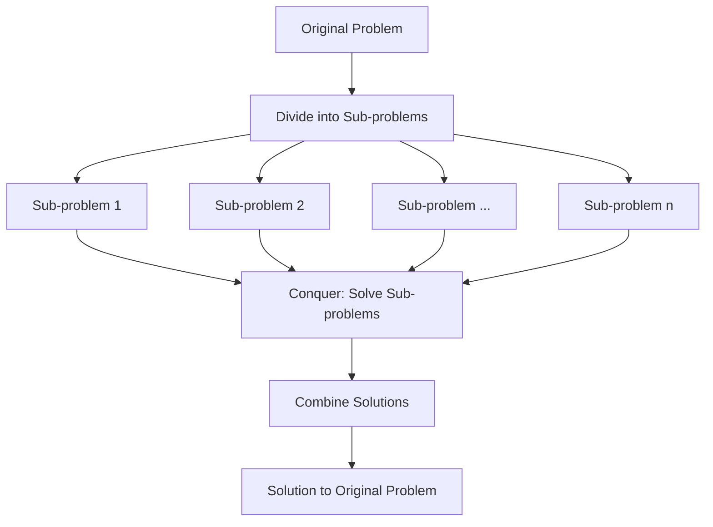

# Divide and Conquer

## Introduction

Divide and Conquer is a powerful algorithmic paradigm used to solve complex problems efficiently. As the name suggests, this approach involves breaking down a problem into smaller, more manageable sub-problems, solving each sub-problem independently, and then combining their solutions to solve the original problem.

The beauty of Divide and Conquer lies in its simplicity and effectiveness. It transforms seemingly difficult problems into a series of simpler ones, often leading to elegant and efficient solutions.

## The Three Steps of Divide and Conquer

The Divide and Conquer approach consists of three essential steps:

1. **Divide**: Break the original problem into smaller sub-problems.
2. **Conquer**: Solve each sub-problem recursively.
3. **Combine**: Merge the solutions of sub-problems to create a solution for the original problem.



## When to Use Divide and Conquer

Divide and Conquer is particularly useful when:

- The problem can be naturally broken down into similar sub-problems
- Sub-problems are independent (solving one doesn't affect the others)
- Solutions to sub-problems can be combined to solve the original problem
- The problem exhibits "optimal substructure" (optimal solution can be constructed from optimal solutions of its sub-problems)

## Common Divide and Conquer Algorithms

Let's explore some classic algorithms that use the Divide and Conquer approach:

### 1. Merge Sort

Merge Sort is a perfect example of Divide and Conquer. It sorts an array by dividing it into halves, sorting each half, and then merging the sorted halves.

```javascript
function mergeSort(arr) {
  // Base case: arrays with 0 or 1 element are already sorted
  if (arr.length <= 1) {
    return arr;
  }

  // Divide the array into two halves
  const middle = Math.floor(arr.length / 2);
  const leftHalf = arr.slice(0, middle);
  const rightHalf = arr.slice(middle);

  // Conquer: recursively sort both halves
  const sortedLeft = mergeSort(leftHalf);
  const sortedRight = mergeSort(rightHalf);

  // Combine: merge the sorted halves
  return merge(sortedLeft, sortedRight);
}

function merge(left, right) {
  let result = [];
  let leftIndex = 0;
  let rightIndex = 0;

  // Compare elements from both arrays and add the smaller one to the result
  while (leftIndex < left.length && rightIndex < right.length) {
    if (left[leftIndex] < right[rightIndex]) {
      result.push(left[leftIndex]);
      leftIndex++;
    } else {
      result.push(right[rightIndex]);
      rightIndex++;
    }
  }

  // Add any remaining elements
  return result.concat(left.slice(leftIndex)).concat(right.slice(rightIndex));
}
```

**Example:**

Input:
```
[38, 27, 43, 3, 9, 82, 10]
```

Output:
```
[3, 9, 10, 27, 38, 43, 82]
```

**Time Complexity**: O(n log n), where n is the number of elements to sort. This is significantly better than the O(n²) complexity of simpler algorithms like Bubble Sort or Insertion Sort for large data sets.

### 2. Binary Search

Binary Search is an efficient algorithm for finding an element in a sorted array by repeatedly dividing the search space in half.

```javascript
function binarySearch(arr, target) {
  // Define the search space with left and right pointers
  let left = 0;
  let right = arr.length - 1;
  
  while (left <= right) {
    // Find the middle element
    const mid = Math.floor((left + right) / 2);
    
    // Found the target
    if (arr[mid] === target) {
      return mid;
    }
    
    // Decide which half to search next
    if (arr[mid] < target) {
      // Target is in the right half
      left = mid + 1;
    } else {
      // Target is in the left half
      right = mid - 1;
    }
  }
  
  // Target not found
  return -1;
}
```

**Example:**

Input:
```
Array: [1, 3, 5, 7, 9, 11, 13, 15, 17, 19]
Target: 7
```

Output:
```
3 (the index of 7 in the array)
```

**Time Complexity**: O(log n), where n is the number of elements in the array. This makes binary search extremely efficient for large datasets.

### 3. Quick Sort

Quick Sort is another popular sorting algorithm that uses the Divide and Conquer approach, though with a slightly different strategy than Merge Sort.

```javascript
function quickSort(arr, left = 0, right = arr.length - 1) {
  if (left < right) {
    // Partition the array and get the pivot index
    const pivotIndex = partition(arr, left, right);
    
    // Recursively sort the sub-arrays
    quickSort(arr, left, pivotIndex - 1);
    quickSort(arr, pivotIndex + 1, right);
  }
  
  return arr;
}

function partition(arr, left, right) {
  // Choose the rightmost element as pivot
  const pivot = arr[right];
  let i = left - 1;
  
  // Move all elements smaller than pivot to the left
  for (let j = left; j < right; j++) {
    if (arr[j] <= pivot) {
      i++;
      [arr[i], arr[j]] = [arr[j], arr[i]]; // Swap elements
    }
  }
  
  // Place pivot in the correct position
  [arr[i + 1], arr[right]] = [arr[right], arr[i + 1]];
  return i + 1; // Return the pivot index
}
```

**Example:**

Input:
```
[9, 7, 5, 11, 12, 2, 14, 3, 10, 6]
```

Output:
```
[2, 3, 5, 6, 7, 9, 10, 11, 12, 14]
```

**Time Complexity**: 
- Average case: O(n log n)
- Worst case: O(n²) (when the pivot selection consistently results in highly imbalanced partitions)

## A Real-World Problem: Finding the Maximum Subarray

Let's look at a practical problem that can be solved with Divide and Conquer: the Maximum Subarray Problem. This problem asks us to find the contiguous subarray within a one-dimensional array of numbers that has the largest sum.

```javascript
function maxSubArray(nums) {
  // Base case: only one element
  if (nums.length === 1) {
    return nums[0];
  }
  
  // Find the middle point
  const mid = Math.floor(nums.length / 2);
  
  // Divide the array into left and right halves
  const leftHalf = nums.slice(0, mid);
  const rightHalf = nums.slice(mid);
  
  // Find maximum subarray sum in left half, right half, and crossing the middle
  const leftMax = maxSubArray(leftHalf);
  const rightMax = maxSubArray(rightHalf);
  const crossMax = maxCrossingSum(nums, mid);
  
  // Return the maximum of the three
  return Math.max(leftMax, rightMax, crossMax);
}

function maxCrossingSum(nums, mid) {
  // Calculate maximum sum of subarray ending at mid-1 (left half)
  let leftSum = 0;
  let maxLeftSum = -Infinity;
  
  for (let i = mid - 1; i >= 0; i--) {
    leftSum += nums[i];
    maxLeftSum = Math.max(maxLeftSum, leftSum);
  }
  
  // Calculate maximum sum of subarray starting at mid (right half)
  let rightSum = 0;
  let maxRightSum = -Infinity;
  
  for (let i = mid; i < nums.length; i++) {
    rightSum += nums[i];
    maxRightSum = Math.max(maxRightSum, rightSum);
  }
  
  // Return the combined sum
  return maxLeftSum + maxRightSum;
}
```

**Example:**

Input:
```
[-2, 1, -3, 4, -1, 2, 1, -5, 4]
```

Output:
```
6 (corresponds to subarray [4, -1, 2, 1])
```

This problem has applications in financial analysis, data mining, and pattern recognition.

## Advantages and Disadvantages

### Advantages
- Solves complex problems efficiently
- Often results in logarithmic time complexity
- Naturally applicable to recursive problems
- Many problems can be elegantly expressed using this paradigm

### Disadvantages
- Recursive implementation may lead to stack overflow for very large inputs
- May have high memory requirements due to the recursive call stack
- Not all problems can be divided into independent sub-problems
- The overhead of recursion might make it less efficient for small inputs

## Summary

The Divide and Conquer approach is a fundamental algorithm design paradigm that solves complex problems by breaking them down into simpler, more manageable sub-problems. It follows three main steps: divide the problem, conquer the sub-problems, and combine their solutions.

We've explored several classic algorithms that use this approach, including Merge Sort, Binary Search, and Quick Sort, as well as a practical application in the Maximum Subarray Problem.

Key benefits of Divide and Conquer include improved efficiency (often achieving O(n log n) or O(log n) time complexity) and elegant, recursive solutions to complex problems.

## Practice Exercises

1. Implement a function to compute x^n using Divide and Conquer. (Hint: x^n can be calculated as x^(n/2) * x^(n/2) for even n, or x * x^(n/2) * x^(n/2) for odd n)

2. Write a function to find the closest pair of points in a 2D plane using Divide and Conquer.

3. Implement the Karatsuba algorithm for fast multiplication of large integers.

4. Use Divide and Conquer to count the number of inversions in an array (an inversion occurs when a[i] > a[j] and i < j).

5. Solve the Skyline problem: Given n rectangular buildings in a 2D city, compute the skyline of these buildings.

## Further Resources

- ["Introduction to Algorithms"](https://mitpress.mit.edu/books/introduction-algorithms-third-edition) by Cormen, Leiserson, Rivest, and Stein - Chapter 4 covers Divide and Conquer in detail
- ["Algorithms"](https://algs4.cs.princeton.edu/home/) by Sedgewick and Wayne
- Online courses on platforms like Coursera, edX, and Khan Academy focusing on algorithmic techniques
- Practice problems on websites like LeetCode, HackerRank, and CodeForces that specifically involve Divide and Conquer strategies