# Greedy Algorithms

## Introduction

Greedy algorithms are simple yet powerful problem-solving strategies that make the locally optimal choice at each step, hoping to find the global optimum solution. The word "greedy" reflects how these algorithms work: they always pick what seems best at the moment without considering the future consequences of that choice.

Think of greedy algorithms like hiking up a mountain when you can't see the peak due to fog. At each step, you simply choose to go in the direction that takes you highest (the locally optimal choice), hoping this will eventually lead you to the summit (the global optimum).

While this approach doesn't always guarantee the best possible solution for every problem, greedy algorithms are:

- Easy to implement
- Computationally efficient
- Surprisingly effective for many important problems

## When to Use Greedy Algorithms

Greedy algorithms work well when a problem has these properties:

1. **Greedy choice property**: A globally optimal solution can be reached by making locally optimal choices.
2. **Optimal substructure**: The optimal solution to the problem contains optimal solutions to its subproblems.

Not every problem satisfies these properties, so it's important to verify that a greedy approach will work before implementing it.

## Common Greedy Algorithm Examples

Let's explore some classic problems that can be solved using greedy algorithms.

### 1. Coin Change Problem

**Problem**: Given a set of coin denominations and a target amount, find the minimum number of coins needed to make that amount.

**Greedy Approach**: Always choose the largest denomination coin that doesn't exceed the remaining amount.

```javascript
function makeChange(coins, amount) {
  // Sort coins in descending order
  coins.sort((a, b) => b - a);
  
  let count = 0;
  let remainingAmount = amount;
  let coinsUsed = {};
  
  for (let coin of coins) {
    // Use as many of the current coin as possible
    const numCoins = Math.floor(remainingAmount / coin);
    
    if (numCoins > 0) {
      coinsUsed[coin] = numCoins;
      count += numCoins;
      remainingAmount -= coin * numCoins;
    }
    
    // If we've made the full amount, we're done
    if (remainingAmount === 0) break;
  }
  
  // Check if we were able to make the full amount
  if (remainingAmount > 0) {
    return "Cannot make exact change with given coins";
  }
  
  return {
    totalCoins: count,
    coinsUsed: coinsUsed
  };
}

// Example usage:
const coins = [25, 10, 5, 1]; // Quarter, dime, nickel, penny
const amount = 63;
console.log(makeChange(coins, amount));
// Output: { totalCoins: 6, coinsUsed: { '25': 2, '10': 1, '1': 3 } }
```

**Note**: While the greedy approach works for US coin denominations, it doesn't work for all possible coin sets. For example, if we had coins [1, 3, 4] and wanted to make 6, the greedy approach would give us 4+1+1=3 coins, but the optimal solution is 3+3=2 coins.

### 2. Activity Selection Problem

**Problem**: You have a set of activities, each with a start and finish time. You want to select the maximum number of activities that don't overlap.

**Greedy Approach**: Sort activities by finish time and always select the activity that finishes earliest among the remaining compatible activities.

```python
def activity_selection(activities):
    # Sort activities by finish time
    activities.sort(key=lambda x: x[1])
    
    selected = [activities[0]]  # Select first activity
    last_finish_time = activities[0][1]
    
    for i in range(1, len(activities)):
        # If this activity starts after the last selected activity finishes
        if activities[i][0] >= last_finish_time:
            selected.append(activities[i])
            last_finish_time = activities[i][1]
    
    return selected

# Example usage:
# Format: (start_time, finish_time)
activities = [(1, 4), (3, 5), (0, 6), (5, 7), (3, 9), (5, 9), (6, 10), (8, 11), (8, 12), (2, 14), (12, 16)]
selected_activities = activity_selection(activities)

print("Selected activities:")
for activity in selected_activities:
    print(f"Start: {activity[0]}, Finish: {activity[1]}")

# Output:
# Selected activities:
# Start: 1, Finish: 4
# Start: 5, Finish: 7
# Start: 8, Finish: 11
# Start: 12, Finish: 16
```

Let's visualize this example with a timeline diagram:

```mermaid
gantt
    title Activity Selection Problem
    dateFormat  HH
    axisFormat %H
    
    section Activities
    Activity 1 : 01, 4h
    Activity 2 : 03, 2h
    Activity 3 : 00, 6h
    Activity 4 (Selected) : crit, 05, 2h
    Activity 5 : 03, 6h
    Activity 6 : 05, 4h
    Activity 7 : 06, 4h
    Activity 8 (Selected) : crit, 08, 3h
    Activity 9 : 08, 4h
    Activity 10 : 02, 12h
    Activity 11 (Selected) : crit, 12, 4h
```



### 3. Fractional Knapsack Problem

**Problem**: Given a set of items with weights and values, determine how much of each item to include in a collection to maximize the total value while keeping the total weight under a given limit.

**Greedy Approach**: Calculate the value-to-weight ratio for each item and take items with the highest ratio first. If an item can't be fully included, take the fraction that fits.

```java
class Item {
    double weight;
    double value;
    double ratio;  // value-to-weight ratio
    
    Item(double weight, double value) {
        this.weight = weight;
        this.value = value;
        this.ratio = value / weight;
    }
}

public class FractionalKnapsack {
    public static double getMaxValue(Item[] items, double capacity) {
        // Sort items by value-to-weight ratio in descending order
        Arrays.sort(items, (a, b) -> Double.compare(b.ratio, a.ratio));
        
        double totalValue = 0;
        double remainingCapacity = capacity;
        
        System.out.println("Items selected:");
        
        for (Item item : items) {
            // If we can take the whole item
            if (remainingCapacity >= item.weight) {
                totalValue += item.value;
                remainingCapacity -= item.weight;
                System.out.println("Took 100% of item with value " + item.value + 
                                   " and weight " + item.weight);
            } else {
                // Take a fraction of the item
                double fraction = remainingCapacity / item.weight;
                totalValue += item.value * fraction;
                System.out.println("Took " + (fraction * 100) + "% of item with value " + 
                                  item.value + " and weight " + item.weight);
                break;  // Knapsack is full
            }
        }
        
        return totalValue;
    }
    
    public static void main(String[] args) {
        Item[] items = {
            new Item(10, 60),
            new Item(20, 100),
            new Item(30, 120)
        };
        
        double capacity = 50;
        double maxValue = getMaxValue(items, capacity);
        
        System.out.println("Maximum value: " + maxValue);
    }
}

/* Output:
Items selected:
Took 100% of item with value 60 and weight 10
Took 100% of item with value 100 and weight 20
Took 66.66666666666666% of item with value 120 and weight 30
Maximum value: 240.0
*/
```

## Huffman Coding: A Practical Application

Huffman coding is a lossless data compression algorithm that uses a greedy approach. It assigns variable-length codes to characters, with shorter codes for more frequent characters, minimizing the average code length.

Here's a simplified implementation:

```python
import heapq
from collections import Counter

class Node:
    def __init__(self, char, freq):
        self.char = char
        self.freq = freq
        self.left = None
        self.right = None
    
    # Define comparison for priority queue
    def __lt__(self, other):
        return self.freq < other.freq

def build_huffman_tree(text):
    # Count frequency of each character
    frequency = Counter(text)
    
    # Create a priority queue of nodes
    priority_queue = [Node(char, freq) for char, freq in frequency.items()]
    heapq.heapify(priority_queue)
    
    # Build the Huffman tree
    while len(priority_queue) > 1:
        # Extract two nodes with lowest frequency
        left = heapq.heappop(priority_queue)
        right = heapq.heappop(priority_queue)
        
        # Create a new internal node with these two nodes as children
        # and frequency equal to the sum of their frequencies
        internal_node = Node(None, left.freq + right.freq)
        internal_node.left = left
        internal_node.right = right
        
        # Add the new node to the priority queue
        heapq.heappush(priority_queue, internal_node)
    
    # Return the root of the Huffman tree
    return priority_queue[0]

def build_huffman_codes(node, code="", mapping=None):
    if mapping is None:
        mapping = {}
    
    # If this is a leaf node (has a character)
    if node.char is not None:
        mapping[node.char] = code
        return mapping
    
    # Traverse left adding '0' to the code
    if node.left:
        build_huffman_codes(node.left, code + "0", mapping)
    
    # Traverse right adding '1' to the code
    if node.right:
        build_huffman_codes(node.right, code + "1", mapping)
    
    return mapping

def huffman_encoding(text):
    # Handle empty string
    if not text:
        return "", None
    
    # Handle case with a single character
    if len(set(text)) == 1:
        return "0" * len(text), {text[0]: "0"}
    
    # Build the Huffman tree
    root = build_huffman_tree(text)
    
    # Generate Huffman codes for each character
    codes = build_huffman_codes(root)
    
    # Encode the text
    encoded_text = "".join(codes[char] for char in text)
    
    return encoded_text, codes

# Example usage:
text = "this is an example for huffman encoding"
encoded_text, codes = huffman_encoding(text)

print("Original text:", text)
print("Encoded text:", encoded_text)
print("Huffman codes:")
for char, code in sorted(codes.items()):
    print(f"'{char}': {code}")
```

Huffman coding is used in many compression formats like JPEG, MP3, and ZIP files. It demonstrates how a greedy approach can create efficient solutions for everyday problems.

## Why Greedy Algorithms Don't Always Work

Consider the following route-finding problem:


If we're trying to find the shortest path from A to D using a greedy approach, we would:
1. Start at A and choose the shortest edge: A→B (cost 1)
2. From B, go to D (cost 8)
3. Total cost: 9

But the optimal path is actually A→C→D with a total cost of 6. This demonstrates a key limitation of greedy algorithms: they can get trapped in local optima.

## Advantages and Disadvantages

### Advantages:
- Simple to implement
- Generally efficient (good time complexity)
- Work well for many problems
- Usually require less code than other approaches

### Disadvantages:
- Don't always produce the optimal solution
- Can be hard to prove correctness
- May need additional modifications to work correctly

## Real-World Applications

Greedy algorithms have numerous applications in the real world:

1. **Network routing protocols** like Dijkstra's algorithm (a greedy algorithm) to find the shortest path
2. **Data compression** techniques like Huffman coding
3. **Task scheduling** in operating systems
4. **Job sequencing** to minimize completion time or maximize profit
5. **Resource allocation** in cloud computing environments
6. **Currency exchange systems** for making change
7. **Kruskal's and Prim's algorithms** for finding minimum spanning trees in network design

## Summary

Greedy algorithms offer a simple yet effective approach to solving optimization problems by making the best choice at each step. While they don't always guarantee the optimal solution, they are often efficient and practical.

Key points to remember:
- Greedy algorithms make locally optimal choices at each step
- They work best for problems with greedy choice property and optimal substructure
- Common examples include coin change, activity selection, and fractional knapsack problems
- Real-world applications include data compression, scheduling, and network design

## Practice Exercises

1. **Exercise 1**: Implement a greedy algorithm to find the minimum number of platforms required for a railway station given arrival and departure times of trains.

2. **Exercise 2**: Design a greedy algorithm to solve the "Job Sequencing with Deadlines" problem, where each job has a profit and a deadline, and you want to maximize profit.

3. **Exercise 3**: Implement Prim's algorithm to find the minimum spanning tree of a graph.

4. **Challenge**: Find a counterexample where the greedy approach for the coin change problem fails. Then implement a dynamic programming solution to handle the general case.

## Further Reading

- "Introduction to Algorithms" by Cormen, Leiserson, Rivest, and Stein (CLRS)
- "Algorithm Design" by Kleinberg and Tardos
- "Algorithms" by Robert Sedgewick and Kevin Wayne