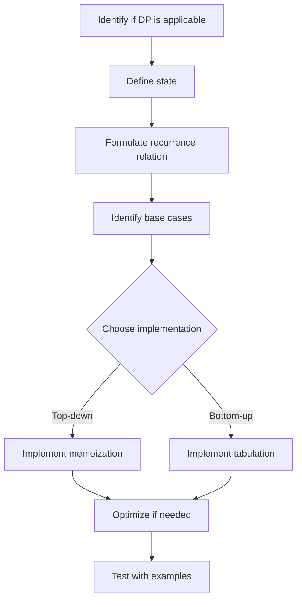

# Dynamic Programming Basics

## Introduction

Dynamic Programming (DP) is a powerful problem-solving technique used to solve complex problems by breaking them down into simpler subproblems. It's particularly effective for optimization problems where we need to find the best solution among many possible options.

Unlike divide-and-conquer approaches, dynamic programming is applicable when subproblems overlap - meaning the same subproblems need to be solved multiple times. By solving each subproblem only once and storing the results in a table (memoization), DP algorithms can dramatically improve efficiency.

In this tutorial, we'll explore:
- The key principles of dynamic programming
- When to use dynamic programming
- Step-by-step approach to solving DP problems
- Common DP patterns with examples
- Real-world applications

## Key Principles of Dynamic Programming

Dynamic programming is based on two fundamental principles:

### 1. Optimal Substructure

A problem has optimal substructure if an optimal solution can be constructed from optimal solutions of its subproblems. In simpler terms, if the best solution for the problem incorporates the best solutions to its subproblems.

### 2. Overlapping Subproblems

A problem has overlapping subproblems if the same subproblems are solved multiple times when finding the solution. Dynamic programming stores the results of subproblems to avoid redundant calculations.

## When to Use Dynamic Programming

Consider using dynamic programming when your problem:
- Can be broken down into overlapping subproblems
- Has optimal substructure
- Requires finding a maximum, minimum, or optimal count
- Involves making a sequence of decisions
- Requires you to find all possible ways to accomplish something

## Approaches to Dynamic Programming

There are two main approaches to implement dynamic programming:

### 1. Top-Down Approach (Memoization)

Start with the original problem and recursively break it down into subproblems. Use a cache (often a hash table or array) to store results of subproblems to avoid redundant calculations.

### 2. Bottom-Up Approach (Tabulation)

Start by solving the smallest subproblems first and work your way up to the original problem. This typically involves filling a table (array) in a systematic way.

## Step-by-Step Approach to Solving DP Problems

Let's develop a framework for tackling dynamic programming problems:

1. **Identify if DP is applicable** - Does the problem exhibit optimal substructure and overlapping subproblems?
2. **Define the state** - Identify what information we need to represent a subproblem
3. **Formulate the recurrence relation** - Express how states relate to each other
4. **Identify the base cases** - Define the simplest subproblems with known answers
5. **Decide the implementation approach** - Top-down or bottom-up
6. **Add optimization if needed** - Sometimes we can reduce space complexity

Let's see this framework in action with some examples.

## Example 1: Fibonacci Sequence

The Fibonacci sequence is a classic example used to introduce dynamic programming. Let's calculate the nth Fibonacci number.

### Problem Statement
The Fibonacci sequence is defined as:
- F(0) = 0
- F(1) = 1
- F(n) = F(n-1) + F(n-2) for n > 1

### Naive Recursive Approach

```javascript
function fibonacci(n) {
  if (n <= 1) return n;
  return fibonacci(n-1) + fibonacci(n-2);
}

console.log(fibonacci(10)); // Output: 55
```

This recursive approach has exponential time complexity O(2ⁿ) because it calculates the same Fibonacci numbers repeatedly.

### DP Approach 1: Top-Down with Memoization

```javascript
function fibonacciMemo(n, memo = {}) {
  if (n in memo) return memo[n];
  if (n <= 1) return n;
  
  memo[n] = fibonacciMemo(n-1, memo) + fibonacciMemo(n-2, memo);
  return memo[n];
}

console.log(fibonacciMemo(10)); // Output: 55
console.log(fibonacciMemo(100)); // Can now easily compute larger values
```

### DP Approach 2: Bottom-Up with Tabulation

```javascript
function fibonacciTabulation(n) {
  if (n <= 1) return n;
  
  let dp = new Array(n+1);
  dp[0] = 0;
  dp[1] = 1;
  
  for (let i = 2; i <= n; i++) {
    dp[i] = dp[i-1] + dp[i-2];
  }
  
  return dp[n];
}

console.log(fibonacciTabulation(10)); // Output: 55
```

### DP Approach 3: Space-Optimized Bottom-Up

```javascript
function fibonacciOptimized(n) {
  if (n <= 1) return n;
  
  let a = 0;
  let b = 1;
  let c;
  
  for (let i = 2; i <= n; i++) {
    c = a + b;
    a = b;
    b = c;
  }
  
  return b;
}

console.log(fibonacciOptimized(10)); // Output: 55
```

The space-optimized version reduces space complexity from O(n) to O(1) since we only need to keep track of the two previous values.

## Example 2: Climbing Stairs Problem

### Problem Statement
You are climbing a staircase with n steps. Each time you can either climb 1 or 2 steps. In how many distinct ways can you climb to the top?

### Analyzing the Problem
- If there is 1 step (n=1), there is only 1 way to climb: take 1 step.
- If there are 2 steps (n=2), there are 2 ways: take 1 step twice or take 2 steps at once.
- For any n > 2, to reach the nth step, we can either:
  - Take a single step from the (n-1)th step, or
  - Take two steps from the (n-2)th step

This gives us the recurrence relation: ways(n) = ways(n-1) + ways(n-2)

### Bottom-Up DP Solution

```javascript
function climbStairs(n) {
  if (n <= 2) return n;
  
  let dp = new Array(n+1);
  dp[1] = 1;
  dp[2] = 2;
  
  for (let i = 3; i <= n; i++) {
    dp[i] = dp[i-1] + dp[i-2];
  }
  
  return dp[n];
}

console.log(climbStairs(5)); // Output: 8
```

### Space-Optimized Solution

```javascript
function climbStairsOptimized(n) {
  if (n <= 2) return n;
  
  let first = 1;
  let second = 2;
  let result;
  
  for (let i = 3; i <= n; i++) {
    result = first + second;
    first = second;
    second = result;
  }
  
  return second;
}

console.log(climbStairsOptimized(5)); // Output: 8
```

## Example 3: Coin Change Problem

### Problem Statement
Given coins of different denominations and a total amount of money, find the minimum number of coins needed to make up that amount. Return -1 if the amount cannot be made up by any combination of the coins.

### Example Input
```
coins = [1, 2, 5]
amount = 11
```

### Example Output
```
3 (5 + 5 + 1 = 11)
```

### Bottom-Up DP Solution

```javascript
function coinChange(coins, amount) {
  // Create array to store minimum coins needed for each amount
  let dp = new Array(amount + 1).fill(Infinity);
  dp[0] = 0;
  
  // Fill the dp array bottom-up
  for (let coin of coins) {
    for (let i = coin; i <= amount; i++) {
      dp[i] = Math.min(dp[i], dp[i - coin] + 1);
    }
  }
  
  return dp[amount] === Infinity ? -1 : dp[amount];
}

console.log(coinChange([1, 2, 5], 11)); // Output: 3
```

### Explanation

1. We create an array `dp` where `dp[i]` represents the minimum number of coins needed to make up amount `i`.
2. We initialize `dp[0] = 0` (it takes 0 coins to make up amount 0) and all other values to Infinity.
3. For each coin denomination, we update dp[i] if using this coin gives a better solution.
4. The final answer is in `dp[amount]`.

Let's visualize the dp array after processing:

```
dp[0] = 0
dp[1] = 1 (one 1-coin)
dp[2] = 1 (one 2-coin)
dp[3] = 2 (one 1-coin + one 2-coin)
dp[4] = 2 (two 2-coins)
dp[5] = 1 (one 5-coin)
dp[6] = 2 (one 1-coin + one 5-coin)
dp[7] = 2 (one 2-coin + one 5-coin)
dp[8] = 3 (one 1-coin + one 2-coin + one 5-coin)
dp[9] = 3 (two 2-coins + one 5-coin)
dp[10] = 2 (two 5-coins)
dp[11] = 3 (one 1-coin + two 5-coins)
```

## Real-World Applications of Dynamic Programming

Dynamic programming is extensively used in various fields:

1. **Economics** - Optimal resource allocation, production planning
2. **Finance** - Portfolio optimization, option pricing
3. **Bioinformatics** - Sequence alignment, protein folding
4. **Computer Graphics** - Image processing, texture mapping
5. **Operations Research** - Scheduling, routing problems
6. **Natural Language Processing** - Speech recognition, machine translation

## Common DP Patterns

As you solve more dynamic programming problems, you'll start to recognize common patterns:

### 1. Linear Sequence DP
- Examples: Fibonacci, climbing stairs
- Pattern: `dp[i]` depends on previous elements in a 1D array

### 2. Grid/Matrix Problems
- Examples: Minimum path sum, unique paths in a grid
- Pattern: `dp[i][j]` depends on adjacent cells

### 3. String Problems
- Examples: Longest common subsequence, edit distance
- Pattern: Usually uses a 2D array where dimensions represent characters or positions in strings

### 4. Decision Making
- Examples: Knapsack problem, coin change
- Pattern: Make choices that optimize some objective

Let's visualize a typical dynamic programming approach with a Mermaid diagram:



## Summary

Dynamic Programming is a powerful technique that helps solve complex problems efficiently by breaking them down into simpler subproblems. The key to mastering DP is practice and pattern recognition.

Remember these steps when approaching a DP problem:
1. Identify if DP is applicable
2. Define the state clearly
3. Formulate the recurrence relation
4. Identify the base cases
5. Choose between top-down and bottom-up approaches
6. Optimize if necessary

As you practice more problems, you'll develop an intuition for when and how to apply dynamic programming effectively.

## Practice Exercises

To strengthen your understanding, try solving these problems:

1. **Longest Increasing Subsequence**: Given an array of integers, find the length of the longest strictly increasing subsequence.

2. **Knapsack Problem**: Given a set of items with weights and values, determine the most valuable subset that can fit in a knapsack of limited capacity.

3. **Edit Distance**: Given two strings, find the minimum number of operations (insert, delete, replace) required to convert one string to another.

4. **Maximum Subarray Sum**: Find the contiguous subarray within an array of numbers that has the largest sum.

5. **House Robber**: Given an array representing the amount of money in each house, determine the maximum amount you can rob without robbing adjacent houses.

## Additional Resources

- [Dynamic Programming on LeetCode](https://leetcode.com/tag/dynamic-programming/)
- [Algorithms, Part II by Princeton University on Coursera](https://www.coursera.org/learn/algorithms-part2)
- [Introduction to Algorithms by CLRS](https://mitpress.mit.edu/books/introduction-algorithms-third-edition)

By practicing these problems and understanding the underlying patterns, you'll develop a solid foundation in dynamic programming that you can apply to solve a wide range of complex problems efficiently.