# Mathematical Algorithms

## Introduction

Mathematical algorithms form the backbone of many programming applications, from simple calculators to complex data analysis tools. These algorithms translate mathematical concepts into step-by-step procedures that computers can execute efficiently.

In this guide, we'll explore fundamental mathematical algorithms that every programmer should understand. Whether you're building a scientific application, a game, or just solving everyday problems with code, these algorithms will provide you with powerful tools to tackle a wide range of challenges.

## The Greatest Common Divisor (GCD)

The Greatest Common Divisor (GCD) of two integers is the largest positive integer that divides both numbers without a remainder. This algorithm has applications in fraction simplification, cryptography, and various other mathematical operations.

### Euclidean Algorithm

The Euclidean algorithm is an efficient method for computing the GCD of two numbers.

```javascript
function gcd(a, b) {
  // Ensure positive numbers
  a = Math.abs(a);
  b = Math.abs(b);
  
  // Base case
  if (b === 0) {
    return a;
  }
  
  // Recursive case
  return gcd(b, a % b);
}

// Example usage
console.log(gcd(48, 18)); // Output: 6
console.log(gcd(101, 103)); // Output: 1
```

The algorithm works by repeatedly applying the property that gcd(a, b) = gcd(b, a % b) until we reach a remainder of 0.

### Step-by-Step Explanation

Let's trace through the example of gcd(48, 18):

1. Call gcd(48, 18)
2. Since b (18) is not 0, we calculate: 48 % 18 = 12
3. Call gcd(18, 12)
4. Since b (12) is not 0, we calculate: 18 % 12 = 6
5. Call gcd(12, 6)
6. Since b (6) is not 0, we calculate: 12 % 6 = 0
7. Call gcd(6, 0)
8. Since b is 0, we return a, which is 6

The GCD of 48 and 18 is 6.

## Sieve of Eratosthenes

Finding prime numbers is a fundamental mathematical operation with applications in cryptography, number theory, and mathematical modeling.

The Sieve of Eratosthenes is an efficient algorithm for finding all prime numbers up to a specified limit.

```javascript
function sieveOfEratosthenes(n) {
  // Create array initialized with true values
  const isPrime = new Array(n + 1).fill(true);
  
  // 0 and 1 are not prime numbers
  isPrime[0] = isPrime[1] = false;
  
  // Check from 2 to square root of n
  for (let i = 2; i * i <= n; i++) {
    // If i is prime, mark all its multiples as non-prime
    if (isPrime[i]) {
      for (let j = i * i; j <= n; j += i) {
        isPrime[j] = false;
      }
    }
  }
  
  // Collect all prime numbers
  const primes = [];
  for (let i = 2; i <= n; i++) {
    if (isPrime[i]) {
      primes.push(i);
    }
  }
  
  return primes;
}

// Example: Find all primes up to 30
console.log(sieveOfEratosthenes(30));
// Output: [2, 3, 5, 7, 11, 13, 17, 19, 23, 29]
```

### How the Sieve Works

The algorithm works by iteratively marking the multiples of each prime, starting from 2. Once we've gone through all the numbers, the unmarked ones are prime.

Here's a visualization of how the algorithm proceeds:

```mermaid
graph TD
    subgraph "Initial State: All numbers 2-30 unmarked"
        2_1([2]) --> 3_1([3])
        3_1 --> 4_1([4])
        4_1 --> 5_1([5])
        5_1 --> 6_1([6])
        6_1 --> 7_1([7])
        7_1 --> more1(...)
        more1 --> 30_1([30])
    end

    subgraph "Step 1: Mark multiples of 2"
        2_2([2]) --> 3_2([3])
        3_2 --> 4_2([4X])
        4_2 --> 5_2([5])
        5_2 --> 6_2([6X])
        6_2 --> 7_2([7])
        7_2 --> more2(...)
        more2 --> 30_2([30X])
    end

    subgraph "Step 2: Mark multiples of 3"
        2_3([2]) --> 3_3([3])
        3_3 --> 4_3([4X])
        4_3 --> 5_3([5])
        5_3 --> 6_3([6X])
        6_3 --> 7_3([7])
        7_3 --> more3(...)
        more3 --> 30_3([30X])
    end

    subgraph "Final: Unmarked numbers are prime"
        2_4([2]) --> 3_4([3])
        3_4 --> 4_4([4X])
        4_4 --> 5_4([5])
        5_4 --> 6_4([6X])
        6_4 --> 7_4([7])
        7_4 --> more4(...)
        more4 --> 30_4([30X])
    end
```



## Fast Exponentiation

Computing large exponents efficiently is crucial in various applications, including cryptography and computational mathematics.

### Binary Exponentiation

Also known as "exponentiation by squaring," this algorithm calculates a^n in O(log n) operations, much faster than the naive O(n) approach.

```javascript
function fastPower(base, exponent) {
  if (exponent === 0) {
    return 1;
  }
  
  // If exponent is odd
  if (exponent % 2 === 1) {
    return base * fastPower(base, exponent - 1);
  }
  
  // If exponent is even
  const half = fastPower(base, exponent / 2);
  return half * half;
}

// Example
console.log(fastPower(2, 10)); // Output: 1024
console.log(fastPower(3, 5));  // Output: 243
```

### How it Works

The algorithm uses the following properties:
- a^0 = 1
- a^n = a * a^(n-1) if n is odd
- a^n = (a^(n/2))^2 if n is even

This approach significantly reduces the number of multiplications needed. For example, to calculate 2^10:

1. 2^10 = (2^5)^2 (even exponent rule)
2. 2^5 = 2 * 2^4 (odd exponent rule)
3. 2^4 = (2^2)^2 (even exponent rule)
4. 2^2 = (2^1)^2 (even exponent rule)
5. 2^1 = 2 * 2^0 (odd exponent rule)
6. 2^0 = 1 (base case)

Working backwards, we get:
- 2^0 = 1
- 2^1 = 2 * 1 = 2
- 2^2 = 2^2 = 4
- 2^4 = 4^2 = 16
- 2^5 = 2 * 16 = 32
- 2^10 = 32^2 = 1024

This requires only 5 multiplications instead of 9 with the naive approach.

## Fibonacci Sequence

The Fibonacci sequence is a series where each number is the sum of the two preceding ones: 0, 1, 1, 2, 3, 5, 8, 13, ...

There are multiple ways to calculate Fibonacci numbers:

### Recursive Approach (Inefficient)

```javascript
function fibonacciRecursive(n) {
  if (n <= 1) {
    return n;
  }
  return fibonacciRecursive(n - 1) + fibonacciRecursive(n - 2);
}

// Example
console.log(fibonacciRecursive(6)); // Output: 8
```

This approach is simple but very inefficient for large values of n due to repeated calculations.

### Dynamic Programming Approach (Efficient)

```javascript
function fibonacciDP(n) {
  if (n <= 1) {
    return n;
  }
  
  const fib = [0, 1];
  for (let i = 2; i <= n; i++) {
    fib[i] = fib[i - 1] + fib[i - 2];
  }
  
  return fib[n];
}

// Example
console.log(fibonacciDP(10)); // Output: 55
```

### Matrix Exponentiation (Most Efficient)

For very large values of n, we can use matrix exponentiation to calculate Fibonacci numbers in O(log n) time:

```javascript
function fibonacciMatrix(n) {
  if (n === 0) {
    return 0;
  }
  
  // Define the base transformation matrix
  let F = [[1, 1], [1, 0]];
  
  // Perform fast exponentiation on the matrix
  power(F, n - 1);
  
  return F[0][0];
  
  // Helper function for matrix exponentiation
  function power(F, n) {
    if (n === 0 || n === 1) {
      return;
    }
    
    const M = [[1, 1], [1, 0]];
    
    power(F, Math.floor(n / 2));
    multiply(F, F);
    
    if (n % 2 !== 0) {
      multiply(F, M);
    }
  }
  
  // Helper function to multiply two 2x2 matrices
  function multiply(F, M) {
    const a = F[0][0] * M[0][0] + F[0][1] * M[1][0];
    const b = F[0][0] * M[0][1] + F[0][1] * M[1][1];
    const c = F[1][0] * M[0][0] + F[1][1] * M[1][0];
    const d = F[1][0] * M[0][1] + F[1][1] * M[1][1];
    
    F[0][0] = a;
    F[0][1] = b;
    F[1][0] = c;
    F[1][1] = d;
  }
}

// Example
console.log(fibonacciMatrix(20)); // Output: 6765
```

This approach leverages the property that if we consider the matrix transformation [[1,1],[1,0]], then F^n gives the (n+1)th Fibonacci number in position `[0][0]`.

## Real-World Applications

### Fraction Simplification using GCD

```javascript
class Fraction {
  constructor(numerator, denominator) {
    if (denominator === 0) {
      throw new Error("Denominator cannot be zero");
    }
    
    // Simplify the fraction using GCD
    const divisor = gcd(numerator, denominator);
    this.numerator = numerator / divisor;
    this.denominator = denominator / divisor;
    
    // Ensure the denominator is positive
    if (this.denominator < 0) {
      this.numerator = -this.numerator;
      this.denominator = -this.denominator;
    }
  }
  
  toString() {
    return `${this.numerator}/${this.denominator}`;
  }
}

function gcd(a, b) {
  a = Math.abs(a);
  b = Math.abs(b);
  
  if (b === 0) {
    return a;
  }
  
  return gcd(b, a % b);
}

// Example
const fraction = new Fraction(24, 36);
console.log(fraction.toString()); // Output: "2/3"
```

### Cryptography using Fast Exponentiation

Many cryptographic algorithms, like RSA, rely on fast modular exponentiation:

```javascript
function modPow(base, exponent, modulus) {
  if (modulus === 1) return 0;
  
  let result = 1;
  base = base % modulus;
  
  while (exponent > 0) {
    // If exponent is odd, multiply with the result
    if (exponent % 2 === 1) {
      result = (result * base) % modulus;
    }
    
    // Exponent must be even now
    exponent = Math.floor(exponent / 2);
    base = (base * base) % modulus;
  }
  
  return result;
}

// Example of simple RSA-like operation
const message = 7;
const e = 5;  // Public exponent
const n = 33; // Modulus (p*q = 3*11)
const d = 17; // Private exponent

// Encrypt: c = m^e mod n
const encrypted = modPow(message, e, n);
console.log("Encrypted:", encrypted); // Output: 28

// Decrypt: m = c^d mod n
const decrypted = modPow(encrypted, d, n);
console.log("Decrypted:", decrypted); // Output: 7 (original message)
```

### Golden Ratio Approximation using Fibonacci

The ratio of consecutive Fibonacci numbers approaches the Golden Ratio (approximately 1.618):

```javascript
function goldenRatioApproximation(iterations) {
  if (iterations < 2) {
    return "Need at least 2 iterations";
  }
  
  let a = 1;
  let b = 1;
  let ratio;
  
  const approximations = [];
  
  for (let i = 2; i <= iterations; i++) {
    ratio = b / a;
    approximations.push({
      iteration: i,
      ratio: ratio
    });
    
    const next = a + b;
    a = b;
    b = next;
  }
  
  return approximations;
}

// Calculate 10 approximations
const results = goldenRatioApproximation(10);
console.log("Golden Ratio Approximations:");
results.forEach(result => {
  console.log(`Iteration ${result.iteration}: ${result.ratio}`);
});

// The last approximation should be close to 1.618...
console.log(`Final approximation: ${results[results.length - 1].ratio}`);
```

## Summary

Mathematical algorithms are essential tools in a programmer's toolkit, enabling efficient solutions to common computational problems. In this guide, we've explored:

1. **Greatest Common Divisor (GCD)** using the Euclidean algorithm
2. **Sieve of Eratosthenes** for finding prime numbers
3. **Fast Exponentiation** for efficiently calculating powers
4. **Fibonacci Sequence** calculation using various approaches
5. Real-world applications in fraction simplification, cryptography, and the golden ratio

Understanding these fundamental algorithms will help you solve a wide range of problems more efficiently and build a strong foundation for more advanced algorithmic concepts.

## Exercises

Test your understanding with these exercises:

1. Implement a Least Common Multiple (LCM) function using the GCD algorithm and the property that LCM(a,b) = (a*b)/GCD(a,b).
2. Modify the Sieve of Eratosthenes to find all twin primes (pairs of primes that differ by 2) less than 100.
3. Implement a function to calculate the nth Catalan number using the recursive formula and optimize it with dynamic programming.
4. Create a function that determines if a number is a perfect number (equal to the sum of its proper divisors).
5. Implement a function to calculate binomial coefficients efficiently using Pascal's triangle.

## Additional Resources

- "Introduction to Algorithms" by Cormen, Leiserson, Rivest, and Stein
- "Concrete Mathematics" by Graham, Knuth, and Patashnik
- "The Art of Computer Programming, Vol. 1: Fundamental Algorithms" by Donald Knuth

Remember that mastering these algorithms takes practice. Try implementing them in different programming languages and applying them to various problems to deepen your understanding.