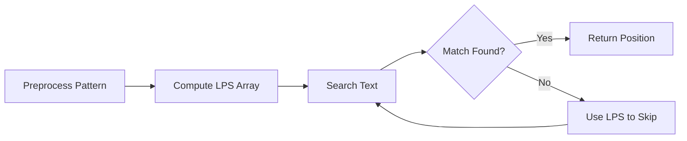

import Tabs from '@theme/Tabs';
import TabItem from '@theme/TabItem';

# String Manipulation Algorithms

## Introduction

String manipulation is a fundamental aspect of programming that involves processing, analyzing, and transforming text data. Whether you're validating user input, parsing data files, or developing a text editor, understanding string algorithms is essential for writing efficient and robust code.

In this tutorial, we'll explore various string manipulation algorithms, from basic operations to more advanced techniques like pattern matching and string searching. These algorithms form the backbone of text processing in programming and have numerous real-world applications.

## Basic String Operations

Before diving into complex algorithms, let's review some fundamental string operations that serve as building blocks for more advanced techniques.

### String Traversal

Traversing a string means accessing each character sequentially. This is the most basic operation and forms the foundation for many string algorithms.

```javascript
function traverseString(str) {
  for (let i = 0; i < str.length; i++) {
    console.log(`Character at position ${i}: ${str[i]}`);
  }
}

// Example usage
traverseString("Hello");
```

**Output:**
```
Character at position 0: H
Character at position 1: e
Character at position 2: l
Character at position 3: l
Character at position 4: o
```

### String Reversal

Reversing a string is a common operation that can be implemented in several ways.

```python
def reverse_string(s):
    # Using slicing in Python
    return s[::-1]
    
    # Alternative implementation using a loop
    # result = ""
    # for char in s:
    #     result = char + result
    # return result

# Example usage
original = "algorithm"
reversed_str = reverse_string(original)
print(f"Original: {original}")
print(f"Reversed: {reversed_str}")
```

**Output:**
```
Original: algorithm
Reversed: mhtirogla
```

### String Concatenation

Concatenation combines two or more strings. While simple, it's important to understand the performance implications of different concatenation methods.

<Tabs>
  <TabItem value="java" label="Java">
  ```java
  public class StringConcatenation {
      public static void main(String[] args) {
          // Inefficient for many operations (creates new string objects)
          String result1 = "Hello" + " " + "World";
          
          // More efficient for multiple concatenations
          StringBuilder sb = new StringBuilder();
          sb.append("Hello");
          sb.append(" ");
          sb.append("World");
          String result2 = sb.toString();
          
          System.out.println(result1);
          System.out.println(result2);
      }
  }
  ```
  </TabItem>
  <TabItem value="javascript" label="JavaScript">
  ```javascript
  // Basic concatenation
  const result1 = "Hello" + " " + "World";
  
  // Using array join (often more efficient for multiple items)
  const parts = ["Hello", " ", "World"];
  const result2 = parts.join("");
  
  console.log(result1);
  console.log(result2);
  ```
  </TabItem>
</Tabs>

## Pattern Matching Algorithms

Pattern matching is the process of finding occurrences of a pattern within a larger text. These algorithms are crucial for text editors, search engines, and data processing applications.

### Brute Force Algorithm

The simplest approach to pattern matching is the brute force method, which checks all possible positions in the text.

```java
public class BruteForceSearch {
    public static int search(String text, String pattern) {
        int n = text.length();
        int m = pattern.length();
        
        // Pattern cannot be found if it's longer than the text
        if (m > n) return -1;
        
        // Check each potential starting position in the text
        for (int i = 0; i <= n - m; i++) {
            int j;
            
            // Check if pattern matches at this position
            for (j = 0; j < m; j++) {
                if (text.charAt(i + j) != pattern.charAt(j)) {
                    break;
                }
            }
            
            // If we completed the inner loop, we found a match
            if (j == m) {
                return i; // Return the starting position of the match
            }
        }
        
        return -1; // Pattern not found
    }
    
    public static void main(String[] args) {
        String text = "The quick brown fox jumps over the lazy dog";
        String pattern = "brown";
        
        int position = search(text, pattern);
        
        if (position != -1) {
            System.out.println("Pattern found at position: " + position);
        } else {
            System.out.println("Pattern not found");
        }
    }
}
```

**Output:**
```
Pattern found at position: 10
```

The brute force algorithm has:
- Time Complexity: O(n × m) where n is the text length and m is the pattern length
- Space Complexity: O(1)

### Knuth-Morris-Pratt (KMP) Algorithm

The KMP algorithm improves on the brute force approach by avoiding unnecessary comparisons using a preprocessed table.

```python
def compute_lps(pattern):
    """Compute Longest Prefix Suffix (LPS) array for KMP algorithm"""
    m = len(pattern)
    lps = [0] * m  # lps[i] = length of the longest proper prefix which is also a suffix of pattern[0..i]
    
    # Initialize
    length = 0  # length of previous longest prefix & suffix
    i = 1
    
    # Calculate lps[i] for i = 1 to m-1
    while i < m:
        if pattern[i] == pattern[length]:
            length += 1
            lps[i] = length
            i += 1
        else:
            if length != 0:
                # This is the tricky part
                length = lps[length - 1]
            else:
                lps[i] = 0
                i += 1
    
    return lps

def kmp_search(text, pattern):
    """KMP algorithm for pattern matching"""
    n = len(text)
    m = len(pattern)
    
    # Edge cases
    if m == 0:
        return 0
    if m > n:
        return -1
    
    # Preprocess: Compute LPS array
    lps = compute_lps(pattern)
    
    i = 0  # index for text
    j = 0  # index for pattern
    
    while i < n:
        # Current characters match
        if pattern[j] == text[i]:
            i += 1
            j += 1
        
        # Pattern completely found
        if j == m:
            return i - j  # Return the starting index of the match
        
        # Mismatch after j matches
        elif i < n and pattern[j] != text[i]:
            if j != 0:
                j = lps[j - 1]  # Use the LPS value to skip comparisons
            else:
                i += 1
    
    return -1  # Pattern not found

# Example usage
text = "ABABDABACDABABCABAB"
pattern = "ABABCABAB"
position = kmp_search(text, pattern)

if position != -1:
    print(f"Pattern found at position: {position}")
else:
    print("Pattern not found")
```

**Output:**
```
Pattern found at position: 10
```

The KMP algorithm has:
- Time Complexity: O(n + m)
- Space Complexity: O(m)

### Boyer-Moore Algorithm

The Boyer-Moore algorithm is often faster in practice as it can skip large portions of the text.

```javascript
function boyerMoore(text, pattern) {
  if (pattern.length === 0) return 0;
  if (pattern.length > text.length) return -1;
  
  const n = text.length;
  const m = pattern.length;
  
  // Preprocessing: Bad Character Heuristic
  // For each character, store the rightmost position in the pattern
  const badChar = {};
  for (let i = 0; i < m; i++) {
    badChar[pattern[i]] = i;
  }
  
  let shift = 0; // Number of positions to shift the pattern
  
  while (shift <= n - m) {
    let j = m - 1;
    
    // Match pattern from right to left
    while (j >= 0 && pattern[j] === text[shift + j]) {
      j--;
    }
    
    // Pattern found
    if (j < 0) {
      return shift;
    }
    
    // Calculate shift based on bad character heuristic
    // If the character is not in the pattern, shift by the pattern length
    // Otherwise, shift to align the bad character with its rightmost occurrence in the pattern
    const badCharShift = badChar[text[shift + j]] !== undefined ? 
      Math.max(1, j - badChar[text[shift + j]]) : m;
    
    shift += badCharShift;
  }
  
  return -1; // Pattern not found
}

// Example usage
const text = "HERE IS A SIMPLE EXAMPLE";
const pattern = "EXAMPLE";
const position = boyerMoore(text, pattern);

console.log(position !== -1 ? 
  `Pattern found at position: ${position}` : 
  "Pattern not found");
```

**Output:**
```
Pattern found at position: 17
```

The Boyer-Moore algorithm has:
- Average case: O(n/m) (can be sublinear!)
- Worst case: O(n × m)
- Space Complexity: O(k) where k is the alphabet size

## String Transformation Algorithms

### Case Conversion

Converting between uppercase and lowercase is a common string operation.

```python
def change_case(text):
    return {
        'lowercase': text.lower(),
        'uppercase': text.upper(),
        'title_case': text.title(),
        'swap_case': text.swapcase()
    }

# Example usage
sample = "String Manipulation ALGORITHMS"
results = change_case(sample)

for case_type, result in results.items():
    print(f"{case_type}: {result}")
```

**Output:**
```
lowercase: string manipulation algorithms
uppercase: STRING MANIPULATION ALGORITHMS
title_case: String Manipulation Algorithms
swap_case: sTRING mANIPULATION algorithms
```

### String Trimming

Removing whitespace or specific characters from the beginning and end of strings.

```javascript
function trimExamples(text) {
  return {
    trimmed: text.trim(),
    leftTrimmed: text.trimStart(),
    rightTrimmed: text.trimEnd(),
    customTrimmed: text.replace(/[,.!?]/g, '')  // Remove punctuation
  };
}

// Example usage
const sample = "  Hello, world! How are you?  ";
const results = trimExamples(sample);

for (const [type, result] of Object.entries(results)) {
  console.log(`${type}: "${result}"`);
}
```

**Output:**
```
trimmed: "Hello, world! How are you?"
leftTrimmed: "Hello, world! How are you?  "
rightTrimmed: "  Hello, world! How are you?"
customTrimmed: "  Hello world How are you  "
```

## String Distance Algorithms

String distance algorithms measure the similarity or difference between strings. They're crucial for spell checkers, DNA sequence analysis, and fuzzy search functionality.

### Levenshtein Distance

The Levenshtein distance (or edit distance) counts the minimum number of single-character operations (insertions, deletions, or substitutions) required to change one string into another.

```python
def levenshtein_distance(s1, s2):
    """Calculate the Levenshtein distance between two strings"""
    if len(s1) < len(s2):
        return levenshtein_distance(s2, s1)  # Make s1 the longer string
    
    # s2 is empty
    if len(s2) == 0:
        return len(s1)
    
    previous_row = range(len(s2) + 1)
    for i, c1 in enumerate(s1):
        current_row = [i + 1]
        for j, c2 in enumerate(s2):
            # Calculate insertions, deletions and substitutions
            insertions = previous_row[j + 1] + 1
            deletions = current_row[j] + 1
            substitutions = previous_row[j] + (c1 != c2)
            
            # Get the minimum
            current_row.append(min(insertions, deletions, substitutions))
        
        previous_row = current_row
    
    return previous_row[-1]

# Example usage
word1 = "kitten"
word2 = "sitting"
distance = levenshtein_distance(word1, word2)

print(f"The Levenshtein distance between '{word1}' and '{word2}' is: {distance}")
```

**Output:**
```
The Levenshtein distance between 'kitten' and 'sitting' is: 3
```

The Levenshtein algorithm has:
- Time Complexity: O(m × n)
- Space Complexity: O(min(m, n))

### Longest Common Subsequence (LCS)

The LCS algorithm finds the longest subsequence common to two strings. It's used in diff tools and DNA sequence analysis.

```java
public class LongestCommonSubsequence {
    public static String findLCS(String s1, String s2) {
        int m = s1.length();
        int n = s2.length();
        int[][] dp = new int[m + 1][n + 1];
        
        // Fill the dp table
        for (int i = 1; i <= m; i++) {
            for (int j = 1; j <= n; j++) {
                if (s1.charAt(i - 1) == s2.charAt(j - 1)) {
                    dp[i][j] = dp[i - 1][j - 1] + 1;
                } else {
                    dp[i][j] = Math.max(dp[i - 1][j], dp[i][j - 1]);
                }
            }
        }
        
        // Reconstruct the LCS
        StringBuilder lcs = new StringBuilder();
        int i = m, j = n;
        while (i > 0 && j > 0) {
            if (s1.charAt(i - 1) == s2.charAt(j - 1)) {
                lcs.insert(0, s1.charAt(i - 1));
                i--;
                j--;
            } else if (dp[i - 1][j] > dp[i][j - 1]) {
                i--;
            } else {
                j--;
            }
        }
        
        return lcs.toString();
    }
    
    public static void main(String[] args) {
        String s1 = "ABCBDAB";
        String s2 = "BDCABA";
        String lcs = findLCS(s1, s2);
        
        System.out.println("String 1: " + s1);
        System.out.println("String 2: " + s2);
        System.out.println("Longest Common Subsequence: " + lcs);
    }
}
```

**Output:**
```
String 1: ABCBDAB
String 2: BDCABA
Longest Common Subsequence: BCBA
```

## Regular Expressions

Regular expressions are patterns used to match character combinations in strings. They're powerful tools for string processing and form the basis of many text processing utilities.

```javascript
function regexExamples() {
  const text = "Contact us at info@example.com or support@company.co.uk";
  
  // Email pattern
  const emailPattern = /[a-zA-Z0-9._%+-]+@[a-zA-Z0-9.-]+\.[a-zA-Z]{2,}/g;
  const emails = text.match(emailPattern);
  
  // Validation pattern
  const phoneNumber = "+1-555-123-4567";
  const phonePattern = /^\+\d{1,3}-\d{3}-\d{3}-\d{4}$/;
  const isValidPhone = phonePattern.test(phoneNumber);
  
  // Replacement
  const original = "Hello World! This is an example.";
  const replaced = original.replace(/[aeiou]/gi, '*');
  
  return {
    emails,
    isValidPhone,
    replaced
  };
}

// Example usage
const results = regexExamples();
console.log("Extracted emails:", results.emails);
console.log("Phone number valid:", results.isValidPhone);
console.log("Vowels replaced:", results.replaced);
```

**Output:**
```
Extracted emails: ["info@example.com", "support@company.co.uk"]
Phone number valid: true
Vowels replaced: "H*ll* W*rld! Th*s *s *n *x*mpl*."
```

## Real-World Applications

String manipulation algorithms power many applications and tools we use daily:

### Text Search and Replace

Text editors use string searching algorithms to find and replace text efficiently.

```javascript
function textEditor(document, search, replace) {
  // Using Boyer-Moore or KMP for better performance in real implementations
  return document.split(search).join(replace);
}

// Example
const document = "The quick brown fox jumps over the quick brown dog.";
const edited = textEditor(document, "quick brown", "lazy");
console.log(edited);
```

**Output:**
```
The lazy fox jumps over the lazy dog.
```

### Data Validation

Forms and applications use string manipulation to validate user input.

```python
def validate_email(email):
    """Simple email validation using regex"""
    import re
    pattern = r'^[a-zA-Z0-9._%+-]+@[a-zA-Z0-9.-]+\.[a-zA-Z]{2,}$'
    return bool(re.match(pattern, email))

def validate_password(password):
    """
    Validate password strength:
    - At least 8 characters
    - Contains uppercase, lowercase, number, and special character
    """
    if len(password) < 8:
        return False
    
    checks = [
        any(c.isupper() for c in password),  # uppercase
        any(c.islower() for c in password),  # lowercase
        any(c.isdigit() for c in password),  # digit
        any(not c.isalnum() for c in password)  # special character
    ]
    
    return all(checks)

# Example
test_emails = ["user@example.com", "invalid@email", "another.user@domain.co.uk"]
test_passwords = ["Weak123", "StrongP@ssw0rd", "onlyletters"]

for email in test_emails:
    print(f"Email '{email}' is {'valid' if validate_email(email) else 'invalid'}")

for password in test_passwords:
    print(f"Password '{password}' is {'strong' if validate_password(password) else 'weak'}")
```

**Output:**
```
Email 'user@example.com' is valid
Email 'invalid@email' is invalid
Email 'another.user@domain.co.uk' is valid
Password 'Weak123' is weak
Password 'StrongP@ssw0rd' is strong
Password 'onlyletters' is weak
```

### Data Parsing

String algorithms are essential for parsing structured data like CSV, JSON, or XML.

```javascript
function parseCSV(csvText) {
  const rows = csvText.trim().split('');
  const headers = rows[0].split(',');
  
  const data = [];
  for (let i = 1; i < rows.length; i++) {
    const values = rows[i].split(',');
    const entry = {};
    
    for (let j = 0; j < headers.length; j++) {
      entry[headers[j]] = values[j];
    }
    
    data.push(entry);
  }
  
  return data;
}

// Example
const csvData = `name,age,city
Alice,28,New York
Bob,34,San Francisco
Charlie,22,Chicago`;

const parsedData = parseCSV(csvData);
console.log("Parsed CSV data:", parsedData);
```

**Output:**
```
Parsed CSV data: [
  { name: 'Alice', age: '28', city: 'New York' },
  { name: 'Bob', age: '34', city: 'San Francisco' },
  { name: 'Charlie', age: '22', city: 'Chicago' }
]
```

## Algorithm Visualization

Here's a visual representation of how the KMP algorithm preprocesses the pattern to optimize string matching:



## Performance Comparison

Let's compare the performance characteristics of different string matching algorithms:

| Algorithm   | Average Case | Worst Case | Space | Preprocessing |
|-------------|--------------|------------|-------|---------------|
| Brute Force | O(n × m)     | O(n × m)   | O(1)  | None          |
| KMP         | O(n + m)     | O(n + m)   | O(m)  | O(m)          |
| Boyer-Moore | O(n/m)       | O(n × m)   | O(k)  | O(m + k)      |
| Rabin-Karp  | O(n + m)     | O(n × m)   | O(1)  | O(m)          |

Where:
- n: length of the text
- m: length of the pattern
- k: size of the alphabet

## Summary

String manipulation algorithms are fundamental tools in a programmer's toolkit. In this tutorial, we've covered:

- Basic string operations: traversal, reversal, and concatenation
- Pattern matching algorithms: Brute Force, KMP, and Boyer-Moore
- String transformation: case conversion and trimming
- String distance metrics: Levenshtein distance and LCS
- Real-world applications including search, validation, and parsing

Understanding these algorithms will help you process text data efficiently and solve complex problems involving strings.

## Exercises

1. **Implement a function** that checks if a string is a palindrome (reads the same forward and backward).
2. **Create a word counter** that counts the frequency of each word in a given text.
3. **Build a simple spell checker** using the Levenshtein distance algorithm.
4. **Implement the Rabin-Karp algorithm** for string matching.
5. **Create a function** to detect and remove duplicate words from a paragraph.

## Additional Resources

- **Algorithms, 4th Edition** by Robert Sedgewick and Kevin Wayne
- **Introduction to Algorithms** by Thomas H. Cormen, Charles E. Leiserson, Ronald L. Rivest, and Clifford Stein
- **The Art of Computer Programming, Volume 3: Sorting and Searching** by Donald E. Knuth
- Online courses on platforms like Coursera, edX, and Udemy covering string algorithms
- Practice problems on websites like LeetCode, HackerRank, and CodeSignal