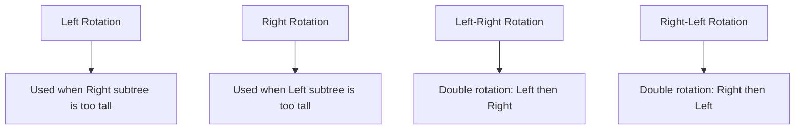
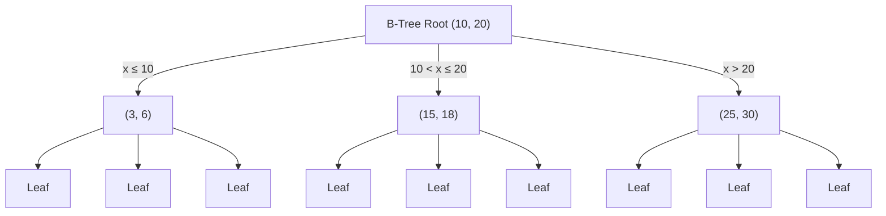
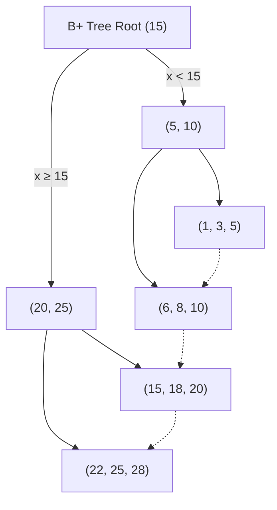
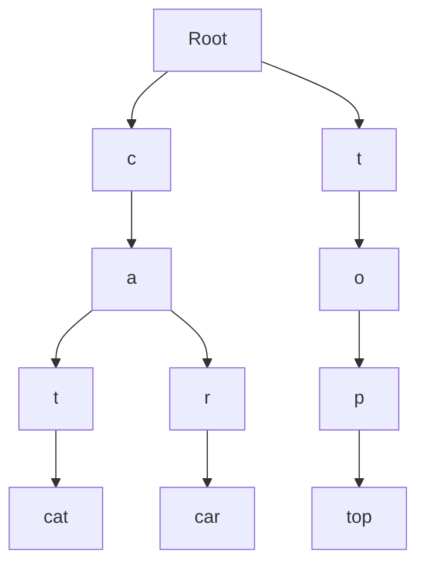

# Advanced Tree Structures

## Introduction

Tree data structures are fundamental in computer science, providing efficient solutions for organizing hierarchical data. While you might be familiar with basic binary trees, this guide explores advanced tree variants that solve specific problems with improved efficiency. These specialized structures optimize operations like searching, inserting, and deleting data, making them essential tools in your programming toolkit.

In this lesson, we'll explore:
- Self-balancing trees (AVL and Red-Black trees)
- Multi-way trees (B-trees and B+ trees)
- Prefix trees (Tries)
- Segment trees
- And their real-world applications

Let's dive deeper into these powerful data structures!

## Self-Balancing Trees

### AVL Trees

AVL trees (named after inventors Adelson-Velsky and Landis) are self-balancing binary search trees where the height difference between left and right subtrees of any node (the balance factor) is at most 1.

#### Key Properties

- Every node maintains a balance factor: `height(left subtree) - height(right subtree)`
- The balance factor must be -1, 0, or 1 for all nodes
- When an insertion or deletion violates this constraint, the tree performs rotations to rebalance

#### AVL Tree Rotations

When the balance factor exceeds the allowed range, one of four rotation types is performed:



#### Implementation

```javascript
class AVLNode {
  constructor(value) {
    this.value = value;
    this.left = null;
    this.right = null;
    this.height = 1;
  }
}

class AVLTree {
  constructor() {
    this.root = null;
  }
  
  // Get height of a node
  getHeight(node) {
    if (node === null) return 0;
    return node.height;
  }
  
  // Get balance factor
  getBalanceFactor(node) {
    if (node === null) return 0;
    return this.getHeight(node.left) - this.getHeight(node.right);
  }
  
  // Right rotation
  rightRotate(y) {
    let x = y.left;
    let T2 = x.right;
    
    // Perform rotation
    x.right = y;
    y.left = T2;
    
    // Update heights
    y.height = Math.max(this.getHeight(y.left), this.getHeight(y.right)) + 1;
    x.height = Math.max(this.getHeight(x.left), this.getHeight(x.right)) + 1;
    
    // Return new root
    return x;
  }
  
  // Left rotation
  leftRotate(x) {
    let y = x.right;
    let T2 = y.left;
    
    // Perform rotation
    y.left = x;
    x.right = T2;
    
    // Update heights
    x.height = Math.max(this.getHeight(x.left), this.getHeight(x.right)) + 1;
    y.height = Math.max(this.getHeight(y.left), this.getHeight(y.right)) + 1;
    
    // Return new root
    return y;
  }
  
  // Insert a node
  insert(value) {
    this.root = this._insert(this.root, value);
  }
  
  _insert(node, value) {
    // Standard BST insert
    if (node === null) return new AVLNode(value);
    
    if (value < node.value)
      node.left = this._insert(node.left, value);
    else if (value > node.value)
      node.right = this._insert(node.right, value);
    else // Duplicate values not allowed
      return node;
    
    // Update height
    node.height = 1 + Math.max(this.getHeight(node.left), this.getHeight(node.right));
    
    // Get balance factor
    let balance = this.getBalanceFactor(node);
    
    // Left Left Case
    if (balance > 1 && value < node.left.value)
      return this.rightRotate(node);
    
    // Right Right Case
    if (balance < -1 && value > node.right.value)
      return this.leftRotate(node);
    
    // Left Right Case
    if (balance > 1 && value > node.left.value) {
      node.left = this.leftRotate(node.left);
      return this.rightRotate(node);
    }
    
    // Right Left Case
    if (balance < -1 && value < node.right.value) {
      node.right = this.rightRotate(node.right);
      return this.leftRotate(node);
    }
    
    return node;
  }
}
```

#### Example Usage

```javascript
const avlTree = new AVLTree();
avlTree.insert(10);
avlTree.insert(20);
avlTree.insert(30);
avlTree.insert(40);
avlTree.insert(50);
avlTree.insert(25);

// Even after inserting these values in sequence,
// the tree remains balanced with O(log n) height
```

### Red-Black Trees

Red-Black trees are another type of self-balancing binary search tree, which maintain balance with simpler rotations than AVL trees, making them more efficient for frequent insertions and deletions.

#### Key Properties

- Every node is either red or black
- The root is always black
- No red node has a red child (two red nodes cannot be adjacent)
- Every path from root to leaf has the same number of black nodes (black-height)

#### Implementation

```javascript
class RedBlackNode {
  constructor(value) {
    this.value = value;
    this.left = null;
    this.right = null;
    this.parent = null;
    this.color = 'RED'; // New nodes are always red
  }
}

class RedBlackTree {
  constructor() {
    this.NIL = new RedBlackNode(null);
    this.NIL.color = 'BLACK';
    this.NIL.left = null;
    this.NIL.right = null;
    this.root = this.NIL;
  }
  
  // Left rotation
  leftRotate(x) {
    let y = x.right;
    x.right = y.left;
    
    if (y.left !== this.NIL)
      y.left.parent = x;
      
    y.parent = x.parent;
    
    if (x.parent === null)
      this.root = y;
    else if (x === x.parent.left)
      x.parent.left = y;
    else
      x.parent.right = y;
      
    y.left = x;
    x.parent = y;
  }
  
  // Right rotation
  rightRotate(y) {
    let x = y.left;
    y.left = x.right;
    
    if (x.right !== this.NIL)
      x.right.parent = y;
      
    x.parent = y.parent;
    
    if (y.parent === null)
      this.root = x;
    else if (y === y.parent.left)
      y.parent.left = x;
    else
      y.parent.right = x;
      
    x.right = y;
    y.parent = x;
  }
  
  // Insertion
  insert(value) {
    let node = new RedBlackNode(value);
    node.left = this.NIL;
    node.right = this.NIL;
    
    let y = null;
    let x = this.root;
    
    while (x !== this.NIL) {
      y = x;
      if (node.value < x.value)
        x = x.left;
      else
        x = x.right;
    }
    
    node.parent = y;
    
    if (y === null)
      this.root = node;
    else if (node.value < y.value)
      y.left = node;
    else
      y.right = node;
      
    // Fix Red-Black properties
    this.fixInsert(node);
  }
  
  fixInsert(k) {
    let u;
    while (k.parent && k.parent.color === 'RED') {
      if (k.parent === k.parent.parent.right) {
        u = k.parent.parent.left;
        if (u.color === 'RED') {
          u.color = 'BLACK';
          k.parent.color = 'BLACK';
          k.parent.parent.color = 'RED';
          k = k.parent.parent;
        } else {
          if (k === k.parent.left) {
            k = k.parent;
            this.rightRotate(k);
          }
          k.parent.color = 'BLACK';
          k.parent.parent.color = 'RED';
          this.leftRotate(k.parent.parent);
        }
      } else {
        u = k.parent.parent.right;
        if (u.color === 'RED') {
          u.color = 'BLACK';
          k.parent.color = 'BLACK';
          k.parent.parent.color = 'RED';
          k = k.parent.parent;
        } else {
          if (k === k.parent.right) {
            k = k.parent;
            this.leftRotate(k);
          }
          k.parent.color = 'BLACK';
          k.parent.parent.color = 'RED';
          this.rightRotate(k.parent.parent);
        }
      }
      if (k === this.root) break;
    }
    this.root.color = 'BLACK';
  }
}
```

#### Real-World Applications of Self-Balancing Trees

- **Database Indexing**: Both AVL and Red-Black trees are used in database systems to maintain indices
- **Priority Queues**: Implementations of efficient priority queues
- **Java TreeMap and TreeSet**: Java's TreeMap and TreeSet implementations use Red-Black trees
- **Linux Kernel**: The Linux kernel uses Red-Black trees for memory management

## Multi-Way Trees

### B-Trees

B-trees are balanced search trees designed to work efficiently with disk storage systems. Unlike binary trees, B-trees can have more than two children per node.

#### Key Properties

- All leaf nodes are at the same level (perfect balance)
- Each node can have multiple keys and children
- A B-tree of order m can have at most m children and m-1 keys per node
- Every non-leaf node (except root) has at least ⌈m/2⌉ children
- The root has at least two children if it's not a leaf



#### Implementation (Simplified)

```javascript
class BTreeNode {
  constructor(isLeaf = false, t) {
    this.isLeaf = isLeaf;
    this.t = t; // Minimum degree
    this.keys = []; // Array of keys
    this.children = []; // Array of child pointers
    this.n = 0; // Current number of keys
  }
}

class BTree {
  constructor(t) {
    this.root = null;
    this.t = t; // Minimum degree
  }
  
  // Search a key in the B-Tree
  search(k, node = this.root) {
    if (!node) return null;
    
    // Find the first key greater than or equal to k
    let i = 0;
    while (i < node.n && k > node.keys[i]) i++;
    
    // If the found key is equal to k, return this node
    if (i < node.n && k === node.keys[i]) return node;
    
    // If key is not found and this is a leaf node
    if (node.isLeaf) return null;
    
    // Go to the appropriate child
    return this.search(k, node.children[i]);
  }
  
  // Insert a key to the B-Tree
  insert(k) {
    // If tree is empty
    if (!this.root) {
      this.root = new BTreeNode(true, this.t);
      this.root.keys[0] = k;
      this.root.n = 1;
      return;
    }
    
    // If root is full, tree grows in height
    if (this.root.n === 2 * this.t - 1) {
      let newRoot = new BTreeNode(false, this.t);
      newRoot.children[0] = this.root;
      this.splitChild(newRoot, 0);
      this.root = newRoot;
      this.insertNonFull(newRoot, k);
    } else {
      this.insertNonFull(this.root, k);
    }
  }
  
  // Insert a key to non-full node
  insertNonFull(node, k) {
    let i = node.n - 1;
    
    if (node.isLeaf) {
      // Find position and insert
      while (i >= 0 && k < node.keys[i]) {
        node.keys[i + 1] = node.keys[i];
        i--;
      }
      node.keys[i + 1] = k;
      node.n++;
    } else {
      // Find child
      while (i >= 0 && k < node.keys[i]) i--;
      i++;
      
      // If child is full, split it
      if (node.children[i].n === 2 * this.t - 1) {
        this.splitChild(node, i);
        if (k > node.keys[i]) i++;
      }
      this.insertNonFull(node.children[i], k);
    }
  }
  
  // Split child y of node x
  splitChild(x, i) {
    let t = this.t;
    let y = x.children[i];
    let z = new BTreeNode(y.isLeaf, t);
    
    // Copy the second half of y's keys to z
    for (let j = 0; j < t - 1; j++) {
      z.keys[j] = y.keys[j + t];
    }
    
    // Copy the second half of y's children to z
    if (!y.isLeaf) {
      for (let j = 0; j < t; j++) {
        z.children[j] = y.children[j + t];
      }
    }
    
    y.n = t - 1;
    z.n = t - 1;
    
    // Insert a new child in x
    for (let j = x.n; j > i; j--) {
      x.children[j + 1] = x.children[j];
    }
    x.children[i + 1] = z;
    
    // Move the middle key from y to x
    for (let j = x.n - 1; j >= i; j--) {
      x.keys[j + 1] = x.keys[j];
    }
    x.keys[i] = y.keys[t - 1];
    x.n++;
  }
}
```

#### Example Usage

```javascript
// Create a B-Tree of minimum degree 3
const btree = new BTree(3);

// Insert keys
btree.insert(10);
btree.insert(20);
btree.insert(5);
btree.insert(6);
btree.insert(12);
btree.insert(30);
btree.insert(7);
btree.insert(17);

// Search for a key
const found = btree.search(6);
console.log(found ? "Key found!" : "Key not found");
// Output: Key found!
```

### B+ Trees

B+ trees are a variation of B-trees commonly used in databases and file systems where all data is stored in the leaf nodes, and the internal nodes only store keys for routing.

#### Key Properties

- All data is stored in leaf nodes
- Leaf nodes are linked in a linked list for efficient sequential access
- Internal nodes only contain keys for routing, not actual data
- Every path from root to leaf has the same length



#### Applications of B-Trees and B+ Trees

- **Database Management Systems**: Most databases use B+ trees for indices
- **File Systems**: Many file systems (like NTFS, HFS+) use B-trees or B+ trees
- **Geographic Information Systems**: For storing spatial data
- **Key-Value Stores**: Many NoSQL databases use B-tree variants

## Tries (Prefix Trees)

Tries are specialized tree structures used for efficient retrieval of keys in a dataset of strings. They're particularly useful for dictionary implementations and prefix-based searches.

### Key Properties

- Each node represents a single character of a string
- Paths from root to leaf represent complete strings
- All descendants of a node share a common prefix
- Efficient for prefix-based operations like autocomplete



### Implementation

```javascript
class TrieNode {
  constructor() {
    this.children = {};
    this.isEndOfWord = false;
  }
}

class Trie {
  constructor() {
    this.root = new TrieNode();
  }
  
  // Insert a word into the trie
  insert(word) {
    let current = this.root;
    
    for (let i = 0; i < word.length; i++) {
      const char = word[i];
      if (!current.children[char]) {
        current.children[char] = new TrieNode();
      }
      current = current.children[char];
    }
    current.isEndOfWord = true;
  }
  
  // Search for a word in the trie
  search(word) {
    let current = this.root;
    
    for (let i = 0; i < word.length; i++) {
      const char = word[i];
      if (!current.children[char]) {
        return false;
      }
      current = current.children[char];
    }
    return current.isEndOfWord;
  }
  
  // Check if there is any word that starts with the given prefix
  startsWith(prefix) {
    let current = this.root;
    
    for (let i = 0; i < prefix.length; i++) {
      const char = prefix[i];
      if (!current.children[char]) {
        return false;
      }
      current = current.children[char];
    }
    return true;
  }
  
  // Get all words with a given prefix
  autocomplete(prefix) {
    const results = [];
    let current = this.root;
    
    // Navigate to the end of the prefix in the trie
    for (let i = 0; i < prefix.length; i++) {
      const char = prefix[i];
      if (!current.children[char]) {
        return results;
      }
      current = current.children[char];
    }
    
    // Helper function to collect all words
    const findAllWords = (node, word) => {
      if (node.isEndOfWord) {
        results.push(word);
      }
      
      for (const char in node.children) {
        findAllWords(node.children[char], word + char);
      }
    };
    
    findAllWords(current, prefix);
    return results;
  }
}
```

#### Example Usage

```javascript
const trie = new Trie();
trie.insert("apple");
trie.insert("application");
trie.insert("appreciate");
trie.insert("book");
trie.insert("banana");

console.log(trie.search("apple")); // true
console.log(trie.search("app")); // false
console.log(trie.startsWith("app")); // true

console.log(trie.autocomplete("app"));
// Output: ["apple", "application", "appreciate"]
```

### Applications of Tries

- **Autocomplete**: Predictive text systems and search engines
- **Spell Checkers**: Efficient verification of word spelling
- **IP Routing**: Longest prefix matching in network routers
- **Natural Language Processing**: Word dictionary implementations
- **Scrabble/Word Games**: Quick validation of words

## Segment Trees

Segment trees are used for solving range query problems like finding minimum, maximum, sum, or other properties over an array segment efficiently.

### Key Properties

- Complete binary tree structure
- Leaf nodes represent individual array elements
- Non-leaf nodes represent a combination of their children (sum, min, max, etc.)
- Efficient for range queries and updates (O(log n) complexity)

### Implementation (Range Sum Query)

```javascript
class SegmentTree {
  constructor(array) {
    this.array = array;
    this.n = array.length;
    // Height of segment tree
    const height = Math.ceil(Math.log2(this.n));
    // Maximum size of segment tree
    const maxSize = 2 * Math.pow(2, height) - 1;
    this.tree = new Array(maxSize).fill(0);
    this.buildTree(0, 0, this.n - 1);
  }
  
  // Build the segment tree
  buildTree(node, start, end) {
    // Leaf node
    if (start === end) {
      this.tree[node] = this.array[start];
      return this.tree[node];
    }
    
    const mid = Math.floor((start + end) / 2);
    // Recursively build left and right subtrees
    const leftSum = this.buildTree(2 * node + 1, start, mid);
    const rightSum = this.buildTree(2 * node + 2, mid + 1, end);
    
    // Internal node stores sum of its children
    this.tree[node] = leftSum + rightSum;
    return this.tree[node];
  }
  
  // Get sum of range [qStart, qEnd]
  getSum(qStart, qEnd) {
    if (qStart < 0 || qEnd >= this.n || qStart > qEnd) {
      throw new Error("Invalid input range");
    }
    return this._getSumRecursive(0, 0, this.n - 1, qStart, qEnd);
  }
  
  _getSumRecursive(node, start, end, qStart, qEnd) {
    // If segment is completely within range
    if (qStart <= start && qEnd >= end) {
      return this.tree[node];
    }
    
    // If segment is completely outside range
    if (end < qStart || start > qEnd) {
      return 0;
    }
    
    // Partial overlap - check both children
    const mid = Math.floor((start + end) / 2);
    const leftSum = this._getSumRecursive(2 * node + 1, start, mid, qStart, qEnd);
    const rightSum = this._getSumRecursive(2 * node + 2, mid + 1, end, qStart, qEnd);
    
    return leftSum + rightSum;
  }
  
  // Update value at index
  update(index, newValue) {
    if (index < 0 || index >= this.n) {
      throw new Error("Invalid index");
    }
    
    // Calculate difference
    const diff = newValue - this.array[index];
    this.array[index] = newValue;
    
    // Update tree
    this._updateRecursive(0, 0, this.n - 1, index, diff);
  }
  
  _updateRecursive(node, start, end, index, diff) {
    // Check if index is within current range
    if (index < start || index > end) {
      return;
    }
    
    // Update current node
    this.tree[node] += diff;
    
    // Not a leaf node, update children
    if (start !== end) {
      const mid = Math.floor((start + end) / 2);
      this._updateRecursive(2 * node + 1, start, mid, index, diff);
      this._updateRecursive(2 * node + 2, mid + 1, end, index, diff);
    }
  }
}
```

#### Example Usage

```javascript
const array = [1, 3, 5, 7, 9, 11];
const segTree = new SegmentTree(array);

// Get sum of range [1, 3]
console.log(segTree.getSum(1, 3)); // Output: 15 (3 + 5 + 7)

// Update value at index 1 from 3 to 10
segTree.update(1, 10);

// Get updated sum
console.log(segTree.getSum(1, 3)); // Output: 22 (10 + 5 + 7)
```

### Applications of Segment Trees

- **Range Query Problems**: Finding sum, minimum, maximum over a range
- **Computational Geometry**: Line segment intersection, closest pair of points
- **Database Systems**: Range queries on large datasets
- **Game Development**: Collision detection systems

## Real-World Applications

### 1. Database Management Systems

B-trees and B+ trees form the backbone of most database index implementations:

```javascript
// Simplified example of database indexing with B+ Tree
function searchDatabase(query, indexTree) {
  // Use B+ tree to find record pointers
  const recordPointers = indexTree.search(query);
  
  // Fetch actual records from disk
  return fetchRecords(recordPointers);
}
```

### 2. Autocomplete Systems

Tries power real-time search suggestions:

```javascript
// Simple autocomplete implementation
function implementAutocomplete(searchBox, trie) {
  searchBox.addEventListener('input', (e) => {
    const prefix = e.target.value;
    const suggestions = trie.autocomplete(prefix);
    displaySuggestions(suggestions);
  });
}
```

### 3. Network Routing Tables

Tries are used for IP routing in network devices:

```javascript
// IP lookup using Trie
function lookupIP(ipAddress, routingTrie) {
  // Convert IP to binary string
  const binaryIP = convertToBinary(ipAddress);
  
  // Find longest matching prefix
  const nextHop = routingTrie.longestPrefixMatch(binaryIP);
  return nextHop;
}
```

### 4. File System Organization

B-trees organize file system directories efficiently:

```javascript
// Simplified file system lookup
function findFile(path, fileSystemTree) {
  const pathComponents = path.split('/');
  let currentNode = fileSystemTree.root;
  
  for (const component of pathComponents) {
    currentNode = currentNode.findChild(component);
    if (!currentNode) return null;
  }
  
  return currentNode.fileData;
}
```

### 5. Game Development

Segment trees for collision detection:

```javascript
// Check for collisions between game objects
function detectCollisions(gameObjects, collisionTree) {
  for (const obj of gameObjects) {
    // Query segment tree for potential collisions
    const candidates = collisionTree.queryRange(obj.boundingBox);
    
    // Check actual collisions with candidates
    for (const candidate of candidates) {
      if (checkDetailedCollision(obj, candidate)) {
        handleCollision(obj, candidate);
      }
    }
  }
}
```

## Performance Comparison

| Tree Structure | Search | Insert | Delete | Space | Balanced? | Use Case |
|----------------|--------|--------|--------|-------|-----------|----------|
| AVL Tree | O(log n) | O(log n) | O(log n) | O(n) | Always | Applications requiring frequent lookups |
| Red-Black Tree | O(log n) | O(log n) | O(log n) | O(n) | Always | General-purpose balanced BST |
| B-Tree | O(log n) | O(log n) | O(log n) | O(n) | Always | Disk-based storage systems |
| B+ Tree | O(log n) | O(log n) | O(log n) | O(n) | Always | Database indexing |
| Trie | O(m) | O(m) | O(m) | O(ALPHABET_SIZE * m * n) | N/A | String dictionaries, m=key length |
| Segment Tree | O(log n) | O(log n) | O(log n) | O(n) | Always | Range queries |

## Summary

Advanced tree structures provide elegant solutions to specific computational problems:

- **Self-Balancing Trees** (AVL, Red-Black) ensure logarithmic height for consistent performance
- **Multi-Way Trees** (B-trees, B+ trees) optimize disk access and are fundamental to databases
- **Tries** excel at string operations and prefix-based queries
- **Segment Trees** efficiently solve range query problems

These structures demonstrate how specialized data structures can dramatically improve algorithm efficiency for specific use cases. By choosing the right tree structure for your problem, you can achieve significant performance improvements over basic implementations.

## Exercises

1. Implement a Red-Black tree and compare its performance with an AVL tree for a sequence of random insertions and deletions.

2. Build a simple autocomplete system using a Trie with a dataset of common English words.

3. Implement a Segment Tree to find the minimum value in a range and solve the "Range Minimum Query" problem.

4. Create a B-tree with a specified order and visualize its structure after inserting 20 random values.

5. Use a B+ tree to implement a simple key-value store that persists to disk.

## Additional Resources

- **Books**:
  - "Introduction to Algorithms" by Cormen, Leiserson, Rivest, and Stein
  - "Advanced Data Structures" by Peter Brass

- **Online Courses**:
  - Stanford's "Algorithms: Design and Analysis"
  - MIT OpenCourseWare: "Advanced Data Structures"

- **Visualization Tools**:
  - [VisuAlgo](https://visualgo.net/) - Visualize data structures and algorithms
  - [B-Tree Visualization](https://www.cs.usfca.edu/~galles/visualization/BTree.html)

- **Practice Problems**:
  - LeetCode's "Tree" category
  - HackerRank's "Data Structures" challenges