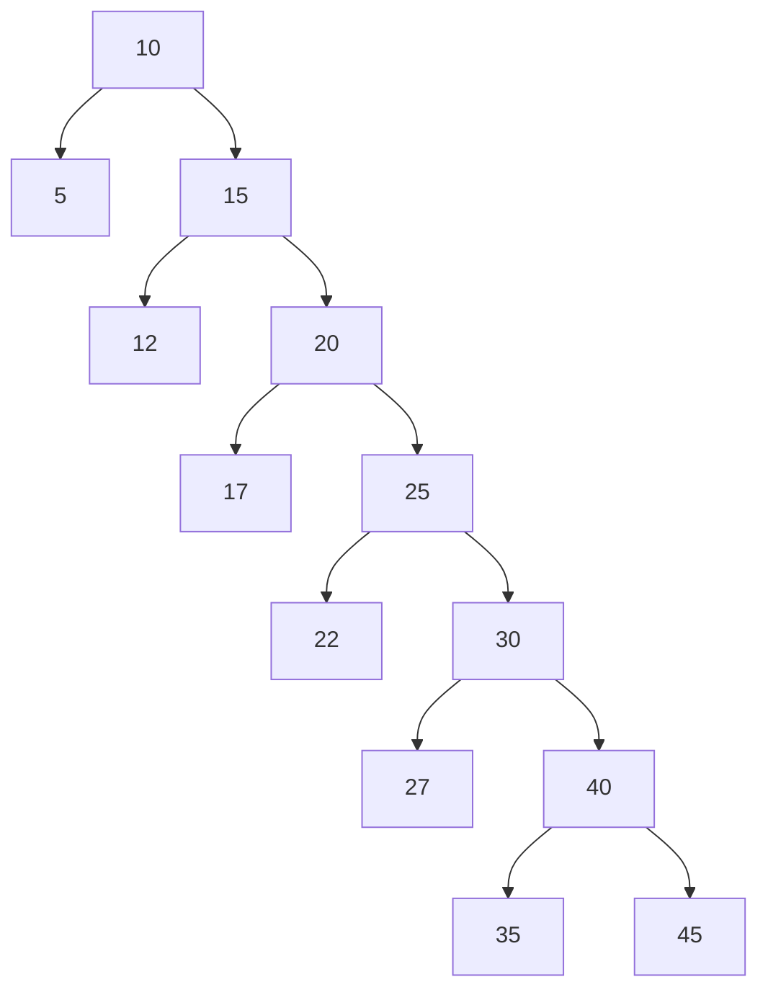
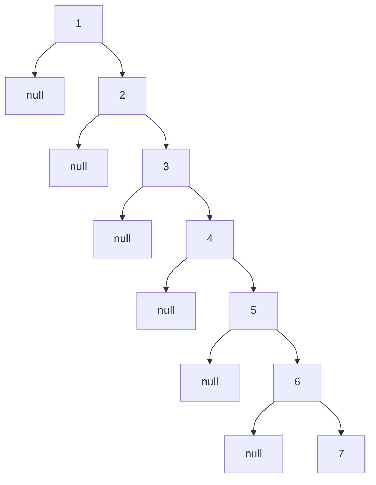
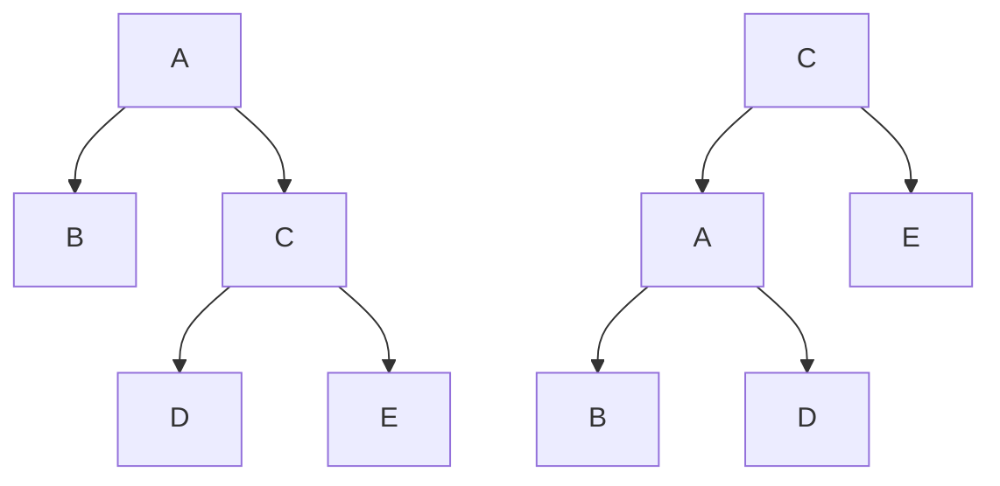
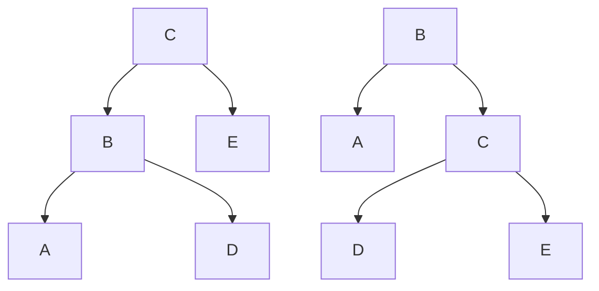

# Balanced Search Trees

## Introduction

Balanced search trees are specialized tree data structures that maintain a balanced shape regardless of the insertion or deletion order of elements. Unlike simple binary search trees that can degrade into linear structures (effectively becoming linked lists) in worst-case scenarios, balanced trees ensure logarithmic O(log n) time complexity for search, insertion, and deletion operations.

These trees are fundamental to many high-performance systems and are used extensively in databases, file systems, and other applications where efficient data retrieval is critical.

## Why Balance Matters

To understand the importance of balanced trees, let's first examine what happens when a binary search tree becomes unbalanced:



In this unbalanced tree, searching for element `45` would require traversing 5 nodes, while in a balanced tree of the same size, we'd only need to traverse 3 or 4 nodes.

Now, imagine an even worse scenario where elements are inserted in sorted order:



This degenerates into a linked list, giving us O(n) search time instead of the desired O(log n).

## Common Types of Balanced Search Trees

### 1. AVL Trees

AVL trees (named after inventors Adelson-Velsky and Landis) maintain balance by ensuring that the height difference between left and right subtrees of any node is at most 1. This height difference is called the balance factor.

#### Balance Factor

For any node in an AVL tree:
- Balance Factor = Height(Left Subtree) - Height(Right Subtree)
- A balance factor of -1, 0, or 1 indicates the tree is balanced

#### Rotations in AVL Trees

When an insertion or deletion violates the balance factor constraint, the tree performs rotations to restore balance:

**Left Rotation:**



**Right Rotation:**



There are also double rotations (Left-Right and Right-Left) for more complex imbalance scenarios.

#### AVL Tree Implementation

Here's a basic implementation of an AVL tree node and insertion operation in Python:

```python
class AVLNode:
    def __init__(self, key):
        self.key = key
        self.left = None
        self.right = None
        self.height = 1  # Height of the node (leaf nodes have height 1)

class AVLTree:
    def __init__(self):
        self.root = None
    
    def height(self, node):
        if node is None:
            return 0
        return node.height
    
    def balance_factor(self, node):
        if node is None:
            return 0
        return self.height(node.left) - self.height(node.right)
    
    def update_height(self, node):
        if node is None:
            return
        node.height = 1 + max(self.height(node.left), self.height(node.right))
    
    def right_rotate(self, y):
        x = y.left
        T2 = x.right
        
        # Perform rotation
        x.right = y
        y.left = T2
        
        # Update heights
        self.update_height(y)
        self.update_height(x)
        
        return x
    
    def left_rotate(self, x):
        y = x.right
        T2 = y.left
        
        # Perform rotation
        y.left = x
        x.right = T2
        
        # Update heights
        self.update_height(x)
        self.update_height(y)
        
        return y
    
    def insert(self, root, key):
        # Standard BST insert
        if root is None:
            return AVLNode(key)
        
        if key < root.key:
            root.left = self.insert(root.left, key)
        elif key > root.key:
            root.right = self.insert(root.right, key)
        else:
            # Duplicate keys not allowed
            return root
        
        # Update height of current node
        self.update_height(root)
        
        # Get balance factor
        balance = self.balance_factor(root)
        
        # Left heavy
        if balance > 1:
            # Left-Right case
            if key > root.left.key:
                root.left = self.left_rotate(root.left)
                return self.right_rotate(root)
            # Left-Left case
            return self.right_rotate(root)
        
        # Right heavy
        if balance < -1:
            # Right-Left case
            if key < root.right.key:
                root.right = self.right_rotate(root.right)
                return self.left_rotate(root)
            # Right-Right case
            return self.left_rotate(root)
        
        return root
    
    def insert_key(self, key):
        self.root = self.insert(self.root, key)
```

#### Example Usage:

```python
# Create an AVL tree
avl_tree = AVLTree()

# Insert elements
elements = [10, 20, 30, 40, 50, 25]
for element in elements:
    avl_tree.insert_key(element)

# The resulting tree will be balanced despite inserting in ascending order
```

### 2. Red-Black Trees

Red-Black trees are another type of self-balancing binary search tree that use a different approach to maintain balance. They're named for the "color" attribute assigned to each node.

#### Red-Black Tree Properties

1. Every node is either red or black
2. The root is black
3. All leaves (NIL/NULL nodes) are black
4. If a node is red, both its children are black
5. Every path from a node to any of its descendant NIL nodes contains the same number of black nodes

These properties ensure the tree remains approximately balanced, with no path being more than twice as long as any other path.

#### Red-Black Tree Implementation

Here's a simplified implementation of a Red-Black tree in Python:

```python
class RBNode:
    def __init__(self, key):
        self.key = key
        self.left = None
        self.right = None
        self.parent = None
        self.color = "RED"  # New nodes are always red

class RedBlackTree:
    def __init__(self):
        self.NIL = RBNode(None)
        self.NIL.color = "BLACK"
        self.NIL.left = None
        self.NIL.right = None
        self.root = self.NIL
    
    def left_rotate(self, x):
        y = x.right
        x.right = y.left
        
        if y.left != self.NIL:
            y.left.parent = x
        
        y.parent = x.parent
        
        if x.parent is None:
            self.root = y
        elif x == x.parent.left:
            x.parent.left = y
        else:
            x.parent.right = y
        
        y.left = x
        x.parent = y
    
    def right_rotate(self, y):
        x = y.left
        y.left = x.right
        
        if x.right != self.NIL:
            x.right.parent = y
        
        x.parent = y.parent
        
        if y.parent is None:
            self.root = x
        elif y == y.parent.left:
            y.parent.left = x
        else:
            y.parent.right = x
        
        x.right = y
        y.parent = x
    
    def insert_fixup(self, k):
        while k.parent and k.parent.color == "RED":
            if k.parent == k.parent.parent.left:
                u = k.parent.parent.right
                
                if u.color == "RED":
                    k.parent.color = "BLACK"
                    u.color = "BLACK"
                    k.parent.parent.color = "RED"
                    k = k.parent.parent
                else:
                    if k == k.parent.right:
                        k = k.parent
                        self.left_rotate(k)
                    
                    k.parent.color = "BLACK"
                    k.parent.parent.color = "RED"
                    self.right_rotate(k.parent.parent)
            else:
                u = k.parent.parent.left
                
                if u.color == "RED":
                    k.parent.color = "BLACK"
                    u.color = "BLACK"
                    k.parent.parent.color = "RED"
                    k = k.parent.parent
                else:
                    if k == k.parent.left:
                        k = k.parent
                        self.right_rotate(k)
                    
                    k.parent.color = "BLACK"
                    k.parent.parent.color = "RED"
                    self.left_rotate(k.parent.parent)
            
            if k == self.root:
                break
        
        self.root.color = "BLACK"
    
    def insert(self, key):
        node = RBNode(key)
        node.left = self.NIL
        node.right = self.NIL
        
        y = None
        x = self.root
        
        while x != self.NIL:
            y = x
            if node.key < x.key:
                x = x.left
            else:
                x = x.right
        
        node.parent = y
        
        if y is None:
            self.root = node
        elif node.key < y.key:
            y.left = node
        else:
            y.right = node
        
        if node.parent is None:
            node.color = "BLACK"
            return
        
        if node.parent.parent is None:
            return
        
        self.insert_fixup(node)
```

#### Example Usage:

```python
# Create a Red-Black tree
rb_tree = RedBlackTree()

# Insert elements
elements = [7, 3, 18, 10, 22, 8, 11, 26]
for element in elements:
    rb_tree.insert(element)
```

### 3. B-Trees and B+ Trees

While AVL and Red-Black trees are binary trees, B-Trees and B+ Trees are multiway search trees designed primarily for disk storage systems.

#### B-Tree Properties

1. A B-Tree of order m has nodes that can contain up to m-1 keys and m children
2. All leaf nodes are at the same level
3. Keys within each node are sorted
4. A non-leaf node with k keys has k+1 children

B-Trees are commonly used in databases and file systems because they minimize disk I/O operations by storing multiple keys per node.

## Time Complexity Comparison

| Operation | Binary Search Tree (worst) | Balanced Trees (AVL, Red-Black) |
|-----------|----------------------------|--------------------------------|
| Search    | O(n)                       | O(log n)                       |
| Insert    | O(n)                       | O(log n)                       |
| Delete    | O(n)                       | O(log n)                       |

## Real-World Applications

Balanced search trees are fundamental to many systems and applications:

### 1. Database Indexing

Most relational databases use B-Trees or B+ Trees for indexing. For example, MySQL's InnoDB storage engine uses B+ Trees to index data, allowing for efficient range queries and lookups.

### 2. File Systems

Many modern file systems use balanced trees to organize file and directory structures:

- Linux ext3/ext4 uses B-Trees for directory indexing
- NTFS (Windows) uses B+ Trees for its Master File Table
- HFS+ (macOS) uses B-Trees for its catalog file

### 3. Memory Management

Red-Black trees are used in many memory allocation systems:

```python
# Example: Using a balanced tree to track memory allocations
class MemoryManager:
    def __init__(self):
        self.memory_tree = RedBlackTree()  # Using our Red-Black tree
    
    def allocate(self, size, address):
        # Track a memory allocation in our tree
        self.memory_tree.insert(address)
    
    def deallocate(self, address):
        # Remove the allocation from our tree
        # (full implementation would need a delete method)
        pass
    
    def find_nearest_allocation(self, address):
        # Find the allocation closest to a given address
        # Efficient because of the balanced tree structure
        pass
```

### 4. Network Routing Tables

Balanced trees are used to implement routing tables in network devices:

```python
# Example: IP routing table using a balanced tree
class RouterTable:
    def __init__(self):
        self.routes = AVLTree()  # Using our AVL tree
    
    def add_route(self, ip_prefix, next_hop):
        self.routes.insert_key((ip_prefix, next_hop))
    
    def find_route(self, ip_address):
        # Find the most specific route for an IP address
        # Efficient lookups because of the balanced tree
        pass
```

## Implementation Considerations

When implementing balanced search trees, consider these factors:

1. **Memory Overhead**: Balanced trees require additional memory for tracking balance information (heights in AVL trees, colors in Red-Black trees)

2. **Implementation Complexity**: AVL trees typically require more complex balancing operations than Red-Black trees

3. **Usage Pattern**: Red-Black trees tend to perform better for frequent insertions/deletions, while AVL trees provide slightly faster lookups due to stricter balancing

4. **Concurrency**: B-Trees are often better for concurrent access scenarios

## Summary

Balanced search trees solve the problem of performance degradation in simple binary search trees by maintaining a balanced structure regardless of the insertion order. This guarantees O(log n) time complexity for core operations, making them crucial for high-performance applications.

The key types of balanced trees include:
- AVL Trees: Strictly balanced (max height difference of 1)
- Red-Black Trees: Approximately balanced
- B-Trees/B+ Trees: Multiway balanced trees optimized for storage systems

Understanding when to use each type of balanced tree is an important skill for efficient system design.

## Exercises

1. Implement a function to check if a given binary tree is balanced according to AVL tree rules.

2. Extend the AVL tree implementation to include deletion operations.

3. Implement a simple key-value store using a balanced search tree of your choice.

4. Compare the performance of AVL trees and Red-Black trees by inserting 1 million random integers and measuring the time taken.

5. Implement a B-Tree with a configurable order (m) and test it with various values of m.

## Additional Resources

- "Introduction to Algorithms" by Cormen, Leiserson, Rivest, and Stein
- "Data Structures and Algorithm Analysis" by Mark Allen Weiss
- "Advanced Data Structures" by Peter Brass