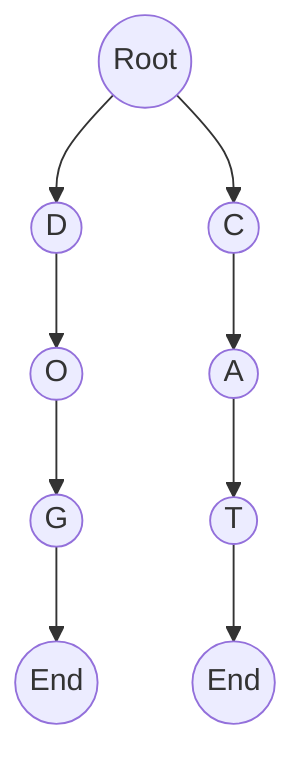
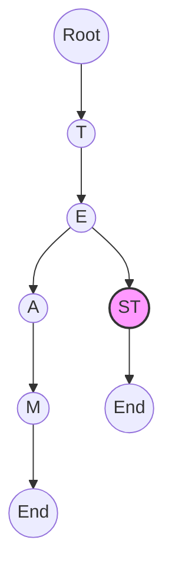

# Trie Data Structure

## Introduction

A **Trie** (pronounced "try" or "tree") is an efficient tree-like data structure used primarily for storing and retrieving strings. The name "trie" comes from the word "re**trie**val," highlighting its primary purpose. Tries are also known as **prefix trees** because they excel at prefix-based operations.

Unlike binary trees or hash tables, tries organize data in a way that makes operations on strings particularly efficient, especially when dealing with large datasets that share common prefixes, such as dictionaries or contact lists.

## Basic Structure

A trie node typically contains:
1. An array or map of child nodes (one for each possible character)
2. A flag indicating whether the node represents the end of a word

Each path from the root to a node in the trie represents a string, with each node along the path corresponding to a character in that string.



In this simple trie, we have two words: "DOG" and "CAT". The nodes marked "End" indicate complete words.

## Implementation

Let's implement a basic trie in JavaScript:

```javascript
class TrieNode {
  constructor() {
    this.children = {};
    this.isEndOfWord = false;
  }
}

class Trie {
  constructor() {
    this.root = new TrieNode();
  }
  
  // Insert a word into the trie
  insert(word) {
    let current = this.root;
    
    for (let char of word) {
      if (!current.children[char]) {
        current.children[char] = new TrieNode();
      }
      current = current.children[char];
    }
    
    current.isEndOfWord = true;
  }
  
  // Search for a word in the trie
  search(word) {
    let current = this.root;
    
    for (let char of word) {
      if (!current.children[char]) {
        return false;
      }
      current = current.children[char];
    }
    
    return current.isEndOfWord;
  }
  
  // Check if there is any word that starts with the given prefix
  startsWith(prefix) {
    let current = this.root;
    
    for (let char of prefix) {
      if (!current.children[char]) {
        return false;
      }
      current = current.children[char];
    }
    
    return true;
  }
}
```

### Example Usage:

```javascript
// Create a new trie
const trie = new Trie();

// Insert words
trie.insert("apple");
trie.insert("application");
trie.insert("apply");
trie.insert("banana");

// Search for words
console.log(trie.search("apple"));      // true
console.log(trie.search("app"));        // false
console.log(trie.search("banana"));     // true
console.log(trie.search("orange"));     // false

// Check prefixes
console.log(trie.startsWith("app"));    // true
console.log(trie.startsWith("ban"));    // true
console.log(trie.startsWith("ora"));    // false
```

## Core Operations

Tries support several fundamental operations:

1. **Insertion**: Add a word to the trie
2. **Search**: Check if a word exists in the trie
3. **Prefix Search**: Find all words that start with a given prefix
4. **Deletion**: Remove a word from the trie

Let's add the ability to find all words with a given prefix:

```javascript
// Add to the Trie class

findWordsWithPrefix(prefix) {
  const result = [];
  let current = this.root;
  
  // Navigate to the node representing the prefix
  for (let char of prefix) {
    if (!current.children[char]) {
      return result; // Prefix not found
    }
    current = current.children[char];
  }
  
  // Helper function to collect all words from this node
  const findAllWords = (node, word) => {
    if (node.isEndOfWord) {
      result.push(word);
    }
    
    for (let char in node.children) {
      findAllWords(node.children[char], word + char);
    }
  };
  
  findAllWords(current, prefix);
  return result;
}
```

### Example of finding words with a prefix:

```javascript
// Using the trie from before
console.log(trie.findWordsWithPrefix("app"));
// Output: ["apple", "application", "apply"]

console.log(trie.findWordsWithPrefix("b"));
// Output: ["banana"]
```

## Time and Space Complexity

### Time Complexity:
- **Insertion**: O(m) where m is the length of the word
- **Search**: O(m) where m is the length of the word
- **Prefix Search**: O(n) where n is the number of nodes visited (proportional to the number of matching words)

### Space Complexity:
- O(ALPHABET_SIZE × n × m) where:
  - ALPHABET_SIZE is the number of possible characters in each node (26 for English lowercase)
  - n is the number of words
  - m is the average length of the words

## Real-World Applications

Tries have numerous practical applications:

### 1. Autocomplete and Predictive Text

When you type in a search engine or messaging app, tries can efficiently find all words that start with what you've typed so far.

```javascript
// Example of an autocomplete system
function autocomplete(trie, userInput) {
  const suggestions = trie.findWordsWithPrefix(userInput);
  return suggestions.slice(0, 5); // Return top 5 suggestions
}

// Build a trie with a dictionary
const dictionaryTrie = new Trie();
["hello", "help", "helper", "helping", "hen", "heritage", "history", "home", "house"].forEach(word => {
  dictionaryTrie.insert(word);
});

// Get autocomplete suggestions
console.log(autocomplete(dictionaryTrie, "he"));
// Output: ["hello", "help", "helper", "helping", "hen"]
```

### 2. Spell Checking

Tries can efficiently verify if a word exists in a dictionary.

```javascript
function isSpelledCorrectly(trie, word) {
  return trie.search(word);
}

// Using the dictionary trie from before
console.log(isSpelledCorrectly(dictionaryTrie, "hello")); // true
console.log(isSpelledCorrectly(dictionaryTrie, "helpp")); // false
```

### 3. IP Routing (Longest Prefix Matching)

Network routers use tries to find the longest matching prefix for an IP address, determining where to forward packets.

### 4. Implementing Dictionaries

Tries are excellent for implementing dictionaries or mappings where keys are strings.

## Advanced Trie Concepts

### 1. Compressed Tries (Radix Trees)

Regular tries can waste space when there are long chains with only one child. Compressed tries merge these chains into single nodes.



In this compressed trie representing "TEAM" and "TEST", the "ST" is compressed into a single node.

### 2. Ternary Search Tries (TST)

A memory-efficient variation where each node has three children: less, equal, and greater. This combines advantages of binary search trees and tries.

## Implementation Exercise

Let's implement a function to delete a word from a trie:

```javascript
// Add to the Trie class

delete(word) {
  // Helper function that returns true if the node should be deleted
  const deleteHelper = (node, word, depth = 0) => {
    // Base case: reached the end of the word
    if (depth === word.length) {
      // If not the end of a word in the trie, nothing to delete
      if (!node.isEndOfWord) return false;
      
      // Mark as not the end of a word
      node.isEndOfWord = false;
      
      // Return true if this node has no children (can be deleted)
      return Object.keys(node.children).length === 0;
    }
    
    const char = word[depth];
    // If character not found, word doesn't exist
    if (!node.children[char]) return false;
    
    // Check if we should delete the child
    const shouldDeleteChild = deleteHelper(node.children[char], word, depth + 1);
    
    // If child should be deleted
    if (shouldDeleteChild) {
      delete node.children[char];
      
      // Return true if this node is not the end of another word and has no children
      return !node.isEndOfWord && Object.keys(node.children).length === 0;
    }
    
    return false;
  };
  
  deleteHelper(this.root, word);
}
```

### Example of deletion:

```javascript
// Create a trie with some words
const deletionTrie = new Trie();
deletionTrie.insert("apple");
deletionTrie.insert("application");

console.log(deletionTrie.search("apple"));        // true
console.log(deletionTrie.search("application"));  // true

// Delete a word
deletionTrie.delete("apple");

console.log(deletionTrie.search("apple"));        // false
console.log(deletionTrie.search("application"));  // true (still exists)
```

## Summary

Tries are powerful data structures for string operations, offering efficient solutions for problems involving prefixes, word searches, and auto-completion. They excel when working with large datasets of strings, especially those with common prefixes.

Key advantages of tries include:
- O(m) lookup time where m is the length of the string
- Efficient prefix-based operations
- Natural organization of string data

The main disadvantage is higher memory usage compared to other structures like hash tables, especially for sparse datasets.

## Additional Resources and Exercises

### Further Learning
- Explore other trie variants like Patricia tries or suffix tries
- Learn about trie applications in computational biology for DNA sequence matching
- Study how to implement tries in different programming languages

### Practice Exercises
1. Implement a function to count the total number of words in a trie
2. Create a trie-based solution for finding the longest common prefix of all strings
3. Implement a function that returns all words in the trie in alphabetical order
4. Build a boggle solver that uses a trie to find all possible words on a boggle board
5. Modify the trie to store additional information at each end node, such as word frequency

By mastering tries, you'll have a powerful tool in your data structure toolkit, especially for string processing applications and algorithms.