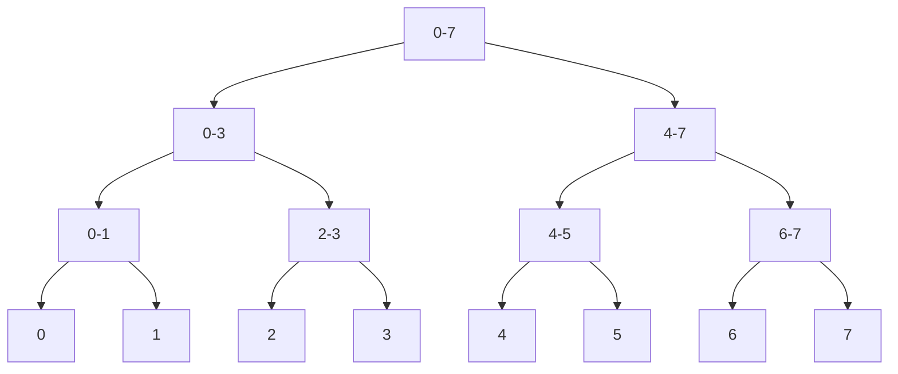

# Segment Trees

## Introduction

A Segment Tree is a versatile and powerful data structure designed to efficiently perform range queries and updates on arrays. While simple arrays excel at single element access, they struggle with operations across ranges of elements. Segment Trees solve this problem by providing a balanced tree-based approach that can handle various range operations with logarithmic time complexity.

In competitive programming and real-world applications, you'll often encounter problems that require:
- Finding the sum of elements from index i to j
- Finding the minimum/maximum element in a range
- Updating elements within a range

A naive approach to these operations would require O(n) time for each query, which becomes inefficient for large datasets or multiple queries. Segment Trees reduce this to O(log n) time per operation.

## Understanding Segment Trees

A Segment Tree is a binary tree where:
- Each node represents a segment (range) of the array
- The root represents the entire array
- Each leaf node represents a single element
- Each non-leaf node has two children that represent the two halves of the node's segment



In the diagram above, each node is labeled with the range it covers. For example, the root node covers the entire array (indices 0 to 7), while its children cover indices 0-3 and 4-7, respectively.

## Building a Segment Tree

Let's implement a Segment Tree for the sum operation in C++:

```cpp
#include <vector>
#include <iostream>

class SegmentTree {
private:
    std::vector<int> tree;
    int n;

    // Build the segment tree recursively
    void build(const std::vector<int>& arr, int node, int start, int end) {
        if (start == end) {
            // Leaf node
            tree[node] = arr[start];
        } else {
            int mid = (start + end) / 2;
            
            // Recursively build left and right subtrees
            build(arr, 2 * node + 1, start, mid);
            build(arr, 2 * node + 2, mid + 1, end);
            
            // Internal node stores the sum of its children
            tree[node] = tree[2 * node + 1] + tree[2 * node + 2];
        }
    }

public:
    SegmentTree(const std::vector<int>& arr) {
        n = arr.size();
        // The maximum size needed for the segment tree array is 2*2^ceil(log2(n)) - 1
        tree.resize(4 * n);
        build(arr, 0, 0, n - 1);
    }

    // More methods will be added here
};
```

Let's analyze what's happening:
1. We allocate a vector to store our tree nodes (4 * n is a safe upper bound)
2. The `build` function constructs the tree recursively
3. For leaf nodes, we simply store the array value
4. For internal nodes, we compute the sum of their children

## Querying the Segment Tree

Now, let's implement a method to query the sum of elements in a range [l, r]:

```cpp
int query(int node, int start, int end, int l, int r) {
    // If the range is completely outside our segment
    if (start > r || end < l) {
        return 0;  // Identity element for sum
    }
    
    // If the segment is completely inside the query range
    if (l <= start && end <= r) {
        return tree[node];
    }
    
    // If the segment partially overlaps with the query range
    int mid = (start + end) / 2;
    int leftSum = query(2 * node + 1, start, mid, l, r);
    int rightSum = query(2 * node + 2, mid + 1, end, l, r);
    
    return leftSum + rightSum;
}

// Wrapper method
int queryRange(int l, int r) {
    return query(0, 0, n - 1, l, r);
}
```

The query operation works as follows:
1. If the current segment is completely outside the query range, return the identity element (0 for sum)
2. If the current segment is completely inside the query range, return the value stored in the node
3. Otherwise, recursively query both children and combine the results

## Updating the Segment Tree

Let's implement a method to update a single element in the array:

```cpp
void update(int node, int start, int end, int idx, int val) {
    // If the index is outside the current segment
    if (idx < start || idx > end) {
        return;
    }
    
    // If we've reached the leaf node for the index
    if (start == end) {
        tree[node] = val;
        return;
    }
    
    // Update the appropriate child
    int mid = (start + end) / 2;
    update(2 * node + 1, start, mid, idx, val);
    update(2 * node + 2, mid + 1, end, idx, val);
    
    // Update the current node based on its children
    tree[node] = tree[2 * node + 1] + tree[2 * node + 2];
}

// Wrapper method
void updateValue(int idx, int val) {
    update(0, 0, n - 1, idx, val);
}
```

The update operation:
1. Navigates to the leaf node corresponding to the index
2. Updates its value
3. Recalculates the values of all ancestors of that leaf

## Complete Implementation

Here's the complete implementation with example usage:

```cpp
#include <vector>
#include <iostream>

class SegmentTree {
private:
    std::vector<int> tree;
    int n;

    void build(const std::vector<int>& arr, int node, int start, int end) {
        if (start == end) {
            tree[node] = arr[start];
        } else {
            int mid = (start + end) / 2;
            build(arr, 2 * node + 1, start, mid);
            build(arr, 2 * node + 2, mid + 1, end);
            tree[node] = tree[2 * node + 1] + tree[2 * node + 2];
        }
    }

    int query(int node, int start, int end, int l, int r) {
        if (start > r || end < l) {
            return 0;
        }
        if (l <= start && end <= r) {
            return tree[node];
        }
        int mid = (start + end) / 2;
        int leftSum = query(2 * node + 1, start, mid, l, r);
        int rightSum = query(2 * node + 2, mid + 1, end, l, r);
        return leftSum + rightSum;
    }

    void update(int node, int start, int end, int idx, int val) {
        if (idx < start || idx > end) {
            return;
        }
        if (start == end) {
            tree[node] = val;
            return;
        }
        int mid = (start + end) / 2;
        update(2 * node + 1, start, mid, idx, val);
        update(2 * node + 2, mid + 1, end, idx, val);
        tree[node] = tree[2 * node + 1] + tree[2 * node + 2];
    }

public:
    SegmentTree(const std::vector<int>& arr) {
        n = arr.size();
        tree.resize(4 * n);
        build(arr, 0, 0, n - 1);
    }

    int queryRange(int l, int r) {
        return query(0, 0, n - 1, l, r);
    }

    void updateValue(int idx, int val) {
        update(0, 0, n - 1, idx, val);
    }
};

int main() {
    std::vector<int> arr = {1, 3, 5, 7, 9, 11};
    SegmentTree segTree(arr);
    
    std::cout << "Sum of elements in range [1, 3]: " << segTree.queryRange(1, 3) << std::endl;
    // Output: Sum of elements in range [1, 3]: 15
    
    segTree.updateValue(2, 10);  // Update arr[2] to 10
    
    std::cout << "Sum of elements in range [1, 3] after update: " << segTree.queryRange(1, 3) << std::endl;
    // Output: Sum of elements in range [1, 3] after update: 20
    
    return 0;
}
```

## Variations and Extensions

### Minimum/Maximum Segment Tree

By changing just a few lines, we can create a segment tree for finding the minimum or maximum in a range:

```cpp
// For minimum queries
// In build and update:
tree[node] = std::min(tree[2 * node + 1], tree[2 * node + 2]);

// In query:
if (start > r || end < l) {
    return INT_MAX;  // Identity element for min
}
```

### Lazy Propagation

For handling range updates efficiently, we can use a technique called "lazy propagation":

```cpp
class LazySegmentTree {
private:
    std::vector<int> tree, lazy;
    int n;

    // Additional methods for lazy propagation
    void pushDown(int node, int start, int end) {
        if (lazy[node] != 0) {
            tree[node] += (end - start + 1) * lazy[node];
            
            if (start != end) {
                lazy[2 * node + 1] += lazy[node];
                lazy[2 * node + 2] += lazy[node];
            }
            
            lazy[node] = 0;
        }
    }

public:
    LazySegmentTree(const std::vector<int>& arr) {
        n = arr.size();
        tree.resize(4 * n);
        lazy.resize(4 * n, 0);
        // Build tree as before
    }

    // Range update: add 'val' to all elements in range [l, r]
    void updateRange(int node, int start, int end, int l, int r, int val) {
        pushDown(node, start, end);
        
        if (start > r || end < l) {
            return;
        }
        
        if (l <= start && end <= r) {
            tree[node] += (end - start + 1) * val;
            if (start != end) {
                lazy[2 * node + 1] += val;
                lazy[2 * node + 2] += val;
            }
            return;
        }
        
        int mid = (start + end) / 2;
        updateRange(2 * node + 1, start, mid, l, r, val);
        updateRange(2 * node + 2, mid + 1, end, l, r, val);
        tree[node] = tree[2 * node + 1] + tree[2 * node + 2];
    }

    // Modified query to handle lazy propagation
    int queryRange(int node, int start, int end, int l, int r) {
        if (start > r || end < l) {
            return 0;
        }
        
        pushDown(node, start, end);
        
        if (l <= start && end <= r) {
            return tree[node];
        }
        
        int mid = (start + end) / 2;
        int leftSum = queryRange(2 * node + 1, start, mid, l, r);
        int rightSum = queryRange(2 * node + 2, mid + 1, end, l, r);
        return leftSum + rightSum;
    }
};
```

Lazy propagation is particularly useful when we have multiple range updates, as it avoids updating all nodes immediately.

## Real-World Applications

Segment Trees have numerous practical applications:

### 1. Database Systems

Range queries are common in databases, where we need to efficiently compute aggregates over ranges of records:

```sql
SELECT SUM(sales) FROM transactions WHERE date BETWEEN '2023-01-01' AND '2023-01-31';
```

Segment trees can power these operations behind the scenes.

### 2. Geographic Information Systems (GIS)

GIS applications often need to find all objects within a certain rectangular area, which can be efficiently implemented using 2D segment trees.

### 3. Computational Geometry

Problems like finding all line segments that intersect a given query range can be solved using segment trees.

### 4. Financial Systems

Computing moving averages, range statistics, or detecting anomalies in time series data is much faster with segment trees.

## Implementation in Python

Here's a Python implementation for those who prefer Python:

```python
class SegmentTree:
    def __init__(self, arr):
        self.n = len(arr)
        self.tree = [0] * (4 * self.n)
        self.build(arr, 0, 0, self.n - 1)
    
    def build(self, arr, node, start, end):
        if start == end:
            self.tree[node] = arr[start]
        else:
            mid = (start + end) // 2
            self.build(arr, 2 * node + 1, start, mid)
            self.build(arr, 2 * node + 2, mid + 1, end)
            self.tree[node] = self.tree[2 * node + 1] + self.tree[2 * node + 2]
    
    def query_range(self, l, r):
        return self._query(0, 0, self.n - 1, l, r)
    
    def _query(self, node, start, end, l, r):
        if start > r or end < l:
            return 0
        if l <= start and end <= r:
            return self.tree[node]
        mid = (start + end) // 2
        left_sum = self._query(2 * node + 1, start, mid, l, r)
        right_sum = self._query(2 * node + 2, mid + 1, end, l, r)
        return left_sum + right_sum
    
    def update_value(self, idx, val):
        self._update(0, 0, self.n - 1, idx, val)
    
    def _update(self, node, start, end, idx, val):
        if idx < start or idx > end:
            return
        if start == end:
            self.tree[node] = val
            return
        mid = (start + end) // 2
        self._update(2 * node + 1, start, mid, idx, val)
        self._update(2 * node + 2, mid + 1, end, idx, val)
        self.tree[node] = self.tree[2 * node + 1] + self.tree[2 * node + 2]

# Example usage
arr = [1, 3, 5, 7, 9, 11]
seg_tree = SegmentTree(arr)
print(f"Sum of elements in range [1, 3]: {seg_tree.query_range(1, 3)}")  # Output: 15
seg_tree.update_value(2, 10)
print(f"Sum after update: {seg_tree.query_range(1, 3)}")  # Output: 20
```

## Time and Space Complexity

Let's analyze the efficiency of segment trees:

| Operation | Time Complexity |
|-----------|-----------------|
| Build     | O(n)            |
| Query     | O(log n)        |
| Update    | O(log n)        |

Space complexity: O(n) - While we allocate 4n nodes, this is still linear in the input size.

## Comparison with Other Data Structures

| Data Structure    | Range Query | Range Update  | Point Update |
|-------------------|-------------|---------------|--------------|
| Array             | O(n)        | O(n)          | O(1)         |
| Binary Indexed Tree | O(log n)  | O(log n)*     | O(log n)     |
| Segment Tree      | O(log n)    | O(log n)**    | O(log n)     |

\* Limited types of updates  
\** With lazy propagation

## Practice Problems

To strengthen your understanding, try solving these problems:
1. Implement a segment tree for finding the minimum element in a range
2. Modify the segment tree to handle range updates (adding a value to all elements in a range)
3. Implement a segment tree that can find the number of elements in a range that are greater than a given value
4. Create a 2D segment tree for matrix operations

## Summary

Segment Trees are powerful data structures that provide efficient solutions for range-based problems. They excel at:

- Range queries (sum, min, max, etc.)
- Point updates
- Range updates (with lazy propagation)

While they require more memory than some alternatives, their flexibility and logarithmic time complexity make them invaluable tools in your algorithmic toolkit.

Understanding segment trees will not only help you solve many competitive programming problems but also give you insights into how efficient range operations can be implemented in real-world applications.

## Additional Resources

Here are some resources to deepen your understanding:
- Competitive Programming 3 by Steven Halim
- Introduction to Algorithms (CLRS)
- GeeksforGeeks articles on Segment Trees
- Codeforces EDU section on Segment Trees

Happy coding!