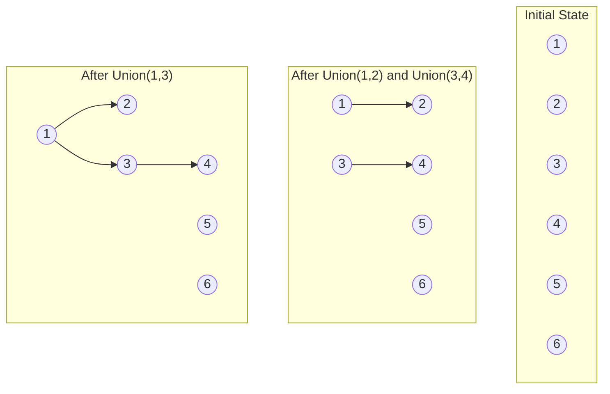

# Disjoint Set (Union-Find)

## Introduction

A Disjoint Set (also known as Union-Find) is a data structure that keeps track of elements partitioned into non-overlapping (disjoint) subsets. It provides near-constant-time operations to:

1. **Find**: Determine which subset an element belongs to
2. **Union**: Join two subsets into a single subset

This data structure is particularly useful for solving problems related to connectivity in graphs, such as determining if two elements are in the same connected component, or merging connected components together.

## Why Learn Disjoint Sets?

Disjoint Sets are powerful tools that solve seemingly complex problems with elegant simplicity. They're essential for:

- Network connectivity problems
- Finding minimum spanning trees (Kruskal's algorithm)
- Detecting cycles in undirected graphs
- Image processing algorithms
- And many more graph-related problems

## Basic Operations

A Disjoint Set supports two primary operations:

- **Find(x)**: Returns the representative (or "parent") of the set containing element x
- **Union(x, y)**: Merges the sets containing elements x and y

## Understanding Disjoint Sets Visually

Let's visualize how elements are grouped in disjoint sets:



## Implementation

Let's implement a basic Disjoint Set data structure in Python:

```python
class DisjointSet:
    def __init__(self, n):
        # Initially, each element is its own parent/representative
        self.parent = list(range(n))
        # Rank is used for union by rank optimization
        self.rank = [0] * n
    
    # Find operation with path compression
    def find(self, x):
        if self.parent[x] != x:
            self.parent[x] = self.find(self.parent[x])  # Path compression
        return self.parent[x]
    
    # Union operation with union by rank
    def union(self, x, y):
        root_x = self.find(x)
        root_y = self.find(y)
        
        if root_x == root_y:
            return  # x and y are already in the same set
        
        # Union by rank
        if self.rank[root_x] < self.rank[root_y]:
            self.parent[root_x] = root_y
        elif self.rank[root_x] > self.rank[root_y]:
            self.parent[root_y] = root_x
        else:
            self.parent[root_y] = root_x
            self.rank[root_x] += 1
```

## Optimizations

Two key optimizations make Disjoint Sets extremely efficient:

### 1. Path Compression

When we perform a `find` operation, we update each node's parent to point directly to the root, flattening the tree structure:

```python
def find(self, x):
    if self.parent[x] != x:
        self.parent[x] = self.find(self.parent[x])  # Path compression
    return self.parent[x]
```

### 2. Union by Rank

When performing a `union` operation, we attach the smaller tree to the root of the larger tree to minimize the height of the resulting tree:

```python
def union(self, x, y):
    root_x = self.find(x)
    root_y = self.find(y)
    
    if root_x == root_y:
        return
    
    # Union by rank
    if self.rank[root_x] < self.rank[root_y]:
        self.parent[root_x] = root_y
    elif self.rank[root_x] > self.rank[root_y]:
        self.parent[root_y] = root_x
    else:
        self.parent[root_y] = root_x
        self.rank[root_x] += 1
```

With these optimizations, both `find` and `union` operations have nearly constant amortized time complexity of approximately O(α(n)), where α(n) is the extremely slow-growing inverse Ackermann function.

## Example: Connected Components

Let's use our Disjoint Set to solve a practical problem - finding connected components in an undirected graph:

```python
def count_connected_components(n, edges):
    # Initialize DisjointSet with n nodes
    ds = DisjointSet(n)
    
    # Union edges
    for u, v in edges:
        ds.union(u, v)
    
    # Count unique representatives
    components = set()
    for i in range(n):
        components.add(ds.find(i))
    
    return len(components)

# Example usage
n = 6  # Number of nodes (0-5)
edges = [(0, 1), (1, 2), (3, 4)]
connected_components = count_connected_components(n, edges)
print(f"Number of connected components: {connected_components}")  # Output: 3
```

Let's analyze the execution:

1. We create a DisjointSet with 6 nodes (0-5)
2. We process the edges:
   - Union(0,1): Nodes 0 and 1 are now in the same component
   - Union(1,2): Nodes 0, 1, and 2 are now in the same component
   - Union(3,4): Nodes 3 and 4 are now in the same component
3. Node 5 remains in its own component
4. Final result: 3 connected components

## Real-World Applications

### 1. Network Connectivity

Disjoint Sets can determine if any two computers in a network can communicate with each other, either directly or indirectly through other computers.

```python
def are_connected(computer_a, computer_b, network_connections):
    n = max(max(a, b) for a, b in network_connections) + 1
    ds = DisjointSet(n)
    
    for a, b in network_connections:
        ds.union(a, b)
    
    return ds.find(computer_a) == ds.find(computer_b)

# Example
connections = [(0, 1), (1, 2), (3, 4), (5, 6)]
print(are_connected(0, 2, connections))  # Output: True
print(are_connected(0, 4, connections))  # Output: False
```

### 2. Kruskal's Algorithm for Minimum Spanning Tree

Disjoint Sets are a key component in Kruskal's algorithm for finding the minimum spanning tree of a graph:

```python
def kruskal_mst(n, edges):
    # Sort edges by weight
    edges.sort(key=lambda x: x[2])
    
    ds = DisjointSet(n)
    mst = []
    
    for u, v, weight in edges:
        if ds.find(u) != ds.find(v):  # If including this edge doesn't create a cycle
            ds.union(u, v)
            mst.append((u, v, weight))
    
    return mst

# Example
edges = [(0, 1, 10), (0, 2, 6), (0, 3, 5), (1, 3, 15), (2, 3, 4)]
mst = kruskal_mst(4, edges)
print("Minimum Spanning Tree:")
for u, v, w in mst:
    print(f"Edge ({u},{v}) with weight {w}")
```

### 3. Detecting Cycles in an Undirected Graph

We can use Disjoint Sets to detect cycles in an undirected graph:

```python
def has_cycle(n, edges):
    ds = DisjointSet(n)
    
    for u, v in edges:
        # If u and v are already in the same set, adding edge (u,v) creates a cycle
        if ds.find(u) == ds.find(v):
            return True
        ds.union(u, v)
    
    return False

# Example
edges = [(0, 1), (1, 2), (2, 0)]
print(f"Graph has cycle: {has_cycle(3, edges)}")  # Output: True
```

## Time Complexity Analysis

| Operation | Time Complexity |
|-----------|----------------|
| Initialize | O(n) |
| Find | O(α(n)) ≈ O(1) |
| Union | O(α(n)) ≈ O(1) |

Where α(n) is the inverse Ackermann function, which grows so slowly that it's effectively a constant for all practical values of n.

## Common Pitfalls

- **Forgetting path compression**: Without path compression, the tree can become very deep, leading to O(n) find operations.
- **Not using union by rank**: This can also lead to deep trees and inefficient operations.
- **Zero vs. One indexing**: Be careful about whether your elements are indexed from 0 or 1.

## Summary

The Disjoint Set (Union-Find) data structure is a powerful tool that efficiently tracks partitioned sets of elements and determines connectivity. With optimizations like path compression and union by rank, it achieves near-constant time operations, making it ideal for solving graph connectivity problems.

Key takeaways:
- A Disjoint Set maintains non-overlapping subsets of elements
- The primary operations are `find(x)` and `union(x, y)`
- Optimizations like path compression and union by rank make operations very efficient
- Common applications include network connectivity, minimum spanning trees, and cycle detection

## Exercises

1. Implement a function that, given a set of edges, determines if they form a valid tree (connected and acyclic).
2. Modify the DisjointSet class to keep track of the size of each set.
3. Implement a function to count the number of islands in a 2D grid using Disjoint Sets.
4. Use Disjoint Sets to solve the "Friends Circle" problem: Given a friendship relation matrix, count the number of friend circles.
5. Implement a function that, given a list of equations like "a==b" and "b!=c", determines if there's any contradiction.

## Additional Resources

- "Introduction to Algorithms" by Cormen, Leiserson, Rivest, and Stein
- "Algorithms" by Robert Sedgewick and Kevin Wayne
- [Stanford CS Theory - Disjoint Sets](http://web.stanford.edu/class/archive/cs/cs161/cs161.1138/lectures/11/Small11.pdf)
- [GeeksforGeeks - Disjoint Set (Union-Find)](https://www.geeksforgeeks.org/disjoint-set-data-structures/)