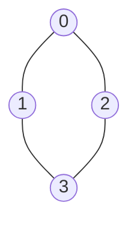

# Advanced Graph Representations

## Introduction

Graphs are powerful data structures that allow us to model relationships between objects. While you might be familiar with basic graph concepts, this tutorial delves into the various ways graphs can be represented in code. The choice of representation can dramatically impact the efficiency of graph algorithms and the amount of memory used.

A graph consists of vertices (or nodes) and edges connecting these vertices. How we store this information in our programs matters greatly when we need to perform operations like finding paths, detecting cycles, or analyzing connectivity.

## Basic Graph Types Recap

Before diving into representation methods, let's quickly remind ourselves of the basic graph types:

- **Undirected Graph**: Edges have no direction
- **Directed Graph**: Edges have a direction (from one vertex to another)
- **Weighted Graph**: Edges have weights or costs associated with them
- **Unweighted Graph**: All edges have the same implicit weight

## Common Graph Representations

### 1. Adjacency Matrix

An adjacency matrix is a 2D array where both dimensions represent vertices. The value at position `[i][j]` indicates whether there's an edge from vertex `i` to vertex `j`.



#### Adjacency Matrix for Undirected Graph

```python
# Representation of the above undirected graph as an adjacency matrix
adjacency_matrix = [
    [0, 1, 1, 0],  # Edges from vertex 0
    [1, 0, 0, 1],  # Edges from vertex 1
    [1, 0, 0, 1],  # Edges from vertex 2
    [0, 1, 1, 0]   # Edges from vertex 3
]
```

In a weighted graph, instead of 0 and 1, we would store the weight value or infinity/zero for no connection.

#### Implementation

```python
class GraphAdjMatrix:
    def __init__(self, num_vertices):
        self.num_vertices = num_vertices
        # Initialize with zeros (no edges)
        self.matrix = [[0 for _ in range(num_vertices)] for _ in range(num_vertices)]
    
    def add_edge(self, u, v, weight=1, directed=False):
        self.matrix[u][v] = weight
        if not directed:
            self.matrix[v][u] = weight
    
    def remove_edge(self, u, v, directed=False):
        self.matrix[u][v] = 0
        if not directed:
            self.matrix[v][u] = 0
    
    def has_edge(self, u, v):
        return self.matrix[u][v] != 0
    
    def get_neighbors(self, vertex):
        neighbors = []
        for i in range(self.num_vertices):
            if self.matrix[vertex][i] != 0:
                neighbors.append(i)
        return neighbors
```

#### Time Complexity
- Space: O(V²) where V is the number of vertices
- Add Edge: O(1)
- Remove Edge: O(1)
- Check if edge exists: O(1)
- Find all neighbors: O(V)

#### Pros and Cons

**Pros:**
- Simple implementation
- Edge lookup is constant time O(1)
- Good for dense graphs

**Cons:**
- Wastes space for sparse graphs (many zeros)
- Always requires O(V²) space regardless of the number of edges

### 2. Adjacency List

An adjacency list uses an array of lists. Each index in the array represents a vertex, and the corresponding list contains the vertices that are adjacent to it.

```python
# Representation of the same graph as an adjacency list
adjacency_list = [
    [1, 2],     # Neighbors of vertex 0
    [0, 3],     # Neighbors of vertex 1
    [0, 3],     # Neighbors of vertex 2
    [1, 2]      # Neighbors of vertex 3
]
```

For weighted graphs, each entry in the list would contain both the vertex and the weight.

#### Implementation

```python
class GraphAdjList:
    def __init__(self, num_vertices):
        self.num_vertices = num_vertices
        self.adj_list = [[] for _ in range(num_vertices)]
    
    def add_edge(self, u, v, weight=None, directed=False):
        if weight is None:
            self.adj_list[u].append(v)
            if not directed:
                self.adj_list[v].append(u)
        else:
            self.adj_list[u].append((v, weight))
            if not directed:
                self.adj_list[v].append((u, weight))
    
    def remove_edge(self, u, v, directed=False):
        # For unweighted graph
        if v in self.adj_list[u]:
            self.adj_list[u].remove(v)
        
        # For weighted graph (assuming weight not specified for removal)
        for i, (vertex, _) in enumerate(self.adj_list[u]):
            if vertex == v:
                self.adj_list[u].pop(i)
                break
        
        if not directed:
            # Similar logic for undirected graph
            if v in self.adj_list[u]:
                self.adj_list[v].remove(u)
            
            for i, (vertex, _) in enumerate(self.adj_list[v]):
                if vertex == u:
                    self.adj_list[v].pop(i)
                    break
    
    def has_edge(self, u, v):
        # For unweighted graph
        return v in self.adj_list[u]
    
    def get_neighbors(self, vertex):
        return self.adj_list[vertex]
```

#### Time Complexity
- Space: O(V + E) where V is the number of vertices and E is the number of edges
- Add Edge: O(1)
- Remove Edge: O(degree(v)) - need to search the list
- Check if edge exists: O(degree(v))
- Find all neighbors: O(1) to access the list, then O(degree(v)) to process them

#### Pros and Cons

**Pros:**
- Space-efficient for sparse graphs
- Iterating over all edges is efficient
- Adding vertices is easier

**Cons:**
- Less efficient for checking if an edge exists
- More complex implementation compared to matrices

### 3. Edge List

An edge list simply stores all edges in a list, with each edge represented as a pair of vertices (or a triple including weight for weighted graphs).

```python
# Edge list representation (unweighted)
edge_list = [(0, 1), (0, 2), (1, 3), (2, 3)]

# Edge list representation (weighted)
weighted_edge_list = [(0, 1, 5), (0, 2, 3), (1, 3, 1), (2, 3, 8)]
```

#### Implementation

```python
class GraphEdgeList:
    def __init__(self):
        self.edges = []
        self.num_vertices = 0
    
    def add_edge(self, u, v, weight=None):
        # Update the number of vertices if necessary
        self.num_vertices = max(self.num_vertices, u + 1, v + 1)
        
        if weight is None:
            self.edges.append((u, v))
        else:
            self.edges.append((u, v, weight))
    
    def remove_edge(self, u, v):
        # For unweighted graph
        if (u, v) in self.edges:
            self.edges.remove((u, v))
        
        # For weighted graph (any weight)
        for i, edge in enumerate(self.edges):
            if len(edge) == 3 and edge[0] == u and edge[1] == v:
                self.edges.pop(i)
                break
    
    def has_edge(self, u, v):
        # For unweighted graph
        if (u, v) in self.edges:
            return True
        
        # For weighted graph (any weight)
        for edge in self.edges:
            if len(edge) == 3 and edge[0] == u and edge[1] == v:
                return True
        return False
    
    def get_neighbors(self, vertex):
        neighbors = []
        for edge in self.edges:
            if edge[0] == vertex:
                neighbors.append(edge[1])
            # If the graph is undirected, also check the other direction
            elif edge[1] == vertex:
                neighbors.append(edge[0])
        return neighbors
```

#### Time Complexity
- Space: O(E) where E is the number of edges
- Add Edge: O(1)
- Remove Edge: O(E)
- Check if edge exists: O(E)
- Find all neighbors: O(E)

#### Pros and Cons

**Pros:**
- Simplest representation
- Best for algorithms that process all edges
- Works well for sparse graphs
- Easy to add new edges

**Cons:**
- Slow to check if a specific edge exists
- Slow to find all edges connected to a vertex
- Not ideal for most graph algorithms

## Specialized Graph Representations

### 1. Incidence Matrix

An incidence matrix has rows representing vertices and columns representing edges. Each entry indicates whether the vertex is incident to the edge.

```python
# For the example graph, with edges e0=(0,1), e1=(0,2), e2=(1,3), e3=(2,3)
incidence_matrix = [
    [1, 1, 0, 0],  # Vertex 0 is incident to edges e0 and e1
    [1, 0, 1, 0],  # Vertex 1 is incident to edges e0 and e2
    [0, 1, 0, 1],  # Vertex 2 is incident to edges e1 and e3
    [0, 0, 1, 1]   # Vertex 3 is incident to edges e2 and e3
]
```

For directed graphs, we use +1 for outgoing edges and -1 for incoming edges.

### 2. Compressed Sparse Row (CSR)

CSR is memory-efficient for large sparse graphs and is commonly used in scientific computing libraries.

```python
# For our example graph
vertices = [0, 2, 4, 6, 8]  # Starting index in edges for each vertex
edges = [1, 2, 0, 3, 0, 3, 1, 2]  # Neighbors
```

The `vertices` array tells us where to find the neighbors of each vertex in the `edges` array. For vertex `i`, its neighbors are stored in `edges[vertices[i]:vertices[i+1]]`.

### 3. Adjacency Set

Similar to an adjacency list but uses sets instead of lists for faster lookups.

```python
# Using Python sets for O(1) average lookup
adjacency_set = [
    {1, 2},     # Neighbors of vertex 0
    {0, 3},     # Neighbors of vertex 1
    {0, 3},     # Neighbors of vertex 2
    {1, 2}      # Neighbors of vertex 3
]
```

## Real-World Applications

### Social Network Analysis

In social networks, people are represented as vertices and their connections as edges. Analyzing communities or influencers often uses graph algorithms.

```python
# Simplified social network representation
class SocialNetwork:
    def __init__(self):
        self.users = {}  # Map user_id to user data
        self.connections = {}  # Adjacency list representation
    
    def add_user(self, user_id, user_data):
        self.users[user_id] = user_data
        self.connections[user_id] = set()
    
    def connect_users(self, user1, user2):
        # Create a bidirectional connection
        self.connections[user1].add(user2)
        self.connections[user2].add(user1)
    
    def get_friends(self, user_id):
        return self.connections[user_id]
    
    def get_friends_of_friends(self, user_id):
        friends_of_friends = set()
        for friend in self.connections[user_id]:
            friends_of_friends.update(self.connections[friend])
        # Remove the original user and their direct friends
        friends_of_friends.discard(user_id)
        for friend in self.connections[user_id]:
            friends_of_friends.discard(friend)
        return friends_of_friends
```

### Road Network Navigation

Map applications represent road networks as weighted graphs, where intersections are vertices and roads are edges with weights representing distance or travel time.

```python
class RoadNetwork:
    def __init__(self):
        self.intersections = {}  # Map ID to (lat, lon)
        self.roads = {}  # Adjacency list with weights
    
    def add_intersection(self, id, lat, lon):
        self.intersections[id] = (lat, lon)
        self.roads[id] = {}
    
    def add_road(self, from_id, to_id, distance, bidirectional=True):
        self.roads[from_id][to_id] = distance
        if bidirectional:
            self.roads[to_id][from_id] = distance
    
    # Example Dijkstra's algorithm implementation for finding shortest paths
    def find_shortest_path(self, start, end):
        import heapq
        
        # Initialize distance dictionary
        distances = {intersection: float('infinity') for intersection in self.intersections}
        distances[start] = 0
        priority_queue = [(0, start)]
        previous = {intersection: None for intersection in self.intersections}
        
        while priority_queue:
            current_distance, current_intersection = heapq.heappop(priority_queue)
            
            # If we've reached the end, we can stop
            if current_intersection == end:
                break
                
            # If we've already found a better path, skip
            if current_distance > distances[current_intersection]:
                continue
                
            # Check all neighboring intersections
            for neighbor, weight in self.roads[current_intersection].items():
                distance = current_distance + weight
                
                # If we've found a better path, update
                if distance < distances[neighbor]:
                    distances[neighbor] = distance
                    previous[neighbor] = current_intersection
                    heapq.heappush(priority_queue, (distance, neighbor))
        
        # Reconstruct path
        path = []
        current = end
        while current is not None:
            path.append(current)
            current = previous[current]
        
        # Reverse path to get from start to end
        path.reverse()
        
        return path, distances[end]
```

### Web Crawling

Web crawlers use graph representations to model the structure of the internet, with webpages as vertices and hyperlinks as directed edges.

```python
class WebGraph:
    def __init__(self):
        self.pages = {}  # URL to page data
        self.links = {}  # Adjacency list of URLs
    
    def add_page(self, url, page_data):
        self.pages[url] = page_data
        self.links[url] = set()
    
    def add_link(self, from_url, to_url):
        self.links[from_url].add(to_url)
    
    def get_outgoing_links(self, url):
        return self.links[url]
    
    def bfs_crawl(self, start_url, max_depth=3):
        visited = set([start_url])
        queue = [(start_url, 0)]  # (URL, depth)
        result = []
        
        while queue:
            url, depth = queue.pop(0)
            result.append(url)
            
            if depth < max_depth:
                for neighbor in self.links.get(url, []):
                    if neighbor not in visited:
                        visited.add(neighbor)
                        queue.append((neighbor, depth + 1))
        
        return result
```

## Choosing the Right Representation

The choice of graph representation depends on:

1. **Graph Density**: For dense graphs (many edges), adjacency matrices are often more efficient. For sparse graphs, adjacency lists or edge lists are better.

2. **Operations Needed**: If you need to quickly check if an edge exists, adjacency matrices are best. If you need to iterate through all neighbors, adjacency lists are preferred.

3. **Memory Constraints**: Edge lists and adjacency lists are more memory-efficient for sparse graphs.

4. **Algorithm Requirements**: Some algorithms work better with specific representations. For example, many graph traversal algorithms work well with adjacency lists.

Here's a quick reference table:

| Operation | Adjacency Matrix | Adjacency List | Edge List |
|-----------|------------------|---------------|-----------|
| Space | O(V²) | O(V+E) | O(E) |
| Add Edge | O(1) | O(1) | O(1) |
| Remove Edge | O(1) | O(degree(V)) | O(E) |
| Check Edge | O(1) | O(degree(V)) | O(E) |
| Find Neighbors | O(V) | O(degree(V)) | O(E) |
| Iterate All Edges | O(V²) | O(V+E) | O(E) |

## Converting Between Representations

Sometimes you may need to convert between different representations. Here's how:

```python
def matrix_to_list(matrix):
    """Convert adjacency matrix to adjacency list"""
    n = len(matrix)
    adj_list = [[] for _ in range(n)]
    
    for i in range(n):
        for j in range(n):
            if matrix[i][j] != 0:
                adj_list[i].append(j)
    
    return adj_list

def list_to_matrix(adj_list):
    """Convert adjacency list to adjacency matrix"""
    n = len(adj_list)
    matrix = [[0 for _ in range(n)] for _ in range(n)]
    
    for i in range(n):
        for j in adj_list[i]:
            matrix[i][j] = 1
    
    return matrix

def list_to_edge_list(adj_list):
    """Convert adjacency list to edge list"""
    edge_list = []
    
    for i in range(len(adj_list)):
        for j in adj_list[i]:
            edge_list.append((i, j))
    
    return edge_list
```

## Summary

In this tutorial, we've explored various ways to represent graphs in code:

1. **Adjacency Matrix**: A 2D array where the element at `[i][j]` indicates an edge from vertex `i` to vertex `j`.
2. **Adjacency List**: An array of lists, where each list contains the neighbors of a vertex.
3. **Edge List**: A simple list of all edges in the graph.
4. **Specialized Representations**: Incidence matrices, compressed sparse row format, and adjacency sets for specific use cases.

Each representation has its strengths and weaknesses, and choosing the right one depends on your specific needs. Graph representations are fundamental to implementing efficient graph algorithms, which are essential for solving problems in social networks, navigation, web crawling, and countless other applications.

## Exercises

1. Implement a function to detect cycles in a graph using both adjacency matrix and adjacency list representations. Compare their performance.

2. Convert the road network example to use an adjacency matrix instead of an adjacency list. Discuss the pros and cons of this change.

3. Implement Prim's algorithm for finding a minimum spanning tree using an adjacency list representation.

4. Create a function that takes a graph in any representation and returns the graph's complement (a graph with the same vertices but with edges exactly where the original graph doesn't have them).

5. Implement a function to check if two different graph representations (e.g., an adjacency matrix and an adjacency list) represent the same graph.

## Additional Resources

- "Introduction to Algorithms" by Cormen, Leiserson, Rivest, and Stein - Contains excellent chapters on graph algorithms and representations.
- "Algorithms" by Robert Sedgewick - Provides practical implementations of graph algorithms in various languages.
- Stanford's CS161 Course Materials - Offers in-depth content on graph theory and algorithms.
- Graph Algorithm Visualizations on visualgo.net - Helps visualize different graph algorithms in action.