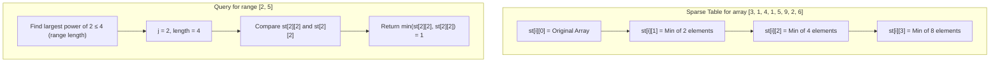

# Sparse Tables

## Introduction

A Sparse Table is a powerful data structure designed to efficiently answer range queries on static arrays. By "range queries," we mean operations like finding the minimum, maximum, sum, or any other associative function over a range of elements in an array.

What makes Sparse Tables special is their impressive query time complexity of **O(1)** for idempotent operations like min/max, and **O(log n)** for non-idempotent operations like sum - all after a one-time **O(n log n)** preprocessing step.

If you're dealing with static arrays (arrays that don't change) and need to perform multiple range queries, Sparse Tables can significantly outperform other data structures like segment trees for certain types of problems.

## Key Concepts

Before diving into implementation details, let's understand the core concepts behind Sparse Tables:

### 1. Power of Two Decomposition

The fundamental insight behind Sparse Tables is that any range [L, R] can be decomposed into overlapping ranges whose lengths are powers of 2.

For example, the range [3, 10] can be covered by the ranges [3, 6] (length 2^2 = 4) and [7, 10] (length 2^2 = 4).

### 2. Precomputed Answers

Sparse Tables precompute answers for all possible ranges whose lengths are powers of 2. This allows us to answer any query by combining precomputed results.

### 3. Idempotent vs. Non-idempotent Operations

- **Idempotent operations** (like min, max, gcd) can have overlapping ranges without affecting the result. For these operations, queries can be answered in O(1) time.
- **Non-idempotent operations** (like sum) require non-overlapping decomposition, resulting in O(log n) query time.

## Building a Sparse Table

Let's walk through the process of building and using a Sparse Table for range minimum queries (RMQ).

### Step 1: Preprocessing

First, we need to build our Sparse Table by precomputing results for all ranges of power-of-2 lengths:

```cpp
// Building a Sparse Table for Range Minimum Queries
const int MAXN = 100005;
const int LOGN = 20; // log2(MAXN)

int arr[MAXN];
int st[MAXN][LOGN]; // sparse table

void buildSparseTable(int n) {
    // Initialize the sparse table for ranges of length 2^0 = 1
    // (single elements)
    for (int i = 0; i < n; i++) {
        st[i][0] = arr[i];
    }
    
    // Fill the sparse table for larger powers of 2
    for (int j = 1; (1 << j) <= n; j++) {
        for (int i = 0; i + (1 << j) - 1 < n; i++) {
            // For RMQ, we take the minimum of two overlapping ranges
            st[i][j] = min(st[i][j-1], st[i + (1 << (j-1))][j-1]);
        }
    }
}
```

Let's break down what's happening:

1. `st[i][j]` represents the result (minimum value) for the range starting at index `i` with length `2^j`.
2. We first fill in the table for ranges of length 1 (j=0).
3. Then we iteratively build up larger ranges by combining two smaller ranges.

### Step 2: Querying the Sparse Table

For Range Minimum Queries, we can answer any query in O(1) time because the min operation is idempotent:

```cpp
// Query the Sparse Table for the minimum in range [L, R]
int queryMin(int L, int R) {
    // Find the largest power of 2 that fits in the range
    int j = log2(R - L + 1);
    
    // Return the minimum of two overlapping ranges
    return min(st[L][j], st[R - (1 << j) + 1][j]);
}
```

Here's how this works:
1. We find the largest power of 2 that fits in our range length.
2. We take two overlapping segments of that length that cover our range.
3. Since the min operation is idempotent, overlapping elements don't affect the result.

### Visualization

Let's visualize how a Sparse Table works:



## Complete Implementation in Python

Here's a complete implementation of Sparse Tables for range minimum queries:

```python
import math

class SparseTable:
    def __init__(self, arr):
        self.arr = arr
        self.n = len(arr)
        self.log_table = [0] * (self.n + 1)
        
        # Precompute log values
        for i in range(2, self.n + 1):
            self.log_table[i] = self.log_table[i // 2] + 1
        
        # Calculate the size of our sparse table
        self.max_log = self.log_table[self.n] + 1
        
        # Initialize sparse table
        self.st = [[0] * self.max_log for _ in range(self.n)]
        
        # Fill in the base case (ranges of length 1)
        for i in range(self.n):
            self.st[i][0] = self.arr[i]
        
        # Build the sparse table
        for j in range(1, self.max_log):
            for i in range(self.n - (1 << j) + 1):
                self.st[i][j] = min(
                    self.st[i][j-1], 
                    self.st[i + (1 << (j-1))][j-1]
                )
    
    def query_min(self, left, right):
        """Return the minimum value in the range [left, right]"""
        # Calculate the largest power of 2 that fits in range length
        j = self.log_table[right - left + 1]
        
        # Return the minimum of two overlapping ranges
        return min(
            self.st[left][j],
            self.st[right - (1 << j) + 1][j]
        )

# Example usage
arr = [3, 1, 4, 1, 5, 9, 2, 6]
sparse_table = SparseTable(arr)

# Query examples
print(sparse_table.query_min(0, 7))  # Output: 1 (min of entire array)
print(sparse_table.query_min(2, 5))  # Output: 1 (min in range [4, 1, 5, 9])
print(sparse_table.query_min(5, 7))  # Output: 2 (min in range [9, 2, 6])
```

## Applications and Variations

### Range Sum Queries

For non-idempotent operations like sum, we need to use a slightly different query method that doesn't allow overlapping segments. This results in O(log n) query time:

```python
def query_sum(self, left, right):
    """Return the sum of values in the range [left, right]"""
    sum_result = 0
    for j in range(self.max_log - 1, -1, -1):
        if left + (1 << j) - 1 <= right:
            sum_result += self.st[left][j]
            left += (1 << j)
    
    return sum_result
```

### GCD Range Queries

Sparse Tables are perfect for greatest common divisor (GCD) queries since the GCD operation is idempotent:

```python
# For GCD, replace min with gcd in the build and query methods
def gcd(a, b):
    while b:
        a, b = b, a % b
    return a
```

### Real-world Applications

1. **Competitive Programming**: Sparse Tables are commonly used in competitive programming for problems involving range queries on static arrays.

2. **Bioinformatics**: Used for efficiently finding patterns in genomic sequences.

3. **Image Processing**: Can be used for certain types of image transformations and filters.

4. **Network Analysis**: Useful for quickly analyzing properties of static network graphs.

## Example Problem: Minimum in Sliding Window

Let's solve a practical problem: find the minimum element in every sliding window of size K in an array.

```python
def sliding_window_min(arr, k):
    n = len(arr)
    st = SparseTable(arr)
    result = []
    
    for i in range(n - k + 1):
        result.append(st.query_min(i, i + k - 1))
    
    return result

# Example
arr = [3, 1, 4, 1, 5, 9, 2, 6]
k = 3
print(sliding_window_min(arr, k))  # Output: [1, 1, 1, 1, 2, 2]
```

## Time and Space Complexity

- **Preprocessing Time**: O(n log n) - we compute values for log n different powers of 2
- **Query Time**: 
  - O(1) for idempotent operations (min, max, gcd)
  - O(log n) for non-idempotent operations (sum)
- **Space Complexity**: O(n log n) - the size of our sparse table

## When to Use Sparse Tables

Sparse Tables are ideal when:
- You have a **static array** (no modifications)
- You need to perform **many range queries**
- You're looking for **idempotent operations** (min, max, gcd)

They are less suitable when:
- The array changes frequently (dynamic)
- Space is a significant constraint
- You're computing non-idempotent operations (though still usable)

## Comparison with Other Data Structures

| Data Structure | Preprocessing | Query | Update | Space | Best For |
|----------------|---------------|-------|--------|-------|----------|
| Sparse Table   | O(n log n)    | O(1)* | O(n log n) | O(n log n) | Static arrays, many queries |
| Segment Tree   | O(n)          | O(log n) | O(log n) | O(n) | Dynamic arrays |
| Fenwick Tree   | O(n log n)    | O(log n) | O(log n) | O(n) | Cumulative operations |

*O(1) for idempotent operations only

## Summary

Sparse Tables are a powerful data structure that offer exceptionally fast range queries on static arrays after a one-time preprocessing step. They are particularly efficient for idempotent operations like finding the minimum or maximum in a range.

Key takeaways:
- Preprocess in O(n log n) time
- Query in O(1) time for min/max operations
- Perfect for static arrays with multiple queries
- Based on the power-of-two decomposition concept

## Exercises

1. Implement a Sparse Table for range GCD queries.
2. Modify the Sparse Table to find the index of the minimum element, not just its value.
3. Solve the "Range Product Queries" problem: Given an array and multiple queries, find the product of all elements in the given range.
4. Implement a 2D Sparse Table for querying minimum values in rectangular regions of a matrix.
5. Compare the performance of Sparse Tables with Segment Trees for different types of range queries.

## Advanced Concepts

For those interested in taking Sparse Tables further:
- **Disjoint Sparse Tables**: An alternative implementation that avoids overlapping segments
- **Fischer-Heun Structure**: Combines Sparse Tables with block decomposition
- **Multi-dimensional Sparse Tables**: For queries on multi-dimensional arrays

Happy coding!