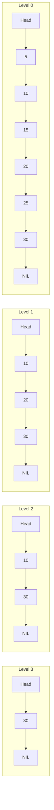

# Skip Lists

## Introduction

Have you ever wondered if there's a way to get the search efficiency of balanced binary trees but with a simpler implementation? Skip Lists offer exactly that! Skip Lists are a probabilistic data structure that provides expected O(log n) search, insertion, and deletion time complexity while being much easier to implement than balanced trees like AVL or Red-Black trees.

Invented by William Pugh in 1989, Skip Lists combine the simplicity of linked lists with efficient searching capabilities. They're particularly useful when you need a data structure that maintains a sorted collection of elements and supports fast search operations.

## What is a Skip List?

At its core, a Skip List is a hierarchy of sorted linked lists, with each level skipping over more elements than the previous one. The bottom level is a regular sorted linked list containing all elements. Each higher level acts as an "express lane" that allows faster traversal by skipping over some elements.

Let's visualize this with a simple diagram:



Each node in a Skip List contains:
- A value
- An array of pointers (or references) to the next nodes at different levels

## How Skip Lists Work

### Key Operations

#### 1. Searching

The search algorithm starts at the highest level of the Skip List and traverses forward until finding a node whose value is greater than or equal to the target. When it can't go further at the current level, it drops down to the next level and continues. This process repeats until either finding the target or determining it doesn't exist.

Here's the algorithm in pseudocode:

```
function search(target):
    current = head
    // Start from the highest level
    for level from max_level downto 0:
        // Traverse forward at current level until we find a node >= target
        while current.next[level] != null and current.next[level].value < target:
            current = current.next[level]
    
    // Move to the node right after where we stopped
    current = current.next[0]
    
    // Check if we found the target
    if current != null and current.value == target:
        return current
    else:
        return null
```

#### 2. Insertion

To insert a new element, we first search for its position, keeping track of the "update" nodes (the last node visited at each level). Then, we randomly determine the height of the new node and update the pointers accordingly.

```
function insert(value):
    // Array to store the update nodes at each level
    update = new Array(max_level + 1)
    
    current = head
    // Find position to insert
    for level from max_level downto 0:
        while current.next[level] != null and current.next[level].value < value:
            current = current.next[level]
        update[level] = current
    
    // Generate random level for new node (with probability)
    new_level = randomLevel()
    
    // Create new node
    new_node = new Node(value, new_level)
    
    // Update pointers at each level
    for level from 0 to new_level:
        new_node.next[level] = update[level].next[level]
        update[level].next[level] = new_node
```

#### 3. Deletion

Deletion is similar to insertion. We find the node to delete, then update the pointers of all nodes that point to it.

```
function delete(value):
    update = new Array(max_level + 1)
    
    current = head
    // Find node to delete
    for level from max_level downto 0:
        while current.next[level] != null and current.next[level].value < value:
            current = current.next[level]
        update[level] = current
    
    current = current.next[0]
    
    // If node exists, update pointers
    if current != null and current.value == value:
        for level from 0 to current.level:
            if update[level].next[level] != current:
                break
            update[level].next[level] = current.next[level]
```

### The Randomization Element

The "probabilistic" nature of Skip Lists comes from how we determine the height of each node. When inserting a new node:

1. Every node is added to level 0
2. With probability p (typically 0.5), we add it to level 1
3. With probability p², we add it to level 2
4. And so on...

This randomization creates an approximate balance that, over time, ensures roughly:
- 1/2 of the nodes appear at level 1
- 1/4 at level 2
- 1/8 at level 3
- And so on...

```
function randomLevel(p = 0.5, max_level = 32):
    level = 0
    while Math.random() < p and level < max_level:
        level++
    return level
```

## Implementation in JavaScript

Let's implement a Skip List in JavaScript:

```javascript
class SkipListNode {
    constructor(value, level) {
        this.value = value;
        this.next = new Array(level + 1).fill(null);
    }
}

class SkipList {
    constructor(maxLevel = 16, p = 0.5) {
        this.maxLevel = maxLevel;
        this.p = p;
        this.level = 0;
        this.head = new SkipListNode(-Infinity, maxLevel);
    }

    randomLevel() {
        let level = 0;
        while (Math.random() < this.p && level < this.maxLevel) {
            level++;
        }
        return level;
    }

    search(value) {
        let current = this.head;
        
        for (let i = this.level; i >= 0; i--) {
            while (current.next[i] !== null && current.next[i].value < value) {
                current = current.next[i];
            }
        }
        
        current = current.next[0];
        
        if (current !== null && current.value === value) {
            return current;
        }
        return null;
    }

    insert(value) {
        const update = new Array(this.maxLevel + 1).fill(null);
        let current = this.head;
        
        for (let i = this.level; i >= 0; i--) {
            while (current.next[i] !== null && current.next[i].value < value) {
                current = current.next[i];
            }
            update[i] = current;
        }
        
        const newLevel = this.randomLevel();
        
        if (newLevel > this.level) {
            for (let i = this.level + 1; i <= newLevel; i++) {
                update[i] = this.head;
            }
            this.level = newLevel;
        }
        
        const newNode = new SkipListNode(value, newLevel);
        
        for (let i = 0; i <= newLevel; i++) {
            newNode.next[i] = update[i].next[i];
            update[i].next[i] = newNode;
        }
    }

    delete(value) {
        const update = new Array(this.maxLevel + 1).fill(null);
        let current = this.head;
        
        for (let i = this.level; i >= 0; i--) {
            while (current.next[i] !== null && current.next[i].value < value) {
                current = current.next[i];
            }
            update[i] = current;
        }
        
        current = current.next[0];
        
        if (current !== null && current.value === value) {
            for (let i = 0; i <= this.level; i++) {
                if (update[i].next[i] !== current) {
                    break;
                }
                update[i].next[i] = current.next[i];
            }
            
            while (this.level > 0 && this.head.next[this.level] === null) {
                this.level--;
            }
        }
    }

    // Print skip list for debugging
    printList() {
        for (let i = this.level; i >= 0; i--) {
            let current = this.head.next[i];
            console.log(`Level ${i}: `);
            while (current !== null) {
                process.stdout.write(`${current.value} -> `);
                current = current.next[i];
            }
            console.log('null');
        }
    }
}
```

## Example Usage

Let's see the Skip List in action:

```javascript
// Create a new skip list
const skipList = new SkipList();

// Insert some values
console.log("Inserting values: 3, 6, 7, 9, 12, 19, 17, 26, 21, 25");
[3, 6, 7, 9, 12, 19, 17, 26, 21, 25].forEach(value => {
    skipList.insert(value);
});

// Print the skip list
console.log("Skip List structure:");
skipList.printList();

// Search for values
console.log("Searching for value 19:", skipList.search(19) ? "Found" : "Not found");
console.log("Searching for value 15:", skipList.search(15) ? "Found" : "Not found");

// Delete a value
console.log("Deleting value 19");
skipList.delete(19);

// Print the updated skip list
console.log("Updated Skip List structure:");
skipList.printList();

// Check if the value was deleted
console.log("Searching for value 19 after deletion:", skipList.search(19) ? "Found" : "Not found");
```

Output:
```
Inserting values: 3, 6, 7, 9, 12, 19, 17, 26, 21, 25

Skip List structure:
Level 2: 
7 -> 17 -> null
Level 1: 
3 -> 7 -> 9 -> 17 -> 21 -> null
Level 0: 
3 -> 6 -> 7 -> 9 -> 12 -> 17 -> 19 -> 21 -> 25 -> 26 -> null

Searching for value 19: Found
Searching for value 15: Not found

Deleting value 19

Updated Skip List structure:
Level 2: 
7 -> 17 -> null
Level 1: 
3 -> 7 -> 9 -> 17 -> 21 -> null
Level 0: 
3 -> 6 -> 7 -> 9 -> 12 -> 17 -> 21 -> 25 -> 26 -> null

Searching for value 19 after deletion: Not found
```

## Time and Space Complexity

Skip Lists offer excellent performance characteristics:

| Operation | Average Case | Worst Case |
|-----------|--------------|------------|
| Search    | O(log n)     | O(n)       |
| Insert    | O(log n)     | O(n)       |
| Delete    | O(log n)     | O(n)       |
| Space     | O(n)         | O(n log n) |

While the worst-case time complexity is O(n), it occurs with extremely low probability due to the random level generation. In practice, Skip Lists consistently perform with O(log n) efficiency.

## Practical Applications

Skip Lists are used in various real-world applications:

1. **Redis**: The popular in-memory database uses Skip Lists for its sorted sets
2. **Memory allocation systems**: Some memory allocators use Skip Lists to track free memory blocks
3. **File systems**: Used in certain file systems for efficient directory indexing
4. **Database indexing**: As an alternative to B-trees for maintaining sorted indexes
5. **In-memory caches**: For efficient range queries on sorted data

## Advantages and Disadvantages

### Advantages:
- Simpler implementation than balanced trees
- Good performance for searching, insertion, and deletion
- Easy to implement concurrent versions (lock-free Skip Lists exist)
- Natural support for range queries

### Disadvantages:
- Uses more memory than standard binary search trees
- Probabilistic nature means occasional sub-optimal structures
- Not as cache-friendly as arrays or some tree implementations

## Summary

Skip Lists are an elegant and practical data structure that offers a compelling alternative to balanced binary search trees. They achieve nearly the same performance while being significantly easier to implement and understand. The probabilistic approach to balancing makes them especially suitable for concurrent environments where traditional rebalancing operations would be complex and expensive.

When you need a sorted collection with fast search operations but want to avoid the complexity of balanced trees, Skip Lists are an excellent choice!

## Exercises

1. Modify the Skip List implementation to support range queries (finding all elements between two values).
2. Implement a method to merge two Skip Lists into one.
3. Create a visualization tool that shows how searches work in a Skip List.
4. Experiment with different values of `p` (probability) and analyze how they affect the Skip List's performance.
5. Implement a concurrent version of Skip Lists that allows multiple threads to safely operate on the structure simultaneously.

## Additional Resources

- Original Paper: "Skip Lists: A Probabilistic Alternative to Balanced Trees" by William Pugh
- "Algorithms" by Robert Sedgewick and Kevin Wayne
- "The Art of Computer Programming, Vol. 3: Sorting and Searching" by Donald Knuth