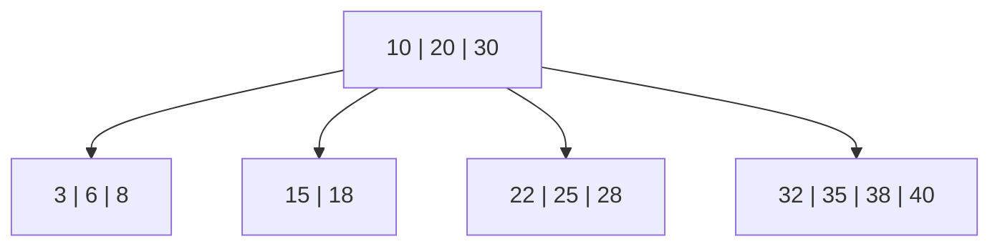
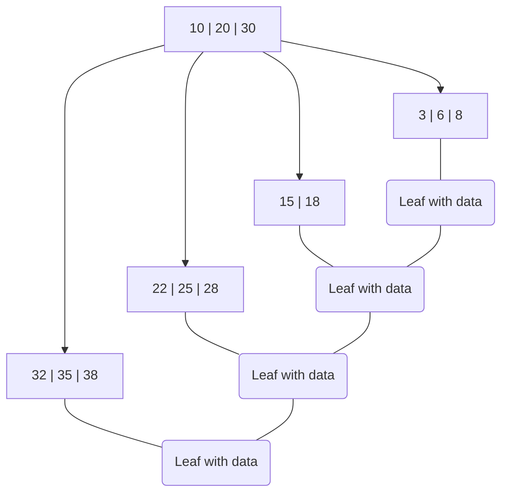

# B-Trees

## Introduction

B-Trees are specialized self-balancing tree data structures that maintain sorted data and allow for efficient operations such as searches, insertions, and deletions. Unlike binary trees where each node can have at most two children, B-Trees allow nodes to have multiple children, making them ideal for storage systems where data is read and written in blocks, such as databases and file systems.

Invented by Rudolf Bayer and Edward M. McCreight in 1971, B-Trees were designed to optimize disk access operations, which are significantly slower than memory operations. By organizing data in a way that minimizes disk reads and writes, B-Trees have become fundamental to the implementation of databases, file systems, and other applications that require efficient access to large datasets stored on disk.

## Key Characteristics of B-Trees

1. **Multi-way Tree**: Each node can have more than two children
2. **Self-Balancing**: Maintains balance through operations that reorganize the tree
3. **Sorted Keys**: All keys within a node are sorted
4. **Guaranteed Fill**: Nodes are at least partially filled (except the root)
5. **Uniform Depth**: All leaf nodes appear at the same level

## B-Tree Properties

A B-Tree of order `m` has the following properties:

- Every node has at most `m` children
- Every non-leaf node (except root) has at least `⌈m/2⌉` children
- The root has at least 2 children if it's not a leaf
- All leaf nodes appear at the same level
- A non-leaf node with `k` children contains `k-1` keys

Let's visualize a B-Tree of order 5:



## B-Tree vs. Binary Search Tree

Before diving deeper, let's compare a B-Tree with a binary search tree (BST) to understand the advantages:

| Feature             | Binary Search Tree                  | B-Tree                               |
|---------------------|-------------------------------------|--------------------------------------|
| Children per node   | Maximum 2                           | Multiple (order m)                   |
| Height              | Can be unbalanced (O(n) worst case) | Always balanced (O(log n))           |
| Space utilization   | Potentially inefficient             | Guaranteed minimum fill              |
| Disk I/O operations | More for large datasets             | Fewer due to higher branching factor |
| Suited for          | In-memory operations                | Disk-based storage systems           |

## Implementing B-Trees in Code

Let's implement a simple B-Tree in Python to understand its structure and basic operations:

```python
class BTreeNode:
    def __init__(self, leaf=False):
        self.leaf = leaf
        self.keys = []
        self.children = []

class BTree:
    def __init__(self, t):
        self.root = BTreeNode(True)
        self.t = t  # Minimum degree (defines the range of keys per node)
        
    def search(self, k, x=None):
        """Search key k in the B-Tree"""
        if x is None:
            x = self.root
            
        i = 0
        while i < len(x.keys) and k > x.keys[i]:
            i += 1
            
        # If the key is found at this node
        if i < len(x.keys) and k == x.keys[i]:
            return (x, i)
            
        # If this is a leaf node, key not found
        if x.leaf:
            return None
            
        # Recursively search in the appropriate child
        return self.search(k, x.children[i])
    
    # Other operations like insert, delete, etc. would follow...
```

## B-Tree Operations

### Search Operation

The search operation in a B-Tree is relatively straightforward and similar to a binary search tree but with multiple keys per node:

1. Start at the root
2. For each node, find the first key greater than or equal to the search key
3. If the key equals the search key, return the node and index
4. If the node is a leaf, return "not found"
5. Otherwise, recurse into the appropriate child node

```python
def search_example(btree):
    # Assume we have a B-Tree with keys inserted
    result = btree.search(15)
    
    if result:
        node, index = result
        print(f"Found key 15 at index {index}")
    else:
        print("Key 15 not found")

# Output (for example):
# Found key 15 at index 0
```

### Insert Operation

Insertion is more complex as it needs to maintain the B-Tree properties:

1. Find the appropriate leaf node for insertion
2. If the leaf node has space, insert the key in the correct position
3. If the leaf node is full, split it and propagate changes upward

Let's look at the insertion process with a simplified example:

```python
def insert_key(btree, k):
    root = btree.root
    
    # If root is full, create a new root
    if len(root.keys) == (2 * btree.t) - 1:
        new_root = BTreeNode(False)
        new_root.children.append(root)
        btree.split_child(new_root, 0)
        btree.root = new_root
        btree.insert_non_full(new_root, k)
    else:
        btree.insert_non_full(root, k)
```

### Delete Operation

Deletion is the most complex operation as it must maintain the B-Tree properties while removing keys:

1. Find the key to delete
2. If in a leaf, simply remove it (if possible)
3. If in an internal node, replace with predecessor or successor
4. If removal would violate minimum keys property, restructure the tree

## Time and Space Complexity

| Operation | Time Complexity |
|-----------|-----------------|
| Search    | O(log n)        |
| Insert    | O(log n)        |
| Delete    | O(log n)        |
| Space     | O(n)            |

Where `n` is the number of keys in the B-Tree.

## Real-World Applications

B-Trees are ubiquitous in systems that need to handle large amounts of data efficiently:

### 1. Database Systems

Most database management systems use B-Trees or their variants (like B+ Trees) for indexing:

```
Example: MySQL's InnoDB storage engine uses B+ Trees for its indexes.
```

### 2. File Systems

Many file systems use B-Trees to organize files and directories:

- NTFS (Windows)
- HFS+ (Mac)
- Ext4 (Linux)

### 3. Key-Value Stores

Many NoSQL databases and key-value stores use B-Trees for data organization:

```
Example: Berkeley DB uses B-Trees for its key-value storage.
```

## B-Tree Variants

B-Trees have several important variants, each optimized for specific use cases:

### B+ Trees

The most common variant where:
- All data is stored in leaf nodes
- Internal nodes only store keys for navigation
- Leaf nodes are linked together for efficient range queries



### B* Trees

- Nodes are kept at least 2/3 full instead of 1/2
- Improves space utilization
- Uses redistribution to delay splits

### 2-3 Trees and 2-3-4 Trees

Special cases of B-Trees where:
- 2-3 Tree: Each node has 2 or 3 children
- 2-3-4 Tree: Each node has 2, 3, or 4 children

## Building a Simple Database Index with B-Trees

Let's look at how we might use a B-Tree to build a simple database index:

```python
class DatabaseIndex:
    def __init__(self):
        self.btree = BTree(t=3)  # Create a B-Tree of minimum degree 3
        
    def add_record(self, key, record_pointer):
        """Add a record to the index with the given key and pointer"""
        self.btree.insert((key, record_pointer))
        
    def find_record(self, key):
        """Find a record in the database using the index"""
        result = self.btree.search(key)
        if result:
            node, idx = result
            _, record_pointer = node.keys[idx]
            return record_pointer
        return None

# Example usage:
index = DatabaseIndex()
index.add_record("employee001", 0x1234)  # Add record with pointer to file position
index.add_record("employee002", 0x5678)

# Later, retrieve the record:
record_ptr = index.find_record("employee001")
# Now we can quickly access the record at position 0x1234
```

## Implementation Considerations

When implementing B-Trees, several practical considerations are important:

1. **Caching**: B-Trees work best when nodes can be cached in memory
2. **Node Size**: Should typically match disk block size for optimal I/O
3. **Key Comparison**: Efficient key comparison is crucial for performance
4. **Concurrency**: Special care needed for multi-threaded access

## Exercises

1. **Basic B-Tree Implementation**
   
   Implement a B-Tree class with the following operations:
   - Insert
   - Search
   - Display the tree structure

2. **Range Query**
   
   Extend your B-Tree implementation to support range queries that return all keys between a given start and end key.

3. **Database Index Simulation**
   
   Create a simple simulation of a database table with an index implemented using a B-Tree. Support operations to:
   - Insert records
   - Find records by key
   - Delete records

## Summary

B-Trees are powerful and versatile data structures that balance the need for fast operations with efficient storage utilization, particularly for disk-based systems. Their ability to maintain balance automatically while minimizing disk I/O operations makes them ideal for databases, file systems, and other applications requiring efficient access to large amounts of data.

Key points to remember:
- B-Trees allow multiple keys per node, reducing tree height
- All operations (search, insert, delete) have logarithmic time complexity
- B-Trees automatically maintain balance through split and merge operations
- Several variants (B+, B*) optimize for specific use cases
- The structure minimizes disk I/O by matching node size to block size

## Additional Resources

- "Introduction to Algorithms" by Cormen, Leiserson, Rivest, and Stein
- "Database System Concepts" by Silberschatz, Korth, and Sudarshan
- "Advanced Data Structures" by Peter Brass
- "Fundamentals of Database Systems" by Elmasri and Navathe

By understanding B-Trees, you've taken an important step in mastering advanced data structures that power many of the systems we rely on daily, from databases to file systems and beyond.