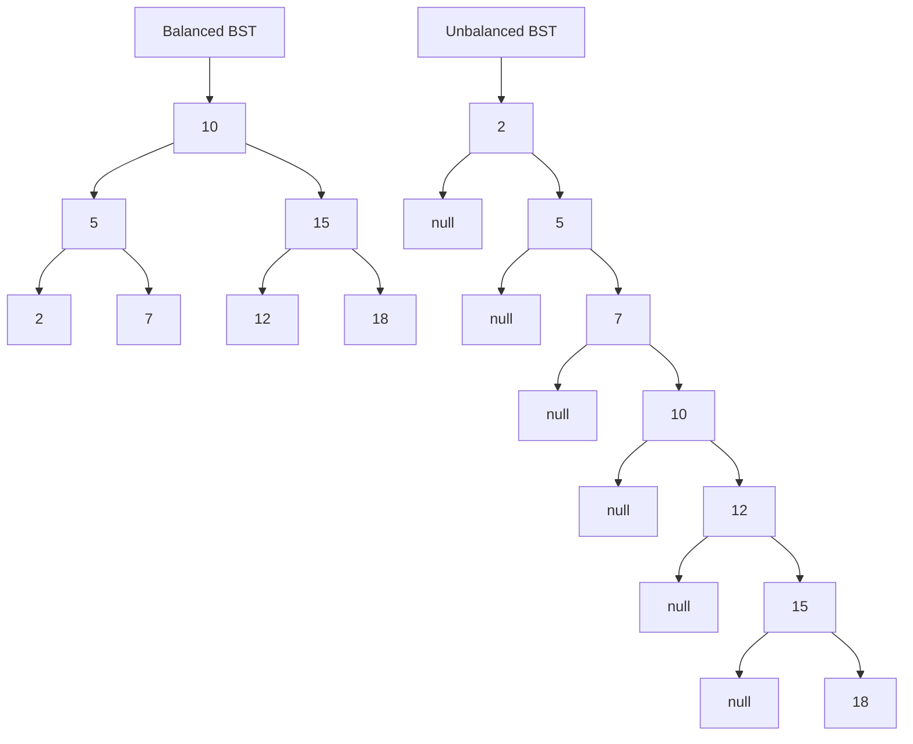
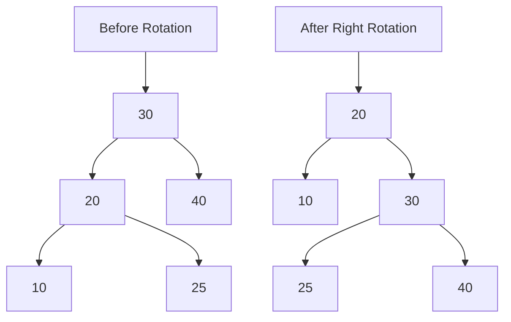

# Self-Balancing Trees

## Introduction

When you're working with tree data structures, especially Binary Search Trees (BSTs), performance depends greatly on the tree's shape. In the worst case, a BST can degenerate into a linked list, causing search operations to slow from O(log n) to O(n) time. Self-balancing trees solve this problem by automatically maintaining their balance during insertions and deletions.

Self-balancing trees are advanced data structures that adjust themselves to ensure optimal performance regardless of the order in which you insert or remove data. These intelligent structures are essential for applications requiring reliable and consistent performance.

## What Makes a Tree "Balanced"?

A balanced tree maintains a shape where the height difference between subtrees is controlled. This balance ensures operations remain efficient (typically O(log n)) even after many modifications.

Let's visualize what we mean by "balanced" vs "unbalanced":



The unbalanced tree on the right would have O(n) search time for elements near the bottom, while the balanced tree maintains O(log n) performance for all elements.

## Common Types of Self-Balancing Trees

### 1. AVL Trees

Named after inventors Adelson-Velsky and Landis, AVL trees were the first self-balancing binary search trees to be invented.

**Key Properties:**
- Each node stores a balance factor (difference in height between left and right subtrees)
- Balance factor must be -1, 0, or 1 for all nodes
- Uses rotations to maintain balance

**Balance Factor Calculation:**
```
BalanceFactor = Height(LeftSubtree) - Height(RightSubtree)
```

#### AVL Tree Rotations

When the balance factor becomes invalid (-2 or +2), we perform rotations to restore balance:

1. **Left Rotation** - Used when right subtree is too heavy
2. **Right Rotation** - Used when left subtree is too heavy
3. **Left-Right Rotation** - Used for left-right imbalance
4. **Right-Left Rotation** - Used for right-left imbalance

Let's visualize a simple right rotation:



#### AVL Tree Implementation

Here's a basic implementation of an AVL tree in Java:

```java
class AVLTree {
    class Node {
        int key, height;
        Node left, right;

        Node(int d) {
            key = d;
            height = 1; // New node is initially at height 1
        }
    }

    Node root;

    // Get height of the tree
    int height(Node N) {
        if (N == null)
            return 0;
        return N.height;
    }

    // Get balance factor of node N
    int getBalance(Node N) {
        if (N == null)
            return 0;
        return height(N.left) - height(N.right);
    }

    // Right rotate subtree rooted with y
    Node rightRotate(Node y) {
        Node x = y.left;
        Node T2 = x.right;

        // Perform rotation
        x.right = y;
        y.left = T2;

        // Update heights
        y.height = Math.max(height(y.left), height(y.right)) + 1;
        x.height = Math.max(height(x.left), height(x.right)) + 1;

        // Return new root
        return x;
    }

    // Left rotate subtree rooted with x
    Node leftRotate(Node x) {
        Node y = x.right;
        Node T2 = y.left;

        // Perform rotation
        y.left = x;
        x.right = T2;

        // Update heights
        x.height = Math.max(height(x.left), height(x.right)) + 1;
        y.height = Math.max(height(y.left), height(y.right)) + 1;

        // Return new root
        return y;
    }

    // Insert a key in the tree
    Node insert(Node node, int key) {
        // Perform the normal BST insertion
        if (node == null)
            return new Node(key);

        if (key < node.key)
            node.left = insert(node.left, key);
        else if (key > node.key)
            node.right = insert(node.right, key);
        else // Duplicate keys not allowed
            return node;

        // Update height of this ancestor node
        node.height = 1 + Math.max(height(node.left), height(node.right));

        // Get the balance factor
        int balance = getBalance(node);

        // If unbalanced, then there are 4 cases

        // Left Left Case
        if (balance > 1 && key < node.left.key)
            return rightRotate(node);

        // Right Right Case
        if (balance < -1 && key > node.right.key)
            return leftRotate(node);

        // Left Right Case
        if (balance > 1 && key > node.left.key) {
            node.left = leftRotate(node.left);
            return rightRotate(node);
        }

        // Right Left Case
        if (balance < -1 && key < node.right.key) {
            node.right = rightRotate(node.right);
            return leftRotate(node);
        }

        // Return the unchanged node pointer
        return node;
    }

    // Public method to insert a new key
    void insert(int key) {
        root = insert(root, key);
    }

    // Print inorder traversal of the tree
    void inOrder(Node node) {
        if (node != null) {
            inOrder(node.left);
            System.out.print(node.key + " ");
            inOrder(node.right);
        }
    }
}
```

#### Example of AVL Tree Operations

Let's see an AVL tree in action:

```java
// Create an AVL tree
AVLTree tree = new AVLTree();

// Insert elements
tree.insert(10);
tree.insert(20);
tree.insert(30);  // This would cause imbalance in a regular BST
tree.insert(40);
tree.insert(50);
tree.insert(25);

// Print inorder traversal
System.out.print("Inorder traversal of constructed AVL tree: ");
tree.inOrder(tree.root);
```

**Output:**
```
Inorder traversal of constructed AVL tree: 10 20 25 30 40 50
```

Without self-balancing, inserting these values in sequence would create a right-skewed tree. However, the AVL tree automatically rebalances to maintain O(log n) performance.

### 2. Red-Black Trees

Red-Black trees are another popular form of self-balancing binary search trees that use "coloring" of nodes to maintain balance.

**Key Properties:**
- Every node is either red or black
- The root is black
- All leaves (NIL) are black
- If a node is red, then both its children are black
- Every path from a node to any of its descendant NIL nodes contains the same number of black nodes

Red-Black trees are slightly less strictly balanced than AVL trees but perform fewer rotations during insertion and deletion, which can be advantageous for applications with frequent modifications.

Here's a basic implementation of a Red-Black tree in Java:

```java
class RedBlackTree {
    private static final boolean RED = true;
    private static final boolean BLACK = false;

    class Node {
        int key;
        boolean color;
        Node left, right, parent;

        Node(int key) {
            this.key = key;
            this.color = RED; // New nodes are always red
            this.left = this.right = this.parent = null;
        }
    }

    private Node root;

    // Helper methods for balancing
    private void leftRotate(Node x) {
        Node y = x.right;
        x.right = y.left;
        if (y.left != null) y.left.parent = x;
        y.parent = x.parent;
        if (x.parent == null) root = y;
        else if (x == x.parent.left) x.parent.left = y;
        else x.parent.right = y;
        y.left = x;
        x.parent = y;
    }

    private void rightRotate(Node y) {
        Node x = y.left;
        y.left = x.right;
        if (x.right != null) x.right.parent = y;
        x.parent = y.parent;
        if (y.parent == null) root = x;
        else if (y == y.parent.left) y.parent.left = x;
        else y.parent.right = x;
        x.right = y;
        y.parent = x;
    }

    private void fixInsertion(Node k) {
        Node u;
        while (k.parent != null && k.parent.color == RED) {
            if (k.parent == k.parent.parent.right) {
                u = k.parent.parent.left;
                if (u != null && u.color == RED) {
                    // Case 1: Uncle is red
                    u.color = BLACK;
                    k.parent.color = BLACK;
                    k.parent.parent.color = RED;
                    k = k.parent.parent;
                } else {
                    if (k == k.parent.left) {
                        // Case 2: Uncle is black and k is a left child
                        k = k.parent;
                        rightRotate(k);
                    }
                    // Case 3: Uncle is black and k is a right child
                    k.parent.color = BLACK;
                    k.parent.parent.color = RED;
                    leftRotate(k.parent.parent);
                }
            } else {
                u = k.parent.parent.right;
                if (u != null && u.color == RED) {
                    // Case 1: Uncle is red
                    u.color = BLACK;
                    k.parent.color = BLACK;
                    k.parent.parent.color = RED;
                    k = k.parent.parent;
                } else {
                    if (k == k.parent.right) {
                        // Case 2: Uncle is black and k is a right child
                        k = k.parent;
                        leftRotate(k);
                    }
                    // Case 3: Uncle is black and k is a left child
                    k.parent.color = BLACK;
                    k.parent.parent.color = RED;
                    rightRotate(k.parent.parent);
                }
            }
            if (k == root) break;
        }
        root.color = BLACK;
    }

    // Insert a new key in the tree
    public void insert(int key) {
        Node newNode = new Node(key);
        if (root == null) {
            root = newNode;
            root.color = BLACK;
            return;
        }

        Node current = root;
        Node parent = null;
        
        // Find the position to insert
        while (current != null) {
            parent = current;
            if (key < current.key) current = current.left;
            else if (key > current.key) current = current.right;
            else return; // Duplicate keys not allowed
        }

        newNode.parent = parent;
        if (key < parent.key) parent.left = newNode;
        else parent.right = newNode;

        // Fix the tree
        fixInsertion(newNode);
    }

    // Traverse and print the tree inorder
    public void inOrder(Node node) {
        if (node != null) {
            inOrder(node.left);
            System.out.print(node.key + "(" + (node.color == RED ? "R" : "B") + ") ");
            inOrder(node.right);
        }
    }

    // Utility method to print
    public void printTree() {
        System.out.print("Inorder traversal with colors: ");
        inOrder(root);
        System.out.println();
    }
}
```

#### Example Usage of Red-Black Tree

```java
RedBlackTree rbTree = new RedBlackTree();

// Insert keys
rbTree.insert(7);
rbTree.insert(3);
rbTree.insert(18);
rbTree.insert(10);
rbTree.insert(22);
rbTree.insert(8);
rbTree.insert(11);

// Print the tree
rbTree.printTree();
```

**Output:**
```
Inorder traversal with colors: 3(B) 7(R) 8(B) 10(B) 11(R) 18(R) 22(B)
```

### 3. B-Trees and B+ Trees

While AVL and Red-Black trees are binary trees, B-Trees and B+ Trees are multiway trees often used in databases and file systems.

**Key Properties of B-Trees:**
- Each node can have multiple keys and children
- Keys within a node are sorted
- All leaf nodes are at the same level
- A B-Tree of order m can have at most m-1 keys and m children

B+ Trees are a variant where:
- Only leaf nodes contain data records
- Inner nodes contain only keys for navigation
- Leaf nodes are linked together, supporting range queries efficiently

These structures are particularly useful for disk-based storage systems where reducing disk I/O operations is critical.

## Real-World Applications

Self-balancing trees are not just theoretical constructs—they power many systems you use daily:

1. **Database Indexing**: Most relational databases use B-Trees or B+ Trees for their indices to enable fast lookups.

2. **File Systems**: Modern file systems like NTFS, ext4, and HFS+ use balanced tree structures to store file metadata.

3. **Network Routing**: Routers use self-balancing trees to store routing information for efficient lookups.

4. **In-Memory Dictionaries**: Programming languages like Java use Red-Black trees in their TreeMap and TreeSet implementations.

5. **Geographic Information Systems (GIS)**: Spatial data structures often rely on balanced trees for efficient spatial queries.

## Performance Comparison

Here's how different self-balancing trees compare:

| Tree Type      | Search    | Insert    | Delete    | Space    | Practical Advantages                          |
|----------------|-----------|-----------|-----------|----------|----------------------------------------------|
| AVL Tree       | O(log n)  | O(log n)  | O(log n)  | O(n)     | Faster lookups due to strict balancing       |
| Red-Black Tree | O(log n)  | O(log n)  | O(log n)  | O(n)     | Faster insertions/deletions, less memory    |
| B-Tree         | O(log n)  | O(log n)  | O(log n)  | O(n)     | Optimized for disk-based storage systems     |
| B+ Tree        | O(log n)  | O(log n)  | O(log n)  | O(n)     | Efficient range queries, sequential access   |

## Implementation Challenges

When implementing self-balancing trees, you'll face several challenges:

1. **Complex Rotation Logic**: Correctly implementing the rotation and rebalancing operations can be tricky.

2. **Edge Cases**: Handling special cases like duplicate keys or empty trees requires careful consideration.

3. **Space Overhead**: Maintaining balance factors or colors requires additional memory per node.

4. **Concurrency Issues**: Making self-balancing trees thread-safe adds another layer of complexity.

## Choosing the Right Self-Balancing Tree

The best self-balancing tree for your application depends on your specific needs:

- **Need fastest lookups?** Consider AVL trees.
- **More insertions than lookups?** Red-Black trees might be better.
- **Working with disk storage?** B-Trees or B+ Trees are designed for this.
- **Need range queries?** B+ Trees excel at this.

## Summary

Self-balancing trees are powerful data structures that maintain their performance regardless of the operation sequence. By automatically adjusting their structure, they provide guaranteed logarithmic time complexity for searches, insertions, and deletions.

The main types we've covered:
- AVL Trees: Strictly balanced, excellent for lookup-heavy applications
- Red-Black Trees: Less strictly balanced but fewer rotations, good for mixed operations
- B-Trees and B+ Trees: Multiway trees optimized for disk-based systems

Understanding these structures equips you with the knowledge to choose and implement the right tree for your specific requirements.

## Exercises

1. Implement an AVL tree and insert the following values in order: 10, 20, 5, 6, 15, 30, 7. Draw the tree after each insertion.

2. Compare the number of rotations required for AVL trees versus Red-Black trees when inserting the sequence: 1, 2, 3, 4, 5, 6, 7, 8, 9.

3. Modify the AVL tree implementation to include a delete operation.

4. Implement a simple database index using a B+ Tree that can handle integer keys and string values.

5. Write a function that converts a given binary search tree into a balanced AVL tree.

## Additional Resources

For further learning, you might explore:

- Advanced tree structures like Splay Trees and Treaps
- Concurrent self-balancing trees for multi-threaded applications
- Cache-optimized variants of these data structures
- Functional implementations of balanced trees

These self-balancing trees form the foundation for efficient data storage and retrieval across computing. They might seem complex at first, but mastering them will dramatically improve the performance of your applications when dealing with large datasets.