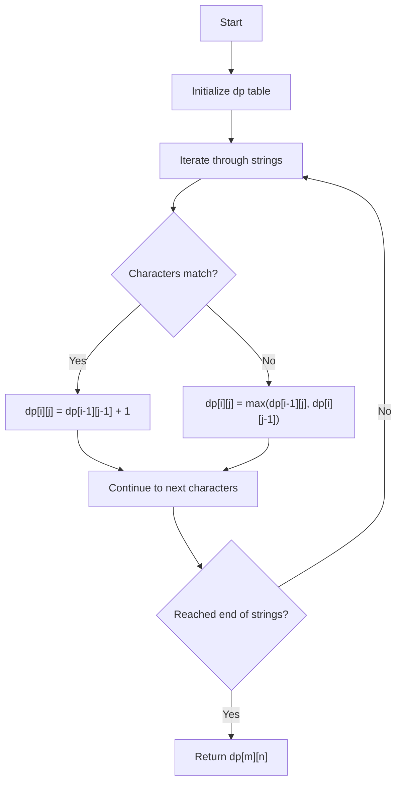

# Advanced Dynamic Programming

## Introduction

Dynamic Programming (DP) is a powerful problem-solving technique that breaks down complex problems into simpler overlapping subproblems, solves each subproblem once, and stores the results for future use. While you might be familiar with basic DP concepts, advanced dynamic programming introduces sophisticated techniques to tackle more complex algorithmic challenges.

In this tutorial, we'll explore advanced DP concepts, patterns, and optimization techniques that will elevate your problem-solving skills to the next level. We'll cover state design, dimension reduction, and real-world applications that showcase the true power of dynamic programming.

## Prerequisites

Before diving into advanced concepts, you should be comfortable with:
- Basic dynamic programming principles (memoization and tabulation)
- Recursion and recursive problem-solving
- Time and space complexity analysis
- Basic data structures (arrays, matrices, trees, graphs)

## Advanced DP Techniques

### 1. Multi-dimensional DP States

Many complex problems require tracking multiple parameters in our DP state.

#### Example: Knapsack with Additional Constraints

Let's solve a variation of the knapsack problem where each item has a weight, value, and a "fragility" rating. You can only place a fragile item on top of less fragile items.

```python
def advanced_knapsack(weights, values, fragility, capacity):
    n = len(weights)
    
    # dp[i][w][f] = max value when considering items 0...i, 
    # with weight capacity w, and max fragility f
    dp = [[[-1 for _ in range(101)] for _ in range(capacity + 1)] for _ in range(n)]
    
    def solve(i, weight_left, max_fragility):
        # Base case
        if i == n:
            return 0
            
        # If already computed
        if dp[i][weight_left][max_fragility] != -1:
            return dp[i][weight_left][max_fragility]
        
        # Skip current item
        result = solve(i + 1, weight_left, max_fragility)
        
        # Take current item if possible
        if weight_left >= weights[i] and fragility[i] <= max_fragility:
            result = max(result, values[i] + 
                         solve(i + 1, weight_left - weights[i], fragility[i]))
        
        dp[i][weight_left][max_fragility] = result
        return result
    
    return solve(0, capacity, 100)  # Assuming max fragility is 100
```

**Key Insight**: With multi-dimensional states, carefully identify all variables that can change and include them in your DP state design.

### 2. State Compression Techniques

Sometimes DP solutions can be memory intensive. State compression reduces memory requirements by:
- Using bit manipulation
- Keeping only necessary information
- Reducing dimensions when possible

#### Example: Traveling Salesman Problem with Bitmasks

```python
def tsp(graph):
    n = len(graph)
    
    # dp[mask][i] = shortest path that visits all vertices in mask and ends at i
    dp = {}
    
    def solve(mask, pos):
        if mask == (1 << n) - 1:  # All cities visited
            return graph[pos][0]  # Return to starting city
        
        if (mask, pos) in dp:
            return dp[(mask, pos)]
        
        ans = float('inf')
        
        # Try to visit each unvisited city
        for city in range(n):
            if (mask & (1 << city)) == 0:  # If city is not visited
                new_ans = graph[pos][city] + solve(mask | (1 << city), city)
                ans = min(ans, new_ans)
        
        dp[(mask, pos)] = ans
        return ans
    
    return solve(1, 0)  # Start with just city 0 visited, positioned at city 0
```

**Input/Output Example**:
```
Input: 
graph = [
    [0, 10, 15, 20],
    [10, 0, 35, 25],
    [15, 35, 0, 30],
    [20, 25, 30, 0]
]

Output: 80 (The optimal route is 0 → 1 → 3 → 2 → 0)
```

### 3. Dimension Reduction

Some problems that appear to need an n-dimensional DP solution can be solved with fewer dimensions by leveraging problem-specific insights.

#### Example: Reducing 2D DP to 1D in Space Optimization

Let's optimize the classic LCS (Longest Common Subsequence) problem:

```python
def longest_common_subsequence(text1, text2):
    m, n = len(text1), len(text2)
    
    # Traditional 2D approach would use dp[m+1][n+1]
    # But we only need the current and previous row
    dp = [0] * (n + 1)
    
    for i in range(1, m + 1):
        prev = 0  # dp[i-1][0]
        for j in range(1, n + 1):
            temp = dp[j]  # Store dp[i-1][j]
            
            if text1[i-1] == text2[j-1]:
                dp[j] = prev + 1
            else:
                dp[j] = max(dp[j], dp[j-1])  # max(dp[i-1][j], dp[i][j-1])
            
            prev = temp
    
    return dp[n]
```

**Space Complexity**: Reduced from O(m*n) to O(n)

### 4. Divide and Conquer Optimization

For certain DP problems where the recurrence relation has a monotonicity property, we can use divide and conquer to reduce time complexity.

#### Example: Optimal Binary Search Tree

Instead of O(n³), we can achieve O(n²) with divide and conquer:

```python
def optimal_bst(keys, freq):
    n = len(keys)
    
    # dp[i][j] = optimal cost for subtree containing keys i through j
    dp = [[0 for _ in range(n)] for _ in range(n)]
    
    # opt[i][j] = optimal root for subtree containing keys i through j
    opt = [[0 for _ in range(n)] for _ in range(n)]
    
    # Initialize for single keys
    for i in range(n):
        dp[i][i] = freq[i]
        opt[i][i] = i
    
    # For each length of subarray
    for length in range(2, n + 1):
        for i in range(n - length + 1):
            j = i + length - 1
            dp[i][j] = float('inf')
            
            # Try each key as root, but only need to check between optimal
            # roots of smaller problems
            r_start = opt[i][j-1]
            r_end = opt[i+1][j] if i+1 <= j else r_start
            
            for r in range(r_start, r_end + 1):
                left_cost = dp[i][r-1] if i <= r-1 else 0
                right_cost = dp[r+1][j] if r+1 <= j else 0
                current_cost = left_cost + right_cost + sum(freq[i:j+1])
                
                if current_cost < dp[i][j]:
                    dp[i][j] = current_cost
                    opt[i][j] = r
    
    return dp[0][n-1]
```

### 5. DP on Trees

Dynamic programming can be applied to tree structures using techniques like rerooting and tree DP.

```python
def tree_dp_example(tree, values):
    n = len(tree)
    
    # dp[node][0] = max sum when node is not selected
    # dp[node][1] = max sum when node is selected
    dp = [[-1, -1] for _ in range(n)]
    
    def solve(node, parent):
        if dp[node][0] != -1:
            return
        
        # Initialize
        dp[node][0] = 0
        dp[node][1] = values[node]
        
        for child in tree[node]:
            if child != parent:
                solve(child, node)
                dp[node][0] += max(dp[child][0], dp[child][1])
                dp[node][1] += dp[child][0]
    
    solve(0, -1)  # Start from root (node 0)
    return max(dp[0][0], dp[0][1])
```

**Explanation**: This solves the maximum independent set problem on a tree, where we want to select nodes to maximize the sum of values, but we can't select adjacent nodes.

## Advanced Applications

### 1. Matrix Chain Multiplication

Determine the most efficient way to multiply a sequence of matrices.

```python
def matrix_chain_multiplication(dimensions):
    n = len(dimensions) - 1  # Number of matrices
    
    # dp[i][j] = minimum cost to multiply matrices i through j
    dp = [[0 for _ in range(n)] for _ in range(n)]
    
    for length in range(2, n + 1):
        for i in range(n - length + 1):
            j = i + length - 1
            dp[i][j] = float('inf')
            
            for k in range(i, j):
                cost = dp[i][k] + dp[k+1][j] + dimensions[i] * dimensions[k+1] * dimensions[j+1]
                dp[i][j] = min(dp[i][j], cost)
    
    return dp[0][n-1]
```

**Input/Output Example**:
```
Input: dimensions = [30, 35, 15, 5, 10, 20, 25]
Output: 15125
```

This represents optimal multiplication order for matrices of sizes 30×35, 35×15, 15×5, 5×10, 10×20, and 20×25.

### 2. Edit Distance with Custom Operations

Extend the classic edit distance problem with additional operations and varying costs.

```python
def advanced_edit_distance(s1, s2, insert_cost, delete_cost, replace_cost, swap_cost):
    m, n = len(s1), len(s2)
    
    # dp[i][j] = min cost to transform s1[0...i-1] to s2[0...j-1]
    dp = [[float('inf') for _ in range(n + 1)] for _ in range(m + 1)]
    
    # Base cases
    dp[0][0] = 0
    for i in range(1, m + 1):
        dp[i][0] = dp[i-1][0] + delete_cost
    for j in range(1, n + 1):
        dp[0][j] = dp[0][j-1] + insert_cost
    
    for i in range(1, m + 1):
        for j in range(1, n + 1):
            # Standard operations
            if s1[i-1] == s2[j-1]:
                dp[i][j] = dp[i-1][j-1]  # No cost if characters match
            else:
                dp[i][j] = min(
                    dp[i-1][j] + delete_cost,  # Delete
                    dp[i][j-1] + insert_cost,  # Insert
                    dp[i-1][j-1] + replace_cost  # Replace
                )
            
            # Swap adjacent characters if applicable
            if i > 1 and j > 1 and s1[i-1] == s2[j-2] and s1[i-2] == s2[j-1]:
                dp[i][j] = min(dp[i][j], dp[i-2][j-2] + swap_cost)
    
    return dp[m][n]
```

### 3. Longest Increasing Subsequence Variations

Let's consider a 2D version where we want the longest subsequence that increases in both dimensions:

```python
def longest_increasing_pair_subsequence(pairs):
    # pairs is a list of (x, y) coordinates
    # We want the longest chain where both x and y increase
    
    # Sort by x-coordinate
    pairs.sort()
    n = len(pairs)
    
    # dp[i] = length of longest chain ending at pairs[i]
    dp = [1] * n
    
    for i in range(1, n):
        for j in range(i):
            if pairs[i][1] > pairs[j][1]:  # y is increasing
                dp[i] = max(dp[i], dp[j] + 1)
    
    return max(dp)
```

## Optimization Techniques

### 1. Bottom-Up vs. Top-Down Approaches

Let's compare both approaches for the same problem:

```python
# Top-down (memoization) for coin change
def coin_change_top_down(coins, amount):
    memo = {}
    
    def solve(remaining):
        if remaining == 0:
            return 0
        if remaining < 0:
            return float('inf')
        if remaining in memo:
            return memo[remaining]
        
        min_coins = float('inf')
        for coin in coins:
            result = solve(remaining - coin)
            if result != float('inf'):
                min_coins = min(min_coins, result + 1)
        
        memo[remaining] = min_coins
        return min_coins
    
    result = solve(amount)
    return result if result != float('inf') else -1

# Bottom-up (tabulation) for coin change
def coin_change_bottom_up(coins, amount):
    dp = [float('inf')] * (amount + 1)
    dp[0] = 0
    
    for coin in coins:
        for i in range(coin, amount + 1):
            dp[i] = min(dp[i], dp[i - coin] + 1)
    
    return dp[amount] if dp[amount] != float('inf') else -1
```

**Pros of Top-Down**:
- More intuitive to implement
- Only calculates needed states
- Easier to debug

**Pros of Bottom-Up**:
- Better constant-factor performance (no recursion overhead)
- Can often optimize space complexity
- Avoids stack overflow for large inputs

### 2. Knuth's Optimization

For certain problems where the cost function satisfies the quadrangle inequality, we can optimize from O(n³) to O(n²):

```python
def optimal_bst_knuth(keys, freq):
    n = len(keys)
    
    # dp[i][j] = optimal cost for keys[i:j+1]
    dp = [[0 for _ in range(n)] for _ in range(n)]
    
    # best[i][j] = optimal root for keys[i:j+1]
    best = [[0 for _ in range(n)] for _ in range(n)]
    
    # Precompute prefix sums
    prefix_sum = [0]
    for f in freq:
        prefix_sum.append(prefix_sum[-1] + f)
    
    # Initialize for single keys
    for i in range(n):
        dp[i][i] = freq[i]
        best[i][i] = i
    
    # For each length of subarray
    for length in range(2, n + 1):
        for i in range(n - length + 1):
            j = i + length - 1
            dp[i][j] = float('inf')
            
            # Using Knuth's optimization
            for r in range(best[i][j-1], best[i+1][j] + 1):
                cost = (prefix_sum[j+1] - prefix_sum[i])
                if r > 0:
                    cost += dp[i][r-1]
                if r < n-1:
                    cost += dp[r+1][j]
                
                if cost < dp[i][j]:
                    dp[i][j] = cost
                    best[i][j] = r
    
    return dp[0][n-1]
```

## Visualizing DP Problems

Dynamic programming solutions can be better understood through visualization. Let's visualize the classic Longest Common Subsequence problem:



## Real-World Applications

### 1. Sequence Alignment in Bioinformatics

DNA sequence alignment is a fundamental problem in bioinformatics that uses dynamic programming:

```python
def dna_alignment(seq1, seq2, match_score=1, mismatch_penalty=-1, gap_penalty=-2):
    m, n = len(seq1), len(seq2)
    
    # dp[i][j] = best alignment score for seq1[0:i] and seq2[0:j]
    dp = [[0 for _ in range(n + 1)] for _ in range(m + 1)]
    
    # Initialize with gap penalties
    for i in range(m + 1):
        dp[i][0] = gap_penalty * i
    for j in range(n + 1):
        dp[0][j] = gap_penalty * j
    
    for i in range(1, m + 1):
        for j in range(1, n + 1):
            # Match or mismatch
            if seq1[i-1] == seq2[j-1]:
                match = dp[i-1][j-1] + match_score
            else:
                match = dp[i-1][j-1] + mismatch_penalty
            
            # Gaps
            delete = dp[i-1][j] + gap_penalty
            insert = dp[i][j-1] + gap_penalty
            
            dp[i][j] = max(match, delete, insert)
    
    return dp[m][n]
```

**Input/Output Example**:
```
Input: 
seq1 = "ACGTACGT"
seq2 = "AGTCTAGC"
match_score = 2, mismatch_penalty = -1, gap_penalty = -2

Output: 6 (optimal alignment score)
```

### 2. Finance: Portfolio Optimization

Dynamic programming can optimize investment portfolios:

```python
def portfolio_optimization(investments, budget, min_returns):
    n = len(investments)
    
    # dp[i][b] = max expected return when considering first i investments
    # with budget b
    dp = [[-float('inf') for _ in range(budget + 1)] for _ in range(n + 1)]
    dp[0][0] = 0
    
    for i in range(1, n + 1):
        cost, expected_return, risk = investments[i-1]
        for b in range(budget + 1):
            # Don't invest in this opportunity
            dp[i][b] = dp[i-1][b]
            
            # Invest if possible
            if b >= cost:
                dp[i][b] = max(dp[i][b], dp[i-1][b-cost] + expected_return)
    
    # Find minimum budget to achieve minimum return
    min_budget = float('inf')
    for b in range(budget + 1):
        if dp[n][b] >= min_returns:
            min_budget = b
            break
    
    return min_budget if min_budget != float('inf') else -1
```

## Advanced DP Problem Patterns

### 1. DP with Probabilities

Some problems involve probabilistic outcomes, requiring dynamic programming with expected values.

```python
def expected_dice_throws(target, faces=6):
    # Expected number of throws to get sum = target with a dice of 'faces' faces
    
    # dp[i] = expected number of throws to get sum = i
    dp = [0] * (target + 1)
    
    for i in range(target - 1, -1, -1):
        # For sum = 0, we need 0 throws
        if i == 0:
            dp[i] = 0
            continue
            
        # For any other sum, calculate expected value
        dp[i] = 1  # One throw for sure
        
        # Add expected number of additional throws
        for j in range(1, faces + 1):
            if i + j <= target:
                dp[i] += dp[i + j] / faces
            else:
                dp[i] += dp[target] / faces
    
    return dp[0]
```

### 2. DP with Game Theory

Many game theory problems can be solved efficiently using dynamic programming:

```python
def nim_game(piles):
    # Determine if the first player can win in Nim
    # In Nim, players take turns removing stones from piles
    # The player who takes the last stone wins
    
    # XOR all pile sizes - if non-zero, first player can win
    result = 0
    for pile in piles:
        result ^= pile
    
    return result != 0

def stoneGameDP(piles):
    n = len(piles)
    
    # dp[i][j] = maximum score difference (player1 - player2)
    # when considering piles[i:j+1]
    dp = [[0 for _ in range(n)] for _ in range(n)]
    
    # Base case: single piles
    for i in range(n):
        dp[i][i] = piles[i]
    
    # Fill dp table
    for length in range(2, n + 1):
        for i in range(n - length + 1):
            j = i + length - 1
            dp[i][j] = max(
                piles[i] - dp[i+1][j],  # Take leftmost pile
                piles[j] - dp[i][j-1]   # Take rightmost pile
            )
    
    return dp[0][n-1] > 0  # Can player 1 win?
```

## Common Mistakes and Pitfalls

1. **Incorrect Base Cases**: Always ensure your base cases cover all possible scenarios.

2. **Memoization Key Design**: For multi-dimensional states, ensure your keys capture all relevant state information.

3. **Off-by-One Errors**: Be careful with array indices, especially in bottom-up approaches.

4. **Greedy vs. DP**: Remember that dynamic programming is needed when the greedy approach fails due to overlapping subproblems.

5. **Excessive Memory Usage**: Consider space optimization techniques for large DP tables.

## Exercises

1. **Advanced Knapsack**: Implement a solution for the knapsack problem with dependencies between items.

2. **Optimal Game Strategy**: Given a row of coins with different values, implement a DP solution to maximize your score when playing optimally against another optimal player.

3. **Minimum Palindrome Partitioning**: Implement a DP solution to find the minimum number of cuts needed to partition a string such that each part is a palindrome.

4. **Longest Common Increasing Subsequence**: Find the longest common subsequence of two arrays such that the subsequence is strictly increasing.

5. **Word Break II**: Given a string and a dictionary, find all ways to break the string into a space-separated sequence of dictionary words.

## Summary

Advanced dynamic programming builds upon basic DP concepts to solve complex algorithmic problems efficiently. Key takeaways include:

1. **State Design**: Carefully identify all variables that affect your solution and include them in your DP state.

2. **Optimization Techniques**: Use dimension reduction, state compression, and other optimization techniques to improve space and time complexity.

3. **Approach Selection**: Choose between top-down and bottom-up approaches based on the problem characteristics.

4. **Application Patterns**: Recognize common patterns like DP on trees, game theory problems, and probability-based problems.

5. **Real-World Applications**: DP techniques apply to diverse fields including bioinformatics, finance, and resource allocation.

By mastering these advanced concepts, you'll be equipped to tackle some of the most challenging algorithmic problems with efficient and elegant solutions.

## Additional Resources

- "Introduction to Algorithms" by Cormen, Leiserson, Rivest, and Stein (Chapter on Dynamic Programming)
- "Competitive Programmer's Handbook" by Antti Laaksonen (Chapters 7-10)
- [Codeforces DP Contest](https://codeforces.com/blog/entry/67679)
- [TopCoder DP Tutorial](https://www.topcoder.com/community/competitive-programming/tutorials/dynamic-programming-from-novice-to-advanced/)
- [AtCoder DP Contest](https://atcoder.jp/contests/dp)