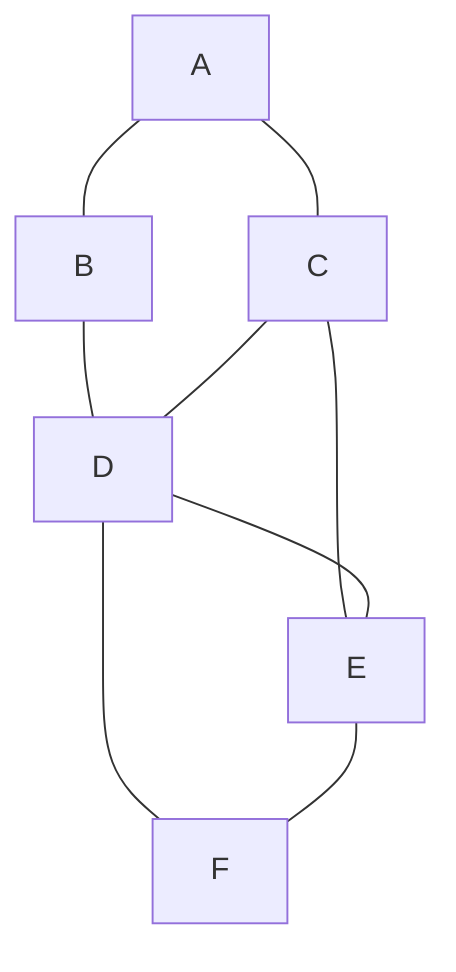
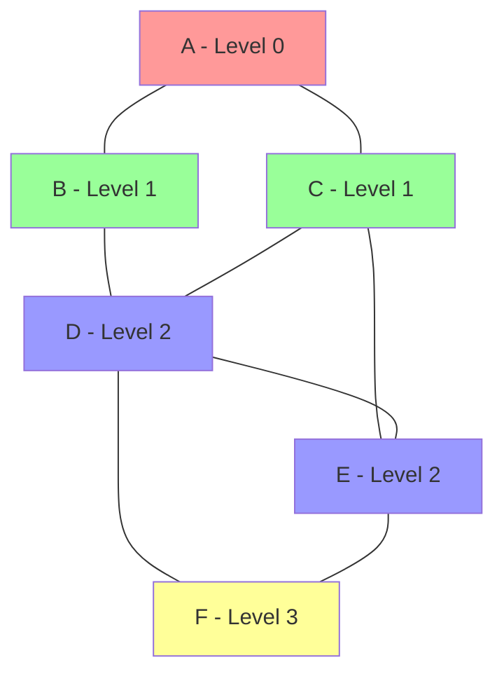
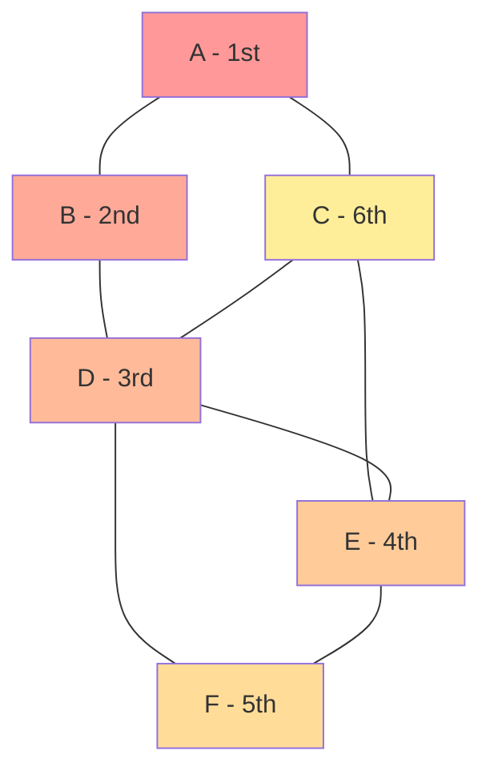

# Graph Traversals: BFS and DFS

## Introduction

Graph traversal is the process of visiting all the vertices of a graph in a systematic way. Two of the most fundamental graph traversal algorithms are **Breadth-First Search (BFS)** and **Depth-First Search (DFS)**. These algorithms form the backbone of many complex graph operations and have wide-ranging applications in computer science.

In this tutorial, we'll explore BFS and DFS in depth, understand how they work, implement them in code, and learn about their real-world applications.

## Prerequisites

Before diving into this tutorial, you should have:
- Basic understanding of graph data structures (vertices/nodes and edges)
- Familiarity with programming concepts like functions, loops, and conditionals
- Knowledge of basic data structures like arrays, queues, and stacks

## Understanding Graphs

A graph consists of:
- **Vertices (or Nodes)**: The fundamental units of which graphs are formed
- **Edges**: Connections between pairs of vertices

Graphs can be:
- **Directed**: Edges have a direction
- **Undirected**: Edges have no direction
- **Weighted**: Edges have associated values (weights)
- **Unweighted**: Edges have no associated values

Let's visualize a simple undirected graph:



## Breadth-First Search (BFS)

### What is BFS?

Breadth-First Search is a traversal algorithm that explores all vertices of a graph at the present depth level before moving on to vertices at the next depth level. It's like exploring a graph in "layers" or "levels."

### Key Characteristics of BFS

1. Uses a **queue** data structure (First-In-First-Out)
2. Explores neighbors before going deeper
3. Finds the shortest path in unweighted graphs
4. Uses more memory for the queue

### BFS Algorithm Steps

1. Start at a given source vertex
2. Visit the vertex and mark it as visited
3. Enqueue all its unvisited adjacent vertices
4. Dequeue a vertex, visit it, and enqueue its unvisited adjacent vertices
5. Repeat steps 3-4 until the queue is empty

### BFS Visualization

Let's see how BFS traverses our example graph starting from vertex A:



The traversal order would be: A → B → C → D → E → F

### BFS Implementation in Python

```python
from collections import defaultdict, deque

class Graph:
    def __init__(self):
        self.graph = defaultdict(list)
    
    def add_edge(self, u, v):
        # For undirected graph, add edges in both directions
        self.graph[u].append(v)
        self.graph[v].append(u)
    
    def bfs(self, start_vertex):
        # Initialize variables
        visited = set()
        queue = deque([start_vertex])
        visited.add(start_vertex)
        result = []
        
        # BFS algorithm
        while queue:
            # Dequeue a vertex
            vertex = queue.popleft()
            result.append(vertex)
            
            # Visit all adjacent vertices
            for neighbor in self.graph[vertex]:
                if neighbor not in visited:
                    visited.add(neighbor)
                    queue.append(neighbor)
        
        return result

# Example usage
graph = Graph()
graph.add_edge('A', 'B')
graph.add_edge('A', 'C')
graph.add_edge('B', 'D')
graph.add_edge('C', 'D')
graph.add_edge('C', 'E')
graph.add_edge('D', 'E')
graph.add_edge('D', 'F')
graph.add_edge('E', 'F')

print("BFS Traversal (starting from vertex A):")
print(graph.bfs('A'))  # Output: ['A', 'B', 'C', 'D', 'E', 'F']
```

## Depth-First Search (DFS)

### What is DFS?

Depth-First Search is a traversal algorithm that explores as far as possible along each branch before backtracking. It's like exploring a maze by following one path as far as possible, then backtracking and trying another path.

### Key Characteristics of DFS

1. Uses a **stack** data structure (Last-In-First-Out) or recursion
2. Explores as deep as possible before backtracking
3. Uses less memory than BFS (for the stack)
4. Good for topological sorting, cycle detection, and path finding

### DFS Algorithm Steps

1. Start at a given source vertex
2. Visit the vertex and mark it as visited
3. Recursively visit all its unvisited adjacent vertices
4. Backtrack when there are no more unvisited adjacent vertices

### DFS Visualization

Let's see how DFS traverses our example graph starting from vertex A:



One possible traversal order would be: A → B → D → E → F → C

Note: DFS traversal order can vary depending on how neighbors are processed.

### DFS Implementation in Python

#### Recursive DFS

```python
from collections import defaultdict

class Graph:
    def __init__(self):
        self.graph = defaultdict(list)
    
    def add_edge(self, u, v):
        # For undirected graph, add edges in both directions
        self.graph[u].append(v)
        self.graph[v].append(u)
    
    def dfs_recursive(self, vertex, visited=None, result=None):
        # Initialize variables on first call
        if visited is None:
            visited = set()
        if result is None:
            result = []
        
        # Mark current vertex as visited and add to result
        visited.add(vertex)
        result.append(vertex)
        
        # Recur for all adjacent vertices
        for neighbor in self.graph[vertex]:
            if neighbor not in visited:
                self.dfs_recursive(neighbor, visited, result)
        
        return result

# Example usage
graph = Graph()
graph.add_edge('A', 'B')
graph.add_edge('A', 'C')
graph.add_edge('B', 'D')
graph.add_edge('C', 'D')
graph.add_edge('C', 'E')
graph.add_edge('D', 'E')
graph.add_edge('D', 'F')
graph.add_edge('E', 'F')

print("DFS Traversal (starting from vertex A):")
print(graph.dfs_recursive('A'))  # Output may vary based on neighbors order
```

#### Iterative DFS (using an explicit stack)

```python
def dfs_iterative(self, start_vertex):
    # Initialize variables
    visited = set()
    stack = [start_vertex]
    result = []
    
    # DFS algorithm
    while stack:
        # Pop a vertex
        vertex = stack.pop()
        
        if vertex not in visited:
            visited.add(vertex)
            result.append(vertex)
            
            # Push all adjacent vertices in reverse order
            # (to maintain same traversal order as recursive)
            for neighbor in reversed(self.graph[vertex]):
                if neighbor not in visited:
                    stack.append(neighbor)
    
    return result
```

## Comparing BFS and DFS

| Feature | BFS | DFS |
|---------|-----|-----|
| Data Structure | Queue (FIFO) | Stack (LIFO) or Recursion |
| Space Complexity | O(b^d) where b is branching factor, d is distance from source | O(h) where h is height of tree/depth of search |
| Completeness | Yes (finds all reachable nodes) | Yes (finds all reachable nodes) |
| Optimality | Yes (finds shortest path in unweighted graphs) | No (may not find shortest path) |
| Use Cases | Shortest path, Level order traversal, Connected components | Topological sorting, Cycle detection, Path finding |

## Applications of Graph Traversals

### BFS Applications

1. **Shortest Path Finding**: In unweighted graphs, BFS finds the shortest path
2. **Web Crawlers**: Explore web pages level by level
3. **Social Network Analysis**: Find people within certain connection distance
4. **GPS Navigation Systems**: Find nearby locations
5. **Network Broadcasting**: Sending information to all nodes

### Example: Finding Shortest Path with BFS

```python
def shortest_path_bfs(self, start, end):
    if start == end:
        return [start]
    
    visited = {start}
    queue = deque([(start, [start])])
    
    while queue:
        node, path = queue.popleft()
        
        for neighbor in self.graph[node]:
            if neighbor == end:
                return path + [neighbor]
            
            if neighbor not in visited:
                visited.add(neighbor)
                queue.append((neighbor, path + [neighbor]))
    
    return None  # No path found
```

### DFS Applications

1. **Topological Sorting**: For scheduling tasks with dependencies
2. **Cycle Detection**: Detecting cycles in graphs
3. **Maze Generation and Solving**: Creating and solving maze puzzles
4. **Connected Components**: Finding connected components in a graph
5. **Graph Coloring**: Assigning colors to vertices

### Example: Detecting Cycles with DFS

```python
def has_cycle(self, start_vertex):
    visited = set()
    rec_stack = set()
    
    def dfs_cycle(vertex):
        visited.add(vertex)
        rec_stack.add(vertex)
        
        for neighbor in self.graph[vertex]:
            if neighbor not in visited:
                if dfs_cycle(neighbor):
                    return True
            elif neighbor in rec_stack:
                return True
        
        rec_stack.remove(vertex)
        return False
    
    return dfs_cycle(start_vertex)
```

## Real-World Applications

### Social Networks

BFS can be used to find all people within a certain connection distance (e.g., "Friends of Friends").

```python
def find_connections_within_distance(self, person, max_distance):
    visited = {person: 0}  # person: distance
    queue = deque([person])
    result = {0: [person]}  # distance: [people]
    
    while queue:
        current = queue.popleft()
        current_distance = visited[current]
        
        if current_distance < max_distance:
            for friend in self.graph[current]:
                if friend not in visited:
                    next_distance = current_distance + 1
                    visited[friend] = next_distance
                    queue.append(friend)
                    
                    if next_distance not in result:
                        result[next_distance] = []
                    result[next_distance].append(friend)
    
    return result
```

### Web Crawling

A web crawler can use BFS to explore websites level by level.

```python
def web_crawler_bfs(start_url, max_pages):
    visited = set([start_url])
    queue = deque([start_url])
    pages_crawled = 0
    
    while queue and pages_crawled < max_pages:
        current_url = queue.popleft()
        pages_crawled += 1
        
        # Fetch page content (simplified)
        page_content = fetch_page(current_url)
        
        # Process the page content
        process_page(current_url, page_content)
        
        # Extract links from the page (simplified)
        links = extract_links(page_content)
        
        for link in links:
            if link not in visited:
                visited.add(link)
                queue.append(link)
    
    return visited
```

### Game Pathfinding

Games use BFS to find the shortest path in grid-based environments.

```python
def find_path_in_grid(grid, start, end):
    rows, cols = len(grid), len(grid[0])
    visited = set([start])
    queue = deque([(start, [start])])
    
    # Possible movements: up, right, down, left
    directions = [(-1, 0), (0, 1), (1, 0), (0, -1)]
    
    while queue:
        (r, c), path = queue.popleft()
        
        if (r, c) == end:
            return path
        
        for dr, dc in directions:
            nr, nc = r + dr, c + dc
            
            if (0 <= nr < rows and 0 <= nc < cols and 
                grid[nr][nc] != 'wall' and 
                (nr, nc) not in visited):
                visited.add((nr, nc))
                queue.append(((nr, nc), path + [(nr, nc)]))
    
    return None  # No path found
```

## Time and Space Complexity

For both BFS and DFS, if we have V vertices and E edges:

- **Time Complexity**: O(V + E)
  - We visit each vertex once: O(V)
  - We explore each edge once: O(E)

- **Space Complexity**:
  - BFS: O(V) for the queue (in worst case, all vertices might be in the queue)
  - DFS: O(H) for the stack or call stack, where H is the height of the DFS tree (in worst case, O(V))

## Common Pitfalls and Best Practices

1. **Always track visited nodes** to avoid infinite loops in graphs with cycles
2. **Choose the right algorithm** for your problem:
   - Use BFS for shortest path in unweighted graphs
   - Use DFS for exploring all possibilities or detecting cycles
3. **Be careful with disconnected graphs** - you may need to run the algorithm multiple times from different starting points
4. **Consider the memory implications** - BFS typically uses more memory than DFS
5. **Pay attention to the order of neighbors** - it can affect the traversal order

## Exercises

1. Implement BFS to find the shortest path between two vertices in an unweighted graph.
2. Modify DFS to detect cycles in a directed graph.
3. Use BFS to determine the minimum number of moves needed for a knight to go from one position to another on a chessboard.
4. Implement a function that uses DFS to find all connected components in an undirected graph.
5. Create a topological sort algorithm using DFS for a directed acyclic graph (DAG).

## Summary

- **BFS** traverses a graph level by level using a queue. It's great for finding shortest paths in unweighted graphs and exploring graphs in a layered approach.
- **DFS** traverses a graph by exploring as far as possible along each branch before backtracking. It's useful for topological sorting, cycle detection, and path finding.
- Both algorithms have a time complexity of O(V + E) and are fundamental to solving many graph problems.
- The choice between BFS and DFS depends on the specific problem you're trying to solve and the properties of your graph.

## Additional Resources

Here are some resources to further your understanding of graph traversal algorithms:

- [Introduction to Algorithms](ISBN:9780262033848) by Cormen, Leiserson, Rivest, and Stein
- [Graph Theory and Its Applications](ISBN:9781482249484) by Gross, Yellen, and Anderson
- [AlgoExpert](https://www.algoexpert.io/) for practice problems on graph traversals
- [LeetCode's Graph section](https://leetcode.com/tag/graph/) for coding challenges on graphs
- [Visualization of Graph Algorithms](https://visualgo.net/en/dfsbfs) on VisuAlgo