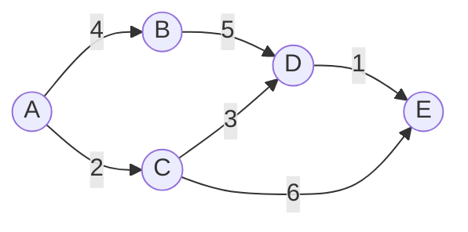

# Shortest Path Algorithms

## Introduction

Shortest path algorithms are fundamental techniques in computer science that solve a common problem: finding the most efficient route between two points in a graph. Whether you're using a GPS navigation system, designing network routing protocols, or optimizing resource allocation, shortest path algorithms form the backbone of these applications.

In this tutorial, we'll explore several important shortest path algorithms, understand how they work, implement them in code, and see how they apply to real-world scenarios.

## What are Shortest Path Algorithms?

Shortest path algorithms find the shortest (or least-cost) path between nodes in a graph. In these algorithms:

- **Nodes** (or vertices) represent points or locations
- **Edges** represent connections between nodes
- **Weights** on edges represent the cost of traversing that connection (distance, time, etc.)

Let's visualize a simple weighted graph:



Here, the numbers on the edges represent weights. The shortest path from A to E would be A → C → D → E with a total weight of 2 + 3 + 1 = 6.

## Common Shortest Path Algorithms

We'll cover three main algorithms:

1. **Dijkstra's Algorithm**: For graphs with non-negative edge weights
2. **Bellman-Ford Algorithm**: Can handle negative edge weights
3. **Floyd-Warshall Algorithm**: Finds shortest paths between all pairs of nodes

## Dijkstra's Algorithm

Dijkstra's algorithm finds the shortest path from a source node to all other nodes in a graph with non-negative edge weights.

### How It Works

1. Assign distance value 0 to the source node and infinity to all other nodes
2. Set all nodes as unvisited and mark the source node as the current node
3. For the current node, consider all unvisited neighbors and calculate their distances from the source
4. After considering all neighbors, mark the current node as visited
5. Select the unvisited node with the smallest distance as the new current node
6. Repeat steps 3-5 until all nodes are visited

### Implementation

Here's a Python implementation of Dijkstra's algorithm:

```python
import heapq

def dijkstra(graph, start):
    # Initialize distances with infinity for all nodes except the start node
    distances = {node: float('infinity') for node in graph}
    distances[start] = 0
    
    # Priority queue to store (distance, node) pairs
    priority_queue = [(0, start)]
    
    # Dictionary to store the shortest path
    shortest_path = {}
    
    while priority_queue:
        # Get the node with the smallest distance
        current_distance, current_node = heapq.heappop(priority_queue)
        
        # If we've already found a shorter path, skip
        if current_distance > distances[current_node]:
            continue
        
        # Check all neighbors of the current node
        for neighbor, weight in graph[current_node].items():
            distance = current_distance + weight
            
            # If we found a shorter path to the neighbor
            if distance < distances[neighbor]:
                distances[neighbor] = distance
                shortest_path[neighbor] = current_node
                heapq.heappush(priority_queue, (distance, neighbor))
    
    return distances, shortest_path

# Example usage
graph = {
    'A': {'B': 4, 'C': 2},
    'B': {'D': 5},
    'C': {'D': 3, 'E': 6},
    'D': {'E': 1},
    'E': {}
}

distances, shortest_path = dijkstra(graph, 'A')
print("Distances from A:", distances)
```

### Example Output

```
Distances from A: {'A': 0, 'B': 4, 'C': 2, 'D': 5, 'E': 6}
```

### Reconstructing the Path

To reconstruct the path from start to end using the `shortest_path` dictionary:

```python
def reconstruct_path(shortest_path, start, end):
    path = []
    current = end
    
    while current != start:
        path.append(current)
        current = shortest_path[current]
    
    path.append(start)
    path.reverse()
    return path

# Example
path = reconstruct_path(shortest_path, 'A', 'E')
print("Shortest path from A to E:", " → ".join(path))
```

Output:
```
Shortest path from A to E: A → C → D → E
```

### Time and Space Complexity

- **Time Complexity**: O((V + E) log V) with a binary heap implementation, where V is the number of vertices and E is the number of edges
- **Space Complexity**: O(V)

## Bellman-Ford Algorithm

Unlike Dijkstra's algorithm, Bellman-Ford can handle graphs with negative edge weights. It can also detect negative weight cycles.

### How It Works

1. Initialize distances from the source to all vertices as infinite and distance to the source itself as 0
2. Relax all edges V-1 times, where V is the number of vertices
3. Check for negative weight cycles

### Implementation

```python
def bellman_ford(graph, start):
    # Convert graph to edge list format
    edges = []
    for u in graph:
        for v, w in graph[u].items():
            edges.append((u, v, w))
    
    # Step 1: Initialize distances
    distances = {node: float('infinity') for node in graph}
    distances[start] = 0
    
    # Step 2: Relax all edges |V| - 1 times
    for _ in range(len(graph) - 1):
        for u, v, w in edges:
            if distances[u] != float('infinity') and distances[u] + w < distances[v]:
                distances[v] = distances[u] + w
    
    # Step 3: Check for negative weight cycles
    for u, v, w in edges:
        if distances[u] != float('infinity') and distances[u] + w < distances[v]:
            print("Graph contains negative weight cycle")
            return None
    
    return distances

# Example with negative edges but no negative cycles
graph_negative = {
    'A': {'B': 4, 'C': 2},
    'B': {'D': -5},
    'C': {'D': 3, 'E': -2},
    'D': {'E': 1},
    'E': {}
}

distances = bellman_ford(graph_negative, 'A')
print("Distances from A:", distances)
```

### Example Output

```
Distances from A: {'A': 0, 'B': 4, 'C': 2, 'D': -1, 'E': 0}
```

### Time and Space Complexity

- **Time Complexity**: O(V × E)
- **Space Complexity**: O(V)

## Floyd-Warshall Algorithm

Floyd-Warshall finds the shortest paths between all pairs of vertices in a graph. It works with both positive and negative edge weights, but doesn't allow negative cycles.

### How It Works

1. Initialize the distance matrix with direct edge weights
2. For each vertex k, update the shortest distance between every pair of vertices (i,j) by considering if path through k is shorter

### Implementation

```python
def floyd_warshall(graph):
    # Create vertices list
    vertices = list(graph.keys())
    
    # Initialize distance matrix
    dist = {}
    for i in vertices:
        dist[i] = {}
        for j in vertices:
            if i == j:
                dist[i][j] = 0
            elif j in graph[i]:
                dist[i][j] = graph[i][j]
            else:
                dist[i][j] = float('infinity')
    
    # Update distances considering all vertices as intermediates
    for k in vertices:
        for i in vertices:
            for j in vertices:
                if dist[i][k] + dist[k][j] < dist[i][j]:
                    dist[i][j] = dist[i][k] + dist[k][j]
    
    return dist

# Example usage
all_distances = floyd_warshall(graph)
print("Distance from A to E:", all_distances['A']['E'])
print("All distances:")
for start in graph:
    for end in graph:
        distance = all_distances[start][end]
        print(f"{start} → {end}: {distance if distance != float('infinity') else 'No path'}")
```

### Example Output

```
Distance from A to E: 6
All distances:
A → A: 0
A → B: 4
A → C: 2
A → D: 5
A → E: 6
...
```

### Time and Space Complexity

- **Time Complexity**: O(V³)
- **Space Complexity**: O(V²)

## Comparison of Algorithms

| Algorithm | Time Complexity | Space Complexity | Handles Negative Weights | Finds All Pairs |
|-----------|-----------------|------------------|--------------------------|-----------------|
| Dijkstra  | O((V+E)log V)   | O(V)             | No                       | No              |
| Bellman-Ford | O(V×E)       | O(V)             | Yes                      | No              |
| Floyd-Warshall | O(V³)      | O(V²)            | Yes                      | Yes             |

## Real-World Applications

### 1. Navigation Systems

GPS systems use shortest path algorithms to find optimal routes between locations. When you ask for directions, a modified version of Dijkstra's or A* (an extension of Dijkstra's) is used to calculate the fastest route.

```python
# Simplified navigation example
def navigate(map_graph, start_location, destination):
    distances, path = dijkstra(map_graph, start_location)
    route = reconstruct_path(path, start_location, destination)
    
    print(f"Optimal route from {start_location} to {destination}:")
    print(" → ".join(route))
    print(f"Estimated travel time: {distances[destination]} minutes")
```

### 2. Network Routing

Internet packets are routed through networks using shortest path algorithms to minimize delay and maximize throughput.

```python
# Network routing example
def route_packet(network, source_router, destination_router):
    # Find the shortest path in terms of latency
    _, path = dijkstra(network, source_router)
    route = reconstruct_path(path, source_router, destination_router)
    
    return route
```

### 3. Social Network Analysis

Finding the shortest connection between two people in a social network (the famous "six degrees of separation").

```python
# Social connection finder
def find_connection(social_graph, person1, person2):
    path = reconstruct_path(
        dijkstra(social_graph, person1)[1],
        person1,
        person2
    )
    
    print(f"Connection between {person1} and {person2}:")
    print(" → ".join(path))
    print(f"They are {len(path)-1} connections apart")
```

## Summary

Shortest path algorithms are powerful tools for solving optimization problems in networks and graphs. We've explored three key algorithms:

- **Dijkstra's Algorithm**: Efficient for graphs with non-negative weights
- **Bellman-Ford Algorithm**: Handles negative weights and detects negative cycles
- **Floyd-Warshall Algorithm**: Finds shortest paths between all pairs of vertices

Each algorithm has its strengths and ideal use cases. Understanding when to apply each one is crucial for efficient problem-solving in various domains.

## Exercises

1. Implement Dijkstra's algorithm to find the shortest path in a city map with one-way streets.
2. Modify the Bellman-Ford algorithm to return the actual path, not just the distances.
3. Use the Floyd-Warshall algorithm to find the "center" of a network (the node with the smallest maximum distance to any other node).
4. Create a visualization of how each algorithm explores a graph step by step.
5. Extend Dijkstra's algorithm to handle multiple criteria (e.g., shortest and fastest route).

## Additional Resources

- Graph Theory and Algorithms books
- Stanford's Algorithms Specialization on Coursera
- Visualization tools like VisuAlgo
- Advanced algorithms like A* and Bi-directional search

Remember that mastering these algorithms requires practice. Try implementing them from scratch and solving various graph problems to deepen your understanding!