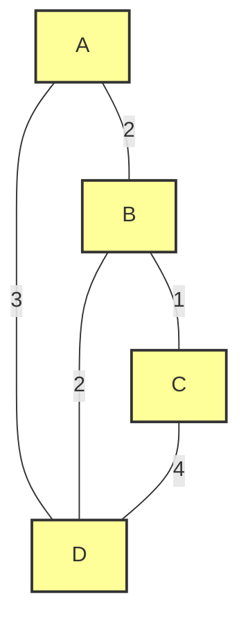
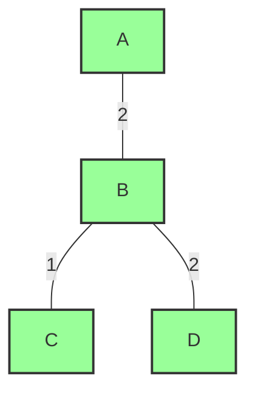

# Minimum Spanning Trees

## Introduction

A Minimum Spanning Tree (MST) is a fundamental concept in graph theory with powerful applications in computer science and real-world problems. In simple terms, an MST is a subset of edges from a connected, undirected graph that connects all vertices together with the minimum possible total edge weight, without creating any cycles.

Think of it this way: if you have several cities (vertices) connected by roads (edges) with different distances (weights), an MST gives you the most efficient way to build a road network that connects all cities while minimizing the total road length.

## Prerequisites

Before diving into MSTs, you should be familiar with:
- Basic graph concepts (vertices, edges, weights)
- Graph representations (adjacency lists/matrices)
- Basic data structures (arrays, queues, priority queues)

## Core Concepts

### What Makes a Spanning Tree?

A spanning tree of a graph G is a tree that:
1. Includes every vertex in G
2. Contains exactly (n-1) edges, where n is the number of vertices
3. Forms a connected subgraph with no cycles

A graph can have multiple spanning trees, but a **minimum** spanning tree is the one with the lowest total edge weight.

### Properties of MSTs

1. A graph can have multiple MSTs if several edges have the same weight
2. If all edge weights are unique, the MST is unique
3. The MST of a graph always includes the minimum weight edge that doesn't create a cycle
4. MSTs exhibit the "cut property" and "cycle property" (explained below)

## Key Algorithms

There are two primary algorithms for finding MSTs: Kruskal's Algorithm and Prim's Algorithm. Let's explore both.

### Kruskal's Algorithm

Kruskal's algorithm follows a greedy approach:

1. Sort all edges in non-decreasing order of weight
2. Initialize an empty MST
3. Iterate through the sorted edges, adding each edge to the MST if it doesn't create a cycle

Here's a step-by-step implementation in Python:

```python
# Kruskal's Algorithm for MST
class DisjointSet:
    def __init__(self, vertices):
        self.parent = {v: v for v in vertices}
        self.rank = {v: 0 for v in vertices}
    
    def find(self, item):
        if self.parent[item] != item:
            self.parent[item] = self.find(self.parent[item])  # Path compression
        return self.parent[item]
    
    def union(self, x, y):
        root_x = self.find(x)
        root_y = self.find(y)
        
        if root_x == root_y:
            return
        
        # Union by rank
        if self.rank[root_x] < self.rank[root_y]:
            self.parent[root_x] = root_y
        elif self.rank[root_x] > self.rank[root_y]:
            self.parent[root_y] = root_x
        else:
            self.parent[root_y] = root_x
            self.rank[root_x] += 1

def kruskal_mst(graph, vertices):
    # Result will store the MST
    result = []
    
    # Sort edges by weight
    edges = []
    for u in graph:
        for v, weight in graph[u]:
            edges.append((u, v, weight))
    
    # Sort edges in non-decreasing order of their weight
    edges.sort(key=lambda x: x[2])
    
    # Create disjoint sets for vertices
    disjoint_set = DisjointSet(vertices)
    
    edge_count = 0
    i = 0
    
    # Process edges until we have (V-1) edges in result
    while edge_count < len(vertices) - 1 and i < len(edges):
        u, v, weight = edges[i]
        i += 1
        
        # Check if including this edge creates a cycle
        if disjoint_set.find(u) != disjoint_set.find(v):
            edge_count += 1
            result.append((u, v, weight))
            disjoint_set.union(u, v)
    
    return result
```

#### Example Input

```python
# Example graph represented as an adjacency list with weights
graph = {
    'A': [('B', 2), ('D', 3)],
    'B': [('A', 2), ('C', 1), ('D', 2)],
    'C': [('B', 1), ('D', 4)],
    'D': [('A', 3), ('B', 2), ('C', 4)]
}
vertices = ['A', 'B', 'C', 'D']

mst = kruskal_mst(graph, vertices)
print("Edges in the MST:")
for u, v, weight in mst:
    print(f"{u} -- {v} == {weight}")
```

#### Example Output

```
Edges in the MST:
B -- C == 1
A -- B == 2
B -- D == 2
```

Total MST weight: 5

### Prim's Algorithm

Prim's algorithm also takes a greedy approach but works differently:

1. Start with a single vertex
2. Repeatedly add the lowest-weight edge that connects the tree to a new vertex
3. Continue until all vertices are included

Here's a step-by-step implementation using a priority queue:

```python
import heapq

def prim_mst(graph, start_vertex):
    # Priority queue to store vertices with their key values
    priority_queue = [(0, start_vertex, None)]  # (weight, vertex, parent)
    visited = set()
    mst = []
    
    while priority_queue and len(visited) < len(graph):
        weight, vertex, parent = heapq.heappop(priority_queue)
        
        if vertex in visited:
            continue
            
        visited.add(vertex)
        
        if parent is not None:
            mst.append((parent, vertex, weight))
        
        for neighbor, edge_weight in graph[vertex]:
            if neighbor not in visited:
                heapq.heappush(priority_queue, (edge_weight, neighbor, vertex))
    
    return mst
```

#### Example Input

```python
# Using the same graph as in Kruskal's example
graph = {
    'A': [('B', 2), ('D', 3)],
    'B': [('A', 2), ('C', 1), ('D', 2)],
    'C': [('B', 1), ('D', 4)],
    'D': [('A', 3), ('B', 2), ('C', 4)]
}

mst = prim_mst(graph, 'A')
print("Edges in the MST:")
for u, v, weight in mst:
    print(f"{u} -- {v} == {weight}")
```

#### Example Output

```
Edges in the MST:
A -- B == 2
B -- C == 1
B -- D == 2
```

Total MST weight: 5

## Visual Representation

Let's visualize how these algorithms work on a simple graph:



And the resulting MST would be:



## Algorithm Comparison

| Algorithm | Time Complexity | Space Complexity | Best For |
|-----------|----------------|-----------------|----------|
| Kruskal   | O(E log E)     | O(V + E)        | Sparse graphs |
| Prim      | O(E log V)     | O(V + E)        | Dense graphs |

Where:
- V = number of vertices
- E = number of edges

## The Cut Property and Cycle Property

Two important theoretical concepts help us understand why these algorithms work:

1. **Cut Property**: For any cut in the graph, the minimum weight edge crossing the cut must be in the MST.
   - A "cut" divides vertices into two non-empty sets.
   - This property enables Prim's algorithm to work correctly.

2. **Cycle Property**: The maximum weight edge in any cycle of the graph cannot be in the MST.
   - This property is the foundation of Kruskal's algorithm.

## Real-World Applications

MSTs have numerous practical applications:

### 1. Network Design

When designing networks (telecommunications, electrical, computer, etc.), MSTs help minimize the cost of connection while ensuring all nodes are connected.

**Example**: A telecom company needs to connect multiple offices with fiber optic cables. Using an MST algorithm, they can find the minimum length of cable needed to connect all offices.

### 2. Clustering Algorithms

MSTs are used in clustering algorithms like Single-Linkage Clustering, where data points are grouped based on their similarity.

```python
def single_linkage_clustering(points, k):
    # Calculate distances between all points
    edges = []
    for i in range(len(points)):
        for j in range(i+1, len(points)):
            distance = calculate_distance(points[i], points[j])
            edges.append((i, j, distance))
    
    # Sort edges by distance
    edges.sort(key=lambda x: x[2])
    
    # Build MST using Kruskal's algorithm
    disjoint_set = DisjointSet(range(len(points)))
    mst = []
    
    for u, v, distance in edges:
        if disjoint_set.find(u) != disjoint_set.find(v):
            mst.append((u, v, distance))
            disjoint_set.union(u, v)
    
    # Remove (k-1) largest edges to create k clusters
    mst.sort(key=lambda x: x[2], reverse=True)
    for i in range(k-1):
        if i < len(mst):
            mst.pop(0)
    
    # Create clusters
    disjoint_set = DisjointSet(range(len(points)))
    for u, v, _ in mst:
        disjoint_set.union(u, v)
    
    clusters = {}
    for i in range(len(points)):
        root = disjoint_set.find(i)
        if root not in clusters:
            clusters[root] = []
        clusters[root].append(points[i])
    
    return list(clusters.values())
```

### 3. Approximately Solving the Traveling Salesman Problem

MSTs can be used to approximate solutions to the Traveling Salesman Problem (TSP), which is NP-hard.

**Example**: A delivery service needs to find an efficient route to visit multiple locations and return to the start. While an MST doesn't directly solve this, it can provide a lower bound and help in approximation algorithms.

### 4. Image Segmentation

In computer vision, MSTs help segment images by grouping similar pixels together.

### 5. Circuit Design

In electronic circuit design, MSTs help minimize the total wire length while ensuring all components are connected.

## Common Challenges and Optimizations

### 1. Handling Disconnected Graphs

MST algorithms assume the graph is connected. For disconnected graphs, you'll need to find a Minimum Spanning Forest (a collection of MSTs, one for each connected component).

```python
def minimum_spanning_forest(graph, vertices):
    forest = []
    visited = set()
    
    for vertex in vertices:
        if vertex not in visited:
            mst = prim_mst(graph, vertex)
            forest.extend(mst)
            
            # Mark all vertices in this MST as visited
            for u, v, _ in mst:
                visited.add(u)
                visited.add(v)
    
    return forest
```

### 2. Efficient Implementation of Disjoint Sets

The efficiency of Kruskal's algorithm heavily depends on the implementation of the disjoint set data structure. Using path compression and union by rank (as shown in our example) optimizes performance.

### 3. Dynamic MST Updates

In some applications, the graph may change over time. Efficiently updating an MST when edges are added or removed is a challenging problem that requires specialized algorithms.

## Summary

Minimum Spanning Trees are a fundamental concept in graph theory with numerous practical applications. We've covered:

1. The definition and properties of MSTs
2. Two main algorithms: Kruskal's and Prim's
3. Implementation details with Python code examples
4. Real-world applications and optimizations

Both Kruskal's and Prim's algorithms are greedy approaches that effectively find the MST, but they differ in their approach and have different performance characteristics depending on the graph structure.

## Exercises

1. Implement Kruskal's algorithm to find the MST of a graph represented as an adjacency matrix.
2. Modify the Prim's algorithm to return the total weight of the MST without constructing the tree itself.
3. Write a function to determine if an edge is a "bridge" in the MST (removing it would disconnect the tree).
4. Implement a function that finds the second minimum spanning tree (the spanning tree with the second smallest total weight).
5. Solve the "City Network" problem: Given n cities and the cost of connecting pairs of cities, find the minimum cost to connect all cities such that there is at least one path between any two cities.

## Additional Resources

For further study:
- Graph Theory Fundamentals
- Advanced Data Structures (Priority Queues, Disjoint Sets)
- Network Flow Algorithms
- Approximation Algorithms for NP-Hard Problems
- Dynamic Graph Algorithms

With these concepts and implementations, you'll be well-equipped to understand and apply Minimum Spanning Trees to solve complex problems efficiently!