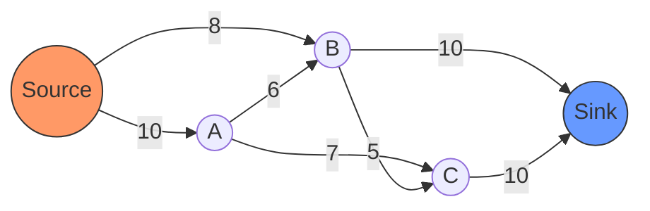
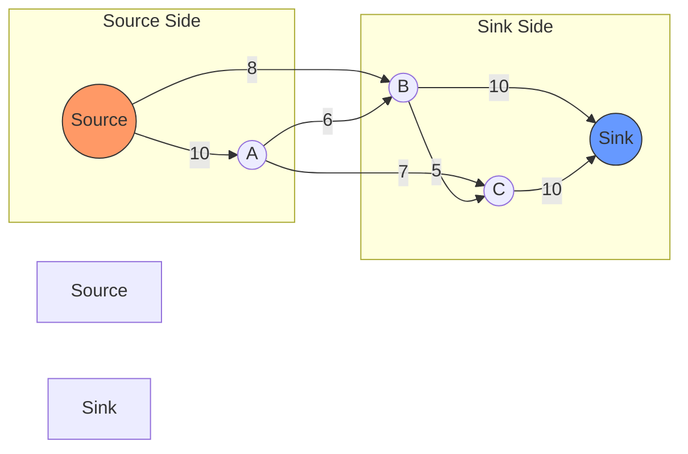

# Network Flow

## Introduction

Network flow is a fascinating area of graph algorithms that deals with the problem of sending as much "flow" as possible through a network of pipes, each with their own capacity limits. It's like figuring out how much water can flow from a source to a destination through a complex system of pipes with different widths.

These algorithms have numerous real-world applications, from transportation and logistics to resource allocation and even bipartite matching problems. Despite being categorized as "advanced," network flow concepts build upon basic graph traversal techniques you might already be familiar with, such as breadth-first search (BFS) and depth-first search (DFS).

## Core Concepts

Before diving into the algorithms, let's understand the fundamental components of a network flow problem:

### Flow Network

A flow network is a directed graph where:

- Each edge has a **capacity** (maximum amount that can flow through that edge)
- There is a **source** node (where flow originates)
- There is a **sink** node (where flow terminates)
- Flow conservation: the total flow entering a node equals the total flow leaving it (except for source and sink)

Let's visualize a simple flow network:



In this diagram, the numbers on the edges represent capacities. For example, edge S→A can handle a maximum flow of 10 units.

### Flow and Residual Networks

- **Flow**: The actual amount passing through each edge (cannot exceed capacity)
- **Residual capacity**: How much more flow can be pushed through an edge
- **Residual network**: A graph showing remaining capacity in each direction

## The Max Flow Problem

The fundamental question in network flow: **What is the maximum amount of flow that can be sent from source to sink?**

Let's explore the main algorithms that solve this problem.

## Ford-Fulkerson Algorithm

The Ford-Fulkerson algorithm is the classic approach to solving the max flow problem.

### Basic Algorithm

1. Start with zero flow on all edges
2. While there exists an augmenting path from source to sink in the residual network:
   - Find the minimum residual capacity along this path
   - Increase flow along this path by this minimum capacity
3. When no augmenting path exists, the current flow is maximal

### Implementation in Python

```python
def ford_fulkerson(graph, source, sink):
    # Initialize flow to 0
    flow = 0
    
    # Create residual graph
    residual_graph = [row[:] for row in graph]
    
    # Path found using DFS
    def dfs(u, min_flow):
        if u == sink:
            return min_flow
        
        for v in range(len(residual_graph)):
            # If there is capacity and v is not visited
            if residual_graph[u][v] > 0 and v not in path:
                path.append(v)
                curr_flow = min(min_flow, residual_graph[u][v])
                
                # Recursively find min flow in path
                bottleneck = dfs(v, curr_flow)
                
                if bottleneck > 0:
                    # Update residual capacities
                    residual_graph[u][v] -= bottleneck
                    residual_graph[v][u] += bottleneck  # Add reverse edge
                    return bottleneck
                
                path.pop()  # Remove v if no flow
        
        return 0
    
    # Find augmenting paths
    while True:
        path = [source]
        augment_flow = dfs(source, float('inf'))
        
        if augment_flow == 0:
            break
            
        flow += augment_flow
    
    return flow

# Example usage
graph = [
    [0, 10, 8, 0, 0],  # Source
    [0, 0, 6, 7, 0],   # A
    [0, 0, 0, 5, 10],  # B
    [0, 0, 0, 0, 10],  # C
    [0, 0, 0, 0, 0]    # Sink
]

max_flow = ford_fulkerson(graph, 0, 4)
print(f"Maximum flow: {max_flow}")  # Output: Maximum flow: 19
```

### Time Complexity

The time complexity of Ford-Fulkerson depends on how we find augmenting paths and the capacity values:
- Worst case: O(E × max_flow) where E is the number of edges
- This is because each augmenting path can increase flow by at least 1
- If capacities are large, this algorithm can be inefficient

## Edmonds-Karp Algorithm

Edmonds-Karp improves upon Ford-Fulkerson by using BFS to find the shortest augmenting path.

### Key Differences from Ford-Fulkerson

- Always uses BFS to find augmenting paths (guarantees shortest path)
- Time complexity: O(V × E²) where V is the number of vertices and E is the number of edges
- More predictable performance regardless of capacity values

### Implementation in Python

```python
from collections import deque

def edmonds_karp(graph, source, sink):
    flow = 0
    n = len(graph)
    
    # Create residual graph
    residual_graph = [row[:] for row in graph]
    
    while True:
        # Use BFS to find an augmenting path
        parent = [-1] * n
        parent[source] = -2  # Mark source as visited
        
        # Store node and its min flow in queue
        queue = deque([(source, float('inf'))])
        
        while queue:
            current, min_flow = queue.popleft()
            
            # Search all adjacent vertices
            for next_node in range(n):
                # If not visited and has capacity
                if parent[next_node] == -1 and residual_graph[current][next_node] > 0:
                    parent[next_node] = current
                    new_min_flow = min(min_flow, residual_graph[current][next_node])
                    
                    if next_node == sink:
                        # Augment flow through the path
                        flow += new_min_flow
                        v = sink
                        
                        while v != source:
                            u = parent[v]
                            residual_graph[u][v] -= new_min_flow
                            residual_graph[v][u] += new_min_flow
                            v = u
                        
                        break
                    
                    queue.append((next_node, new_min_flow))
            else:
                continue
            break
        else:
            # No augmenting path found, we're done
            break
    
    return flow

# Example usage (same graph as before)
graph = [
    [0, 10, 8, 0, 0],  # Source
    [0, 0, 6, 7, 0],   # A
    [0, 0, 0, 5, 10],  # B
    [0, 0, 0, 0, 10],  # C
    [0, 0, 0, 0, 0]    # Sink
]

max_flow = edmonds_karp(graph, 0, 4)
print(f"Maximum flow: {max_flow}")  # Output: Maximum flow: 19
```

## The Min-Cut Max-Flow Theorem

One of the most important theoretical results in network flow is the Min-Cut Max-Flow theorem, which states:

> The maximum flow in a network equals the capacity of the minimum cut.

A **cut** is a partition of nodes into two sets, one containing the source and the other containing the sink. The capacity of a cut is the sum of capacities of edges going from the source's set to the sink's set.



The cut shown above has a capacity of 8 + 6 + 7 = 21. A minimum cut would have the lowest possible total capacity.

## Practical Applications

Network flow algorithms have numerous real-world applications:

### 1. Transportation Networks

Optimizing the flow of goods or vehicles through a transportation network. For example, determining the maximum capacity of a highway system.

### 2. Bipartite Matching

Finding maximum matching in bipartite graphs. This can be applied to job assignments, resource allocation, and more.

```python
def maximum_bipartite_matching(graph, n, m):
    """
    Finds maximum matching in a bipartite graph
    graph: adjacency list where graph[i] lists nodes connected to i
    n: number of nodes on the left side
    m: number of nodes on the right side
    """
    # Create flow network
    # n + m + 2 nodes (n left nodes, m right nodes, source, sink)
    flow_graph = [[0] * (n + m + 2) for _ in range(n + m + 2)]
    source = 0
    sink = n + m + 1
    
    # Connect source to all left nodes with capacity 1
    for i in range(1, n + 1):
        flow_graph[source][i] = 1
    
    # Connect all right nodes to sink with capacity 1
    for i in range(n + 1, n + m + 1):
        flow_graph[i][sink] = 1
    
    # Connect left to right according to given graph
    for left_node in range(n):
        for right_node in graph[left_node]:
            flow_graph[left_node + 1][right_node + n + 1] = 1
    
    # Run max flow algorithm
    return edmonds_karp(flow_graph, source, sink)

# Example: Job assignment
# 3 workers, 4 jobs, each worker can do certain jobs
workers_to_jobs = [
    [0, 2, 3],  # Worker 0 can do jobs 0, 2, 3
    [0, 1],     # Worker 1 can do jobs 0, 1
    [1, 2]      # Worker 2 can do jobs 1, 2
]

max_assignments = maximum_bipartite_matching(workers_to_jobs, 3, 4)
print(f"Maximum number of job assignments: {max_assignments}")
```

### 3. Image Segmentation

In computer vision, network flow can be used for segmenting images (separating foreground from background).

### 4. Sports Scheduling

Determining whether a league schedule is feasible given constraints.

## Dinic's Algorithm: A More Efficient Approach

For completeness, let's briefly mention Dinic's algorithm, which is an improvement over Edmonds-Karp:

- Uses a level graph to find multiple augmenting paths at once
- Time complexity: O(V² × E)
- Particularly efficient for networks with unit capacities

## Summary

Network flow algorithms solve the problem of maximizing flow through a directed graph with capacity constraints. The key algorithms we've covered are:

1. **Ford-Fulkerson**: The classic approach using augmenting paths
2. **Edmonds-Karp**: An improvement that always finds the shortest augmenting path
3. **Dinic's Algorithm**: A further optimization using level graphs

These algorithms have diverse applications and are fundamental tools in solving optimization problems.

## Practice Exercises

1. Implement the Ford-Fulkerson algorithm to find the maximum flow in a given network.
2. Solve a bipartite matching problem using the Edmonds-Karp algorithm.
3. Given a network, find both the maximum flow and the minimum cut.
4. Implement Dinic's algorithm and compare its performance with Edmonds-Karp.
5. Use network flow to solve a real-world problem such as airline scheduling or resource allocation.

## Additional Resources

- "Introduction to Algorithms" by Cormen, Leiserson, Rivest, and Stein (Chapter on Network Flow)
- "Algorithm Design" by Kleinberg and Tardos
- Stanford University's CS Theory course materials on network flow
- MIT OpenCourseWare lectures on network flow algorithms