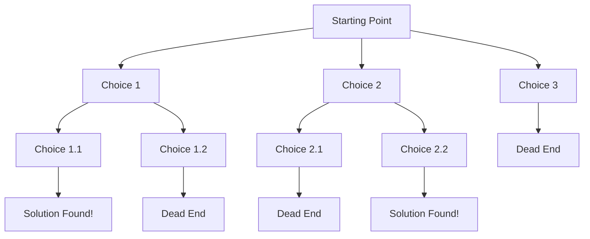

# Backtracking Techniques

## Introduction

Backtracking is a powerful algorithmic technique used to find solutions to computational problems, particularly those without a straightforward approach. It's like exploring a maze with multiple paths - you try one path, and if it doesn't lead to the exit, you **backtrack** to a previous position and try another path.

In programming terms, backtracking builds a solution incrementally, abandoning solutions ("backtracking") as soon as it determines they cannot possibly be completed to a valid solution. This "try, test, and backtrack" approach makes it incredibly useful for solving problems like puzzles, pathfinding, and constraint satisfaction problems.

## Core Concepts of Backtracking

At its heart, backtracking relies on a few key principles:

1. **Recursive exploration** - Breaking the problem into smaller subproblems
2. **State space traversal** - Systematically exploring all potential solutions
3. **Constraint checking** - Validating if the current partial solution can lead to a complete one
4. **Pruning** - Eliminating invalid paths early to avoid wasted computation

## Backtracking Algorithm Template

Most backtracking solutions follow this general pattern:

```python
def backtrack(candidate):
    if is_solution(candidate):
        output_solution(candidate)
        return
    
    for next_candidate in get_candidates(candidate):
        if is_valid(next_candidate):
            # Add to our solution
            add_to_solution(next_candidate)
            
            # Recurse
            backtrack(next_candidate)
            
            # Backtrack (remove from solution)
            remove_from_solution(next_candidate)
```

This template demonstrates the recursive nature of backtracking, exploring all valid possibilities and undoing choices that don't lead to solutions.

## Visualizing Backtracking

Backtracking can be visualized as a search tree, where each node represents a state and branches represent possible choices:



When the algorithm hits a dead end, it backtracks to the previous state and tries another path.

## Classic Backtracking Problems

Let's explore some classic problems that can be solved using backtracking:

### 1. The N-Queens Problem

The N-Queens problem asks how to place N chess queens on an N×N chessboard so that no two queens threaten each other.

```python
def solve_n_queens(n):
    board = [['.' for _ in range(n)] for _ in range(n)]
    solutions = []
    
    def is_safe(row, col):
        # Check column
        for i in range(row):
            if board[i][col] == 'Q':
                return False
        
        # Check upper left diagonal
        for i, j in zip(range(row-1, -1, -1), range(col-1, -1, -1)):
            if board[i][j] == 'Q':
                return False
        
        # Check upper right diagonal
        for i, j in zip(range(row-1, -1, -1), range(col+1, n)):
            if board[i][j] == 'Q':
                return False
        
        return True
    
    def backtrack(row):
        if row == n:
            # We found a solution, add it to our results
            solutions.append([''.join(row) for row in board])
            return
        
        for col in range(n):
            if is_safe(row, col):
                # Place queen
                board[row][col] = 'Q'
                
                # Recurse to place queens in next rows
                backtrack(row + 1)
                
                # Backtrack
                board[row][col] = '.'
    
    backtrack(0)
    return solutions
```

**Example Input:**
```
n = 4
```

**Output:**
```
[
  [".Q..",  // Solution 1
   "...Q",
   "Q...",
   "..Q."],

  ["..Q.",  // Solution 2
   "Q...",
   "...Q",
   ".Q.."]
]
```

### 2. Sudoku Solver

Solving a Sudoku puzzle is a perfect application of backtracking:

```python
def solve_sudoku(board):
    # Find an empty cell
    def find_empty():
        for i in range(9):
            for j in range(9):
                if board[i][j] == 0:
                    return i, j
        return None
    
    # Check if the number can be placed in the given position
    def is_valid(num, pos):
        row, col = pos
        
        # Check row
        for j in range(9):
            if board[row][j] == num and j != col:
                return False
        
        # Check column
        for i in range(9):
            if board[i][col] == num and i != row:
                return False
        
        # Check 3x3 box
        box_row, box_col = (row // 3) * 3, (col // 3) * 3
        
        for i in range(box_row, box_row + 3):
            for j in range(box_col, box_col + 3):
                if board[i][j] == num and (i, j) != pos:
                    return False
        
        return True
    
    def backtrack():
        empty = find_empty()
        
        # If no empty spaces, we've solved the puzzle
        if not empty:
            return True
        
        row, col = empty
        
        # Try digits 1-9
        for num in range(1, 10):
            # Check if valid
            if is_valid(num, (row, col)):
                # Place the number
                board[row][col] = num
                
                # Recursively try to solve rest of the board
                if backtrack():
                    return True
                
                # If we get here, this placement didn't work
                # Backtrack
                board[row][col] = 0
        
        # No solution found with current configuration
        return False
    
    backtrack()
    return board
```

**Example Input:**
```
board = [
    [5, 3, 0, 0, 7, 0, 0, 0, 0],
    [6, 0, 0, 1, 9, 5, 0, 0, 0],
    [0, 9, 8, 0, 0, 0, 0, 6, 0],
    [8, 0, 0, 0, 6, 0, 0, 0, 3],
    [4, 0, 0, 8, 0, 3, 0, 0, 1],
    [7, 0, 0, 0, 2, 0, 0, 0, 6],
    [0, 6, 0, 0, 0, 0, 2, 8, 0],
    [0, 0, 0, 4, 1, 9, 0, 0, 5],
    [0, 0, 0, 0, 8, 0, 0, 7, 9]
]
```

**Output:**
```
[
    [5, 3, 4, 6, 7, 8, 9, 1, 2],
    [6, 7, 2, 1, 9, 5, 3, 4, 8],
    [1, 9, 8, 3, 4, 2, 5, 6, 7],
    [8, 5, 9, 7, 6, 1, 4, 2, 3],
    [4, 2, 6, 8, 5, 3, 7, 9, 1],
    [7, 1, 3, 9, 2, 4, 8, 5, 6],
    [9, 6, 1, 5, 3, 7, 2, 8, 4],
    [2, 8, 7, 4, 1, 9, 6, 3, 5],
    [3, 4, 5, 2, 8, 6, 1, 7, 9]
]
```

### 3. Permutations Generator

Generating all permutations of a set is another classic application of backtracking:

```python
def generate_permutations(nums):
    result = []
    
    def backtrack(current, remaining):
        # If no more elements to permute, add solution
        if not remaining:
            result.append(current[:])
            return
        
        for i in range(len(remaining)):
            # Add element to current permutation
            current.append(remaining[i])
            
            # Recurse with remaining elements
            backtrack(current, remaining[:i] + remaining[i+1:])
            
            # Backtrack
            current.pop()
    
    backtrack([], nums)
    return result
```

**Example Input:**
```
nums = [1, 2, 3]
```

**Output:**
```
[
  [1, 2, 3],
  [1, 3, 2],
  [2, 1, 3],
  [2, 3, 1],
  [3, 1, 2],
  [3, 2, 1]
]
```

## Performance Considerations

While backtracking is powerful, it can be computationally expensive:

- **Time complexity:** Often O(b^d) where b is the branching factor and d is the maximum depth of the search tree
- **Space complexity:** Usually O(d) due to the recursion stack

To improve efficiency:

1. **Implement pruning:** Detect and avoid exploring paths that cannot lead to valid solutions
2. **Use heuristics:** Guide the search toward more promising solutions first
3. **Apply constraint propagation:** Reduce the search space by applying constraints early
4. **Memorization:** Store results of already computed states to avoid redundant calculations

## Real-World Applications

Backtracking isn't just for puzzles; it has many practical applications:

1. **Route Planning:** Finding all possible paths between locations
2. **Constraint Satisfaction Problems:** Scheduling, resource allocation
3. **Pattern Matching:** Finding patterns in text or images
4. **Game Development:** AI for games like chess or tic-tac-toe
5. **Circuit Design:** Finding optimal arrangements of components

## Practical Example: Subset Sum Problem

The Subset Sum problem asks if there exists a subset of given numbers that sum up to a target value:

```python
def subset_sum(nums, target):
    result = []
    
    def backtrack(start, subset, current_sum):
        # If we found a valid subset, add it
        if current_sum == target:
            result.append(subset[:])
            return
        
        # If we've exceeded the target or reached the end, stop
        if current_sum > target or start >= len(nums):
            return
        
        # Include current element
        subset.append(nums[start])
        backtrack(start + 1, subset, current_sum + nums[start])
        
        # Exclude current element (backtrack)
        subset.pop()
        backtrack(start + 1, subset, current_sum)
    
    backtrack(0, [], 0)
    return result
```

**Example Input:**
```
nums = [3, 1, 5, 2]
target = 6
```

**Output:**
```
[[3, 1, 2], [1, 5]]
```

## When to Use Backtracking

Backtracking is most suitable when:

1. The problem requires exploring all possible combinations or permutations
2. You need to find all possible solutions, not just one
3. The problem can be broken down into a sequence of decisions
4. Early validation can eliminate many potential solutions

However, if the search space is extremely large, consider alternative approaches like dynamic programming, greedy algorithms, or heuristic search algorithms.

## Common Pitfalls and Tips

When implementing backtracking algorithms:

1. **Avoid infinite recursion:** Ensure your base case is reachable
2. **Watch for duplicates:** Be careful not to count the same solution twice
3. **Manage state correctly:** Restore the state properly after backtracking
4. **Test with small examples:** Verify with simple cases before tackling larger ones
5. **Implement strong pruning:** The efficiency of backtracking depends heavily on eliminating invalid paths early

## Summary

Backtracking is a powerful algorithmic technique that systematically explores potential solutions by building them step-by-step and abandoning paths that can't lead to valid solutions. While it can be computationally intensive, techniques like pruning and constraint propagation can make it efficient enough for many real-world applications.

The key to mastering backtracking is understanding when to apply it and how to implement effective pruning strategies to reduce the search space.

## Practice Exercises

To strengthen your understanding of backtracking:

1. Implement a solution for the Rat in a Maze problem
2. Create a Crossword Puzzle solver
3. Solve the Graph Coloring problem
4. Write a Word Break solver to determine if a string can be segmented into dictionary words
5. Develop a Knights Tour solver for a chessboard

## Additional Resources

- "Introduction to Algorithms" by Cormen, Leiserson, Rivest, and Stein
- "Algorithms" by Robert Sedgewick and Kevin Wayne
- "Competitive Programmer's Handbook" by Antti Laaksonen

Happy backtracking! Remember, the key is to try, test, and if needed, backtrack to find the optimal solution.