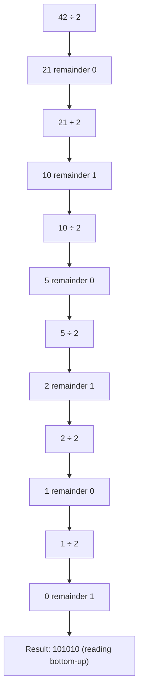

# Bit Manipulation

## Introduction

Bit manipulation involves directly manipulating individual bits within a computer's binary representation of data. While modern programming often abstracts away these low-level operations, understanding bit manipulation provides powerful tools for solving certain problems more efficiently.

In this tutorial, we'll explore how to work with binary data at the bit level, understand the common bitwise operators, and learn practical applications where bit manipulation shines.

## Binary Representation Basics

Before diving into bit manipulation, let's refresh our understanding of binary numbers.

In computing, all data is ultimately represented as sequences of bits (binary digits), where each bit can only be 0 or 1. For example, the decimal number 42 is represented in binary as `101010`.

### Converting Between Decimal and Binary

To convert a decimal number to binary:
1. Divide the number by 2
2. Record the remainder (0 or 1)
3. Repeat with the quotient until it becomes 0
4. Read the remainders from bottom to top



## Bitwise Operators

Programming languages provide several operators for bit manipulation:

### AND (`&`)

The AND operator compares corresponding bits: if both bits are 1, the result is 1; otherwise, it's 0.

```javascript
// Example: 5 & 3 in binary
// 5 = 101
// 3 = 011
// -------------
//     001 = 1 in decimal

console.log(5 & 3); // Output: 1
```

### OR (`|`)

The OR operator results in 1 if at least one of the corresponding bits is 1.

```javascript
// Example: 5 | 3 in binary
// 5 = 101
// 3 = 011
// -------------
//     111 = 7 in decimal

console.log(5 | 3); // Output: 7
```

### XOR (`^`)

The XOR (exclusive OR) operator results in 1 only if exactly one of the corresponding bits is 1.

```javascript
// Example: 5 ^ 3 in binary
// 5 = 101
// 3 = 011
// -------------
//     110 = 6 in decimal

console.log(5 ^ 3); // Output: 6
```

### NOT (`~`)

The NOT operator flips all bits (0 becomes 1, and 1 becomes 0).

```javascript
// Example: ~5 in binary (in a hypothetical 8-bit system)
// 5 = 00000101
// ~5 = 11111010 = -6 in decimal (due to two's complement)

console.log(~5); // Output: -6
```

### Left Shift (`<<`)

The left shift operator shifts all bits to the left by a specified number of positions. Zeros are added on the right.

```javascript
// Example: 5 << 1 in binary
// 5 = 101
// 5 << 1 = 1010 = 10 in decimal

console.log(5 << 1); // Output: 10
```

### Right Shift (`>>`)

The right shift operator shifts all bits to the right. There are two types:
- Logical right shift (`>>>`) adds zeros on the left
- Arithmetic right shift (`>>`) copies the sign bit

```javascript
// Example: 5 >> 1 in binary
// 5 = 101
// 5 >> 1 = 010 = 2 in decimal

console.log(5 >> 1); // Output: 2
```

## Common Bit Manipulation Techniques

Let's explore some useful techniques for bit manipulation.

### Checking if a Bit is Set

To check if the nth bit (0-indexed from right) is set to 1:

```javascript
function isBitSet(num, bit) {
    return ((num >> bit) & 1) === 1;
}

// Example
console.log(isBitSet(42, 3)); // Is the 3rd bit set in 42 (101010)? Output: true
console.log(isBitSet(42, 2)); // Is the 2nd bit set in 42 (101010)? Output: false
```

### Setting a Bit

To set the nth bit to 1:

```javascript
function setBit(num, bit) {
    return num | (1 << bit);
}

// Example: Set the 2nd bit in 42 (101010)
// Result: 101110 = 46
console.log(setBit(42, 2)); // Output: 46
```

### Clearing a Bit

To clear (set to 0) the nth bit:

```javascript
function clearBit(num, bit) {
    return num & ~(1 << bit);
}

// Example: Clear the 3rd bit in 42 (101010)
// Result: 101010 & ~(001000) = 101010 & 110111 = 100010 = 34
console.log(clearBit(42, 3)); // Output: 34
```

### Toggling a Bit

To flip the nth bit (0 to 1, or 1 to 0):

```javascript
function toggleBit(num, bit) {
    return num ^ (1 << bit);
}

// Example: Toggle the 1st bit in 42 (101010)
// Result: 101010 ^ 000010 = 101000 = 40
console.log(toggleBit(42, 1)); // Output: 40
```

## Practical Applications

### 1. Efficient Storage with Bitmasks

When you need to store multiple boolean values, using individual bits is more efficient than using separate boolean variables.

```javascript
// Using bitmasks to track player abilities
const ABILITY_FLY = 1 << 0;     // 00001 = 1
const ABILITY_SWIM = 1 << 1;    // 00010 = 2
const ABILITY_FIREPROOF = 1 << 2; // 00100 = 4
const ABILITY_INVISIBLE = 1 << 3; // 01000 = 8
const ABILITY_TELEPORT = 1 << 4;  // 10000 = 16

// Player with flying and teleportation abilities
let playerAbilities = ABILITY_FLY | ABILITY_TELEPORT; // 10001 = 17

// Check if player can fly
function canPlayerFly(abilities) {
    return (abilities & ABILITY_FLY) !== 0;
}

// Grant swimming ability
function grantSwimming(abilities) {
    return abilities | ABILITY_SWIM;
}

// Remove flying ability
function removeFlying(abilities) {
    return abilities & ~ABILITY_FLY;
}

console.log(canPlayerFly(playerAbilities)); // Output: true
playerAbilities = grantSwimming(playerAbilities); // Now 10011 = 19
playerAbilities = removeFlying(playerAbilities); // Now 10010 = 18
console.log(canPlayerFly(playerAbilities)); // Output: false
```

### 2. Fast Multiplication and Division

Bit shifting can be used for fast multiplication and division by powers of 2:

```javascript
// Multiply by 2^n using left shift
function multiplyByPowerOf2(num, power) {
    return num << power;
}

// Divide by 2^n using right shift
function divideByPowerOf2(num, power) {
    return num >> power;
}

console.log(multiplyByPowerOf2(10, 3)); // 10 * 2^3 = 10 * 8 = 80
console.log(divideByPowerOf2(80, 2));   // 80 / 2^2 = 80 / 4 = 20
```

### 3. Counting Set Bits (Hamming Weight)

Counting the number of 1s in a binary number is a common operation in cryptography and error detection:

```javascript
// Brian Kernighan's algorithm for counting set bits
function countSetBits(num) {
    let count = 0;
    while (num > 0) {
        num &= (num - 1); // Clear the least significant set bit
        count++;
    }
    return count;
}

console.log(countSetBits(42)); // 101010 has 3 set bits, Output: 3
```

### 4. Checking if a Number is a Power of 2

A neat bit manipulation trick to check if a number is a power of 2:

```javascript
function isPowerOfTwo(num) {
    // A power of 2 has exactly one bit set
    // Note: This doesn't work for 0, so we check that separately
    return num > 0 && (num & (num - 1)) === 0;
}

console.log(isPowerOfTwo(16)); // Output: true (16 = 10000)
console.log(isPowerOfTwo(18)); // Output: false (18 = 10010)
```

### 5. Swap Numbers Without Temporary Variable

```javascript
function swapWithXOR(a, b) {
    console.log(`Before swap: a = ${a}, b = ${b}`);
    
    a = a ^ b;
    b = a ^ b; // Now b has original value of a
    a = a ^ b; // Now a has original value of b
    
    console.log(`After swap: a = ${a}, b = ${b}`);
    return [a, b];
}

swapWithXOR(10, 25);
```

## Performance Considerations

Bit manipulation is generally very fast since it operates at the hardware level. However:

1. Modern compilers often optimize arithmetic operations to be as efficient as bit manipulation
2. Code readability might be sacrificed for minor performance gains
3. Always benchmark to ensure bit manipulation actually improves performance in your specific case

## Summary

Bit manipulation is a powerful technique that allows direct control over binary data. We've covered:

- Basic binary representation
- Bitwise operators: AND, OR, XOR, NOT, shifts
- Common techniques: checking, setting, clearing, and toggling bits
- Practical applications including bitmasks, fast arithmetic, and algorithm optimizations

These techniques are particularly valuable when:
- Working on resource-constrained systems
- Implementing cryptographic algorithms
- Optimizing performance-critical code
- Solving certain types of algorithmic problems

## Exercises

1. Write a function to determine if a number has exactly one bit set to 1.
2. Implement a function that returns the position of the rightmost set bit.
3. Create a bitmask to represent days of the week and write functions to:
   - Add a day to the schedule
   - Remove a day from the schedule
   - Check if a specific day is scheduled
4. Write a function to reverse the bits in an integer.
5. Implement a function that counts the number of leading zeros in a binary number.

## Additional Resources

For further exploration of bit manipulation:

- "Hacker's Delight" by Henry S. Warren, Jr.
- "Bit Twiddling Hacks" by Sean Eron Anderson
- LeetCode's Bit Manipulation problem set
- The Art of Computer Programming, Volume 4A: Combinatorial Algorithms by Donald Knuth