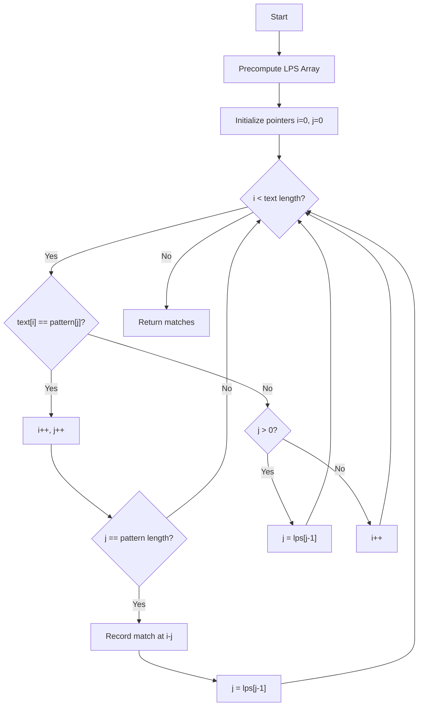

# Pattern Matching

## Introduction

Pattern matching is a fundamental concept in computer science that involves finding occurrences of a specified pattern within a larger dataset. While the term might sound abstract, you encounter pattern matching every day when you:

- Search for text in a document
- Look up a word in a dictionary
- Filter emails based on specific criteria
- Use find-and-replace functionality

In this tutorial, we'll explore various pattern matching algorithms, understand how they work, and learn when to apply them to solve real-world problems efficiently.

## Basic Concepts

At its core, pattern matching answers a simple question: "Does this pattern exist within this data?" The pattern could be a string, a regular expression, or even a complex data structure.

Let's start with the most common scenario: finding a string within another string.

### Naive String Matching

The simplest approach is to check every possible position in the text where the pattern might occur.

```javascript
function naiveStringMatch(text, pattern) {
  const matches = [];
  const textLength = text.length;
  const patternLength = pattern.length;
  
  // Check each possible starting position in the text
  for (let i = 0; i <= textLength - patternLength; i++) {
    let j;
    
    // Check if pattern matches at current position
    for (j = 0; j < patternLength; j++) {
      if (text[i + j] !== pattern[j]) {
        break;
      }
    }
    
    // If we completed the inner loop, we found a match
    if (j === patternLength) {
      matches.push(i);
    }
  }
  
  return matches;
}

// Example usage
const text = "ABABDABACDABABCABAB";
const pattern = "ABABC";
const matches = naiveStringMatch(text, pattern);
console.log(`Pattern found at positions: ${matches.join(', ')}`);
// Output: Pattern found at positions: 10
```

**Time Complexity**: O((n-m+1) × m) where n is the length of the text and m is the length of the pattern.

While the naive approach works for small texts, it quickly becomes inefficient for larger inputs. This is where advanced algorithms come in.

## Advanced Pattern Matching Algorithms

### Knuth-Morris-Pratt (KMP) Algorithm

The KMP algorithm improves upon the naive approach by avoiding redundant comparisons. It uses a preprocessed array (often called the "failure function" or "LPS table") to skip characters that we already know will match.

```javascript
function kmpSearch(text, pattern) {
  const matches = [];
  const n = text.length;
  const m = pattern.length;
  
  // Edge case: empty pattern matches at every position
  if (m === 0) {
    for (let i = 0; i <= n; i++) {
      matches.push(i);
    }
    return matches;
  }
  
  // Preprocess: compute the LPS (Longest Prefix Suffix) array
  const lps = computeLPSArray(pattern);
  
  let i = 0; // index for text
  let j = 0; // index for pattern
  
  while (i < n) {
    // Current characters match
    if (pattern[j] === text[i]) {
      i++;
      j++;
    }
    
    // Found a complete match
    if (j === m) {
      matches.push(i - j);
      j = lps[j - 1]; // Look for the next match
    } 
    // Mismatch after some matches
    else if (i < n && pattern[j] !== text[i]) {
      if (j !== 0) {
        j = lps[j - 1]; // Use the LPS value to skip characters
      } else {
        i++;
      }
    }
  }
  
  return matches;
}

function computeLPSArray(pattern) {
  const m = pattern.length;
  const lps = new Array(m).fill(0);
  
  let len = 0;
  let i = 1;
  
  while (i < m) {
    if (pattern[i] === pattern[len]) {
      len++;
      lps[i] = len;
      i++;
    } else {
      if (len !== 0) {
        len = lps[len - 1];
      } else {
        lps[i] = 0;
        i++;
      }
    }
  }
  
  return lps;
}

// Example usage
const text = "ABABDABACDABABCABAB";
const pattern = "ABABC";
const kmpMatches = kmpSearch(text, pattern);
console.log(`KMP found pattern at positions: ${kmpMatches.join(', ')}`);
// Output: KMP found pattern at positions: 10
```

**Time Complexity**: O(n + m) where n is the length of the text and m is the length of the pattern.

The key insight of KMP is that when a mismatch occurs, we don't need to restart from the beginning of the pattern. The LPS array tells us how many characters we can skip.

### Boyer-Moore Algorithm

Boyer-Moore is often faster than KMP in practice because it can skip multiple characters at once. It uses two heuristics:

1. **Bad Character Heuristic**: When a mismatch occurs, shift the pattern so that the mismatched character in the text aligns with its rightmost occurrence in the pattern.
2. **Good Suffix Heuristic**: Shift the pattern so that the matching suffix aligns with its next occurrence in the pattern.

```javascript
function boyerMooreSearch(text, pattern) {
  const matches = [];
  const n = text.length;
  const m = pattern.length;
  
  // Precompute bad character shifts
  const badChar = precomputeBadChar(pattern);
  
  let s = 0; // s is the shift of the pattern with respect to text
  
  while (s <= (n - m)) {
    let j = m - 1;
    
    // Keep checking characters from right to left
    while (j >= 0 && pattern[j] === text[s + j]) {
      j--;
    }
    
    // Pattern found
    if (j < 0) {
      matches.push(s);
      // Move pattern to align with the next possible match
      s += (s + m < n) ? m - badChar[text.charCodeAt(s + m)] : 1;
    } else {
      // Bad character rule: shift pattern to align with bad character
      const badCharShift = Math.max(1, j - badChar[text.charCodeAt(s + j)]);
      s += badCharShift;
    }
  }
  
  return matches;
}

function precomputeBadChar(pattern) {
  const badChar = new Array(256).fill(-1);
  const m = pattern.length;
  
  // Store the rightmost position of each character
  for (let i = 0; i < m; i++) {
    badChar[pattern.charCodeAt(i)] = i;
  }
  
  return badChar;
}

// Example usage
const text = "ABABDABACDABABCABAB";
const pattern = "ABABC";
const bmMatches = boyerMooreSearch(text, pattern);
console.log(`Boyer-Moore found pattern at positions: ${bmMatches.join(', ')}`);
// Output: Boyer-Moore found pattern at positions: 10
```

**Time Complexity**: 
- Best Case: O(n/m)
- Worst Case: O(n×m)
- Average Case: O(n)

Boyer-Moore performs best when the pattern is long and the alphabet is large, making it particularly effective for natural language processing.

## Regular Expressions

Regular expressions (regex) provide a powerful way to describe complex patterns using a specialized syntax.

```javascript
// Simple regex pattern
const emailPattern = /^[a-zA-Z0-9._%+-]+@[a-zA-Z0-9.-]+\.[a-zA-Z]{2,}$/;

// Testing emails
const validEmail = "user@example.com";
const invalidEmail = "invalid-email";

console.log(`${validEmail} is valid: ${emailPattern.test(validEmail)}`);
// Output: user@example.com is valid: true

console.log(`${invalidEmail} is valid: ${emailPattern.test(invalidEmail)}`);
// Output: invalid-email is valid: false
```

Regular expressions are implemented using specialized pattern matching algorithms, often variants of finite automata.

### When to use regex vs. specialized algorithms

- **Use regex** for:
  - Simple pattern matching tasks
  - When the pattern structure is complex but follows standard rules
  - When readability is more important than performance

- **Use specialized algorithms** for:
  - Performance-critical applications
  - When searching for simple strings in very large texts
  - When you need precise control over the matching behavior

## Pattern Matching Visualization

Let's visualize how the KMP algorithm works:



## Real-World Applications

### 1. Text Editors and Search Functionality

When you use Ctrl+F to find text in a document, pattern matching algorithms power this functionality. Modern text editors often use variants of Boyer-Moore for efficiency.

### 2. Bioinformatics

Pattern matching is crucial in DNA sequence analysis. Scientists need to locate specific gene sequences within the genome, which involves finding patterns in extremely long strings.

```javascript
// Simplified example of DNA pattern matching
function findGeneSequence(genome, targetSequence) {
  const matches = boyerMooreSearch(genome, targetSequence);
  return matches.length > 0 ? `Gene found at positions ${matches.join(', ')}` : 'Gene not found';
}

// Example (simplified)
const genome = "ACGTACGTACGTTGCAACGTACGTACGTTGCA";
const geneToFind = "ACGTTGCA";
console.log(findGeneSequence(genome, geneToFind));
// Output: Gene found at positions 8, 24
```

### 3. Data Mining and Analysis

Pattern matching helps identify trends, anomalies, or specific patterns in large datasets:

```javascript
// Detecting a specific purchase pattern in transaction data
function detectPurchasePattern(transactions, pattern) {
  let matches = 0;
  
  for (let i = 0; i <= transactions.length - pattern.length; i++) {
    let isMatch = true;
    
    for (let j = 0; j < pattern.length; j++) {
      if (transactions[i + j].category !== pattern[j]) {
        isMatch = false;
        break;
      }
    }
    
    if (isMatch) matches++;
  }
  
  return matches;
}

// Example: Find how many times a customer bought groceries, followed by gas, followed by electronics
const transactions = [
  { id: 1, category: 'groceries' },
  { id: 2, category: 'gas' },
  { id: 3, category: 'electronics' },
  { id: 4, category: 'clothes' },
  { id: 5, category: 'groceries' },
  { id: 6, category: 'gas' },
  { id: 7, category: 'electronics' }
];

const pattern = ['groceries', 'gas', 'electronics'];
const patternCount = detectPurchasePattern(transactions, pattern);
console.log(`Purchase pattern occurred ${patternCount} times`);
// Output: Purchase pattern occurred 2 times
```

### 4. Spam Filters and Security Applications

Email filters use pattern matching to detect spam messages by looking for specific patterns of words or structures that indicate unwanted content.

```javascript
function isSpam(email) {
  // Simplified spam patterns
  const spamPatterns = [
    /buy now/i,
    /free money/i,
    /lottery winner/i,
    /viagra/i,
    /\$\d+ million/i
  ];
  
  for (const pattern of spamPatterns) {
    if (pattern.test(email)) {
      return true;
    }
  }
  
  return false;
}

const email1 = "Hello, I wanted to discuss the project timeline.";
const email2 = "CONGRATULATIONS! You are our lottery winner! Claim your $5 million prize now!";

console.log(`Email 1 is spam: ${isSpam(email1)}`);  // false
console.log(`Email 2 is spam: ${isSpam(email2)}`);  // true
```

## Choosing the Right Algorithm

Here's a quick guide to help you choose the appropriate pattern matching algorithm:

| Algorithm | Best Use Case | Time Complexity | Space Complexity |
|-----------|---------------|-----------------|------------------|
| Naive     | Simple cases with short patterns | O((n-m+1) × m) | O(1) |
| KMP       | When pattern has repeated subpatterns | O(n + m) | O(m) |
| Boyer-Moore | Long patterns, large alphabet | O(n) average, O(n×m) worst | O(m + alphabet size) |
| Regex     | Complex pattern structures | Varies | Varies |

## Performance Comparison

Let's compare the performance of different algorithms on a sample text:

```javascript
function comparePerformance(text, pattern) {
  console.time('Naive');
  const naiveMatches = naiveStringMatch(text, pattern);
  console.timeEnd('Naive');
  
  console.time('KMP');
  const kmpMatches = kmpSearch(text, pattern);
  console.timeEnd('KMP');
  
  console.time('Boyer-Moore');
  const bmMatches = boyerMooreSearch(text, pattern);
  console.timeEnd('Boyer-Moore');
  
  console.log(`Matches found: ${naiveMatches.length}`);
  console.log(`Positions: ${naiveMatches.join(', ')}`);
}

// Create a larger test case
const longText = "ABABDABACDABABCABAB".repeat(1000);
const pattern = "ABABC";

comparePerformance(longText, pattern);
// Sample output (timing will vary):
// Naive: 15.231ms
// KMP: 4.758ms
// Boyer-Moore: 1.825ms
// Matches found: 1000
// Positions: 10, 30, 50, ...
```

## Summary

Pattern matching is a versatile tool in a programmer's arsenal with applications ranging from simple text search to complex data analysis. We've covered:

1. Basic naive string matching
2. Advanced algorithms like KMP and Boyer-Moore
3. Regular expressions for complex pattern description
4. Real-world applications in various domains
5. Performance considerations and algorithm selection

Understanding when and how to use these algorithms will help you solve problems more efficiently and write better code.

## Exercises

1. Implement a case-insensitive version of the naive string matching algorithm.
2. Modify the KMP algorithm to find the longest repeated substring in a text.
3. Create a simple spell checker using pattern matching techniques.
4. Implement a function that highlights all occurrences of a pattern in a text (consider how you would handle overlapping matches).
5. Use pattern matching to detect palindromes in a text.

## Additional Resources

- [Algorithms by Robert Sedgewick and Kevin Wayne](https://algs4.cs.princeton.edu/)
- [Regular Expressions Documentation](https://developer.mozilla.org/en-US/docs/Web/JavaScript/Guide/Regular_Expressions)
- [Visualizing String Matching Algorithms](https://www.cs.usfca.edu/~galles/visualization/PatternMatch.html)
- Online practice platforms like LeetCode and HackerRank have many pattern matching problems to solve

Happy coding!