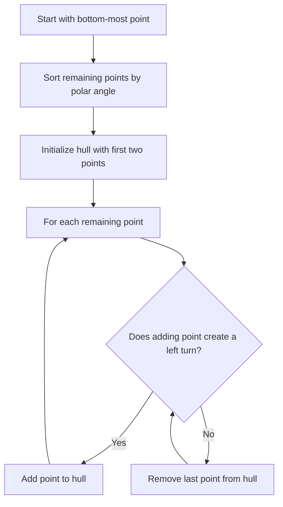
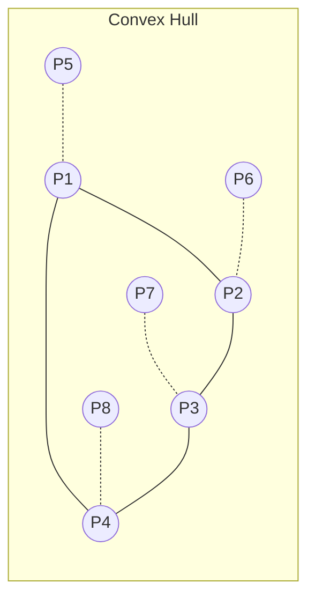
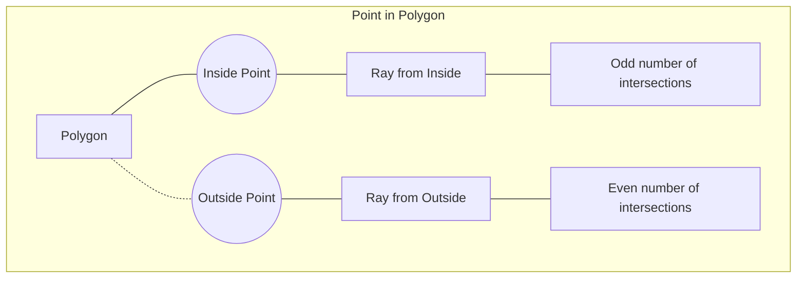

# Computational Geometry

## Introduction

Computational geometry is a branch of computer science that focuses on developing efficient algorithms for solving geometric problems. These problems involve points, lines, polygons, and other geometric objects in 2D and 3D spaces. Computational geometry forms the foundation for many applications like computer graphics, robotics, geographic information systems (GIS), game development, and computer-aided design (CAD).

In this tutorial, we'll explore the fundamental concepts of computational geometry, key algorithms, and their practical applications. While this is an advanced topic, we'll break it down into digestible parts for beginners.

## Basic Geometric Primitives

Before diving into algorithms, let's understand the basic geometric primitives we'll be working with:

- **Point**: A location in space, typically represented as coordinates (x, y) in 2D
- **Line Segment**: A straight line connecting two points
- **Vector**: A quantity with both magnitude and direction
- **Polygon**: A closed shape made up of line segments
- **Convex Hull**: The smallest convex polygon that contains all points in a set

## Point Representation

In code, we typically represent a point as a class or struct:

```python
class Point:
    def __init__(self, x, y):
        self.x = x
        self.y = y
        
    def __str__(self):
        return f"({self.x}, {self.y})"
```

## Core Algorithms in Computational Geometry

### 1. Determining if points are collinear

Three or more points are collinear if they all lie on the same straight line. We can check this using the area of the triangle formed by the points - if the area is zero, the points are collinear.

```python
def are_collinear(p1, p2, p3):
    # Calculate the area of the triangle using cross product
    area = abs((p1.x * (p2.y - p3.y) + 
                p2.x * (p3.y - p1.y) + 
                p3.x * (p1.y - p2.y)) / 2.0)
    
    # If area is close to zero, points are collinear
    return abs(area) < 1e-10  # Using epsilon for floating-point comparison

# Example usage
p1 = Point(1, 1)
p2 = Point(2, 2)
p3 = Point(3, 3)
print(f"Are points {p1}, {p2}, {p3} collinear? {are_collinear(p1, p2, p3)}")

# Output: Are points (1, 1), (2, 2), (3, 3) collinear? True
```

### 2. Convex Hull Algorithm (Graham Scan)

The convex hull of a set of points is the smallest convex polygon that contains all the points. One of the most popular algorithms for finding the convex hull is Graham Scan.

Here's a step-by-step implementation:

```python
def orientation(p, q, r):
    """
    Returns the orientation of triplet (p, q, r).
    0 --> Collinear
    1 --> Clockwise
    2 --> Counterclockwise
    """
    val = (q.y - p.y) * (r.x - q.x) - (q.x - p.x) * (r.y - q.y)
    
    if val == 0:
        return 0  # Collinear
    return 1 if val > 0 else 2  # Clockwise or Counterclockwise

def graham_scan(points):
    n = len(points)
    
    # If less than 3 points, cannot form a convex hull
    if n < 3:
        return points
    
    # Find the bottom-most point (or leftmost in case of tie)
    bottom_most = min(points, key=lambda p: (p.y, p.x))
    
    # Sort points based on polar angle with respect to bottom_most
    def polar_angle(p):
        return math.atan2(p.y - bottom_most.y, p.x - bottom_most.x)
    
    sorted_points = sorted(points, key=polar_angle)
    
    # Initialize stack for convex hull points
    hull = [sorted_points[0], sorted_points[1]]
    
    # Process remaining points
    for i in range(2, n):
        # Keep removing top element while the angle formed makes a non-left turn
        while len(hull) > 1 and orientation(hull[-2], hull[-1], sorted_points[i]) != 2:
            hull.pop()
        hull.append(sorted_points[i])
    
    return hull

# Example usage
import math
points = [Point(0, 0), Point(1, 1), Point(2, 2), Point(4, 4), 
          Point(0, 3), Point(1, 2), Point(3, 1), Point(3, 3)]
hull = graham_scan(points)
print("Convex Hull points:")
for point in hull:
    print(point)

# Output:
# Convex Hull points:
# (0, 0)
# (3, 1)
# (4, 4)
# (0, 3)
```

Let's visualize how Graham Scan works:



### 3. Line Intersection

Determining if two line segments intersect is a fundamental operation in computational geometry.

```python
class LineSegment:
    def __init__(self, p1, p2):
        self.p1 = p1
        self.p2 = p2

def do_intersect(line1, line2):
    # Find the four orientations needed for general and special cases
    o1 = orientation(line1.p1, line1.p2, line2.p1)
    o2 = orientation(line1.p1, line1.p2, line2.p2)
    o3 = orientation(line2.p1, line2.p2, line1.p1)
    o4 = orientation(line2.p1, line2.p2, line1.p2)
    
    # General case
    if o1 != o2 and o3 != o4:
        return True
    
    # Special Cases (collinear)
    if o1 == 0 and on_segment(line1.p1, line2.p1, line1.p2):
        return True
    if o2 == 0 and on_segment(line1.p1, line2.p2, line1.p2):
        return True
    if o3 == 0 and on_segment(line2.p1, line1.p1, line2.p2):
        return True
    if o4 == 0 and on_segment(line2.p1, line1.p2, line2.p2):
        return True
    
    return False

def on_segment(p, q, r):
    """
    Returns true if point q lies on line segment 'pr'
    """
    return (q.x <= max(p.x, r.x) and q.x >= min(p.x, r.x) and
            q.y <= max(p.y, r.y) and q.y >= min(p.y, r.y))

# Example usage
l1 = LineSegment(Point(1, 1), Point(5, 5))
l2 = LineSegment(Point(1, 5), Point(5, 1))
print(f"Do line segments intersect? {do_intersect(l1, l2)}")

# Output: Do line segments intersect? True
```

### 4. Point in Polygon (Ray Casting Algorithm)

Determining whether a point lies inside a polygon is another important problem in computational geometry.

```python
def is_point_in_polygon(point, polygon):
    """
    Returns True if the point is inside the polygon, False otherwise.
    Uses the ray casting algorithm.
    """
    n = len(polygon)
    if n < 3:  # Not a polygon
        return False
    
    # Count intersections of a ray from point to the right
    count = 0
    for i in range(n):
        j = (i + 1) % n
        
        # Check if the ray intersects with the edge
        if ((polygon[i].y > point.y) != (polygon[j].y > point.y) and
            point.x < polygon[i].x + (polygon[j].x - polygon[i].x) * 
            (point.y - polygon[i].y) / (polygon[j].y - polygon[i].y)):
            count += 1
    
    # If count is odd, point is inside the polygon
    return count % 2 == 1

# Example usage
polygon = [Point(0, 0), Point(5, 0), Point(5, 5), Point(0, 5)]
test_point1 = Point(2, 2)
test_point2 = Point(6, 6)

print(f"Is point {test_point1} inside the polygon? {is_point_in_polygon(test_point1, polygon)}")
print(f"Is point {test_point2} inside the polygon? {is_point_in_polygon(test_point2, polygon)}")

# Output:
# Is point (2, 2) inside the polygon? True
# Is point (6, 6) inside the polygon? False
```

### 5. Computing the Area of a Polygon

We can compute the area of a simple polygon (without self-intersections) using the Shoelace formula:

```python
def polygon_area(vertices):
    """
    Calculate the area of a polygon using the Shoelace formula.
    
    Args:
        vertices: List of Point objects representing the vertices of the polygon
    
    Returns:
        The area of the polygon
    """
    n = len(vertices)
    if n < 3:
        return 0.0
    
    # Initialize area
    area = 0.0
    
    # Calculate area using Shoelace formula
    for i in range(n):
        j = (i + 1) % n
        area += vertices[i].x * vertices[j].y
        area -= vertices[j].x * vertices[i].y
    
    # Take absolute value and divide by 2
    return abs(area) / 2.0

# Example usage
square = [Point(0, 0), Point(0, 4), Point(4, 4), Point(4, 0)]
print(f"Area of square: {polygon_area(square)}")

# Output: Area of square: 16.0
```

## Real-World Applications

### 1. Collision Detection in Games

Game developers use computational geometry algorithms to detect when game objects collide with each other. For example, checking if a bullet has hit a target or if a character has touched an obstacle.

```python
def check_collision(object1_vertices, object2_vertices):
    """
    Simple collision detection using the Separating Axis Theorem (SAT).
    This is a simplified version for convex polygons.
    """
    # For a complete implementation, you'd need to check projections
    # on all axes of both polygons.
    
    # For demonstration, we'll just check if any point of object1 is inside object2
    for point in object1_vertices:
        if is_point_in_polygon(point, object2_vertices):
            return True
            
    # And vice versa
    for point in object2_vertices:
        if is_point_in_polygon(point, object1_vertices):
            return True
    
    return False

# Example: Player and enemy bounding boxes
player = [Point(1, 1), Point(3, 1), Point(3, 3), Point(1, 3)]
enemy = [Point(2, 2), Point(4, 2), Point(4, 4), Point(2, 4)]
print(f"Collision detected: {check_collision(player, enemy)}")

# Output: Collision detected: True
```

### 2. Geographic Information Systems (GIS)

GIS applications use computational geometry to analyze spatial data, like calculating the area of land parcels or finding all points of interest within a certain region.

```python
def find_points_in_region(points_of_interest, region_polygon):
    """
    Find all points of interest that lie within a region.
    
    Args:
        points_of_interest: List of Point objects with additional data
        region_polygon: List of Point objects representing the region boundary
    
    Returns:
        List of points that are inside the region
    """
    return [poi for poi in points_of_interest if is_point_in_polygon(poi, region_polygon)]

# Example usage for a city map
class PointOfInterest(Point):
    def __init__(self, x, y, name, category):
        super().__init__(x, y)
        self.name = name
        self.category = category
    
    def __str__(self):
        return f"{self.name} at ({self.x}, {self.y})"

# Points of interest in a city
poi_list = [
    PointOfInterest(2, 3, "Central Park", "Park"),
    PointOfInterest(5, 6, "Main Library", "Education"),
    PointOfInterest(1, 7, "City Hall", "Government"),
    PointOfInterest(8, 2, "Shopping Mall", "Commercial")
]

# Downtown area polygon
downtown = [Point(0, 0), Point(0, 5), Point(5, 5), Point(5, 0)]

# Find points in downtown
downtown_pois = find_points_in_region(poi_list, downtown)
print("Points of interest in downtown:")
for poi in downtown_pois:
    print(poi)

# Output:
# Points of interest in downtown:
# Central Park at (2, 3)
```

### 3. Path Planning for Robotics

Robots use computational geometry to plan paths through environments with obstacles.

```python
def is_path_clear(start, end, obstacles):
    """
    Check if a straight path from start to end is clear of obstacles.
    
    Args:
        start: Point object representing start position
        end: Point object representing end position
        obstacles: List of polygons, each polygon is a list of Point objects
    
    Returns:
        True if path is clear, False if path intersects with any obstacle
    """
    path = LineSegment(start, end)
    
    for obstacle in obstacles:
        n = len(obstacle)
        for i in range(n):
            j = (i + 1) % n
            edge = LineSegment(obstacle[i], obstacle[j])
            if do_intersect(path, edge):
                return False
    
    return True

# Example: Robot navigation
start_pos = Point(1, 1)
goal_pos = Point(8, 8)
obstacles = [
    [Point(3, 2), Point(5, 2), Point(5, 6), Point(3, 6)],  # Rectangular obstacle
    [Point(7, 3), Point(9, 3), Point(8, 5)]  # Triangular obstacle
]

print(f"Is path from {start_pos} to {goal_pos} clear? {is_path_clear(start_pos, goal_pos, obstacles)}")

# Output: Is path from (1, 1) to (8, 8) clear? False
```

## Visualizing Computational Geometry Algorithms

Let's visualize some of the key concepts:





## Summary

Computational geometry provides powerful algorithms for solving geometric problems in computer science. In this tutorial, we covered:

1. Basic geometric primitives and their representation
2. Fundamental algorithms:
   - Checking if points are collinear
   - Computing the convex hull (Graham Scan)
   - Detecting line segment intersections
   - Determining if a point is inside a polygon
   - Computing the area of a polygon

3. Real-world applications:
   - Collision detection in games
   - Geographic information systems
   - Path planning for robotics

These algorithms form the foundation for many advanced applications in computer graphics, computer vision, robotics, and more.

## Exercises

1. Implement a function to find the closest pair of points from a set of points.
2. Modify the convex hull algorithm to handle collinear points correctly.
3. Implement an algorithm to triangulate a simple polygon.
4. Create a function to find the largest empty circle within a set of points.
5. Implement the Delaunay triangulation algorithm.

## Additional Resources

- "Computational Geometry: Algorithms and Applications" by Mark de Berg, Otfried Cheong, Marc van Kreveld, and Mark Overmars
- [Computational Geometry Tutorial on GeeksforGeeks](https://www.geeksforgeeks.org/computational-geometry-introduction/)
- [CGAL: The Computational Geometry Algorithms Library](https://www.cgal.org/)

These resources will help you dive deeper into computational geometry and explore more advanced algorithms and applications.

Happy coding!