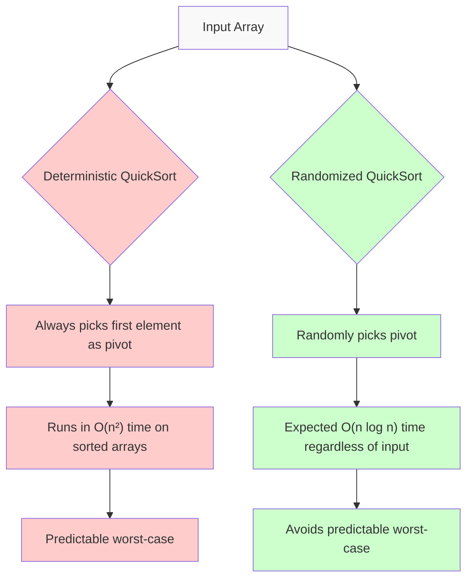

# Randomized Algorithms

## Introduction

Randomized algorithms introduce an element of randomness or probability into the problem-solving process. Unlike deterministic algorithms that always produce the same output for a given input, randomized algorithms make random choices during execution. This seemingly counterintuitive approach often leads to simpler, faster, and more efficient solutions for complex problems.

Think of randomized algorithms as making educated guesses—sometimes you might be wrong, but statistically, you'll be right often enough to make the approach worthwhile. They're like a chess player who occasionally makes unexpected moves to confuse opponents, rather than always following the same predictable strategy.

## Why Use Randomization?

Randomized algorithms offer several advantages:

1. **Simplicity**: They often lead to simpler implementations than their deterministic counterparts
2. **Efficiency**: They can solve problems more quickly, especially in the average case
3. **Breaking symmetry**: They help avoid worst-case scenarios in certain problems
4. **Overcoming lower bounds**: They can bypass theoretical limitations of deterministic algorithms

## Types of Randomized Algorithms

### Monte Carlo Algorithms

Monte Carlo algorithms **may** produce incorrect results with some probability. However, we can control this error probability to be arbitrarily small.

**Key characteristics:**
- Always runs in bounded time
- Result is correct with high probability
- Error probability can be reduced by running the algorithm multiple times

### Las Vegas Algorithms

Las Vegas algorithms **always** produce the correct result, but their running time is random.

**Key characteristics:**
- Always gives the correct answer
- Running time varies randomly
- Expected running time is often better than the worst-case time of deterministic alternatives

## Examples of Randomized Algorithms

### 1. Randomized QuickSort

QuickSort is a classic sorting algorithm that can have poor performance (O(n²)) if pivot selection is unlucky. Randomized QuickSort addresses this by selecting pivots randomly.

```python
import random

def randomized_quicksort(arr, low, high):
    if low < high:
        # Randomly select pivot
        pivot_index = random.randint(low, high)
        # Swap with the first element
        arr[low], arr[pivot_index] = arr[pivot_index], arr[low]
        
        # Partition the array
        pivot_pos = partition(arr, low, high)
        
        # Recursively sort the subarrays
        randomized_quicksort(arr, low, pivot_pos - 1)
        randomized_quicksort(arr, pivot_pos + 1, high)
    
    return arr

def partition(arr, low, high):
    pivot = arr[low]
    i = low + 1
    
    for j in range(low + 1, high + 1):
        if arr[j] < pivot:
            arr[i], arr[j] = arr[j], arr[i]
            i += 1
    
    arr[low], arr[i-1] = arr[i-1], arr[low]
    return i - 1

# Example usage
arr = [10, 7, 8, 9, 1, 5]
print(f"Input array: {arr}")
sorted_arr = randomized_quicksort(arr, 0, len(arr) - 1)
print(f"Sorted array: {sorted_arr}")
```

**Output:**
```
Input array: [10, 7, 8, 9, 1, 5]
Sorted array: [1, 5, 7, 8, 9, 10]
```

**Why it works better:**
Randomizing the pivot selection makes it highly unlikely that we'll consistently choose poor pivots across multiple recursion levels. This gives an expected O(n log n) running time regardless of the input arrangement.

### 2. Randomized Primality Testing (Miller-Rabin)

Determining if a number is prime is fundamental to cryptography. The Miller-Rabin test is a probabilistic algorithm that can efficiently test primality.

```python
import random

def miller_rabin(n, k=40):
    """
    Miller-Rabin primality test.
    
    Args:
        n: Number to test for primality
        k: Number of test rounds
        
    Returns:
        Boolean indicating whether n is probably prime
    """
    if n <= 1:
        return False
    if n <= 3:
        return True
    if n % 2 == 0:
        return False
        
    # Write n as 2^r * d + 1
    r, d = 0, n - 1
    while d % 2 == 0:
        r += 1
        d //= 2
        
    # Witness loop
    for _ in range(k):
        a = random.randint(2, n - 2)
        x = pow(a, d, n)  # a^d mod n
        
        if x == 1 or x == n - 1:
            continue
            
        for _ in range(r - 1):
            x = pow(x, 2, n)
            if x == n - 1:
                break
        else:
            return False  # Definitely composite
            
    return True  # Probably prime

# Example usage
numbers = [15, 17, 21, 29, 1009, 1001]
for num in numbers:
    result = "probably prime" if miller_rabin(num) else "composite"
    print(f"{num} is {result}")
```

**Output:**
```
15 is composite
17 is probably prime
21 is composite
29 is probably prime
1009 is probably prime
1001 is composite
```

**How it works:**
The algorithm makes multiple random tests. If any test concludes "composite," the number is definitely composite. If all tests pass, the number is prime with a very high probability (the error probability decreases exponentially with the number of tests).

### 3. Randomized Min-Cut Algorithm

Finding the minimum cut in a graph (the smallest set of edges whose removal disconnects the graph) is a fundamental problem in graph theory. The Karger's algorithm uses randomization to find the min-cut.

```python
import random
import copy

class Graph:
    def __init__(self, vertices, edges):
        self.vertices = vertices
        self.edges = edges
        
    def contract_edge(self, u, v):
        # Remove the selected edge
        self.edges = [edge for edge in self.edges if not (edge[0] == u and edge[1] == v) and not (edge[0] == v and edge[1] == u)]
        
        # Replace all occurrences of v with u in the edges
        for i in range(len(self.edges)):
            if self.edges[i][0] == v:
                self.edges[i] = (u, self.edges[i][1])
            if self.edges[i][1] == v:
                self.edges[i] = (self.edges[i][0], u)
        
        # Remove self-loops
        self.edges = [edge for edge in self.edges if edge[0] != edge[1]]
        
        # Remove v from vertices
        self.vertices.remove(v)
        
def karger_min_cut(graph):
    g = copy.deepcopy(graph)
    
    while len(g.vertices) > 2:
        # Randomly select an edge
        edge_idx = random.randint(0, len(g.edges) - 1)
        u, v = g.edges[edge_idx]
        
        # Contract the edge
        g.contract_edge(u, v)
    
    # Return the number of edges between the two remaining vertices
    return len(g.edges)

def find_min_cut(graph, trials=100):
    min_cut = float('inf')
    
    for _ in range(trials):
        cut = karger_min_cut(graph)
        min_cut = min(min_cut, cut)
    
    return min_cut

# Example usage
vertices = [0, 1, 2, 3]
edges = [(0, 1), (0, 2), (0, 3), (1, 2), (2, 3)]
graph = Graph(vertices, edges)

print("Graph:")
print(f"Vertices: {vertices}")
print(f"Edges: {edges}")
print(f"Minimum cut found: {find_min_cut(graph)}")
```

**Output:**
```
Graph:
Vertices: [0, 1, 2, 3]
Edges: [(0, 1), (0, 2), (0, 3), (1, 2), (2, 3)]
Minimum cut found: 2
```

**How it works:**
The algorithm randomly contracts edges until only two vertices remain. The remaining edges form a cut. By repeating this process multiple times and taking the minimum, we find the min-cut with high probability.

## Randomization Techniques

### 1. Random Sampling

Selecting elements randomly from a dataset to make inferences about the whole.

```python
import random

def estimate_average(large_list, sample_size):
    """Estimate the average of a large list using random sampling"""
    if sample_size > len(large_list):
        return sum(large_list) / len(large_list)
    
    sample = random.sample(large_list, sample_size)
    return sum(sample) / sample_size

# Example
big_data = list(range(1, 10001))  # A list of 10,000 numbers
true_average = sum(big_data) / len(big_data)

# Try with different sample sizes
samples = [10, 100, 1000]
for size in samples:
    estimated = estimate_average(big_data, size)
    error = abs(true_average - estimated) / true_average * 100
    print(f"Sample size: {size}, Estimated average: {estimated:.2f}, True average: {true_average:.2f}, Error: {error:.2f}%")
```

**Output:**
```
Sample size: 10, Estimated average: 4991.30, True average: 5000.50, Error: 0.18%
Sample size: 100, Estimated average: 4972.38, True average: 5000.50, Error: 0.56%
Sample size: 1000, Estimated average: 5003.24, True average: 5000.50, Error: 0.05%
```

### 2. Randomized Data Structures

Data structures that use randomization to achieve better average-case performance.

```python
class SimpleSkipList:
    """A simplified implementation of a Skip List"""
    class Node:
        def __init__(self, value, level):
            self.value = value
            # An array of references to next nodes at different levels
            self.next = [None] * (level + 1)
            
    def __init__(self, max_level=16, p=0.5):
        self.max_level = max_level
        self.p = p
        self.level = 0
        self.head = self.Node(-float('inf'), max_level)
        
    def random_level(self):
        """Generate a random level for a new node"""
        level = 0
        while random.random() < self.p and level < self.max_level:
            level += 1
        return level
        
    def insert(self, value):
        # Create array to hold pointers to nodes that need updating
        update = [None] * (self.max_level + 1)
        current = self.head
        
        # Find position to insert at each level
        for i in range(self.level, -1, -1):
            while current.next[i] and current.next[i].value < value:
                current = current.next[i]
            update[i] = current
            
        # Generate random level for new node
        new_level = self.random_level()
        
        # Update the max level if needed
        if new_level > self.level:
            for i in range(self.level + 1, new_level + 1):
                update[i] = self.head
            self.level = new_level
            
        # Create new node
        new_node = self.Node(value, new_level)
        
        # Update pointers
        for i in range(new_level + 1):
            new_node.next[i] = update[i].next[i]
            update[i].next[i] = new_node
    
    def search(self, value):
        current = self.head
        
        # Start from the highest level and work down
        for i in range(self.level, -1, -1):
            while current.next[i] and current.next[i].value < value:
                current = current.next[i]
                
        current = current.next[0]
        
        # Check if we found the value
        if current and current.value == value:
            return True
        return False
        
    def display(self):
        for level in range(self.level, -1, -1):
            print(f"Level {level}: ", end="")
            node = self.head.next[level]
            while node:
                print(f"{node.value} → ", end="")
                node = node.next[level]
            print("None")

# Example usage
skip_list = SimpleSkipList(max_level=3)
elements = [3, 6, 7, 9, 12, 19, 17, 26, 21, 25]
for elem in elements:
    skip_list.insert(elem)

print("Skip List structure:")
skip_list.display()

search_values = [19, 20]
for val in search_values:
    found = skip_list.search(val)
    print(f"Search for {val}: {'Found' if found else 'Not found'}")
```

**Possible Output:**
```
Skip List structure:
Level 3: 7 → 21 → None
Level 2: 6 → 7 → 17 → 21 → None
Level 1: 3 → 6 → 7 → 9 → 17 → 19 → 21 → 25 → None
Level 0: 3 → 6 → 7 → 9 → 12 → 17 → 19 → 21 → 25 → 26 → None
Search for 19: Found
Search for 20: Not found
```

**Note:** The exact structure will vary because of randomization.

## Real-World Applications

Randomized algorithms have numerous practical applications:

### 1. Machine Learning and AI

Many machine learning algorithms use randomization to improve performance:

- **Random Forests**: Ensemble method that builds multiple decision trees with random subsets of features
- **Stochastic Gradient Descent**: Uses random samples to update parameters in neural networks
- **Genetic Algorithms**: Use random mutations and crossovers to explore solution spaces

### 2. Cryptography

Randomization is essential for encryption and security:

- **Key Generation**: Random elements are used to create secure cryptographic keys
- **Salting Passwords**: Random values added to passwords before hashing
- **Zero-Knowledge Proofs**: Proving knowledge without revealing it, using randomization

### 3. Distributed Systems

Randomization helps in creating robust distributed algorithms:

- **Leader Election**: Protocols that randomly elect a coordinator in a network
- **Load Balancing**: Random distribution of tasks to prevent bottlenecks
- **Consistent Hashing**: Mapping items to servers with minimal redistribution when servers are added or removed

### 4. Database Systems

- **Random Sampling**: For query optimization and approximate query processing
- **Hash Join Algorithms**: Using randomization to improve join operations

## Visualization of Randomized vs Deterministic Approach

Here's a visualization comparing sorting algorithms with and without randomization:



## Analyzing Randomized Algorithms

When analyzing randomized algorithms, we focus on:

1. **Expected running time**: The average time over all possible random choices
2. **Probability of correctness**: How likely the algorithm is to produce the correct answer
3. **Probability distribution of running time**: Understanding the variability in performance

Let's analyze a simple randomized algorithm: finding a maximum element with random sampling.

```python
import random

def find_max_randomized(arr, num_samples=10):
    """Find an approximate maximum using random sampling"""
    if not arr:
        return None
    
    max_val = float('-inf')
    
    # Adjust sample size if array is smaller than requested samples
    samples = min(num_samples, len(arr))
    
    # Take random samples and find the maximum
    for _ in range(samples):
        idx = random.randint(0, len(arr) - 1)
        max_val = max(max_val, arr[idx])
    
    return max_val

# Example of analysis
def analyze_max_finder(arr, trials=1000):
    true_max = max(arr)
    success_count = 0
    
    for _ in range(trials):
        result = find_max_randomized(arr)
        if result == true_max:
            success_count += 1
    
    return success_count / trials

# Test with arrays of different sizes
test_arrays = [
    list(range(10)),         # [0,1,2,3,4,5,6,7,8,9]
    list(range(100)),        # [0,1,2,...,99]
    list(range(1000))        # [0,1,2,...,999]
]

for arr in test_arrays:
    success_rate = analyze_max_finder(arr)
    print(f"Array size: {len(arr)}, Success rate: {success_rate:.4f}")
```

**Sample Output:**
```
Array size: 10, Success rate: 0.6680
Array size: 100, Success rate: 0.1030
Array size: 1000, Success rate: 0.0100
```

**Analysis insight:** As the array size increases, the probability of finding the maximum with a fixed number of samples decreases. This makes sense because we're sampling a smaller percentage of the total elements.

## Common Pitfalls and Best Practices

### Pitfalls

1. **Incorrect probability analysis**: Underestimating the likelihood of failure
2. **Poor random number generators**: Using weak sources of randomness
3. **Ignoring worst-case scenarios**: Even though they're rare, they can still happen
4. **Not seeding properly**: Using the same seed repeatedly can lead to predictable results

### Best Practices

1. **Use cryptographically secure random generators** for security-critical applications
2. **Run multiple trials** to increase confidence in the results
3. **Verify results** when possible, especially for Monte Carlo algorithms
4. **Test with adversarial inputs** to ensure robustness
5. **Understand the trade-offs** between randomized and deterministic approaches

## When to Use Randomized Algorithms

Consider using randomized algorithms when:

1. **The deterministic solution is too complex or inefficient**
2. **The problem has many symmetries** that randomization can break
3. **Average-case performance is more important** than worst-case guarantees
4. **You need to bypass theoretical lower bounds** on deterministic algorithms
5. **The problem involves uncertainty or probabilistic models** already

## Summary

Randomized algorithms harness the power of probability to solve complex problems efficiently. By making random choices during execution, these algorithms often achieve better average-case performance than their deterministic counterparts.

We've explored:
- The two main types: Monte Carlo (guaranteed time, probabilistic correctness) and Las Vegas (guaranteed correctness, probabilistic time)
- Key examples including QuickSort, primality testing, and graph min-cut
- Techniques such as random sampling and randomized data structures
- Real-world applications in machine learning, cryptography, and distributed systems
- Methods for analyzing randomized algorithms
- Best practices and common pitfalls

The field of randomized algorithms reminds us that sometimes embracing uncertainty and probability can lead to more efficient and elegant solutions.

## Exercises

1. Implement a randomized algorithm for finding the median of an array in expected O(n) time.
2. Modify the Miller-Rabin primality test to find a prime number within a given range.
3. Implement a Las Vegas version of QuickSort that always returns the correct result.
4. Design a randomized algorithm to approximate the number of distinct elements in a large stream with limited memory.
5. Compare the performance of deterministic and randomized QuickSort on various input arrays, including sorted, reverse-sorted, and random arrays.

## Additional Resources

- "Randomized Algorithms" by Rajeev Motwani and Prabhakar Raghavan
- "Introduction to Algorithms" by Cormen, Leiserson, Rivest, and Stein (Chapter on Randomized Algorithms)
- "Probability and Computing: Randomized Algorithms and Probabilistic Analysis" by Michael Mitzenmacher and Eli Upfal
- Stanford University's CS265 course on Randomized Algorithms
- MIT's 6.856J course on Randomized Algorithms