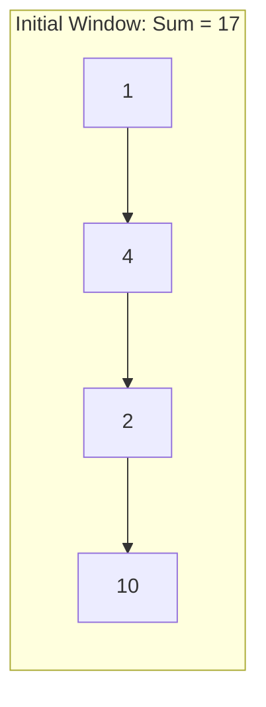
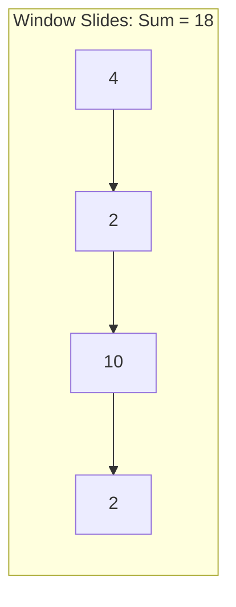

# Sliding Window Pattern

## Introduction

The Sliding Window pattern is a powerful technique used to efficiently process arrays, strings, or other sequential data structures. As the name suggests, it involves creating a "window" that slides through the data, allowing us to process subsets of data without redundant calculations.

This pattern is particularly useful when you need to keep track of a contiguous sequence of elements, such as finding the longest substring with unique characters or calculating the maximum sum of a subarray of a specific size.

## Why Use the Sliding Window Pattern?

The naive approach to solving problems involving subarrays or substrings often involves using nested loops, resulting in O(n²) time complexity. The sliding window technique optimizes this to O(n) time complexity in many cases, making it significantly more efficient for large datasets.

## Types of Sliding Window

There are two main types of sliding window approaches:

1. **Fixed-Size Window**: The window size remains constant throughout the traversal.
2. **Dynamic-Size Window**: The window size can grow or shrink based on certain conditions.

Let's explore both types with examples.

## Fixed-Size Window

In a fixed-size window approach, we maintain a window of a predefined size and slide it through the data one element at a time.

### Example Problem: Maximum Sum Subarray

**Problem**: Given an array of integers and a number k, find the maximum sum of a subarray of size k.

**Input**: 
- Array: [1, 4, 2, 10, 2, 3, 1, 0, 20]
- k: 4

**Output**: 24 (sum of [2, 10, 2, 10])

### Solution:

```javascript
function maxSubarraySum(arr, k) {
  // Check if array length is less than k
  if (arr.length < k) {
    return null;
  }
  
  // Calculate sum of first window
  let maxSum = 0;
  for (let i = 0; i < k; i++) {
    maxSum += arr[i];
  }
  
  // Initialize current sum with the first window's sum
  let currentSum = maxSum;
  
  // Slide the window and update maxSum
  for (let i = k; i < arr.length; i++) {
    // Add the next element and remove the first element of the previous window
    currentSum = currentSum + arr[i] - arr[i - k];
    // Update maxSum if currentSum is greater
    maxSum = Math.max(maxSum, currentSum);
  }
  
  return maxSum;
}

// Example usage
console.log(maxSubarraySum([1, 4, 2, 10, 2, 3, 1, 0, 20], 4)); // Output: 24
```

### How It Works:

Let's visualize the sliding window approach for our example:



Step 1: Calculate the sum of the first k elements (1 + 4 + 2 + 10 = 17).



Step 2: Slide the window by adding the next element (2) and removing the first element (1).
New sum = 17 - 1 + 2 = 18.

We continue this process, sliding the window one element at a time and keeping track of the maximum sum:

- Window [4, 2, 10, 2] = 18
- Window [2, 10, 2, 3] = 17
- Window [10, 2, 3, 1] = 16
- Window [2, 3, 1, 0] = 6
- Window [3, 1, 0, 20] = 24

The maximum sum is 24, which comes from the subarray [3, 1, 0, 20].

## Dynamic-Size Window

In the dynamic-size window approach, the window size changes based on specific conditions. This is useful when you don't know the window size beforehand.

### Example Problem: Longest Substring Without Repeating Characters

**Problem**: Given a string, find the length of the longest substring without repeating characters.

**Input**: "abcabcbb"

**Output**: 3 (The longest substring is "abc")

### Solution:

```javascript
function longestSubstringWithoutRepeats(str) {
  if (str.length === 0) return 0;
  
  let maxLength = 0;
  let start = 0;
  let charMap = {};
  
  for (let end = 0; end < str.length; end++) {
    const currentChar = str[end];
    
    // If the character is already in the window, update the start pointer
    if (charMap[currentChar] !== undefined && charMap[currentChar] >= start) {
      start = charMap[currentChar] + 1;
    }
    
    // Update the character position in the map
    charMap[currentChar] = end;
    
    // Update the maximum length
    maxLength = Math.max(maxLength, end - start + 1);
  }
  
  return maxLength;
}

// Example usage
console.log(longestSubstringWithoutRepeats("abcabcbb")); // Output: 3
console.log(longestSubstringWithoutRepeats("bbbbb")); // Output: 1
console.log(longestSubstringWithoutRepeats("pwwkew")); // Output: 3
```

### How It Works:

Let's visualize the dynamic sliding window approach for "abcabcbb":

1. Start with an empty window
2. Add 'a': Window = "a", maxLength = 1
3. Add 'b': Window = "ab", maxLength = 2
4. Add 'c': Window = "abc", maxLength = 3
5. Add 'a': 'a' is already in the window, so adjust the window: Window = "bca", maxLength = 3
6. Add 'b': 'b' is already in the window, so adjust the window: Window = "cab", maxLength = 3
7. Add 'c': 'c' is already in the window, so adjust the window: Window = "abc", maxLength = 3
8. Add 'b': 'b' is already in the window, so adjust the window: Window = "cb", maxLength = 3
9. Add 'b': 'b' is already in the window, so adjust the window: Window = "b", maxLength = 3

The longest substring without repeating characters is "abc" with a length of 3.

## Common Applications of Sliding Window

The sliding window pattern is commonly used in:

1. **String problems**:
   - Finding the longest/shortest substring with certain properties
   - String matching
   - Anagram finding

2. **Array problems**:
   - Maximum/minimum sum subarray of a given size
   - Finding the smallest subarray with a given sum
   - Calculating moving averages

## Step-by-Step Approach to Solving Sliding Window Problems

1. **Identify the problem type**:
   - Is it a fixed-size window problem?
   - Is it a dynamic-size window problem?

2. **For fixed-size window**:
   - Calculate the sum/result for the first window
   - Iterate through the array, removing the first element and adding the next element
   - Track the maximum/minimum result

3. **For dynamic-size window**:
   - Use two pointers: start and end
   - Expand the window by moving the end pointer
   - Contract the window by moving the start pointer when a condition is met
   - Track the result after each adjustment

## Real-World Applications

### Stock Market Analysis

The sliding window pattern can be used to calculate moving averages of stock prices:

```javascript
function calculateMovingAverage(prices, days) {
  if (prices.length < days) return [];
  
  const movingAverages = [];
  let sum = 0;
  
  // Calculate sum of first window
  for (let i = 0; i < days; i++) {
    sum += prices[i];
  }
  movingAverages.push(sum / days);
  
  // Slide the window and calculate moving averages
  for (let i = days; i < prices.length; i++) {
    sum = sum - prices[i - days] + prices[i];
    movingAverages.push(sum / days);
  }
  
  return movingAverages;
}

// Example: 5-day moving average of stock prices
const stockPrices = [100, 110, 115, 105, 102, 108, 112, 115, 120];
console.log(calculateMovingAverage(stockPrices, 5));
// Output: [106.4, 108, 108.4, 110.4, 113]
```

### Data Streaming

In data streaming applications, the sliding window pattern can be used to process recent data:

```javascript
class DataStream {
  constructor(windowSize) {
    this.windowSize = windowSize;
    this.dataPoints = [];
  }
  
  addDataPoint(value) {
    this.dataPoints.push(value);
    
    // Keep only the most recent windowSize data points
    if (this.dataPoints.length > this.windowSize) {
      this.dataPoints.shift();
    }
    
    return this.getAverage();
  }
  
  getAverage() {
    if (this.dataPoints.length === 0) return 0;
    
    const sum = this.dataPoints.reduce((acc, val) => acc + val, 0);
    return sum / this.dataPoints.length;
  }
}

// Example usage
const temperatureStream = new DataStream(5);
console.log(temperatureStream.addDataPoint(22)); // 22
console.log(temperatureStream.addDataPoint(24)); // 23
console.log(temperatureStream.addDataPoint(26)); // 24
console.log(temperatureStream.addDataPoint(28)); // 25
console.log(temperatureStream.addDataPoint(30)); // 26
console.log(temperatureStream.addDataPoint(32)); // 28 (22 is removed)
```

## Practice Problems

Here are some practice problems to strengthen your understanding of the sliding window pattern:

1. **Maximum Sum of K Consecutive Elements**: Given an array and a value K, find the maximum sum of K consecutive elements.

2. **Smallest Subarray with Sum Greater Than X**: Find the smallest subarray with a sum greater than or equal to X.

3. **Longest Substring with K Distinct Characters**: Find the longest substring that contains at most K distinct characters.

4. **Fruits into Baskets**: You have two baskets, and each basket can carry any quantity of fruit. What is the maximum amount of fruit you can collect?

5. **Permutation in String**: Given two strings s1 and s2, check if s2 contains a permutation of s1.

## Summary

The sliding window pattern is a powerful technique for solving array and string problems efficiently. By using a window that slides through the data, we can reduce the time complexity from O(n²) to O(n) in many cases.

Key points to remember:
- Use a fixed-size window when the size is known beforehand
- Use a dynamic-size window when the size depends on certain conditions
- The pattern is particularly useful for finding subarrays or substrings with specific properties
- Real-world applications include stock market analysis, data streaming, and network packet monitoring

## Additional Resources

- [LeetCode Sliding Window Problems Collection](https://leetcode.com/tag/sliding-window/)
- [Grokking the Coding Interview: Patterns for Coding Questions](https://www.educative.io/courses/grokking-the-coding-interview)
- [Dynamic Programming and Sliding Window Techniques](https://www.geeksforgeeks.org/window-sliding-technique/)