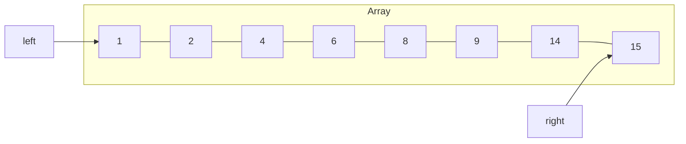
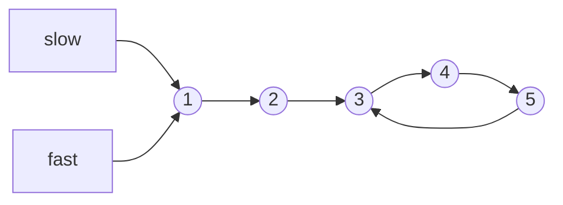

# Two Pointers

## Introduction

The Two Pointers pattern is a simple yet powerful technique used to solve array and string problems efficiently. As the name suggests, it involves using two reference variables (pointers) that iterate through the data structure in a coordinated fashion to achieve a specific goal.

This technique is particularly useful when we need to:
- Find a pair of elements in a sorted array that satisfy certain conditions
- Compare elements from different positions within an array or string
- Search for patterns or subarrays within a larger collection

The primary advantage of the Two Pointers pattern is that it often helps reduce the time complexity from O(n²) to O(n), making your solutions much more efficient.

## How It Works

The basic idea is to use two pointers that either:

1. **Start from opposite ends** and move toward each other
2. **Start from the same position** and move in the same direction at different speeds
3. **Start from different positions** and move in the same direction

Let's explore each approach with examples.

## Approach 1: Pointers Moving Toward Each Other

This approach is commonly used when working with sorted arrays.

### Example: Two Sum II (Finding a pair with a target sum in a sorted array)

**Problem**: Given a sorted array of integers, find two numbers such that they add up to a specific target.

**Input**: 
- Array: `[1, 2, 4, 6, 8, 9, 14, 15]`
- Target: `13`

**Output**: Indices of the two numbers that add up to the target (1-indexed)
- `[3, 5]` (numbers 4 and 9 add up to 13)

```javascript
function twoSum(numbers, target) {
  let left = 0;
  let right = numbers.length - 1;
  
  while (left < right) {
    const currentSum = numbers[left] + numbers[right];
    
    if (currentSum === target) {
      // Adding 1 for 1-indexed result
      return [left + 1, right + 1];
    } else if (currentSum < target) {
      left++;
    } else {
      right--;
    }
  }
  
  return [-1, -1]; // No solution found
}
```

**Visualization**:



**Step-by-step walkthrough**:

1. Initialize `left = 0` and `right = 7`
2. Calculate sum: `numbers[0] + numbers[7] = 1 + 15 = 16`
   - 16 > 13, so we decrease `right` to 6
3. Calculate sum: `numbers[0] + numbers[6] = 1 + 14 = 15`
   - 15 > 13, so we decrease `right` to 5
4. Calculate sum: `numbers[0] + numbers[5] = 1 + 9 = 10`
   - 10 < 13, so we increase `left` to 1
5. Calculate sum: `numbers[1] + numbers[5] = 2 + 9 = 11`
   - 11 < 13, so we increase `left` to 2
6. Calculate sum: `numbers[2] + numbers[5] = 4 + 9 = 13`
   - 13 = 13, we found our answer! Return `[3, 6]` (1-indexed)

The time complexity is O(n), and the space complexity is O(1).

## Approach 2: Pointers Moving in the Same Direction (Same Starting Point)

This approach is useful for finding patterns within arrays or linked lists.

### Example: Fast and Slow Pointers to Find Cycle

**Problem**: Determine if a linked list has a cycle.

```javascript
function hasCycle(head) {
  if (!head || !head.next) return false;
  
  let slow = head;
  let fast = head;
  
  while (fast && fast.next) {
    slow = slow.next;        // Move one step
    fast = fast.next.next;   // Move two steps
    
    if (slow === fast) {
      return true;  // Cycle detected
    }
  }
  
  return false;  // No cycle
}
```

**Visualization**:



In this example, both pointers start at the head. The slow pointer moves one node at a time, while the fast pointer moves two nodes at a time. If there's a cycle, the fast pointer will eventually catch up to the slow pointer.

The time complexity is O(n), and the space complexity is O(1).

## Approach 3: Pointers Moving in the Same Direction (Different Starting Points)

This approach is often used for sliding window problems or when comparing elements at different positions.

### Example: Remove Duplicates from Sorted Array

**Problem**: Given a sorted array, remove the duplicates in-place and return the length of the new array.

**Input**: `[0, 0, 1, 1, 1, 2, 2, 3, 3, 4]`

**Output**: `5` (new array: `[0, 1, 2, 3, 4]`)

```javascript
function removeDuplicates(nums) {
  if (nums.length === 0) return 0;
  
  let i = 0; // Position to place the next unique element
  
  for (let j = 1; j < nums.length; j++) {
    if (nums[j] !== nums[i]) {
      i++;
      nums[i] = nums[j];
    }
  }
  
  return i + 1; // Length of the array with duplicates removed
}
```

**Step-by-step walkthrough**:

1. Initialize `i = 0` (the position of the last unique element).
2. For each element at position `j` (starting from 1):
   - If `nums[j]` is different from `nums[i]`, increment `i` and set `nums[i] = nums[j]`.
   - If `nums[j]` is the same as `nums[i]`, just move `j` forward.

**Initial state**: `[0, 0, 1, 1, 1, 2, 2, 3, 3, 4]`
- `i = 0, j = 1`: `nums[j] = nums[i] = 0`, so just move `j` to 2.
- `i = 0, j = 2`: `nums[j] = 1 ≠ nums[i] = 0`, so set `i = 1` and `nums[i] = 1`.
- `i = 1, j = 3`: `nums[j] = nums[i] = 1`, so just move `j` to 4.
- `i = 1, j = 4`: `nums[j] = nums[i] = 1`, so just move `j` to 5.
- `i = 1, j = 5`: `nums[j] = 2 ≠ nums[i] = 1`, so set `i = 2` and `nums[i] = 2`.
- ...and so on.

The time complexity is O(n), and the space complexity is O(1) because we're modifying the array in-place.

## Common Patterns and Applications

The Two Pointers technique is versatile and can be applied to many problems:

1. **Finding pairs in a sorted array**:
   - Two Sum
   - Three Sum (using a combination of Two Pointers and iteration)
   - Four Sum

2. **String manipulation**:
   - Palindrome checking
   - Reversing strings
   - Removing duplicates

3. **Linked list operations**:
   - Finding cycles
   - Finding the middle element
   - Merging two sorted lists

4. **Partitioning**:
   - Dutch National Flag problem
   - Quicksort partition step

### Example: Valid Palindrome

**Problem**: Determine if a string is a palindrome, considering only alphanumeric characters and ignoring case.

**Input**: `"A man, a plan, a canal: Panama"`

**Output**: `true` (it reads the same forward and backward: "amanaplanacanalpanama")

```javascript
function isPalindrome(s) {
  // Convert to lowercase and remove non-alphanumeric characters
  s = s.toLowerCase().replace(/[^a-z0-9]/g, '');
  
  let left = 0;
  let right = s.length - 1;
  
  while (left < right) {
    if (s[left] !== s[right]) {
      return false;
    }
    left++;
    right--;
  }
  
  return true;
}
```

The time complexity is O(n), and the space complexity is O(1) if we consider the filtered string as part of the input.

## When to Use Two Pointers

The Two Pointers pattern is ideal when:

1. You're dealing with sorted arrays or strings
2. You need to find a set of elements that fulfill certain constraints
3. You want to compare elements at different positions
4. You need to avoid using extra space (achieve O(1) space complexity)

## Practical Exercise: Container With Most Water

**Problem**: Given n non-negative integers representing the heights of vertical lines, find two lines that together with the x-axis form a container that holds the most water.

**Input**: `[1, 8, 6, 2, 5, 4, 8, 3, 7]`

**Output**: `49` (container between heights 8 and 7)

```javascript
function maxArea(height) {
  let maxWater = 0;
  let left = 0;
  let right = height.length - 1;
  
  while (left < right) {
    // Calculate the area
    const width = right - left;
    const minHeight = Math.min(height[left], height[right]);
    const area = width * minHeight;
    
    maxWater = Math.max(maxWater, area);
    
    // Move the pointer pointing to the shorter line
    if (height[left] < height[right]) {
      left++;
    } else {
      right--;
    }
  }
  
  return maxWater;
}
```

**Visual explanation**:

We start with the widest container possible (pointers at both ends) and then try to find taller lines that might create a larger area, even though the width decreases. We always move the pointer pointing to the shorter line because the container's capacity is limited by the shorter line.

The time complexity is O(n), and the space complexity is O(1).

## Summary

The Two Pointers pattern is a powerful technique that allows us to solve many array and string problems efficiently. By using two pointers that traverse the data structure in a coordinated manner, we can often reduce the time complexity from O(n²) to O(n).

Key points to remember:
- Two pointers can start from opposite ends and move toward each other
- Two pointers can start from the same position and move at different speeds
- Two pointers can start from different positions and move in the same direction
- The technique is particularly useful for sorted arrays and linked lists
- It helps achieve O(1) space complexity for many problems

## Practice Problems

To master the Two Pointers technique, try solving these problems:

1. **Easy**:
   - Reverse a string
   - Find the middle of a linked list
   - Merge two sorted arrays

2. **Medium**:
   - Three Sum (find all unique triplets that add up to zero)
   - Sort Colors (Dutch National Flag problem)
   - Find all pairs with a given difference

3. **Hard**:
   - Trapping Rain Water
   - Minimum Window Substring
   - K-diff Pairs in an Array

Remember, the key to mastering this pattern is practice. Try implementing these solutions yourself before looking at the solutions!

## Additional Resources

- [LeetCode Two Pointers problems](https://leetcode.com/tag/two-pointers/)
- [GeeksforGeeks Two Pointers Technique](https://www.geeksforgeeks.org/two-pointers-technique/)
- [Interactive visualizations of Two Pointers algorithms](https://visualgo.net/en)