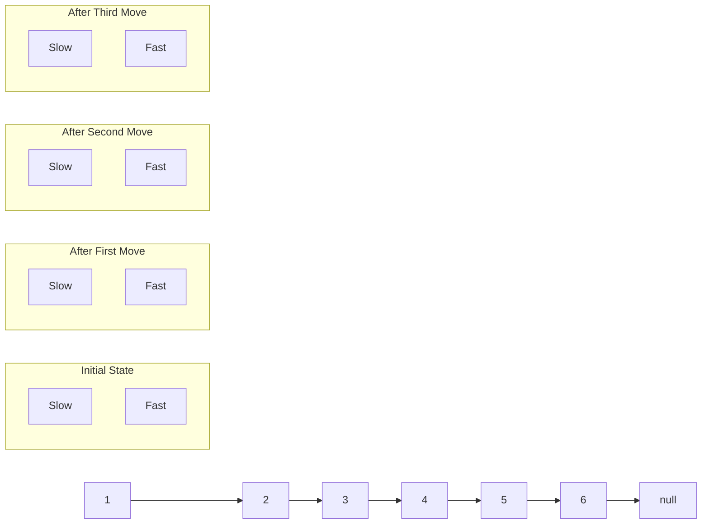

# Fast and Slow Pointers

## Introduction

The Fast and Slow Pointers technique (also known as the "Hare and Tortoise" algorithm) is an efficient problem-solving pattern that uses two pointers moving at different speeds through a sequence. This approach is particularly useful for:

- Detecting cycles in a linked list
- Finding the middle element of a linked list
- Determining if a linked list is a palindrome
- Solving problems that require finding a pattern or cycle in an array

The beauty of this technique lies in its simplicity and efficiency - it typically requires only O(n) time complexity and O(1) space complexity, making it memory-efficient for large datasets.

## How It Works

The core idea is to use two pointers that traverse through the data structure at different speeds:

1. **Slow Pointer**: Moves one step at a time
2. **Fast Pointer**: Moves two (or more) steps at a time

By maintaining this speed difference, we can detect various properties of the data structure without using additional space for tracking visited elements.



## Common Applications

### 1. Detecting a Cycle in a Linked List

One of the most famous applications of this technique is Floyd's Cycle-Finding Algorithm, which can determine if a linked list has a cycle.

```javascript
function hasCycle(head) {
  if (!head || !head.next) return false;
  
  let slow = head;
  let fast = head;
  
  // Fast pointer moves at twice the speed of slow pointer
  while (fast && fast.next) {
    slow = slow.next;        // Move one step
    fast = fast.next.next;   // Move two steps
    
    // If there's a cycle, the pointers will eventually meet
    if (slow === fast) {
      return true;
    }
  }
  
  // If fast reaches the end, there's no cycle
  return false;
}
```

**How it works:** If there's a cycle, the fast pointer will eventually catch up to the slow pointer from behind. If there's no cycle, the fast pointer will reach the end of the list.

### 2. Finding the Middle of a Linked List

This pattern provides an elegant solution for finding the middle node of a linked list in a single pass.

```javascript
function findMiddle(head) {
  if (!head) return null;
  
  let slow = head;
  let fast = head;
  
  // When fast reaches the end, slow will be at the middle
  while (fast && fast.next) {
    slow = slow.next;
    fast = fast.next.next;
  }
  
  return slow; // This is our middle node
}
```

**Input/Output Example:**
- Input: `1 -> 2 -> 3 -> 4 -> 5`
- Output: Node with value `3`

- Input: `1 -> 2 -> 3 -> 4 -> 5 -> 6`
- Output: Node with value `4` (for even-length lists, we get the second middle node)

### 3. Checking if a Linked List is a Palindrome

We can use fast and slow pointers to efficiently check if a linked list represents a palindrome.

```javascript
function isPalindrome(head) {
  if (!head || !head.next) return true;
  
  // Find the middle of the list
  let slow = head;
  let fast = head;
  
  while (fast && fast.next) {
    slow = slow.next;
    fast = fast.next.next;
  }
  
  // Reverse the second half
  let prev = null;
  let current = slow;
  let next = null;
  
  while (current) {
    next = current.next;
    current.next = prev;
    prev = current;
    current = next;
  }
  
  // Compare the first and second half
  let firstHalf = head;
  let secondHalf = prev;
  
  while (secondHalf) {
    if (firstHalf.val !== secondHalf.val) {
      return false;
    }
    firstHalf = firstHalf.next;
    secondHalf = secondHalf.next;
  }
  
  return true;
}
```

**Input/Output Example:**
- Input: `1 -> 2 -> 2 -> 1`
- Output: `true` (It reads the same forward and backward)

- Input: `1 -> 2 -> 3 -> 1`
- Output: `false`

### 4. Finding the Start of a Cycle

If a linked list has a cycle, we can find where the cycle begins:

```javascript
function detectCycleStart(head) {
  if (!head || !head.next) return null;
  
  let slow = head;
  let fast = head;
  let hasCycle = false;
  
  // Detect if there's a cycle
  while (fast && fast.next) {
    slow = slow.next;
    fast = fast.next.next;
    
    if (slow === fast) {
      hasCycle = true;
      break;
    }
  }
  
  if (!hasCycle) return null;
  
  // Reset slow pointer to head and move both at same speed
  slow = head;
  while (slow !== fast) {
    slow = slow.next;
    fast = fast.next;
  }
  
  return slow; // This is the start of the cycle
}
```

## Real-World Applications

### 1. Memory Leak Detection

The concept of cycle detection using fast and slow pointers has applications in garbage collection and memory leak detection in programming languages. If objects reference each other in a cycle, they might not be garbage collected properly.

### 2. Data Streaming

In data streaming applications, this pattern can be used to detect repeating patterns in the incoming data stream without storing the entire stream in memory.

### 3. Sequence Detection in DNA

Bioinformatics uses similar techniques to find repeating sequences in DNA without having to store large portions of the genome in memory.

## Implementation Tips

1. **Always check for edge cases**: Empty lists, single-element lists, etc.
2. **Be careful with null pointers**: Always ensure your fast pointer won't access `null.next`.
3. **Adjust pointer speeds as needed**: While "slow=1, fast=2" is common, some problems might require different speeds.
4. **Consider the loop condition**: Your while loop condition should prevent null pointer exceptions.

## Practice Problems

Here are some problems you can solve using the Fast and Slow pointers pattern:

1. **Linked List Cycle II**: Find the node where the cycle begins in a linked list.
2. **Happy Number**: Determine if a number is "happy" (eventually reaches 1 when replacing it with the sum of squares of its digits).
3. **Find the Duplicate Number**: Find the duplicate in an array of integers where each integer is between 1 and n (inclusive).
4. **Middle of the Linked List**: Return the middle node of a linked list.
5. **Palindrome Linked List**: Determine if a linked list is a palindrome.

## Time and Space Complexity Analysis

Most Fast and Slow pointer solutions have the following complexities:

- **Time Complexity**: O(n) where n is the number of elements
- **Space Complexity**: O(1) as we only use two pointers regardless of input size

This makes the pattern especially useful for memory-constrained environments or when working with very large datasets.

## Summary

The Fast and Slow Pointers pattern is a powerful technique that offers elegant solutions to a variety of problems, particularly those involving linked lists and cycles. Its main advantages are:

- Memory efficiency (constant space complexity)
- Linear time complexity
- Simple implementation
- Ability to solve problems in a single pass through the data

By mastering this pattern, you'll add an important tool to your algorithmic problem-solving toolkit that can help you efficiently solve problems that might otherwise require more complex approaches or additional memory.

## Additional Resources

- Robert Floyd's original paper on cycle detection algorithms
- "Introduction to Algorithms" by Cormen, Leiserson, Rivest, and Stein (covers cycle detection)
- Online coding platforms like LeetCode and HackerRank have many problems that can be solved using this pattern