# Merge Intervals

## Introduction

The Merge Intervals pattern is a technique used to solve problems involving overlapping intervals or ranges. This pattern is particularly useful when you need to:

- Merge overlapping intervals
- Find intersections between intervals
- Check if intervals conflict with each other
- Schedule tasks or meetings

Intervals are typically represented as pairs of values (start, end) and can represent various real-world concepts like time periods, numerical ranges, or segments.

## Understanding Intervals

An interval is a range with a start and end point. In code, we usually represent intervals as:

```javascript
// As an array
const interval = [start, end];

// Or as an object
const interval = { start: startValue, end: endValue };
```

For example, the interval [1, 5] represents the range from 1 to 5 (inclusive).

## The Core Problem: Merging Overlapping Intervals

The fundamental operation in this pattern is identifying and merging overlapping intervals.

Two intervals [a, b] and [c, d] overlap if:
- a ≤ d AND c ≤ b

When intervals overlap, we can merge them into a single interval:
- [min(a, c), max(b, d)]

Let's visualize this:

```mermaid
gantt
    title Interval Overlap Examples
    dateFormat X
    axisFormat %d
    
    section Overlapping
    Interval A [1,5]           :a1, 1, 5
    Interval B [3,7]           :a2, 3, 7
    Merged [1,7]               :a3, 1, 7
    
    section Non-overlapping
    Interval C [1,2]           :b1, 1, 2
    Interval D [4,6]           :b2, 4, 6
```



## Step-by-Step Algorithm for Merging Intervals

Let's break down a step-by-step approach to merge overlapping intervals:

1. **Sort the intervals** based on their start times
2. **Initialize** a result array with the first interval
3. **Iterate** through the remaining intervals:
   - If the current interval overlaps with the last interval in the result, merge them
   - Otherwise, add the current interval to the result

## Implementation

Here's a JavaScript implementation of the merge intervals algorithm:

```javascript
function mergeIntervals(intervals) {
  // Handle edge cases
  if (intervals.length <= 1) {
    return intervals;
  }
  
  // Sort intervals by start time
  intervals.sort((a, b) => a[0] - b[0]);
  
  const result = [intervals[0]];
  
  for (let i = 1; i < intervals.length; i++) {
    const currentInterval = intervals[i];
    const lastMergedInterval = result[result.length - 1];
    
    // Check if intervals overlap
    if (currentInterval[0] <= lastMergedInterval[1]) {
      // Merge overlapping intervals
      lastMergedInterval[1] = Math.max(lastMergedInterval[1], currentInterval[1]);
    } else {
      // Add non-overlapping interval to result
      result.push(currentInterval);
    }
  }
  
  return result;
}
```

### Example:

```javascript
const intervals = [[1,3], [2,6], [8,10], [15,18]];
console.log(mergeIntervals(intervals)); 
// Output: [[1,6], [8,10], [15,18]]
```

Let's trace through this example step by step:

1. Sort the intervals: `[[1,3], [2,6], [8,10], [15,18]]` (already sorted)
2. Initialize result with the first interval: `result = [[1,3]]`
3. Consider interval `[2,6]`:
   - Last merged interval is `[1,3]`
   - Since `2 <= 3`, there is an overlap
   - Merge into `[1,6]`, result becomes `[[1,6]]`
4. Consider interval `[8,10]`:
   - Last merged interval is `[1,6]`
   - Since `8 > 6`, there is no overlap
   - Add to result, result becomes `[[1,6], [8,10]]`
5. Consider interval `[15,18]`:
   - Last merged interval is `[8,10]`
   - Since `15 > 10`, there is no overlap
   - Add to result, result becomes `[[1,6], [8,10], [15,18]]`

## Variations of the Merge Intervals Pattern

### 1. Insert Interval

Given a set of non-overlapping intervals and a new interval, insert the new interval at the correct position and merge if necessary.

```javascript
function insertInterval(intervals, newInterval) {
  const result = [];
  let i = 0;
  const n = intervals.length;
  
  // Add all intervals that come before newInterval
  while (i < n && intervals[i][1] < newInterval[0]) {
    result.push(intervals[i]);
    i++;
  }
  
  // Merge overlapping intervals
  while (i < n && intervals[i][0] <= newInterval[1]) {
    newInterval[0] = Math.min(newInterval[0], intervals[i][0]);
    newInterval[1] = Math.max(newInterval[1], intervals[i][1]);
    i++;
  }
  
  // Add the merged interval
  result.push(newInterval);
  
  // Add remaining intervals
  while (i < n) {
    result.push(intervals[i]);
    i++;
  }
  
  return result;
}
```

### 2. Interval Intersection

Find the intersection of two lists of intervals.

```javascript
function intervalIntersection(listA, listB) {
  const result = [];
  let i = 0, j = 0;
  
  while (i < listA.length && j < listB.length) {
    // Find the overlap
    const start = Math.max(listA[i][0], listB[j][0]);
    const end = Math.min(listA[i][1], listB[j][1]);
    
    // If there is an overlap, add it to the result
    if (start <= end) {
      result.push([start, end]);
    }
    
    // Move the pointer of the interval that ends earlier
    if (listA[i][1] < listB[j][1]) {
      i++;
    } else {
      j++;
    }
  }
  
  return result;
}
```

### 3. Conflicting Appointments

Determine if a person can attend all appointments without any conflicts.

```javascript
function canAttendAllAppointments(intervals) {
  // Sort intervals by start time
  intervals.sort((a, b) => a[0] - b[0]);
  
  // Check for any overlapping intervals
  for (let i = 1; i < intervals.length; i++) {
    if (intervals[i][0] < intervals[i-1][1]) {
      return false; // Found an overlap
    }
  }
  
  return true; // No overlaps found
}
```

## Real-World Applications

The Merge Intervals pattern has numerous practical applications:

### 1. Calendar Scheduling

When building a calendar application, you need to check for conflicting meetings and potentially merge free time slots.

```javascript
function findFreeTimes(meetings, dayStart, dayEnd) {
  // Add day boundaries
  const intervals = [[dayStart, dayStart], ...meetings, [dayEnd, dayEnd]];
  
  // Sort by start time
  intervals.sort((a, b) => a[0] - b[0]);
  
  const freeTimes = [];
  
  // Find gaps between meetings
  for (let i = 1; i < intervals.length; i++) {
    const freeStart = intervals[i-1][1];
    const freeEnd = intervals[i][0];
    
    if (freeStart < freeEnd) {
      freeTimes.push([freeStart, freeEnd]);
    }
  }
  
  return freeTimes;
}

// Example:
const meetings = [[9, 10.5], [12, 13], [16, 18]];
console.log(findFreeTimes(meetings, 9, 20));
// Output: [[10.5, 12], [13, 16], [18, 20]]
```

### 2. Resource Allocation

When managing resources like CPU time, memory, or meeting rooms, you need to determine if there are any conflicts.

```javascript
function minimumRoomsRequired(meetings) {
  const startTimes = meetings.map(m => m[0]).sort((a, b) => a - b);
  const endTimes = meetings.map(m => m[1]).sort((a, b) => a - b);
  
  let rooms = 0;
  let maxRooms = 0;
  let s = 0, e = 0;
  
  while (s < startTimes.length) {
    if (startTimes[s] < endTimes[e]) {
      rooms++;
      s++;
    } else {
      rooms--;
      e++;
    }
    maxRooms = Math.max(maxRooms, rooms);
  }
  
  return maxRooms;
}

// Example:
const meetings = [[9, 10], [9, 12], [11, 13], [14, 16]];
console.log(minimumRoomsRequired(meetings));
// Output: 2 (We need 2 rooms to accommodate all meetings)
```

### 3. Data Range Processing

When working with ranges of data, like time series or sensor readings, merging overlapping ranges can help in data cleaning and analysis.

```javascript
function mergeDataRanges(ranges) {
  // Use our merge intervals function
  return mergeIntervals(ranges);
}

// Example: Merging temperature readings from overlapping time periods
const temperatureReadings = [
  [1, 5, "Sensor A"],  // Time 1-5, from Sensor A
  [3, 8, "Sensor B"],  // Time 3-8, from Sensor B
  [9, 12, "Sensor A"], // Time 9-12, from Sensor A
];

// Extracting just the time intervals
const timeRanges = temperatureReadings.map(reading => [reading[0], reading[1]]);
const mergedRanges = mergeDataRanges(timeRanges);
console.log(mergedRanges);
// Output: [[1, 8], [9, 12]]
```

## Common Patterns and Optimizations

1. **Always sort first**: Most interval problems become simpler after sorting intervals by their start times.

2. **Process intervals sequentially**: After sorting, you can typically process intervals in a single pass.

3. **Use separate arrays for start and end times**: For some problems, separating start and end times into different arrays can simplify the solution.

4. **Consider using a min-heap**: For problems involving finding the minimum number of resources, a min-heap can be useful.

## Tips for Solving Interval Problems

1. **Visualize the intervals**: Drawing intervals on a timeline helps understand the problem better.

2. **Identify the comparisons**: Determine how to compare intervals (by start time, end time, or both).

3. **Handle edge cases**: Consider empty input, single intervals, or intervals with special properties.

4. **Check for off-by-one errors**: Be careful with inclusive vs. exclusive interval ends.

## Summary

The Merge Intervals pattern is a powerful technique for working with intervals or ranges of data. The core operations include:

1. **Sorting intervals** (usually by start time)
2. **Detecting overlaps** between intervals
3. **Merging overlapping intervals**
4. **Inserting** new intervals into existing sets
5. **Finding intersections** between intervals

This pattern is particularly useful in scheduling applications, resource allocation problems, and data processing tasks where ranges need to be analyzed or combined.

## Practice Exercises

1. **Merge Intervals**: Implement the basic merge intervals algorithm.
   - Input: `[[1,3], [2,6], [8,10], [15,18]]`
   - Expected Output: `[[1,6], [8,10], [15,18]]`

2. **Insert Interval**: Insert a new interval into a sorted list of non-overlapping intervals.
   - Input: Intervals = `[[1,3], [6,9]]`, New Interval = `[2,5]`
   - Expected Output: `[[1,5], [6,9]]`

3. **Meeting Rooms**: Determine the minimum number of meeting rooms required.
   - Input: `[[0,30], [5,10], [15,20]]`
   - Expected Output: `2`

4. **Employee Free Time**: Find common free time slots for multiple employees.
   - Input: Employee 1: `[[9,12], [15,18]]`, Employee 2: `[[8,10], [14,16]]`
   - Expected Output: `[[10,12], [16,18]]`

5. **Maximum CPU Load**: Find the maximum CPU load at any point in time given a list of jobs with start time, end time, and CPU load.
   - Input: `[[1,4,3], [2,5,4], [7,9,6]]` (format: [start, end, load])
   - Expected Output: `7` (max load is 3+4=7 when first and second jobs overlap)

## Additional Resources

- "Introduction to Algorithms" by Cormen, Leiserson, Rivest, and Stein
- "Elements of Programming Interviews" by Aziz, Lee, and Prakash
- [LeetCode Merge Intervals Problems](https://leetcode.com/tag/interval/)
- [GeeksforGeeks Interval Merging](https://www.geeksforgeeks.org/merging-intervals/)