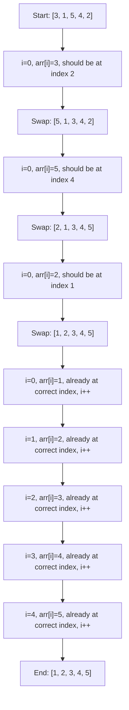

# Cyclic Sort Pattern

## Introduction

The Cyclic Sort pattern is a simple yet powerful technique for efficiently sorting arrays where the elements are in a given range. This pattern is particularly useful when dealing with arrays containing numbers from 1 to n or 0 to n-1, as it allows us to sort the array with a time complexity of O(n) without using extra space.

Unlike traditional sorting algorithms like Quick Sort or Merge Sort that have O(n log n) time complexity, Cyclic Sort takes advantage of the information about the range of numbers to achieve linear time complexity.

## How Cyclic Sort Works

The core idea behind Cyclic Sort is simple:

> When dealing with an array containing numbers in a range, each number should be placed at its correct index based on its value.

For example, in an array containing numbers from 1 to n, the number 1 should be at index 0, the number 2 should be at index 1, and so on.

The algorithm works as follows:

1. Start iterating the array from the beginning
2. If the current element is not at its correct position, swap it with the element at its correct position
3. If the current element is at its correct position, move to the next element
4. Repeat until the array is sorted

## Basic Implementation

Let's implement a basic Cyclic Sort for an array containing numbers from 1 to n:

```javascript
function cyclicSort(arr) {
  let i = 0;
  
  // Iterate through the array
  while (i < arr.length) {
    // Find the correct position for the current element
    // For an array with values 1 to n, the correct position for value is (value-1)
    const correctIndex = arr[i] - 1;
    
    // If the element is not at its correct position, swap
    if (arr[i] !== arr[correctIndex]) {
      // Swap elements
      [arr[i], arr[correctIndex]] = [arr[correctIndex], arr[i]];
    } else {
      // If element is at correct position, move to next element
      i++;
    }
  }
  
  return arr;
}

// Example usage
const array = [3, 1, 5, 4, 2];
console.log("Original array:", array);
console.log("Sorted array:", cyclicSort(array));
```

**Output:**
```
Original array: [3, 1, 5, 4, 2]
Sorted array: [1, 2, 3, 4, 5]
```

## Visualizing the Algorithm

Let's visualize how Cyclic Sort works using the example array `[3, 1, 5, 4, 2]`:



## Step-by-Step Explanation

Let's trace through the algorithm to understand it better:

1. We start with the array `[3, 1, 5, 4, 2]` and `i = 0`
2. `arr[0] = 3` should be at index `3-1 = 2`, so we swap with the element at index 2
   - Array becomes `[5, 1, 3, 4, 2]`
3. `arr[0] = 5` should be at index `5-1 = 4`, so we swap with the element at index 4
   - Array becomes `[2, 1, 3, 4, 5]`
4. `arr[0] = 2` should be at index `2-1 = 1`, so we swap with the element at index 1
   - Array becomes `[1, 2, 3, 4, 5]`
5. `arr[0] = 1` is already at the correct index, so we increment `i` to 1
6. `arr[1] = 2` is already at the correct index, so we increment `i` to 2
7. `arr[2] = 3` is already at the correct index, so we increment `i` to 3
8. `arr[3] = 4` is already at the correct index, so we increment `i` to 4
9. `arr[4] = 5` is already at the correct index, so we increment `i` to 5
10. Since `i = 5` equals the array length, we exit the loop and return the sorted array `[1, 2, 3, 4, 5]`

## Variations

### Sorting an Array Containing Numbers from 0 to N-1

If the array contains numbers from 0 to n-1 instead of 1 to n, we need to modify our approach slightly:

```javascript
function cyclicSort(arr) {
  let i = 0;
  
  while (i < arr.length) {
    // For values 0 to n-1, the correct position is equal to the value
    const correctIndex = arr[i];
    
    if (arr[i] < arr.length && arr[i] !== arr[correctIndex]) {
      [arr[i], arr[correctIndex]] = [arr[correctIndex], arr[i]];
    } else {
      i++;
    }
  }
  
  return arr;
}

// Example usage
const array = [3, 0, 1, 4, 2];
console.log("Original array:", array);
console.log("Sorted array:", cyclicSort(array));
```

**Output:**
```
Original array: [3, 0, 1, 4, 2]
Sorted array: [0, 1, 2, 3, 4]
```

## Time and Space Complexity

- **Time Complexity**: O(n) where n is the number of elements in the array. Although we have a nested loop, each element is put in its correct position at most once, giving us a linear time complexity.
- **Space Complexity**: O(1) since we perform the sort in-place without using any extra space.

## Practical Applications

The Cyclic Sort pattern is particularly useful for solving a variety of array problems:

### 1. Finding Missing Numbers

One of the most common applications of the Cyclic Sort pattern is finding missing numbers in an array.

```javascript
function findMissingNumber(nums) {
  let i = 0;
  
  // First, sort the array using cyclic sort
  while (i < nums.length) {
    // For values 0 to n-1, correct position equals value
    const correctIndex = nums[i];
    
    // Only swap if value is within array bounds and not at correct position
    if (nums[i] < nums.length && nums[i] !== nums[correctIndex]) {
      [nums[i], nums[correctIndex]] = [nums[correctIndex], nums[i]];
    } else {
      i++;
    }
  }
  
  // After sorting, find the first index where value doesn't match position
  for (let i = 0; i < nums.length; i++) {
    if (nums[i] !== i) {
      return i;
    }
  }
  
  // If all numbers are in correct positions, the missing number is n
  return nums.length;
}

// Example usage
const array = [3, 0, 1, 4, 2, 6];
console.log("Array:", array);
console.log("Missing number:", findMissingNumber(array)); // Output: 5
```

### 2. Finding All Missing Numbers

If multiple numbers are missing from an array containing numbers from 1 to n, we can use Cyclic Sort to find all of them:

```javascript
function findAllMissingNumbers(nums) {
  let i = 0;
  const missingNumbers = [];
  
  // First, sort the array using cyclic sort
  while (i < nums.length) {
    // For values 1 to n in a 0-indexed array, correct position is value-1
    const correctIndex = nums[i] - 1;
    
    if (nums[i] > 0 && nums[i] <= nums.length && nums[i] !== nums[correctIndex]) {
      [nums[i], nums[correctIndex]] = [nums[correctIndex], nums[i]];
    } else {
      i++;
    }
  }
  
  // Find all indices where value doesn't match expected value
  for (let i = 0; i < nums.length; i++) {
    if (nums[i] !== i + 1) {
      missingNumbers.push(i + 1);
    }
  }
  
  return missingNumbers;
}

// Example usage
const array = [2, 3, 1, 8, 2, 3, 5, 1];
console.log("Array:", array);
console.log("Missing numbers:", findAllMissingNumbers(array)); // Output: [4, 6, 7]
```

### 3. Finding Duplicates

The Cyclic Sort pattern can also be used to find duplicates in an array:

```javascript
function findDuplicates(nums) {
  let i = 0;
  const duplicates = [];
  
  // Sort the array using cyclic sort
  while (i < nums.length) {
    const correctIndex = nums[i] - 1;
    
    if (nums[i] !== nums[correctIndex]) {
      [nums[i], nums[correctIndex]] = [nums[correctIndex], nums[i]];
    } else {
      i++;
    }
  }
  
  // Find all indices where value doesn't match position+1
  for (let i = 0; i < nums.length; i++) {
    if (nums[i] !== i + 1) {
      duplicates.push(nums[i]);
    }
  }
  
  return duplicates;
}

// Example usage
const array = [4, 3, 2, 7, 8, 2, 3, 1];
console.log("Array:", array);
console.log("Duplicates:", findDuplicates(array)); // Output: [2, 3]
```

## Common Pitfalls and Tips

1. **Range Verification**: Always verify that the array elements are within the expected range (1 to n or 0 to n-1) before applying Cyclic Sort.

2. **Avoiding Infinite Loops**: Be careful with the logic in your swapping condition to avoid infinite loops, especially when handling duplicate values.

3. **Boundary Cases**: Remember to handle boundary cases correctly, such as when the array is empty or contains just one element.

4. **Value Transformation**: When elements are not in the direct range (e.g., if they're odd numbers only), transform the formula for calculating the correct index accordingly.

## Summary

The Cyclic Sort pattern is a powerful technique for efficiently sorting arrays where elements are in a specific range. This pattern achieves O(n) time complexity with O(1) space complexity, making it more efficient than traditional sorting algorithms for these specific cases.

Key advantages of Cyclic Sort:
- Linear time complexity O(n)
- Constant space complexity O(1)
- Extremely efficient for arrays with values in a given range
- Useful for solving various array problems like finding missing numbers or duplicates

This pattern demonstrates how understanding the constraints and properties of a problem can lead to highly optimized solutions.

## Practice Exercises

1. **Find Corrupt Pair**: Given an array containing n numbers taken from the range 1 to n. The array has one duplicate and one missing number. Find both the duplicate and the missing number.

2. **Find the First K Missing Positive Numbers**: Given an unsorted array containing numbers, find the first k missing positive numbers.

3. **Find the Smallest Missing Positive Number**: Given an unsorted array containing numbers, find the smallest missing positive number.

4. **Sort an Array of 0s, 1s, and 2s**: Apply the Cyclic Sort pattern to efficiently sort an array that contains only 0s, 1s, and 2s.

By practicing these exercises, you'll strengthen your understanding of the Cyclic Sort pattern and be better equipped to apply it to solve real-world problems.