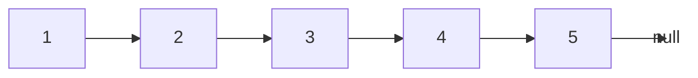
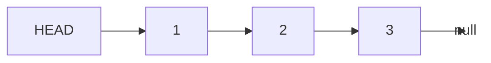
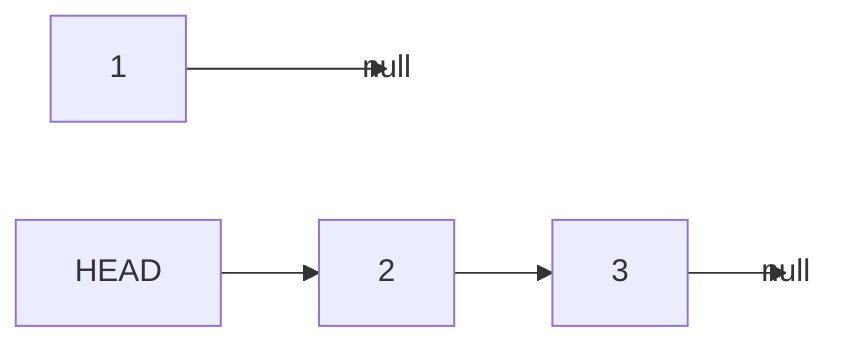
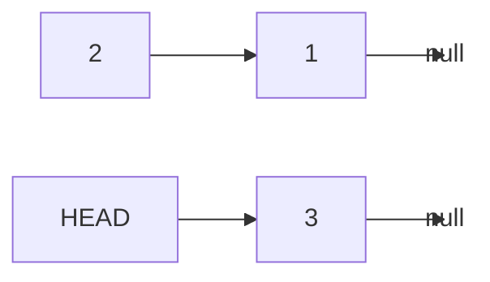
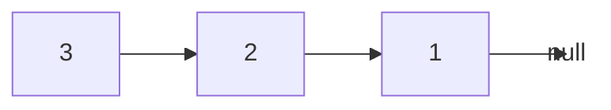

# In-place Reversal of Linked List

## Introduction

Linked lists are fundamental data structures in computer science that consist of nodes where each node contains data and a reference (or pointer) to the next node in the sequence. One common pattern that appears in many linked list problems is the **in-place reversal** technique.

In-place reversal allows us to reverse a linked list without using any extra space (O(1) space complexity), making it an efficient approach for memory-constrained environments. This pattern is particularly useful when you need to manipulate the structure of a linked list without creating a new one.

## Understanding Linked Lists

Before diving into the reversal pattern, let's quickly review what a linked list is:

```js
class ListNode {
  constructor(value) {
    this.value = value;
    this.next = null;
  }
}
```

A linked list is formed when multiple nodes are connected:



## The In-place Reversal Pattern

The in-place reversal pattern involves changing the direction of the `next` pointers of each node in the linked list. Instead of A→B→C→D→null, we want to transform it to null←A←B←C←D, where D becomes the new head of the list.

The key insight is that we need to track three pointers during the reversal process:
1. `current`: The node we're currently processing
2. `previous`: The node before the current node
3. `next`: The next node to process (saved before we modify `current.next`)

### Step-by-Step Algorithm:

1. Initialize `previous` pointer to `null`
2. Initialize `current` pointer to the `head` of the list
3. While `current` is not `null`:
   a. Save the `next` node before changing pointers
   b. Reverse the `current` node's pointer to point to the `previous` node
   c. Move `previous` and `current` pointers one step forward
4. Return the `previous` pointer (the new head)

## Implementation: Reversing a Linked List

Let's implement this algorithm in JavaScript:

```js
function reverseLinkedList(head) {
  let previous = null;
  let current = head;
  
  while (current !== null) {
    // Save the next node
    let next = current.next;
    
    // Reverse the pointer
    current.next = previous;
    
    // Move pointers one position ahead
    previous = current;
    current = next;
  }
  
  // The previous pointer is the new head
  return previous;
}
```

### Visual Walkthrough

Let's trace through the algorithm with a small example:

Initial List: 1 → 2 → 3 → null



Step 1: Initialize `previous = null`, `current = head` (node with value 1)

Step 2: First iteration of the while loop
  - `next = current.next` (node with value 2)
  - `current.next = previous` (null)
  - `previous = current` (node with value 1)
  - `current = next` (node with value 2)

Current state:


Step 3: Second iteration of the while loop
  - `next = current.next` (node with value 3)
  - `current.next = previous` (node with value 1)
  - `previous = current` (node with value 2)
  - `current = next` (node with value 3)

Current state:


Step 4: Third iteration of the while loop
  - `next = current.next` (null)
  - `current.next = previous` (node with value 2)
  - `previous = current` (node with value 3)
  - `current = next` (null)

Current state:


Step 5: The while loop terminates as `current` is now null
  - Return `previous` (node with value 3) as the new head

Final Result: 3 → 2 → 1 → null

## Time and Space Complexity

- **Time Complexity**: O(n) - We visit each node exactly once
- **Space Complexity**: O(1) - We use a constant amount of extra space regardless of input size

## Variations of the Pattern

The in-place reversal pattern can be applied to solve various linked list problems:

### 1. Reverse a Sub-list

Reversing a portion of the linked list from position `p` to `q`:

```js
function reverseSubList(head, p, q) {
  if (p === q) {
    return head;
  }
  
  // Move to position p
  let current = head;
  let previous = null;
  let i = 1;
  
  while (current !== null && i < p) {
    previous = current;
    current = current.next;
    i++;
  }
  
  // Save nodes before reversal section
  let connectionStart = previous;
  let subListStart = current;
  
  // Reverse nodes from p to q
  previous = null;
  i = 0;
  
  while (current !== null && i < q - p + 1) {
    let next = current.next;
    current.next = previous;
    previous = current;
    current = next;
    i++;
  }
  
  // Connect with the rest of the list
  if (connectionStart !== null) {
    connectionStart.next = previous;
  } else {
    head = previous;
  }
  
  subListStart.next = current;
  
  return head;
}
```

### 2. Reverse Alternating K-element Sub-lists

Reversing every K elements while leaving the next K elements intact:

```js
function reverseAlternatingKElements(head, k) {
  if (k <= 1 || head === null) {
    return head;
  }
  
  let current = head;
  let previous = null;
  
  while (current !== null) {
    let connectionStart = previous;
    let subListStart = current;
    
    // Reverse k nodes
    previous = null;
    let i = 0;
    
    while (current !== null && i < k) {
      let next = current.next;
      current.next = previous;
      previous = current;
      current = next;
      i++;
    }
    
    // Connect with the reversed part
    if (connectionStart !== null) {
      connectionStart.next = previous;
    } else {
      head = previous;
    }
    
    subListStart.next = current;
    
    // Skip k nodes
    previous = subListStart;
    i = 0;
    
    while (current !== null && i < k) {
      previous = current;
      current = current.next;
      i++;
    }
  }
  
  return head;
}
```

## Real-World Applications

The in-place reversal pattern is useful in many real-world scenarios:

1. **Implementing undo functionality** in text editors where operations need to be reversed
2. **Detecting palindromes** in linked lists by reversing the second half and comparing
3. **Solving rotation-based problems** such as rotating a linked list by K positions
4. **Memory optimization** in embedded systems where memory is constrained

### Example: Checking if a Linked List is a Palindrome

```js
function isPalindrome(head) {
  if (head === null || head.next === null) {
    return true;
  }
  
  // Find the middle of the linked list
  let slow = head;
  let fast = head;
  
  while (fast !== null && fast.next !== null) {
    slow = slow.next;
    fast = fast.next.next;
  }
  
  // Reverse the second half
  let secondHalfHead = reverseLinkedList(slow);
  let copyOfSecondHalfHead = secondHalfHead;
  
  // Compare the first and second half
  let result = true;
  let firstHalfNode = head;
  let secondHalfNode = secondHalfHead;
  
  while (secondHalfNode !== null) {
    if (firstHalfNode.value !== secondHalfNode.value) {
      result = false;
      break;
    }
    firstHalfNode = firstHalfNode.next;
    secondHalfNode = secondHalfNode.next;
  }
  
  // Restore the original linked list
  reverseLinkedList(copyOfSecondHalfHead);
  
  return result;
}
```

## Common Pitfalls and Tips

1. **Forgetting to save the next node before reversal**: Always store `next = current.next` before modifying `current.next`
2. **Not updating the head pointer**: Remember to return the new head (`previous`) after reversal
3. **Edge cases**: Handle empty lists and single-node lists properly
4. **Infinite loops**: Be cautious when manipulating pointers to avoid circular references
5. **Lost connections**: Keep track of necessary connections when reversing subparts of a list

## Summary

The in-place reversal of linked lists is a powerful pattern that allows you to efficiently reverse a linked list or portions of it without using additional space. This pattern relies on manipulating the next pointers of each node while iterating through the list.

Key takeaways:
- In-place reversal uses O(1) space complexity
- The algorithm requires tracking three pointers: previous, current, and next
- This pattern can be adapted to solve various linked list problems
- Understanding this pattern will help you solve many linked list interview questions

## Practice Problems

To solidify your understanding of this pattern, try these practice problems:

1. Reverse a linked list in groups of size K
2. Reorder a linked list in the pattern: L₀ → Lₙ → L₁ → Lₙ₋₁ → L₂ → Lₙ₋₂ → ...
3. Rotate a linked list to the right by K positions
4. Swap nodes in pairs without modifying node values

## Further Resources

- [Linked List Data Structure](https://en.wikipedia.org/wiki/Linked_list)
- [Common Linked List Interview Questions](https://leetcode.com/tag/linked-list/)
- [Recursively Reversing a Linked List](https://www.geeksforgeeks.org/reverse-a-linked-list/)