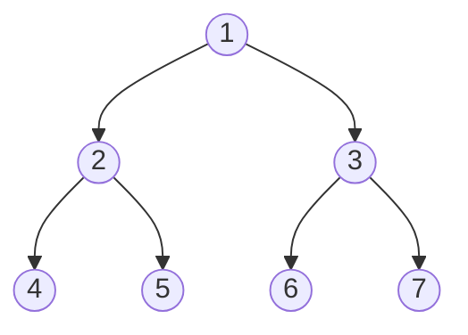

# Tree Traversal Patterns

## Introduction

Tree traversal is a fundamental concept in computer science that involves visiting every node in a tree data structure exactly once. Understanding different tree traversal patterns is essential for solving various programming problems efficiently, especially those involving hierarchical data.

Trees are non-linear data structures that represent hierarchical relationships between elements. Unlike arrays or linked lists, which are linear data structures, trees allow for more complex data organization. This makes them perfect for representing file systems, organization charts, family trees, and many other real-world hierarchical structures.

In this guide, we'll explore different tree traversal patterns, understand when to use each pattern, and see how they can be applied to solve programming problems.

## Understanding Tree Structure

Before diving into traversal patterns, let's ensure we have a clear understanding of the tree structure:

- A **tree** is a connected, acyclic graph consisting of nodes connected by edges.
- Each tree has a **root node**, which is the topmost node without any parent.
- Nodes directly connected to a node are called its **children**.
- A node can have only one **parent** (except the root node, which has no parent).
- Nodes with no children are called **leaf nodes** or simply **leaves**.
- Nodes with the same parent are called **siblings**.

Let's visualize a simple binary tree:



This is a binary tree where each node has at most two children.

## Types of Tree Traversal

### Depth-First Search (DFS)

In DFS, we explore as far as possible along each branch before backtracking. There are three common ways to perform DFS on a binary tree:

#### 1. Pre-order Traversal (Root → Left → Right)

In pre-order traversal, we:
1. Visit the current node
2. Recursively traverse the left subtree
3. Recursively traverse the right subtree

```javascript
function preOrderTraversal(root) {
  if (root === null) return;
  
  // Visit the node
  console.log(root.val);
  
  // Traverse left subtree
  preOrderTraversal(root.left);
  
  // Traverse right subtree
  preOrderTraversal(root.right);
}
```

For our example tree, pre-order traversal would give: `1, 2, 4, 5, 3, 6, 7`

#### 2. In-order Traversal (Left → Root → Right)

In in-order traversal, we:
1. Recursively traverse the left subtree
2. Visit the current node
3. Recursively traverse the right subtree

```javascript
function inOrderTraversal(root) {
  if (root === null) return;
  
  // Traverse left subtree
  inOrderTraversal(root.left);
  
  // Visit the node
  console.log(root.val);
  
  // Traverse right subtree
  inOrderTraversal(root.right);
}
```

For our example tree, in-order traversal would give: `4, 2, 5, 1, 6, 3, 7`

:::tip
In-order traversal of a Binary Search Tree (BST) gives nodes in ascending order!
:::

#### 3. Post-order Traversal (Left → Right → Root)

In post-order traversal, we:
1. Recursively traverse the left subtree
2. Recursively traverse the right subtree
3. Visit the current node

```javascript
function postOrderTraversal(root) {
  if (root === null) return;
  
  // Traverse left subtree
  postOrderTraversal(root.left);
  
  // Traverse right subtree
  postOrderTraversal(root.right);
  
  // Visit the node
  console.log(root.val);
}
```

For our example tree, post-order traversal would give: `4, 5, 2, 6, 7, 3, 1`

### Breadth-First Search (BFS)

Also known as Level Order Traversal, BFS visits all nodes at the present depth before moving to nodes at the next depth level.

```javascript
function levelOrderTraversal(root) {
  if (root === null) return;
  
  // Create a queue and add root to it
  const queue = [root];
  
  while (queue.length > 0) {
    // Remove the first node from queue
    const current = queue.shift();
    
    // Visit the node
    console.log(current.val);
    
    // Add left child to queue if it exists
    if (current.left) {
      queue.push(current.left);
    }
    
    // Add right child to queue if it exists
    if (current.right) {
      queue.push(current.right);
    }
  }
}
```

For our example tree, level-order traversal would give: `1, 2, 3, 4, 5, 6, 7`

## When to Use Each Traversal Pattern

1. **Pre-order Traversal**: Useful when you need to explore roots before leaves. Common uses include creating a copy of the tree or getting prefix expression of an expression tree.

2. **In-order Traversal**: Useful when you need to process a binary search tree in a sorted manner. This gives nodes in non-decreasing order.

3. **Post-order Traversal**: Useful when you need to delete the tree or explore leaves before roots. Also used to get the postfix expression of an expression tree.

4. **Level-order Traversal (BFS)**: Useful when you need to process all nodes at a given distance from the root before moving further. This is often used for finding the shortest path or the minimum number of steps.

## Common Tree Traversal Problems & Solutions

### Problem 1: Maximum Depth of Binary Tree

**Problem**: Find the maximum depth (height) of a binary tree.

**Solution**:

```javascript
function maxDepth(root) {
  if (root === null) return 0;
  
  // Recursively find the depth of left and right subtrees
  const leftDepth = maxDepth(root.left);
  const rightDepth = maxDepth(root.right);
  
  // Return the maximum depth + 1 (for the current node)
  return Math.max(leftDepth, rightDepth) + 1;
}
```

This function uses post-order traversal as we need to know the depths of both subtrees before determining the depth of the current tree.

### Problem 2: Check if a Binary Tree is Symmetric

**Problem**: Determine if a binary tree is a mirror of itself (symmetric around its center).

**Solution**:

```javascript
function isSymmetric(root) {
  if (root === null) return true;
  
  // Helper function to check if two subtrees are mirror images
  function isMirror(left, right) {
    // If both nodes are null, they are mirror images
    if (left === null && right === null) return true;
    
    // If only one node is null, they are not mirror images
    if (left === null || right === null) return false;
    
    // Check if values are equal and their subtrees are mirror images
    return (left.val === right.val) && 
           isMirror(left.left, right.right) && 
           isMirror(left.right, right.left);
  }
  
  // Check if the left and right subtrees are mirror images
  return isMirror(root.left, root.right);
}
```

This solution uses a variation of pre-order traversal but checks two nodes simultaneously.

### Problem 3: Binary Tree Level Order Traversal

**Problem**: Return the level order traversal of a binary tree's values as an array of arrays, with each inner array containing the values of nodes at that level.

**Solution**:

```javascript
function levelOrder(root) {
  if (root === null) return [];
  
  const result = [];
  const queue = [root];
  
  while (queue.length > 0) {
    const levelSize = queue.length;
    const currentLevel = [];
    
    for (let i = 0; i < levelSize; i++) {
      const current = queue.shift();
      
      // Add the node's value to the current level array
      currentLevel.push(current.val);
      
      // Add children to the queue
      if (current.left) {
        queue.push(current.left);
      }
      
      if (current.right) {
        queue.push(current.right);
      }
    }
    
    // Add the current level array to the result
    result.push(currentLevel);
  }
  
  return result;
}
```

This solution uses BFS (level-order traversal) and keeps track of each level separately.

## Advanced Tree Traversal Patterns

### Zigzag Level Order Traversal

This is a variation of level-order traversal where we traverse from left to right for one level, then right to left for the next, and so on.

```javascript
function zigzagLevelOrder(root) {
  if (root === null) return [];
  
  const result = [];
  const queue = [root];
  let leftToRight = true;
  
  while (queue.length > 0) {
    const levelSize = queue.length;
    const currentLevel = [];
    
    for (let i = 0; i < levelSize; i++) {
      const current = queue.shift();
      
      // Add the node's value to the current level array based on direction
      if (leftToRight) {
        currentLevel.push(current.val);
      } else {
        currentLevel.unshift(current.val); // Add to front for right-to-left
      }
      
      // Add children to the queue
      if (current.left) {
        queue.push(current.left);
      }
      
      if (current.right) {
        queue.push(current.right);
      }
    }
    
    // Add the current level array to the result
    result.push(currentLevel);
    
    // Toggle the direction for the next level
    leftToRight = !leftToRight;
  }
  
  return result;
}
```

### Vertical Order Traversal

In vertical order traversal, we group nodes by their horizontal distance from the root.

```javascript
function verticalOrder(root) {
  if (root === null) return [];
  
  // Map to store nodes at each column (horizontal distance)
  const columnMap = new Map();
  
  // Queue for BFS: [node, column]
  const queue = [[root, 0]];
  
  // Track min and max columns to process them in order later
  let minCol = 0;
  let maxCol = 0;
  
  while (queue.length > 0) {
    const [node, column] = queue.shift();
    
    // Update min and max column values
    minCol = Math.min(minCol, column);
    maxCol = Math.max(maxCol, column);
    
    // Add the node to its column in the map
    if (!columnMap.has(column)) {
      columnMap.set(column, []);
    }
    columnMap.get(column).push(node.val);
    
    // Add children to the queue with updated column values
    if (node.left) {
      queue.push([node.left, column - 1]);
    }
    
    if (node.right) {
      queue.push([node.right, column + 1]);
    }
  }
  
  // Construct the result from the column map
  const result = [];
  for (let col = minCol; col <= maxCol; col++) {
    if (columnMap.has(col)) {
      result.push(columnMap.get(col));
    }
  }
  
  return result;
}
```

## Real-World Applications

### 1. File System Navigation

Tree traversal is crucial for navigating through file systems which are typically organized as tree structures.

```javascript
function listFiles(directory, indentation = 0) {
  const files = fs.readdirSync(directory);
  
  for (const file of files) {
    const filePath = path.join(directory, file);
    const stats = fs.statSync(filePath);
    
    // Print with indentation to show hierarchy
    console.log(' '.repeat(indentation) + file);
    
    // If it's a directory, recursively list its contents
    if (stats.isDirectory()) {
      listFiles(filePath, indentation + 2);
    }
  }
}
```

### 2. HTML DOM Parsing

Web browsers use tree traversal to parse the HTML DOM tree for rendering and manipulation.

```javascript
function parseDOM(element, callback) {
  // Apply callback to current element
  callback(element);
  
  // Recursively process all child nodes
  const children = element.childNodes;
  for (let i = 0; i < children.length; i++) {
    if (children[i].nodeType === Node.ELEMENT_NODE) {
      parseDOM(children[i], callback);
    }
  }
}
```

### 3. Expression Evaluation

Tree traversal is used to evaluate arithmetic expressions stored in expression trees.

```javascript
function evaluateExpressionTree(node) {
  // Leaf node (operand)
  if (!node.left && !node.right) {
    return node.val;
  }
  
  // Evaluate left and right subtrees
  const leftValue = evaluateExpressionTree(node.left);
  const rightValue = evaluateExpressionTree(node.right);
  
  // Apply the operator at the current node
  switch (node.val) {
    case '+': return leftValue + rightValue;
    case '-': return leftValue - rightValue;
    case '*': return leftValue * rightValue;
    case '/': return leftValue / rightValue;
    default: return 0;
  }
}
```

## Performance Considerations

Both DFS and BFS traversal methods have a time complexity of O(n), where n is the number of nodes in the tree, as we need to visit each node exactly once.

The space complexity depends on the specific traversal method and the structure of the tree:

- For DFS (using recursion), the space complexity is O(h) where h is the height of the tree, due to the recursion stack.
- For BFS, the space complexity is O(w) where w is the maximum width of the tree, due to the queue used.

For a balanced binary tree:
- The height is approximately log(n)
- The maximum width is approximately n/2 (at the bottom level)

Therefore:
- DFS uses O(log n) space for balanced trees, but can use O(n) space in the worst case (for a skewed tree)
- BFS uses O(n) space in the worst case

## Summary

Tree traversal patterns are essential tools for efficiently processing hierarchical data structures. We've covered:

1. Depth-First Search traversal methods:
   - Pre-order (Root → Left → Right)
   - In-order (Left → Root → Right)
   - Post-order (Left → Right → Root)

2. Breadth-First Search (Level Order Traversal)

3. Advanced traversal patterns:
   - Zigzag Level Order Traversal
   - Vertical Order Traversal

4. Real-world applications:
   - File System Navigation
   - HTML DOM Parsing
   - Expression Evaluation

Each traversal pattern has specific use cases and applications, and understanding when to use each pattern is key to solving tree-based problems efficiently.

## Practice Exercises

1. Implement a function to find all leaf nodes in a binary tree.
2. Write a function to print all paths from root to leaf nodes.
3. Implement a function to find the lowest common ancestor of two nodes in a binary tree.
4. Write a function to check if a binary tree is a valid binary search tree.
5. Implement a function to serialize and deserialize a binary tree.

## Additional Resources

- [Introduction to Algorithms](https://mitpress.mit.edu/books/introduction-algorithms-third-edition) by Cormen, Leiserson, Rivest, and Stein
- [LeetCode Tree Problems](https://leetcode.com/tag/tree/)
- [HackerRank Tree Problems](https://www.hackerrank.com/domains/data-structures?filters%5Bsubdomains%5D%5B%5D=trees)
- [Visualgo - Tree Visualization](https://visualgo.net/en/bst)