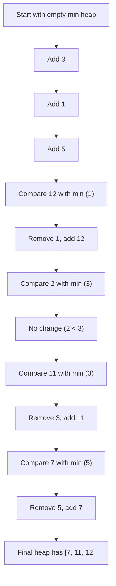

# Top K Elements

The "Top K Elements" pattern is a powerful problem-solving approach that helps you efficiently identify the K largest or smallest elements in a collection. This pattern is widely used in applications requiring sorting, prioritization, or selection from large datasets.

## Introduction

In many programming scenarios, you'll encounter situations where you need to find a specific number of maximum or minimum elements from a collection. For example:

- Finding the top 5 highest-scoring players in a game
- Identifying the 3 nearest restaurants to your location
- Selecting the 10 most frequent words in a document
- Retrieving the 5 largest files in a directory

While you could solve these problems by sorting the entire collection and taking the first K elements, this approach is inefficient for large datasets. The "Top K Elements" pattern offers more optimized solutions using data structures like heaps (priority queues).

## Understanding the Pattern

The "Top K Elements" pattern typically involves:

1. Processing a collection of elements
2. Maintaining a data structure (usually a heap) containing K elements
3. Comparing each new element with the current collection
4. Producing the final K elements that match our criteria

Let's explore how to implement this pattern using different approaches.

## Solution Approaches

### 1. Sorting Approach

The simplest approach is to sort the entire collection and take the first (or last) K elements.

```javascript
function findTopKElements(arr, k) {
  // Sort in descending order
  const sortedArray = [...arr].sort((a, b) => b - a);
  
  // Return the first k elements
  return sortedArray.slice(0, k);
}

// Example usage
const scores = [84, 95, 72, 60, 98, 88, 76];
const k = 3;
const topKScores = findTopKElements(scores, k);
console.log(`Top ${k} scores:`, topKScores);
// Output: Top 3 scores: [98, 95, 88]
```

**Time Complexity**: O(n log n) due to the sorting operation  
**Space Complexity**: O(n) for the sorted array

This approach is simple but becomes inefficient for large datasets when K is small compared to the total number of elements.

### 2. Min Heap Approach (for Top K Largest Elements)

A more efficient approach uses a min heap (priority queue) of size K:

```javascript
class MinHeap {
  constructor() {
    this.heap = [];
  }
  
  push(val) {
    this.heap.push(val);
    this.heapifyUp();
  }
  
  pop() {
    if (this.heap.length === 0) return null;
    
    const min = this.heap[0];
    const last = this.heap.pop();
    
    if (this.heap.length > 0) {
      this.heap[0] = last;
      this.heapifyDown();
    }
    
    return min;
  }
  
  peek() {
    return this.heap.length > 0 ? this.heap[0] : null;
  }
  
  size() {
    return this.heap.length;
  }
  
  heapifyUp() {
    let index = this.heap.length - 1;
    const element = this.heap[index];
    
    while (index > 0) {
      let parentIndex = Math.floor((index - 1) / 2);
      let parent = this.heap[parentIndex];
      
      if (element >= parent) break;
      
      this.heap[parentIndex] = element;
      this.heap[index] = parent;
      index = parentIndex;
    }
  }
  
  heapifyDown() {
    let index = 0;
    const length = this.heap.length;
    const element = this.heap[0];
    
    while (true) {
      let leftChildIndex = 2 * index + 1;
      let rightChildIndex = 2 * index + 2;
      let leftChild, rightChild;
      let swap = null;
      
      if (leftChildIndex < length) {
        leftChild = this.heap[leftChildIndex];
        if (leftChild < element) {
          swap = leftChildIndex;
        }
      }
      
      if (rightChildIndex < length) {
        rightChild = this.heap[rightChildIndex];
        if (
          (swap === null && rightChild < element) || 
          (swap !== null && rightChild < leftChild)
        ) {
          swap = rightChildIndex;
        }
      }
      
      if (swap === null) break;
      
      this.heap[index] = this.heap[swap];
      this.heap[swap] = element;
      index = swap;
    }
  }
}

function findTopKLargest(arr, k) {
  const minHeap = new MinHeap();
  
  // Process each element in the array
  for (const num of arr) {
    // If the heap has less than k elements, add the element
    if (minHeap.size() < k) {
      minHeap.push(num);
    } 
    // If the current element is larger than the smallest element in the heap
    else if (num > minHeap.peek()) {
      minHeap.pop(); // Remove the smallest element
      minHeap.push(num); // Add the current element
    }
  }
  
  // Extract all elements from the heap
  const result = [];
  while (minHeap.size() > 0) {
    result.push(minHeap.pop());
  }
  
  return result.reverse(); // Reverse to get descending order
}

// Example usage
const nums = [3, 1, 5, 12, 2, 11, 7];
const k = 3;
const topK = findTopKLargest(nums, k);
console.log(`Top ${k} largest elements:`, topK);
// Output: Top 3 largest elements: [12, 11, 7]
```

**Time Complexity**: O(n log k) where n is the number of elements and k is the size of the heap  
**Space Complexity**: O(k) for storing the heap

This approach is much more efficient when K is significantly smaller than the input size.

### 3. Max Heap Approach (for Top K Smallest Elements)

Similarly, we can use a max heap to find the K smallest elements:

```javascript
// Assuming we have a MaxHeap implementation similar to MinHeap
// Just change the comparison operators

function findTopKSmallest(arr, k) {
  const maxHeap = new MaxHeap();
  
  for (const num of arr) {
    if (maxHeap.size() < k) {
      maxHeap.push(num);
    } else if (num < maxHeap.peek()) {
      maxHeap.pop();
      maxHeap.push(num);
    }
  }
  
  const result = [];
  while (maxHeap.size() > 0) {
    result.push(maxHeap.pop());
  }
  
  return result; // Already in ascending order
}
```

## Visual Representation

Let's visualize how the min heap approach works when finding the top 3 largest elements from [3, 1, 5, 12, 2, 11, 7]:



## Real-World Applications

The Top K Elements pattern is used in numerous real-world applications:

### 1. Content Recommendation Systems

Streaming platforms like Netflix or YouTube use this pattern to show you the top K most relevant videos based on your viewing history.

```javascript
function getTopKRecommendations(userPreferences, contentLibrary, k) {
  // Calculate relevance score for each content
  const scoredContent = contentLibrary.map(content => {
    return {
      id: content.id,
      title: content.title,
      score: calculateRelevanceScore(content, userPreferences)
    };
  });
  
  // Use our Top K function to find the most relevant content
  return findTopKLargest(scoredContent, k, item => item.score);
}
```

### 2. Search Engine Results

When you search on Google, it needs to efficiently find the top K most relevant results from billions of web pages.

### 3. System Monitoring

Identifying the top K processes consuming the most CPU or memory on a system:

```javascript
function getTopKResourceConsumers(processes, k) {
  return findTopKLargest(processes, k, process => process.cpuUsage);
}
```

### 4. Social Media

Finding trending topics by identifying the top K most frequently used hashtags.

## Variations of the Top K Pattern

### K Closest Points

Find the K points closest to a given point (often the origin).

```javascript
function kClosestPoints(points, k, origin = [0, 0]) {
  // Calculate distance from origin for each point
  const distances = points.map(point => {
    const distance = Math.sqrt(
      Math.pow(point[0] - origin[0], 2) + Math.pow(point[1] - origin[1], 2)
    );
    return { point, distance };
  });
  
  // Use min heap to find k points with smallest distances
  // (Implementation would be similar to findTopKElements but tracking distance)
  return findTopKSmallest(distances, k, item => item.distance)
    .map(item => item.point);
}
```

### K Most Frequent Elements

Find the K most frequently occurring elements in a collection.

```javascript
function kMostFrequent(arr, k) {
  // Count frequencies
  const frequencyMap = new Map();
  for (const num of arr) {
    frequencyMap.set(num, (frequencyMap.get(num) || 0) + 1);
  }
  
  // Create array of [element, frequency] pairs
  const frequencies = [...frequencyMap.entries()];
  
  // Find top k elements based on frequency
  return findTopKLargest(frequencies, k, item => item[1])
    .map(item => item[0]);
}

// Example
const elements = [1, 1, 1, 2, 2, 3, 4, 4, 4, 4];
const k = 2;
console.log(`${k} most frequent elements:`, kMostFrequent(elements, k));
// Output: 2 most frequent elements: [4, 1]
```

## Performance Considerations

When choosing an approach for the Top K Elements pattern, consider:

1. **Input Size**: For very large datasets, the heap approach is usually better
2. **Value of K**: If K is close to the size of the input, sorting might be more efficient
3. **Memory Constraints**: The heap approach uses less memory (O(K) vs O(N))
4. **Stability**: If you need to preserve the original order of equal elements, additional considerations are needed

## Summary

The "Top K Elements" pattern is a versatile and efficient approach for finding a subset of elements from a collection based on certain criteria. The key insights are:

1. Use a heap data structure to efficiently track the top K elements
2. For finding the K largest elements, use a min heap of size K
3. For finding the K smallest elements, use a max heap of size K
4. The heap approach gives us O(n log k) time complexity, which is significantly better than the O(n log n) sorting approach when K is small

By mastering this pattern, you'll be able to efficiently solve a wide range of problems that involve finding a subset of elements from a larger collection.

## Practice Exercises

1. **Top K Frequent Words**: Given a list of words, find the K most frequently occurring words.
2. **K Closest Points to Origin**: Given a list of points on a plane, find the K closest points to the origin (0, 0).
3. **K-th Largest Element**: Find the K-th largest element in an unsorted array.
4. **Sort Characters By Frequency**: Sort the characters in a string by decreasing frequency.
5. **Top K Numbers in a Stream**: Design a class to efficiently find the top K largest elements in a continuous stream of numbers.

Happy coding!