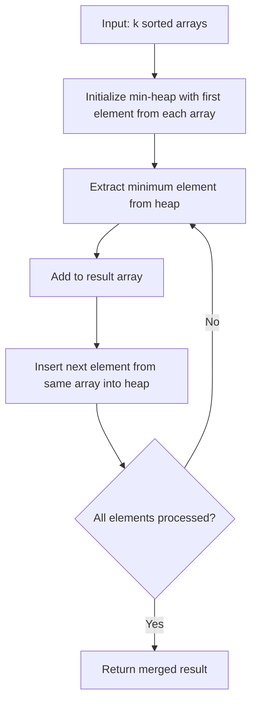

# K-way Merge

## Introduction

The K-way Merge pattern is a powerful technique used to efficiently combine multiple sorted arrays or collections into a single sorted output. This pattern extends the fundamental concept of merging that you might be familiar with from the Merge Sort algorithm, but instead of merging just two sorted arrays, it handles merging `k` sorted arrays simultaneously.

This pattern is particularly useful when dealing with large datasets that are already sorted in parts, and you need to combine them while maintaining the sorted order. The K-way Merge pattern is an essential technique to have in your algorithmic toolkit as it appears in various real-world scenarios and coding interviews.

## Understanding the K-way Merge Pattern

### The Basic Concept

At its core, the K-way Merge pattern involves:

1. Taking `k` sorted arrays/lists as input
2. Comparing the smallest (or largest, depending on the sorting order) elements from each array
3. Selecting the smallest among them and adding it to the result
4. Repeating until all elements from all arrays have been processed

### Why Is It Useful?

- **Efficiency**: It allows us to combine multiple sorted collections without having to resort the combined data.
- **Scalability**: Works well with large datasets and external sorting.
- **Optimization**: Often provides better time complexity than naive approaches.

## Step-by-Step Implementation

Let's implement a K-way Merge algorithm using a min-heap approach. This allows us to efficiently find the minimum element among the front elements of all arrays.

```python
import heapq

def k_way_merge(sorted_arrays):
    """
    Merge k sorted arrays into a single sorted array using a min-heap.
    
    Args:
        sorted_arrays: A list of sorted arrays
        
    Returns:
        A single sorted array containing all elements from input arrays
    """
    result = []
    
    # Create a min-heap of (value, array_index, element_index) tuples
    min_heap = []
    
    # Initialize with the first element from each array
    for i, arr in enumerate(sorted_arrays):
        if arr:  # Only if the array is not empty
            heapq.heappush(min_heap, (arr[0], i, 0))
    
    # Process elements from the heap
    while min_heap:
        # Get the smallest element
        val, array_idx, element_idx = heapq.heappop(min_heap)
        
        # Add it to the result
        result.append(val)
        
        # If there are more elements in the same array, add the next one to the heap
        if element_idx + 1 < len(sorted_arrays[array_idx]):
            next_idx = element_idx + 1
            next_val = sorted_arrays[array_idx][next_idx]
            heapq.heappush(min_heap, (next_val, array_idx, next_idx))
    
    return result
```

### Example Usage:

```python
# Example arrays
arr1 = [1, 5, 7, 9]
arr2 = [2, 4, 6, 8]
arr3 = [0, 3, 10]

# Merge the arrays
merged = k_way_merge([arr1, arr2, arr3])
print(merged)
# Output: [0, 1, 2, 3, 4, 5, 6, 7, 8, 9, 10]
```

## How It Works: Visual Explanation

Let's visualize the process of merging multiple sorted arrays:



## Time and Space Complexity Analysis

- **Time Complexity**: O(n log k), where:
  - n is the total number of elements across all arrays
  - k is the number of arrays
  - The log k factor comes from heap operations (insertion and removal)

- **Space Complexity**: O(k) for the heap + O(n) for the output array = O(n + k)

## Practical Applications

The K-way Merge pattern appears in many real-world scenarios:

### 1. External Sorting

When sorting data that doesn't fit into memory, external sorting algorithms break the data into chunks, sort each chunk independently, and then use K-way Merge to combine them.

### 2. Merge K Sorted Lists

A classic interview problem involves merging k sorted linked lists into a single sorted linked list. This is a direct application of the K-way Merge pattern.

```python
# Definition for a singly-linked list node
class ListNode:
    def __init__(self, val=0, next=None):
        self.val = val
        self.next = next

def merge_k_lists(lists):
    """
    Merge k sorted linked lists into one sorted linked list.
    
    Args:
        lists: A list of sorted linked list heads
        
    Returns:
        Head of the merged linked list
    """
    # Create a dummy head
    dummy = ListNode(0)
    current = dummy
    
    # Create a min-heap
    heap = []
    
    # Add the head of each list to the heap
    for i, head in enumerate(lists):
        if head:
            # Use a tuple of (value, list_index, node) for the heap
            # We include the list_index to avoid comparing nodes when values are equal
            heapq.heappush(heap, (head.val, i, head))
    
    # Process nodes from the heap
    while heap:
        # Get the node with the smallest value
        val, list_idx, node = heapq.heappop(heap)
        
        # Connect it to our result list
        current.next = node
        current = current.next
        
        # Add the next node from the same list to the heap
        if node.next:
            heapq.heappush(heap, (node.next.val, list_idx, node.next))
    
    return dummy.next
```

### 3. Finding the K Smallest Elements in N Sorted Arrays

Another common problem is to find the K smallest elements from N sorted arrays.

```python
def find_k_smallest(arrays, k):
    """
    Find the k smallest elements across multiple sorted arrays.
    
    Args:
        arrays: A list of sorted arrays
        k: Number of smallest elements to find
        
    Returns:
        List of k smallest elements
    """
    result = []
    min_heap = []
    
    # Initialize with the first element from each array
    for i, arr in enumerate(arrays):
        if arr:
            heapq.heappush(min_heap, (arr[0], i, 0))
    
    # Extract k elements from the heap
    while min_heap and len(result) < k:
        val, array_idx, element_idx = heapq.heappop(min_heap)
        result.append(val)
        
        # Add the next element from the same array
        if element_idx + 1 < len(arrays[array_idx]):
            next_idx = element_idx + 1
            next_val = arrays[array_idx][next_idx]
            heapq.heappush(min_heap, (next_val, array_idx, next_idx))
    
    return result
```

### 4. Database Operations

The K-way Merge pattern is often used in database systems for sorting and merging operations, especially when the data being processed is too large to fit into memory.

## Variations and Optimizations

### 1. Using Different Priority Queues

While we used Python's `heapq` for simplicity, in production systems, you might use different priority queue implementations based on your specific needs:

- Binary heaps (used in our examples)
- Fibonacci heaps
- Self-balancing binary search trees

### 2. Parallel Processing

For extremely large datasets, you can parallelize the merge process by:
- Dividing the k arrays into groups
- Merging each group in parallel
- Performing a final merge of the results

### 3. External Memory Algorithms

When dealing with data that doesn't fit in memory, specialized external memory variations of K-way Merge are used.

## Problem-Solving Examples

### Example 1: Merge K Sorted Arrays

Let's solve a problem where we need to merge K sorted arrays.

```python
def merge_k_sorted_arrays(arrays):
    """
    Merge k sorted arrays into one sorted array.
    """
    if not arrays:
        return []
    
    # Use our k_way_merge function
    return k_way_merge(arrays)

# Test with example
arrays = [
    [1, 4, 7],
    [2, 5, 8],
    [3, 6, 9]
]
result = merge_k_sorted_arrays(arrays)
print(result)
# Output: [1, 2, 3, 4, 5, 6, 7, 8, 9]
```

### Example 2: Find the Kth Smallest Element in a Sorted Matrix

Another classic problem that can be solved using the K-way Merge pattern.

```python
def kth_smallest_in_matrix(matrix, k):
    """
    Find the kth smallest element in a n x n matrix where each row and column is sorted.
    
    Args:
        matrix: n x n sorted matrix
        k: position of the element to find (1-based)
        
    Returns:
        The kth smallest element
    """
    n = len(matrix)
    min_heap = []
    
    # Add the first element of each row to the heap
    for r in range(min(n, k)):
        heapq.heappush(min_heap, (matrix[r][0], r, 0))
    
    # Extract elements from the heap until we reach the kth element
    for _ in range(k-1):
        if not min_heap:
            break
            
        val, row, col = heapq.heappop(min_heap)
        
        # Add the next element from the same row if it exists
        if col + 1 < n:
            heapq.heappush(min_heap, (matrix[row][col+1], row, col+1))
    
    # The top element in the heap is our kth smallest
    if min_heap:
        return min_heap[0][0]
    return None

# Example
matrix = [
    [1, 5, 9],
    [10, 11, 13],
    [12, 13, 15]
]
print(kth_smallest_in_matrix(matrix, 8))
# Output: 13
```

## Summary

The K-way Merge pattern is a powerful technique for combining multiple sorted collections into a single sorted output efficiently. It's particularly useful when dealing with large datasets and forms the basis for many important algorithms and applications.

Key points to remember:
- K-way Merge uses a priority queue (heap) to efficiently select the next smallest element
- It has a time complexity of O(n log k), which is more efficient than sorting all elements together
- The pattern is widely used in external sorting, database operations, and many interview problems
- Understanding K-way Merge helps solve a variety of problems involving multiple sorted collections

## Practice Exercises

To solidify your understanding of the K-way Merge pattern, try these exercises:

1. Implement a K-way Merge algorithm that merges K sorted linked lists
2. Find the median of K sorted arrays
3. Modify the K-way Merge to work with streams or iterators (where you don't have the full arrays in memory)
4. Implement an external K-way Merge sort for files that are too large to fit in memory
5. Create a K-way Merge function that can handle arrays sorted in different orders (some ascending, some descending)

## Additional Resources

- **Books**:
  - "Introduction to Algorithms" by Cormen, Leiserson, Rivest, and Stein
  - "The Art of Computer Programming, Volume 3: Sorting and Searching" by Donald Knuth

- **Online Platforms to Practice**:
  - LeetCode (search for problems involving merging k sorted lists)
  - HackerRank
  - CodeSignal

Happy coding, and have fun implementing the K-way Merge pattern in your projects!