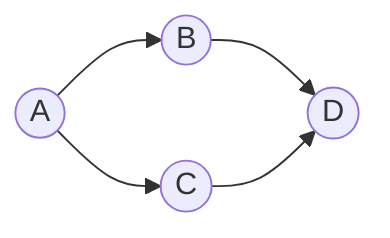
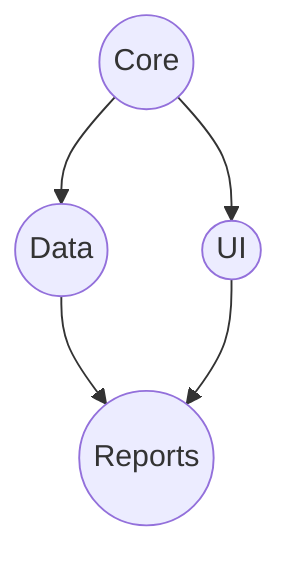
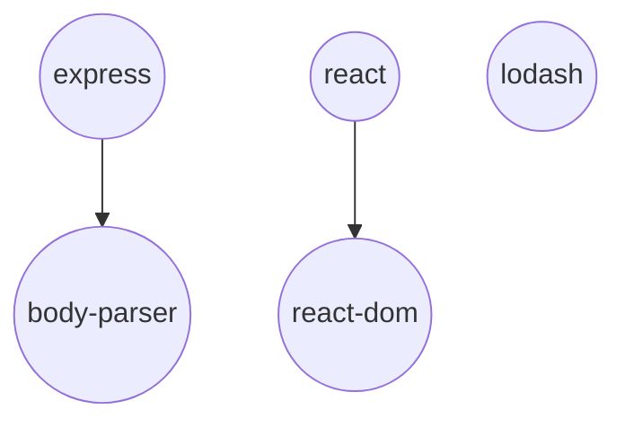

# Topological Sort

## Introduction

Topological Sort is a linear ordering of vertices in a directed graph such that for every directed edge (u, v), vertex u comes before vertex v in the ordering. In simpler terms, if there's a path from node A to node B in the graph, then node A appears before node B in the topological ordering.

This algorithm is particularly useful when you need to schedule tasks with dependencies. For instance, if task B depends on task A being completed first, we could represent this as a directed edge from A to B. Topological Sort would then give us a valid sequence to complete all tasks without violating any dependencies.

:::note
Topological Sort only works on **Directed Acyclic Graphs (DAGs)**. If the graph contains a cycle, then a valid topological ordering isn't possible.
:::

## Understanding Topological Sort

### Prerequisites

Before diving into Topological Sort, make sure you understand:
- Basic graph concepts
- Directed graphs
- Graph traversal algorithms (DFS/BFS)

### Visual Representation

Let's understand Topological Sort visually:



In this graph:
- A directed edge from A to B means B depends on A
- One valid topological ordering would be: A, B, C, D
- Another valid ordering could be: A, C, B, D

Both orderings ensure that a vertex appears before all vertices it has edges to.

## Implementations

There are two common ways to implement Topological Sort:

1. **Kahn's Algorithm** (using BFS)
2. **DFS-based approach**

Let's explore both:

### DFS-based Topological Sort

```javascript
function topologicalSort(graph) {
  const visited = new Set();
  const stack = [];
  
  function dfs(node) {
    visited.add(node);
    
    // Visit all neighbors
    for (const neighbor of graph[node]) {
      if (!visited.has(neighbor)) {
        dfs(neighbor);
      }
    }
    
    // Add current node to the beginning of result
    stack.unshift(node);
  }
  
  // Run DFS on all unvisited vertices
  for (const node in graph) {
    if (!visited.has(node)) {
      dfs(node);
    }
  }
  
  return stack;
}

// Example usage
const graph = {
  'A': ['B', 'C'],
  'B': ['D'],
  'C': ['D'],
  'D': []
};

console.log(topologicalSort(graph)); // Output: ['A', 'C', 'B', 'D']
```

### Kahn's Algorithm (BFS-based Topological Sort)

```javascript
function kahnTopologicalSort(graph) {
  // Calculate in-degree for each vertex
  const inDegree = {};
  const result = [];
  const queue = [];
  
  // Initialize in-degree for all nodes to 0
  for (const node in graph) {
    inDegree[node] = 0;
  }
  
  // Calculate in-degree for each node
  for (const node in graph) {
    for (const neighbor of graph[node]) {
      inDegree[neighbor] = (inDegree[neighbor] || 0) + 1;
    }
  }
  
  // Add all nodes with in-degree 0 to the queue
  for (const node in inDegree) {
    if (inDegree[node] === 0) {
      queue.push(node);
    }
  }
  
  // Process nodes in queue
  while (queue.length > 0) {
    const current = queue.shift();
    result.push(current);
    
    // Reduce in-degree of neighbors
    for (const neighbor of graph[current]) {
      inDegree[neighbor]--;
      
      // If in-degree becomes 0, add to queue
      if (inDegree[neighbor] === 0) {
        queue.push(neighbor);
      }
    }
  }
  
  // Check if we've visited all nodes
  if (result.length !== Object.keys(graph).length) {
    return "Graph has a cycle, topological sort not possible!";
  }
  
  return result;
}

// Example usage
const graph = {
  'A': ['B', 'C'],
  'B': ['D'],
  'C': ['D'],
  'D': []
};

console.log(kahnTopologicalSort(graph)); // Output: ['A', 'B', 'C', 'D'] or ['A', 'C', 'B', 'D']
```

## Time and Space Complexity

For both algorithms:
- **Time Complexity**: O(V + E), where V is the number of vertices and E is the number of edges
- **Space Complexity**: O(V)

## Detecting Cycles in a Graph

An important aspect of Topological Sort is detecting cycles. If a graph has a cycle, a valid topological ordering isn't possible. Both algorithms can be modified to detect cycles:

- In the DFS approach: Use a separate set to track nodes in the current recursion stack.
- In Kahn's algorithm: If the result array doesn't contain all vertices, there's a cycle.

## Real-World Applications

Topological Sort has many practical applications:

### 1. Task Scheduling

Consider a software build system where certain libraries must be compiled before others:



A valid build order using topological sort would be: Core → Data → UI → Reports

### 2. Course Prerequisites

In college, some courses require prerequisites:

```javascript
const courseGraph = {
  'Calculus I': ['Calculus II'],
  'Calculus II': ['Differential Equations'],
  'Programming Basics': ['Data Structures', 'Algorithms'],
  'Data Structures': ['Algorithms'],
  'Algorithms': ['Advanced Algorithms'],
  'Differential Equations': []
};

console.log(topologicalSort(courseGraph));
// Possible output: ['Calculus I', 'Programming Basics', 'Calculus II', 'Data Structures', 'Differential Equations', 'Algorithms', 'Advanced Algorithms']
```

### 3. Package Dependencies

In package managers like npm or pip, packages have dependencies that must be installed first:



Topological sort ensures dependencies are installed in the correct order.

## Common Pitfalls and Tips

1. **Remember to check for cycles**: A DAG shouldn't have cycles.
2. **Multiple valid orderings**: There can be multiple valid topological sorts for a graph.
3. **Empty graph**: A graph with no edges has a trivial topological ordering.
4. **Disconnected components**: Process each component separately.

## Practice Exercise: Course Scheduler

**Problem**: Given a list of courses and their prerequisites, determine if you can finish all courses.

**Input**:
- Number of courses `n` (labeled from 0 to n-1)
- Prerequisites as pairs `[a, b]` indicating course `a` requires course `b`

**Example**:
```javascript
numCourses = 4;
prerequisites = [[1,0], [2,0], [3,1], [3,2]];
// Can be visualized as:
// 0 -> 1 -> 3
// |         ^
// └-> 2 ----┘
```

**Solution using Topological Sort**:

```javascript
function canFinishCourses(numCourses, prerequisites) {
  // Create adjacency list
  const graph = {};
  for (let i = 0; i < numCourses; i++) {
    graph[i] = [];
  }
  
  // Build the graph
  for (const [course, prereq] of prerequisites) {
    graph[prereq].push(course);
  }
  
  // Track visited nodes and nodes in current path
  const visited = new Set();
  const path = new Set();
  
  function hasCycle(node) {
    // If node is in current path, we found a cycle
    if (path.has(node)) return true;
    // If already processed and no cycle found
    if (visited.has(node)) return false;
    
    path.add(node);
    
    // Check all neighbors for cycles
    for (const neighbor of graph[node]) {
      if (hasCycle(neighbor)) return true;
    }
    
    path.delete(node);
    visited.add(node);
    return false;
  }
  
  // Check each node for cycles
  for (let i = 0; i < numCourses; i++) {
    if (hasCycle(i)) return false;
  }
  
  return true;
}

// Test
console.log(canFinishCourses(4, [[1,0], [2,0], [3,1], [3,2]])); // true
console.log(canFinishCourses(2, [[1,0], [0,1]])); // false (cycle)
```

## Summary

Topological Sort is a powerful algorithm for processing directed acyclic graphs. It orders vertices such that all directed edges go from earlier to later vertices in the sequence.

Key takeaways:
- Only works on directed acyclic graphs (DAGs)
- Can be implemented using either DFS or BFS (Kahn's algorithm)
- Has time complexity O(V + E)
- Useful for dependency resolution, task scheduling, and more
- Multiple valid topological orderings may exist

## Additional Resources

- Try implementing both algorithms from scratch
- Solve these classic problems that use topological sort:
  - Course Schedule (LeetCode #207)
  - Alien Dictionary (LeetCode #269)
  - Minimum Height Trees (LeetCode #310)

## Practice Exercises

1. Implement a function to detect if a graph has a valid topological ordering
2. Find all possible topological orderings of a given graph
3. Solve the "Build Order" problem: Given a list of projects and dependencies, find a build order that allows building all projects