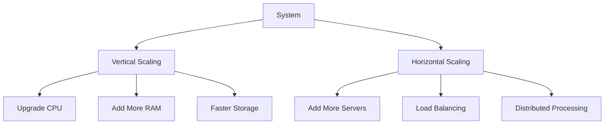
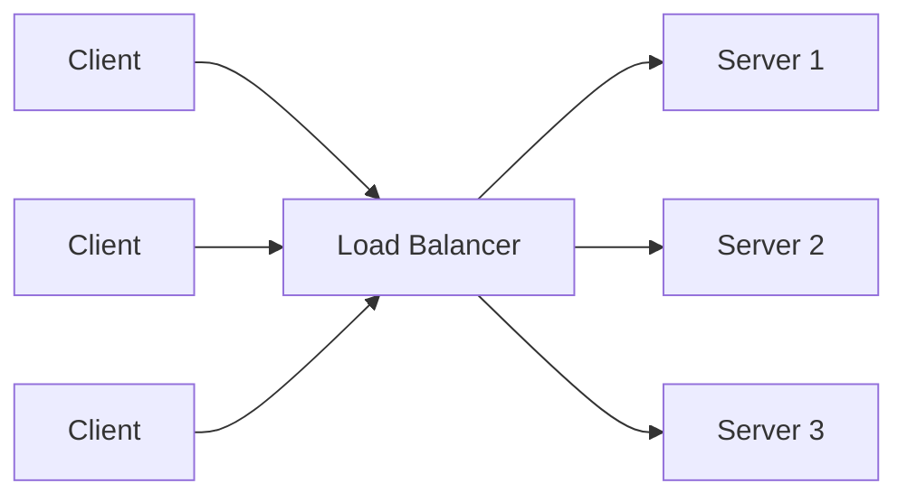
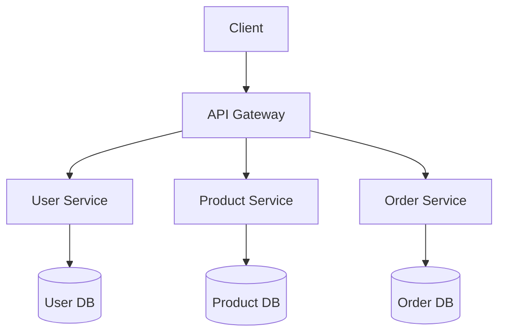
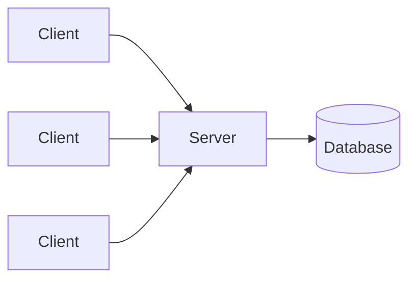
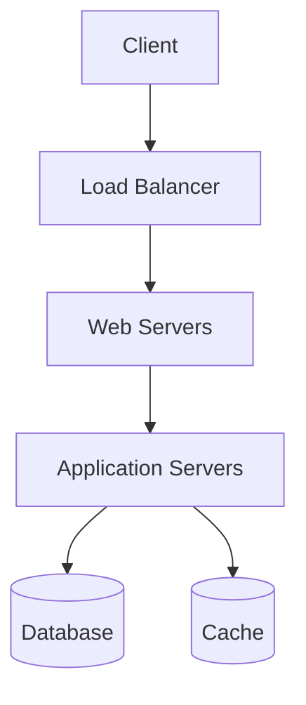

# System Design Fundamentals

## Introduction

System design is the process of defining the architecture, components, interfaces, and data for a system to satisfy specified requirements. Understanding system design fundamentals is crucial for building applications that can scale, remain reliable under load, and efficiently serve users' needs.

Whether you're designing a simple web application or a complex distributed system, the core principles remain the same. This guide will walk you through the essential concepts that form the foundation of effective system design.

## Why System Design Matters

Even for beginners, understanding system design principles is important because:

- It helps you build applications that can grow with your user base
- It reduces technical debt and the need for painful rewrites later
- It improves reliability and user experience
- It provides a structured approach to solving complex problems
- It's a critical skill for advancing in software engineering careers

## Core System Design Concepts

### 1. Scalability

Scalability refers to a system's ability to handle growing amounts of work by adding resources.

#### Types of Scalability

- **Vertical Scaling (Scaling Up)**: Adding more power (CPU, RAM) to your existing machine
- **Horizontal Scaling (Scaling Out)**: Adding more machines to your pool of resources



#### Example: Scaling a Web Application

For a simple web application:

- **Vertical Scaling**: Upgrading from a server with 4GB RAM to one with 16GB RAM
- **Horizontal Scaling**: Moving from a single server to multiple servers behind a load balancer

```javascript
// Simple Node.js server
const express = require('express');
const app = express();

app.get('/', (req, res) => {
  res.send('Hello World!');
});

// In vertical scaling, we might just increase resources for this single instance
const PORT = process.env.PORT || 3000;
app.listen(PORT, () => {
  console.log(`Server running on port ${PORT}`);
});
```

With horizontal scaling, we'd deploy this same code to multiple servers and add a load balancer in front.

### 2. Reliability

Reliability is the probability that a system will perform its intended function for a specified period.

#### Key Components of Reliability:

- **Fault Tolerance**: The ability to continue operating despite failures
- **Redundancy**: Duplicating critical components to ensure backup availability
- **Error Handling**: Proper detection and management of errors

#### Example: Adding Redundancy

```javascript
// Simple example of redundancy in database connections
const primary = connectToDatabase('primary-db-server');
const secondary = connectToDatabase('secondary-db-server');

async function executeQuery(query) {
  try {
    return await primary.query(query);
  } catch (error) {
    console.log('Primary database failed, falling back to secondary');
    return await secondary.query(query);
  }
}
```

### 3. Availability

Availability is the proportion of time a system is in a functioning condition. It's often measured in "nines" - for example, "five nines" (99.999%) availability means the system is down for only about 5 minutes per year.

#### Strategies to Improve Availability:

- **Eliminate Single Points of Failure**: Ensure no single component can cause system-wide failure
- **Implement Proper Monitoring**: Detect issues before they cause outages
- **Design for Graceful Degradation**: System continues to function with reduced capabilities during failures

### 4. Performance

Performance refers to how quickly a system responds to user actions or processes data.

#### Key Performance Metrics:

- **Latency**: Time taken to respond to a request
- **Throughput**: Number of operations the system can handle per unit time
- **Response Time**: Total time from request to response

#### Example: Improving API Performance

```javascript
// Before optimization
app.get('/users', async (req, res) => {
  const users = await database.fetchAllUsers();
  res.json(users);
});

// After optimization with pagination
app.get('/users', async (req, res) => {
  const page = parseInt(req.query.page) || 1;
  const limit = parseInt(req.query.limit) || 20;
  const offset = (page - 1) * limit;
  
  const users = await database.fetchUsers(limit, offset);
  res.json({
    users,
    pagination: {
      currentPage: page,
      pageSize: limit,
      hasMore: users.length === limit
    }
  });
});
```

### 5. Maintainability

Maintainability is how easily a system can be modified to correct faults, improve performance, or adapt to a changed environment.

#### Principles for Maintainable Systems:

- **Modularity**: Building systems from smaller, interchangeable components
- **Clean Interfaces**: Well-defined APIs between components
- **Documentation**: Clear documentation of system design and components
- **Testing**: Comprehensive test coverage to catch regressions

### 6. Load Balancing

Load balancing is the practice of distributing computational workloads across multiple computers or servers.

#### Common Load Balancing Algorithms:

- **Round Robin**: Requests are distributed sequentially across the server group
- **Least Connections**: New requests go to the server with the fewest active connections
- **Resource-Based**: Load is distributed based on servers' current resource usage



### 7. Caching

Caching is storing copies of frequently accessed data in a high-speed data storage layer.

#### Common Caching Strategies:

- **Client-Side Caching**: Storing data in the user's browser
- **CDN Caching**: Using Content Delivery Networks to cache static assets closer to users
- **Application Caching**: Caching at the application level to reduce database load

#### Example: Implementing Redis Caching

```javascript
const express = require('express');
const redis = require('redis');
const app = express();
const client = redis.createClient();

app.get('/products/:id', async (req, res) => {
  const productId = req.params.id;
  
  // Try to get from cache first
  client.get(`product:${productId}`, async (err, cachedProduct) => {
    if (cachedProduct) {
      return res.json(JSON.parse(cachedProduct));
    }
    
    // If not in cache, get from database
    const product = await database.getProductById(productId);
    
    // Save to cache for future requests (expire after 1 hour)
    client.setex(`product:${productId}`, 3600, JSON.stringify(product));
    
    return res.json(product);
  });
});
```

## Common System Design Patterns

### 1. Microservices Architecture

Breaking an application into small, loosely coupled services that can be developed, deployed, and scaled independently.



**Benefits**:
- Independent development and deployment
- Technology diversity (different services can use different technologies)
- Fault isolation
- Scalability at the service level

**Challenges**:
- Increased complexity in service-to-service communication
- Data consistency across services
- Operational overhead

### 2. Client-Server Architecture

A computing model where a server hosts, delivers, and manages resources and services that clients request.



**Benefits**:
- Centralized data storage and control
- Easier security implementation
- Reduced client-side requirements

### 3. Publish-Subscribe Pattern

A messaging pattern where senders (publishers) do not send messages directly to receivers (subscribers) but instead categorize messages into topics without knowledge of which subscribers will receive them.

```javascript
// Example using Node.js EventEmitter
const EventEmitter = require('events');
const eventBus = new EventEmitter();

// Subscriber
eventBus.on('userCreated', (user) => {
  console.log(`Sending welcome email to ${user.email}`);
  sendWelcomeEmail(user.email);
});

// Another subscriber for the same event
eventBus.on('userCreated', (user) => {
  console.log(`Adding user ${user.id} to analytics`);
  trackUserSignup(user.id);
});

// Publisher
function createUser(userData) {
  // Create user in database
  const newUser = database.users.create(userData);
  
  // Publish event
  eventBus.emit('userCreated', newUser);
  
  return newUser;
}
```

## Practical System Design Example: Building a URL Shortener

Let's examine how system design principles apply to building a URL shortening service like bit.ly.

### Requirements:

1. Generate short URLs for long URLs
2. Redirect users from short URLs to original long URLs
3. Track click statistics
4. Handle high traffic volume

### High-Level Design:



### Components:

1. **API Service**:
   - Endpoint to create short URLs
   - Endpoint to redirect short URLs to original URLs

2. **URL Storage**:
   - Database to store URL mappings
   - Cache for frequently accessed URLs

3. **ID Generation Service**:
   - Creates unique short codes for URLs

### Example Implementation:

```javascript
const express = require('express');
const redis = require('redis');
const { nanoid } = require('nanoid');
const app = express();
const client = redis.createClient();

app.use(express.json());

// Create short URL
app.post('/api/shorten', async (req, res) => {
  const { longUrl } = req.body;
  if (!longUrl) {
    return res.status(400).json({ error: 'URL is required' });
  }
  
  // Generate a short ID (6 characters)
  const shortId = nanoid(6);
  
  // Store in database
  await database.storeUrl(shortId, longUrl);
  
  // Also cache it
  client.set(`url:${shortId}`, longUrl);
  
  const shortUrl = `http://short.url/${shortId}`;
  res.json({ shortUrl });
});

// Redirect to original URL
app.get('/:shortId', async (req, res) => {
  const { shortId } = req.params;
  
  // Try to get URL from cache
  client.get(`url:${shortId}`, async (err, cachedUrl) => {
    if (cachedUrl) {
      // Track this click
      trackClick(shortId);
      return res.redirect(cachedUrl);
    }
    
    // If not in cache, try database
    const longUrl = await database.getLongUrl(shortId);
    if (!longUrl) {
      return res.status(404).json({ error: 'URL not found' });
    }
    
    // Cache for future requests
    client.set(`url:${shortId}`, longUrl);
    
    // Track this click
    trackClick(shortId);
    
    res.redirect(longUrl);
  });
});

function trackClick(shortId) {
  // Increment click count in database
  database.incrementClickCount(shortId);
  
  // Could also publish an event for analytics processing
  eventBus.emit('urlClicked', { shortId, timestamp: new Date() });
}

const PORT = process.env.PORT || 3000;
app.listen(PORT, () => {
  console.log(`Server running on port ${PORT}`);
});
```

## Scaling Considerations:

1. **Database Sharding**: As URL mappings grow, we might need to partition data across multiple database servers
2. **Caching Layer**: Redis or Memcached to reduce database load
3. **CDN**: For static assets and possibly even for redirects in certain cases
4. **Analytics Processing**: Separate system for processing click data

## System Design Interview Tips

If you're preparing for system design interviews, keep these tips in mind:

1. **Clarify Requirements**: Always start by clarifying functional and non-functional requirements
2. **Think About Scale**: Consider how your design will handle growth
3. **Identify Bottlenecks**: Proactively point out potential bottlenecks and how to address them
4. **Start High-Level**: Begin with a high-level design before diving into details
5. **Justify Trade-offs**: Explain the reasoning behind your design choices
6. **Know Your Numbers**: Understand typical system design numbers (e.g., QPS a single server can handle, typical database read/write speeds)

## Summary

System design fundamentals provide the building blocks for creating robust, scalable, and maintainable software systems. We've covered:

- Core concepts like scalability, reliability, and performance
- Key architectural patterns including microservices and publish-subscribe
- Practical application through a URL shortener example
- Considerations for real-world implementation

Understanding these principles will help you make better design decisions and build systems that can grow with your users' needs.

## Exercises

1. Design a simple photo-sharing application. Consider how users upload, store, and view images.
2. Analyze an existing application you use regularly (e.g., Twitter, Instagram). Identify how it might implement the system design principles we've discussed.
3. Extend the URL shortener example to include user accounts and analytics dashboards.
4. Research and compare different database options (SQL vs. NoSQL) for a discussion forum application.

## Additional Resources

- Books:
  - "Designing Data-Intensive Applications" by Martin Kleppmann
  - "System Design Interview" by Alex Xu
  
- Online Courses:
  - MIT's Distributed Systems course
  - Stanford's Database Systems courses
  
- Practice Platforms:
  - LeetCode's System Design questions
  - HackerRank's System Design challenges