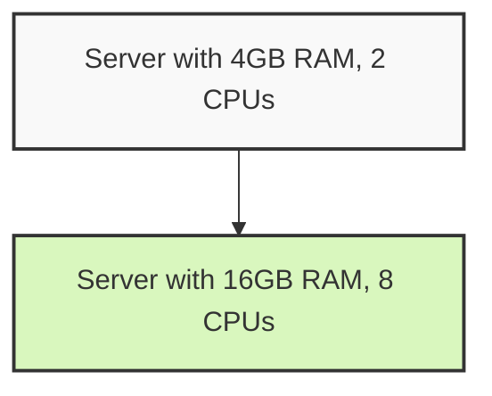
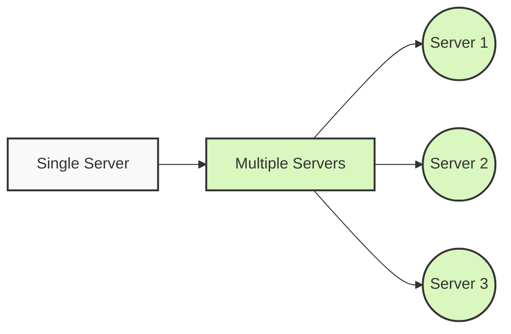
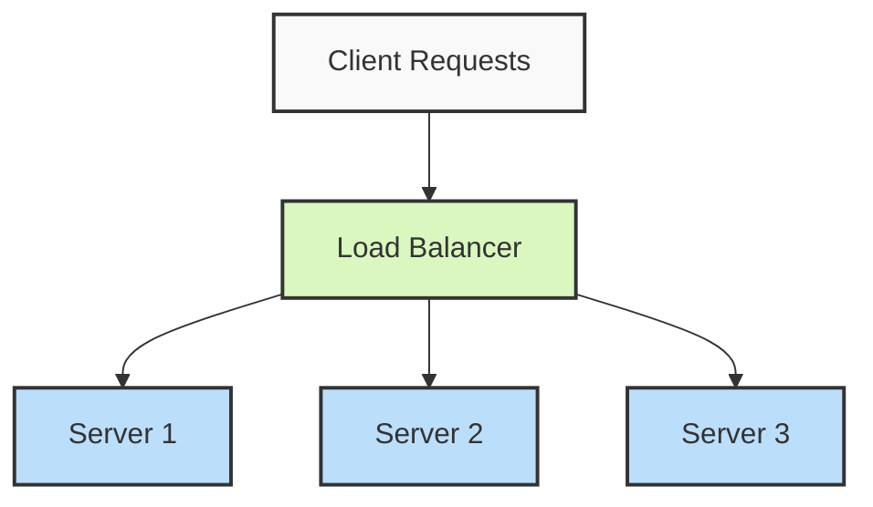
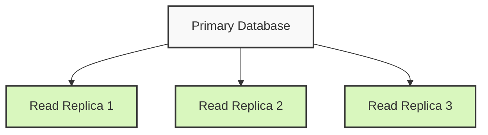
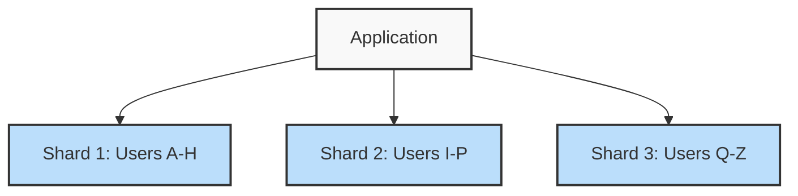
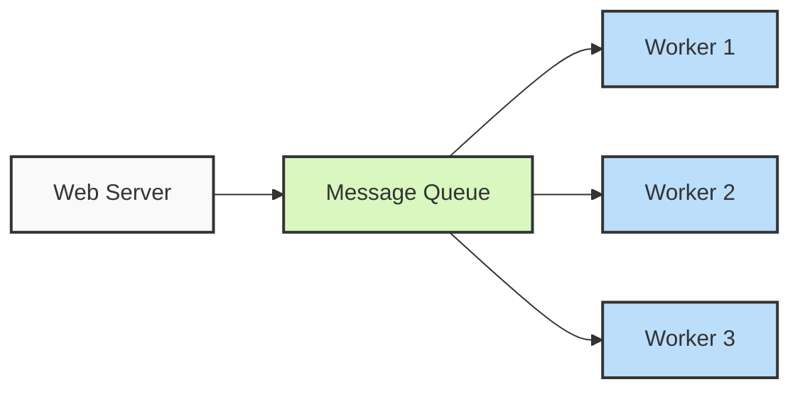
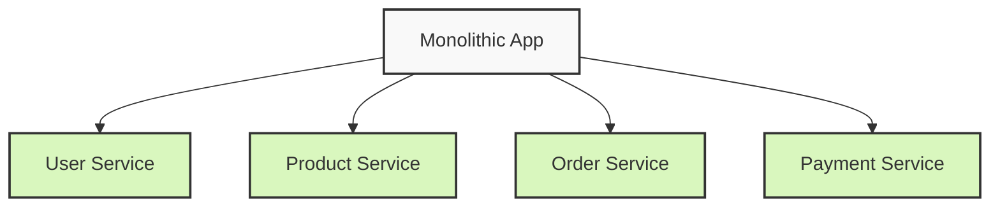

# Scalability Concepts

## Introduction

Scalability is a system's ability to handle growing amounts of work by adding resources to the system. In software engineering, a scalable application can maintain performance levels when user load or data volume increases. As your application grows from serving a handful of users to potentially millions, understanding scalability becomes crucial.

This guide explores core scalability concepts that every developer should understand when designing systems that can grow gracefully.

## Why Scalability Matters

Imagine you've built a simple web application that works perfectly for 100 users. What happens when your user base grows to 10,000 or even 1 million users? Without proper scalability planning:

- Response times slow down dramatically
- The system may crash under heavy loads
- Database operations become bottlenecks
- Users experience timeouts and errors

A well-scaled system, on the other hand, maintains consistent performance regardless of user count or data volume.

## Types of Scaling

There are two primary approaches to scaling systems:

### Vertical Scaling (Scaling Up)

Vertical scaling involves adding more power to your existing machines by increasing resources like:

- CPU
- RAM
- Storage
- Network capacity



**Advantages:**
- Simpler to implement
- No distribution complexity
- Can be quick to deploy

**Limitations:**
- Hardware has physical limits
- Often requires downtime during upgrades
- More expensive as you scale higher
- Single point of failure remains

**Example:** Upgrading your database server from 8GB RAM to 32GB RAM to handle more concurrent connections.

### Horizontal Scaling (Scaling Out)

Horizontal scaling involves adding more machines to your pool of resources, distributing the load across multiple servers.



**Advantages:**
- Practically unlimited scaling potential
- Better fault tolerance (no single point of failure)
- Can use commodity hardware (more cost-effective)
- Often allows for zero-downtime scaling

**Limitations:**
- More complex to implement
- Requires architecture designed for distribution
- Data consistency challenges across nodes
- Need for load balancing

**Example:** Adding more web server instances behind a load balancer to handle increasing traffic.

## Core Scalability Strategies

### 1. Load Balancing

Load balancers distribute incoming traffic across multiple servers to ensure no single server bears too much demand.



**Common load balancing algorithms:**

- **Round-robin:** Routes requests to each server in turn
- **Least connections:** Routes to server with fewest active connections
- **IP hash:** Uses client IP to determine which server receives the request (helps with session persistence)
- **Weighted round-robin:** Assigns different capacities to servers

**Example implementation with NGINX configuration:**

```nginx
http {
    upstream backend_servers {
        server backend1.example.com weight=3;
        server backend2.example.com;
        server backend3.example.com;
    }

    server {
        listen 80;
        location / {
            proxy_pass http://backend_servers;
        }
    }
}
```

### 2. Caching

Caching stores frequently accessed data in a high-speed data storage layer to reduce database load and improve response times.

**Types of caching:**

- **Application cache:** In-memory storage within your application
- **Distributed cache:** Like Redis or Memcached
- **CDN:** For static assets
- **Database query cache:** For frequent database queries

**Example of implementing Redis caching in Node.js:**

```javascript
const redis = require('redis');
const client = redis.createClient();

async function getUserProfile(userId) {
  // Try to get data from cache first
  const cachedData = await client.get(`user:${userId}`);
  
  if (cachedData) {
    return JSON.parse(cachedData); // Cache hit
  }
  
  // Cache miss - fetch from database
  const userData = await database.getUserById(userId);
  
  // Store in cache for future requests (expire after 1 hour)
  await client.set(`user:${userId}`, JSON.stringify(userData), 'EX', 3600);
  
  return userData;
}
```

### 3. Database Scaling

Databases often become bottlenecks in growing systems. Key scaling strategies include:

#### Vertical Scaling
Upgrading the database server with more resources.

#### Horizontal Scaling
**Replication:** Creating copies of your database.



**Example MySQL primary-replica configuration:**

```sql
-- On primary server
CREATE USER 'replication_user'@'%' IDENTIFIED BY 'password';
GRANT REPLICATION SLAVE ON *.* TO 'replication_user'@'%';

-- On replica server
CHANGE MASTER TO
  MASTER_HOST='primary_server_ip',
  MASTER_USER='replication_user',
  MASTER_PASSWORD='password',
  MASTER_LOG_FILE='mysql-bin.000001',
  MASTER_LOG_POS=107;
START SLAVE;
```

**Sharding:** Splitting the database across multiple machines by distributing data.



### 4. Asynchronous Processing

Moving time-consuming tasks out of the request-response cycle improves scalability.



**Example using a message queue with Node.js and RabbitMQ:**

```javascript
// Producer (Web Server)
const amqp = require('amqplib');

async function sendEmailTask(email, subject, body) {
  const connection = await amqp.connect('amqp://localhost');
  const channel = await connection.createChannel();
  
  await channel.assertQueue('email_tasks');
  channel.sendToQueue('email_tasks', Buffer.from(
    JSON.stringify({ email, subject, body })
  ));
  
  console.log("Email task queued");
  await channel.close();
  await connection.close();
}

// Consumer (Worker)
async function startWorker() {
  const connection = await amqp.connect('amqp://localhost');
  const channel = await connection.createChannel();
  
  await channel.assertQueue('email_tasks');
  channel.consume('email_tasks', async (msg) => {
    if (msg) {
      const data = JSON.parse(msg.content.toString());
      
      // Process the task (send email)
      await sendEmail(data.email, data.subject, data.body);
      
      channel.ack(msg);
    }
  });
  
  console.log("Email worker started");
}
```

### 5. Microservices Architecture

Breaking a monolithic application into smaller, independently deployable services.



**Benefits for scalability:**
- Independent scaling of services based on their specific load
- Technology diversity (use the right tool for each service)
- Easier team scaling (different teams own different services)
- Fault isolation

**Example API Gateway pattern with Express.js:**

```javascript
const express = require('express');
const { createProxyMiddleware } = require('http-proxy-middleware');
const app = express();

// User service
app.use('/api/users', createProxyMiddleware({ 
  target: 'http://user-service:3001',
  changeOrigin: true,
  pathRewrite: {'^/api/users': '/users'}
}));

// Product service
app.use('/api/products', createProxyMiddleware({ 
  target: 'http://product-service:3002',
  changeOrigin: true,
  pathRewrite: {'^/api/products': '/products'}
}));

// Order service
app.use('/api/orders', createProxyMiddleware({ 
  target: 'http://order-service:3003',
  changeOrigin: true,
  pathRewrite: {'^/api/orders': '/orders'}
}));

app.listen(3000, () => {
  console.log('API Gateway running on port 3000');
});
```

## Real-World Scalability Example: E-commerce Site

Let's consider how scalability concepts would apply to a growing e-commerce website:

### Initial Setup (100 users/day)
- Single server running the application and database
- Simple vertical scaling as needed

### Growing Site (1,000 users/day)
- Separate database server
- Add caching layer (Redis)
- CDN for static assets

### Popular Site (10,000 users/day)
- Load balancer with multiple application servers
- Database read replicas
- Asynchronous processing for tasks like:
  - Order fulfillment
  - Email notifications
  - Image processing

### Major Platform (100,000+ users/day)
- Microservices architecture
- Database sharding
- Global CDN
- Multiple data centers
- Auto-scaling server groups
- Dedicated caching clusters

## Common Scalability Challenges

### 1. Stateful vs. Stateless Design

**Problem:** Sessions stored locally on servers prevent easy horizontal scaling.

**Solution:** Make your application stateless by storing session data in:
- Distributed cache (Redis)
- Database
- Client-side (JWT tokens)

### 2. Database Connection Pooling

**Problem:** Opening new database connections for each request is resource-intensive.

**Solution:** Implement connection pooling:

```javascript
const mysql = require('mysql2');

const pool = mysql.createPool({
  host: 'database.server.com',
  user: 'db_user',
  password: 'db_password',
  database: 'my_database',
  waitForConnections: true,
  connectionLimit: 10,
  queueLimit: 0
});

async function getUser(userId) {
  // Pool automatically manages connections
  const [rows] = await pool.promise().query('SELECT * FROM users WHERE id = ?', [userId]);
  return rows[0];
}
```

### 3. Handling Distributed Transactions

**Problem:** Ensuring consistency across distributed systems.

**Solution:** Implement patterns like:
- Two-phase commit
- Saga pattern
- Event sourcing

### 4. Monitoring and Autoscaling

**Problem:** Manual scaling can't react quickly enough to demand spikes.

**Solution:** Implement autoscaling based on metrics:

```bash
# AWS CLI example to create an autoscaling policy
aws autoscaling put-scaling-policy \
  --auto-scaling-group-name my-app-asg \
  --policy-name cpu-scaling-policy \
  --policy-type TargetTrackingScaling \
  --target-tracking-configuration file://config.json

# config.json
{
  "TargetValue": 70.0,
  "PredefinedMetricSpecification": {
    "PredefinedMetricType": "ASGAverageCPUUtilization"
  }
}
```

## Summary

Scalability is not a feature you add to a system but a characteristic you design into it from the beginning. The core scalability concepts we've covered include:

1. **Vertical vs. Horizontal Scaling:** Understanding when to scale up vs. scale out
2. **Load Balancing:** Distributing traffic across multiple servers
3. **Caching:** Reducing database load by storing frequent data
4. **Database Scaling:** Using replication and sharding to scale data storage
5. **Asynchronous Processing:** Moving heavy tasks out of the request-response cycle
6. **Microservices:** Breaking down applications for independent scaling

Remember that scalability is always about trade-offs. The right approach depends on your specific application requirements, expected growth, and available resources.

## Exercises

1. **Design Challenge:** Sketch a system architecture for a social media platform that needs to handle 1 million daily active users.

2. **Implementation Exercise:** Set up a simple horizontally scaled application with a load balancer and two application servers using Docker Compose.

3. **Performance Testing:** Use a tool like Apache JMeter to test how your application performs under increasing load and identify bottlenecks.

4. **Caching Implementation:** Add Redis caching to an existing application and measure the performance improvements.

## Additional Resources

- Books:
  - "Designing Data-Intensive Applications" by Martin Kleppmann
  - "System Design Interview" by Alex Xu

- Online Courses:
  - MIT's Distributed Systems course
  - Stanford's Scalable Systems: Design and Implementation

- Tools to Explore:
  - Docker and Kubernetes for containerization
  - Redis and Memcached for caching
  - NGINX and HAProxy for load balancing

Happy scaling!