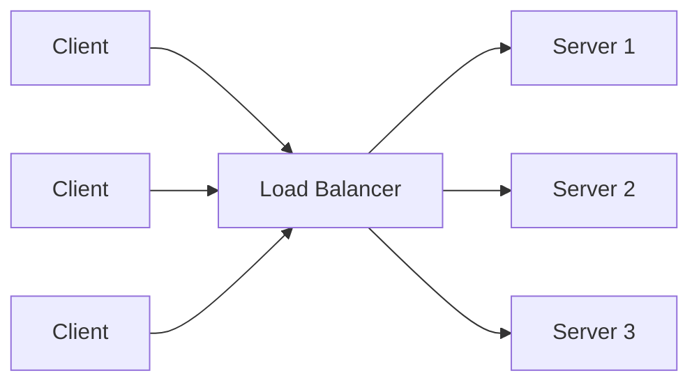
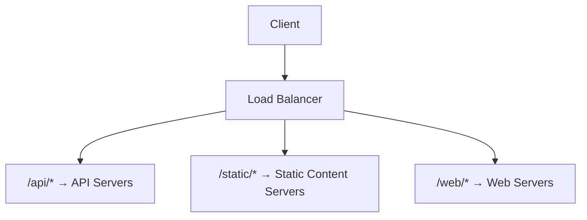

# Load Balancing

## Introduction

Load balancing is a critical concept in system design that distributes incoming network traffic across multiple servers. Think of it like multiple checkout counters at a grocery store - instead of everyone queuing at a single counter (which would be slow), customers are directed to whichever counter is available, making the overall shopping experience faster and more efficient.

In web applications and distributed systems, load balancing ensures:

- **High availability**: If one server fails, traffic automatically routes to healthy servers
- **Scalability**: You can add more servers as demand increases
- **Reliability**: The system continues functioning even when components fail
- **Efficiency**: Computing resources are utilized optimally

## How Load Balancing Works

At its core, a load balancer sits between client devices and backend servers, acting as a "traffic cop" to direct incoming requests efficiently.



When a client (like a web browser) makes a request:

1. The request first reaches the load balancer
2. The load balancer selects a server from the available pool using a specific algorithm
3. The request is forwarded to the selected server
4. The server processes the request and returns a response
5. The response passes back through the load balancer to the client

## Load Balancing Algorithms

Load balancers use various algorithms to determine which server should handle each incoming request:

### 1. Round Robin

The simplest algorithm - requests are distributed sequentially across the server pool.

```javascript
function roundRobinBalancer(servers) {
  let currentIndex = 0;
  
  return function getNextServer() {
    const server = servers[currentIndex];
    currentIndex = (currentIndex + 1) % servers.length;
    return server;
  };
}

// Usage example
const servers = ['server1', 'server2', 'server3'];
const balancer = roundRobinBalancer(servers);

console.log(balancer()); // 'server1'
console.log(balancer()); // 'server2'
console.log(balancer()); // 'server3'
console.log(balancer()); // 'server1' (cycles back)
```

### 2. Least Connections

Directs traffic to the server with the fewest active connections, helping to prevent overload.

```javascript
function leastConnectionsBalancer(servers) {
  // In a real system, we'd track actual connections
  // This is a simplified example
  const connections = {};
  
  // Initialize connection count for each server
  servers.forEach(server => {
    connections[server] = 0;
  });
  
  return function getNextServer() {
    // Find server with minimum connections
    let minServer = servers[0];
    let minConnections = connections[minServer];
    
    for (const server of servers) {
      if (connections[server] < minConnections) {
        minConnections = connections[server];
        minServer = server;
      }
    }
    
    // Increment connection count and return server
    connections[minServer]++;
    return minServer;
  };
}
```

### 3. Weighted Round Robin

Similar to round robin, but servers are assigned weights based on their capacity.

```javascript
function weightedRoundRobinBalancer(servers, weights) {
  // Create an expanded array with repetitions based on weights
  const expandedPool = [];
  
  for (let i = 0; i < servers.length; i++) {
    for (let j = 0; j < weights[i]; j++) {
      expandedPool.push(servers[i]);
    }
  }
  
  let currentIndex = 0;
  
  return function getNextServer() {
    const server = expandedPool[currentIndex];
    currentIndex = (currentIndex + 1) % expandedPool.length;
    return server;
  };
}

// Usage example
const servers = ['server1', 'server2', 'server3'];
const weights = [5, 3, 2]; // server1 has higher capacity
const balancer = weightedRoundRobinBalancer(servers, weights);
```

### 4. IP Hash

Uses a hash of the client's IP address to determine which server to select, ensuring a client is consistently sent to the same server.

```javascript
function ipHashBalancer(servers) {
  return function getServerForIP(clientIP) {
    // Simple hash function for demonstration
    let hash = 0;
    for (let i = 0; i < clientIP.length; i++) {
      hash = (hash + clientIP.charCodeAt(i)) % servers.length;
    }
    
    return servers[hash];
  };
}

// Usage example
const servers = ['server1', 'server2', 'server3'];
const balancer = ipHashBalancer(servers);

console.log(balancer('192.168.1.1')); // Consistent server for this IP
console.log(balancer('10.0.0.1'));    // Different IP, potentially different server
```

## Types of Load Balancers

### 1. Layer 4 Load Balancers (Transport Layer)

These operate at the transport layer (TCP/UDP) and make routing decisions based on IP address and port information.

- **Pros**: Faster processing, simple configuration
- **Cons**: Limited application awareness, less flexibility

### 2. Layer 7 Load Balancers (Application Layer)

These operate at the application layer and can make routing decisions based on the content of the request (URL path, HTTP headers, cookies).

- **Pros**: More intelligent routing, application-aware
- **Cons**: More resource-intensive processing



## Load Balancer Health Checks

Load balancers perform regular health checks on servers to ensure they're functioning properly. If a server fails a health check, it's temporarily removed from the pool.

```javascript
function serverHealthCheck(server, endpoint = '/health') {
  return new Promise((resolve, reject) => {
    // Simplified example (in real code, use actual HTTP requests)
    setTimeout(() => {
      // Simulate a 95% success rate
      if (Math.random() < 0.95) {
        console.log(`${server} health check passed`);
        resolve(true);
      } else {
        console.log(`${server} health check failed!`);
        resolve(false);
      }
    }, 100);
  });
}

async function updateServerPool(servers) {
  const healthyServers = [];
  
  for (const server of servers) {
    const isHealthy = await serverHealthCheck(server);
    if (isHealthy) {
      healthyServers.push(server);
    }
  }
  
  return healthyServers;
}
```

## Real-World Load Balancing Implementation

Let's build a simple load balancer in Node.js to demonstrate the concept:

```javascript
const http = require('http');
const httpProxy = require('http-proxy'); // You'd need to install this package

// Backend servers
const servers = [
  { url: 'http://localhost:3001', healthy: true },
  { url: 'http://localhost:3002', healthy: true },
  { url: 'http://localhost:3003', healthy: true }
];

// Create a proxy server
const proxy = httpProxy.createProxyServer({});

// Round-robin index
let current = 0;

// Create the load balancer
const server = http.createServer((req, res) => {
  // Get next available server
  let attemptCount = 0;
  let selectedServer = null;
  
  while (attemptCount < servers.length) {
    const candidateServer = servers[current];
    current = (current + 1) % servers.length;
    
    if (candidateServer.healthy) {
      selectedServer = candidateServer;
      break;
    }
    
    attemptCount++;
  }
  
  if (!selectedServer) {
    res.writeHead(500);
    return res.end('No healthy servers available');
  }
  
  // Forward the request to the selected server
  console.log(`Forwarding request to ${selectedServer.url}`);
  proxy.web(req, res, { target: selectedServer.url });
});

// Handle proxy errors
proxy.on('error', (err, req, res) => {
  console.error('Proxy error:', err);
  res.writeHead(500);
  res.end('Proxy error');
});

// Start the server
const PORT = 3000;
server.listen(PORT, () => {
  console.log(`Load balancer running on port ${PORT}`);
});

// Simulate health checks
function checkServerHealth() {
  servers.forEach((server, index) => {
    http.get(server.url + '/health', (res) => {
      server.healthy = res.statusCode === 200;
      console.log(`Server ${server.url} health: ${server.healthy ? 'OK' : 'FAIL'}`);
    }).on('error', (err) => {
      server.healthy = false;
      console.log(`Server ${server.url} health check failed: ${err.message}`);
    });
  });
}

// Check health every 10 seconds
setInterval(checkServerHealth, 10000);
```

## Common Load Balancing Patterns

### 1. Global Server Load Balancing (GSLB)

Distributes traffic across multiple data centers based on geographic location, improving performance by directing users to the closest server.

### 2. DNS Load Balancing

Uses the Domain Name System to distribute traffic by returning different IP addresses for the same domain name.

### 3. Session Persistence (Sticky Sessions)

Ensures that once a client establishes a session with a specific server, all subsequent requests go to the same server.

```javascript
function stickySessionBalancer(servers) {
  const sessionMap = {};
  
  return function getServer(sessionId) {
    // If this session already has an assigned server, use it
    if (sessionMap[sessionId]) {
      return sessionMap[sessionId];
    }
    
    // Otherwise, assign a new server (simple round-robin)
    const serverIndex = Object.keys(sessionMap).length % servers.length;
    sessionMap[sessionId] = servers[serverIndex];
    
    return sessionMap[sessionId];
  };
}
```

## Benefits of Load Balancing

1. **Improved Reliability**: Single points of failure are eliminated
2. **Scalability**: Easily add more servers to handle increased traffic
3. **Efficient Resource Utilization**: Ensures all servers are used effectively
4. **Flexibility**: Can route traffic based on various criteria
5. **Better User Experience**: Reduced latency and improved response times

## Challenges and Considerations

1. **Session Management**: Handling user sessions across multiple servers
2. **SSL/TLS Termination**: Managing encryption across balanced servers
3. **Health Monitoring**: Effectively detecting and handling server failures
4. **Consistent Hashing**: Minimizing redistribution when servers are added/removed
5. **Cost**: Hardware load balancers can be expensive (though software and cloud-based options are available)

## Popular Load Balancing Solutions

- **Software**: NGINX, HAProxy, Apache Traffic Server
- **Hardware**: F5 BIG-IP, Citrix ADC, A10 Networks
- **Cloud Services**: AWS Elastic Load Balancing, Google Cloud Load Balancing, Azure Load Balancer

## Summary

Load balancing is a fundamental technique for building scalable and reliable systems. By distributing traffic across multiple servers, load balancers help prevent system overload, handle traffic spikes, and ensure high availability.

As your application grows, implementing proper load balancing becomes increasingly critical. The right load balancing strategy depends on your specific requirements, including traffic patterns, application architecture, and scalability needs.

## Exercises

1. Set up a simple load balancer using NGINX on your local machine with two or three backend web servers.
2. Implement a basic round-robin load balancer in your preferred programming language.
3. Design a system that would require both layer 4 and layer 7 load balancing, explaining where each would be used.
4. Research how major websites like Amazon or Netflix implement load balancing at scale.

## Further Reading

- High Performance Browser Networking (Chapter on Load Balancing)
- Site Reliability Engineering: How Google Runs Production Systems
- The Art of Scalability: Scalable Web Architecture, Processes, and Organizations