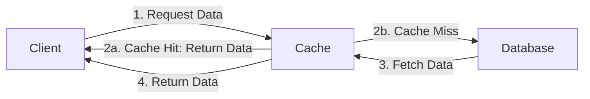

# Caching Strategies

## Introduction

Caching is one of the most powerful and widely-used techniques in system design to improve application performance, reduce latency, and decrease the load on backend resources. By storing frequently accessed data in a faster, more accessible location, caching can dramatically speed up your applications and reduce costs associated with redundant processing or database queries.

In this article, we'll explore various caching strategies, their implementations, advantages, disadvantages, and real-world applications. By the end, you'll understand how to effectively use caching in your own projects.

## What is Caching?

Caching is the process of storing copies of data in a temporary storage location (the "cache") so future requests for that data can be served faster.



The fundamental principle behind caching is simple: accessing data from memory is significantly faster than accessing it from disk, and accessing data locally is faster than making a network request.

## Common Caching Strategies

Let's explore the most common caching strategies you'll encounter in system design.

### 1. Cache-Aside (Lazy Loading)

In cache-aside, the application first checks the cache for data. If the data exists (a cache hit), it's returned immediately. If the data doesn't exist (a cache miss), the application fetches it from the database, stores it in the cache, and then returns it.

```javascript
async function getData(key) {
  // Check if data exists in cache
  let data = cache.get(key);
  
  if (data === null) {
    // Cache miss - get data from database
    data = await database.query(key);
    
    // Store data in cache for future requests
    cache.set(key, data, EXPIRATION_TIME);
  }
  
  return data;
}
```

**Advantages:**
- Only requested data is cached
- Resilient to cache failures (application can still function by fetching from database)

**Disadvantages:**
- Cache misses result in slower responses (3 trips: cache, database, cache)
- Data can become stale if database updates don't update the cache

### 2. Write-Through

In write-through caching, data is written to both the cache and the database simultaneously whenever a write operation occurs.

```javascript
async function updateData(key, value) {
  // Update the database
  await database.update(key, value);
  
  // Update the cache
  cache.set(key, value, EXPIRATION_TIME);
  
  return success;
}
```

**Advantages:**
- Cache is always up-to-date with the database
- Reads are fast after initial population

**Disadvantages:**
- Write operations are slower because they must complete in both cache and database
- Cache contains data that might never be read

### 3. Write-Behind (Write-Back)

Write-behind caching writes data to the cache first, then asynchronously updates the database later. This can be done immediately or in batches.

```javascript
function updateData(key, value) {
  // Update the cache immediately
  cache.set(key, value, EXPIRATION_TIME);
  
  // Queue the database update to happen asynchronously
  updateQueue.push({key, value});
  
  return success;
}

// In a background process
async function processDatabaseUpdates() {
  while (true) {
    const batch = updateQueue.getBatch(MAX_BATCH_SIZE);
    await database.batchUpdate(batch);
    await sleep(UPDATE_INTERVAL);
  }
}
```

**Advantages:**
- Fast write operations (only need to write to cache)
- Reduced database load through batching

**Disadvantages:**
- Risk of data loss if cache fails before data is written to database
- More complex implementation

### 4. Read-Through

In read-through caching, the cache itself is responsible for loading data from the database when a cache miss occurs. The application only interacts with the cache, never directly with the database.

```javascript
// The application only interacts with the cache
async function getData(key) {
  return cache.get(key);
}

// The cache implementation handles cache misses internally
class Cache {
  async get(key) {
    let data = this.storage.get(key);
    
    if (data === null) {
      // Cache miss - load from database
      data = await database.query(key);
      this.storage.set(key, data, EXPIRATION_TIME);
    }
    
    return data;
  }
}
```

**Advantages:**
- Simplifies application code (only works with cache)
- Consistent read performance

**Disadvantages:**
- Initial requests are slower
- Cache must include logic to fetch from database

### 5. Refresh-Ahead

Refresh-ahead proactively refreshes cache entries before they expire, based on usage patterns.

```javascript
class RefreshAheadCache {
  constructor(refreshThreshold = 0.75) {
    this.refreshThreshold = refreshThreshold; // e.g., 0.75 = refresh at 75% of TTL
  }
  
  async get(key) {
    const entry = this.storage.get(key);
    
    if (entry === null) {
      // Cache miss
      const data = await database.query(key);
      this.storage.set(key, data, EXPIRATION_TIME);
      return data;
    } else {
      // Check if we should refresh ahead
      const ageRatio = entry.age / EXPIRATION_TIME;
      
      if (ageRatio > this.refreshThreshold) {
        // Refresh async without blocking the current request
        setTimeout(async () => {
          const freshData = await database.query(key);
          this.storage.set(key, freshData, EXPIRATION_TIME);
        }, 0);
      }
      
      return entry.data;
    }
  }
}
```

**Advantages:**
- Minimizes cache misses
- Improves perceived performance

**Disadvantages:**
- More complex implementation
- Might cause unnecessary refreshes

## Cache Eviction Policies

When a cache reaches its capacity, it needs to decide which items to remove to make space for new ones. Here are common eviction policies:

### 1. Least Recently Used (LRU)

Removes the least recently accessed items first. This is the most common policy.

```javascript
class LRUCache {
  constructor(capacity) {
    this.capacity = capacity;
    this.cache = new Map();
  }
  
  get(key) {
    if (!this.cache.has(key)) return null;
    
    // Remove and re-add to make this the most recently used item
    const value = this.cache.get(key);
    this.cache.delete(key);
    this.cache.set(key, value);
    
    return value;
  }
  
  set(key, value) {
    // Remove if already exists
    if (this.cache.has(key)) {
      this.cache.delete(key);
    }
    
    // Evict least recently used item if at capacity
    if (this.cache.size >= this.capacity) {
      const firstKey = this.cache.keys().next().value;
      this.cache.delete(firstKey);
    }
    
    // Add new item
    this.cache.set(key, value);
  }
}
```

### 2. Least Frequently Used (LFU)

Removes items that are accessed least frequently.

### 3. First In, First Out (FIFO)

Removes the oldest items first, regardless of usage.

### 4. Time To Live (TTL)

Removes items that have been in the cache longer than a specified time period.

## Distributed Caching Strategies

As systems scale, it becomes necessary to distribute the cache across multiple servers.

### 1. Client-Side Caching

Caching data directly in the client (browser, mobile app) to reduce network requests.

```javascript
// Browser localStorage example
function getDataWithClientCache(key) {
  // Check browser cache first
  const cachedData = localStorage.getItem(key);
  
  if (cachedData) {
    const { data, expiry } = JSON.parse(cachedData);
    
    // Check if cache is still valid
    if (expiry > Date.now()) {
      return Promise.resolve(data);
    }
  }
  
  // Fetch from server if not in cache or expired
  return fetch(`/api/data/${key}`)
    .then(response => response.json())
    .then(data => {
      // Store in cache with expiry
      const cacheEntry = {
        data: data,
        expiry: Date.now() + (30 * 60 * 1000) // 30 minutes
      };
      
      localStorage.setItem(key, JSON.stringify(cacheEntry));
      return data;
    });
}
```

### 2. Consistent Hashing

Distributes cache entries across multiple servers while minimizing redistributions when servers are added or removed.

```javascript
class ConsistentHashRing {
  constructor(nodes = [], replicas = 3) {
    this.ring = {};
    this.keys = [];
    this.replicas = replicas;
    
    if (nodes.length > 0) {
      nodes.forEach(node => this.addNode(node));
    }
  }
  
  addNode(node) {
    // Add virtual nodes (replicas) for better distribution
    for (let i = 0; i < this.replicas; i++) {
      const key = this.hashFunction(`${node}-${i}`);
      this.ring[key] = node;
      this.keys.push(key);
    }
    
    // Sort keys for binary search
    this.keys.sort((a, b) => a - b);
  }
  
  removeNode(node) {
    for (let i = 0; i < this.replicas; i++) {
      const key = this.hashFunction(`${node}-${i}`);
      delete this.ring[key];
      
      const index = this.keys.indexOf(key);
      if (index >= 0) {
        this.keys.splice(index, 1);
      }
    }
  }
  
  getNode(key) {
    if (this.keys.length === 0) return null;
    
    const hash = this.hashFunction(key);
    
    // Find the first node with a hash >= the key's hash
    let i;
    for (i = 0; i < this.keys.length; i++) {
      if (this.keys[i] >= hash) {
        break;
      }
    }
    
    // Wrap around to the first node if needed
    if (i === this.keys.length) {
      i = 0;
    }
    
    return this.ring[this.keys[i]];
  }
  
  hashFunction(key) {
    // Simple hash function for demonstration
    let hash = 0;
    for (let i = 0; i < key.length; i++) {
      hash = (hash << 5) + hash + key.charCodeAt(i);
      hash &= hash; // Convert to 32-bit integer
    }
    return Math.abs(hash);
  }
}
```

### 3. Sharding

Divides the cache into shards based on some attribute of the data.

## Real-World Applications

Let's explore some common applications of caching in real-world systems:

### 1. Database Query Caching

```javascript
async function getUserById(userId) {
  const cacheKey = `user:${userId}`;
  
  // Try to get from cache first
  const cachedUser = await redisClient.get(cacheKey);
  
  if (cachedUser) {
    return JSON.parse(cachedUser);
  }
  
  // Query database if not in cache
  const user = await db.query('SELECT * FROM users WHERE id = ?', [userId]);
  
  // Store in cache for future requests (expire after 1 hour)
  await redisClient.set(cacheKey, JSON.stringify(user), 'EX', 3600);
  
  return user;
}
```

### 2. API Response Caching

```javascript
function cacheMiddleware(duration) {
  return (req, res, next) => {
    const key = `api:${req.originalUrl}`;
    
    redisClient.get(key, (err, cachedResponse) => {
      if (cachedResponse) {
        // Cache hit
        return res.json(JSON.parse(cachedResponse));
      }
      
      // Cache miss - store the original JSON method
      const originalJson = res.json;
      
      // Override res.json to cache the response
      res.json = function(body) {
        redisClient.set(key, JSON.stringify(body), 'EX', duration);
        return originalJson.call(this, body);
      };
      
      next();
    });
  };
}

// Usage in Express
app.get('/api/popular-products', cacheMiddleware(300), (req, res) => {
  // This expensive operation only runs on cache misses
  db.query('SELECT * FROM products ORDER BY views DESC LIMIT 10')
    .then(products => res.json(products))
    .catch(err => res.status(500).json({ error: err.message }));
});
```

### 3. Static Content Caching

```javascript
// Using a CDN for static content caching
app.use(express.static('public', {
  maxAge: '1d', // Cache static files for 1 day
  setHeaders: function(res, path) {
    if (path.endsWith('.html')) {
      // Don't cache HTML files for as long
      res.setHeader('Cache-Control', 'public, max-age=3600');
    }
  }
}));
```

### 4. Computed Results Caching

```javascript
function fibonacci(n, cache = {}) {
  // Check cache first
  if (cache[n]) return cache[n];
  
  // Base cases
  if (n <= 1) return n;
  
  // Compute and cache result
  cache[n] = fibonacci(n - 1, cache) + fibonacci(n - 2, cache);
  return cache[n];
}
```

## Common Caching Problems and Solutions

### 1. Cache Invalidation

One of the hardest problems in caching is knowing when to invalidate cache entries.

```javascript
// Event-based cache invalidation
function updateProduct(productId, updates) {
  // Update database
  return db.updateProduct(productId, updates)
    .then(() => {
      // Invalidate related cache keys
      const keysToInvalidate = [
        `product:${productId}`,
        'latest-products',
        `category-products:${updates.categoryId}`
      ];
      
      return Promise.all(keysToInvalidate.map(key => redisClient.del(key)));
    });
}
```

### 2. Thundering Herd Problem

When many clients simultaneously request data that isn't in the cache, they all hit the database at once.

```javascript
class CacheWithSemaphore {
  constructor() {
    this.cache = new Map();
    this.locks = new Map();
  }
  
  async get(key, fetchFunction) {
    // Check if in cache
    if (this.cache.has(key)) {
      return this.cache.get(key);
    }
    
    // Check if already being fetched
    if (this.locks.has(key)) {
      // Wait for the existing request to complete
      return this.locks.get(key);
    }
    
    // Create a promise for this fetch
    const fetchPromise = fetchFunction()
      .then(data => {
        this.cache.set(key, data);
        this.locks.delete(key);
        return data;
      })
      .catch(err => {
        this.locks.delete(key);
        throw err;
      });
    
    // Store the promise so other requests can wait on it
    this.locks.set(key, fetchPromise);
    
    return fetchPromise;
  }
}

// Usage
const dataCache = new CacheWithSemaphore();

async function getData(userId) {
  return dataCache.get(`user:${userId}`, () => {
    // This expensive operation will only happen once
    // even if multiple requests come in simultaneously
    return db.query('SELECT * FROM users WHERE id = ?', [userId]);
  });
}
```

### 3. Cache Stampede

Similar to the thundering herd problem, but occurs when many cached items expire at the same time.

```javascript
function getWithJitter(key, fetchFn, ttl) {
  return cache.get(key, async () => {
    const data = await fetchFn();
    
    // Add jitter to expiration to prevent synchronized expiration
    const jitter = Math.floor(Math.random() * (ttl * 0.2)); // 20% jitter
    const expiration = ttl + jitter;
    
    cache.set(key, data, expiration);
    return data;
  });
}
```

## Best Practices for Caching

1. **Use appropriate TTLs:** Set appropriate time-to-live values based on how frequently your data changes.

2. **Cache at multiple levels:** Implement caching at different system tiers (client, CDN, application, database).

3. **Monitor cache performance:** Track cache hit/miss rates and adjust your strategy accordingly.

4. **Choose the right eviction policy:** Pick an eviction policy that matches your access patterns.

5. **Plan for cache failures:** Your system should gracefully handle cache unavailability.

6. **Use cache warming:** Pre-populate cache with frequently accessed data.

```javascript
async function warmCache() {
  console.log('Warming cache...');
  
  // Get top 100 most popular product IDs
  const topProductIds = await db.query(
    'SELECT id FROM products ORDER BY views DESC LIMIT 100'
  );
  
  // Fetch each product into cache
  const promises = topProductIds.map(({ id }) => {
    return db.query('SELECT * FROM products WHERE id = ?', [id])
      .then(product => {
        return cache.set(`product:${id}`, JSON.stringify(product), 'EX', 3600);
      });
  });
  
  await Promise.all(promises);
  console.log('Cache warming complete!');
}
```

## Summary

Caching is a powerful technique to improve application performance and reduce system load. We've explored various caching strategies, eviction policies, and real-world applications. The key points to remember:

- **Cache-aside:** Application checks cache first, falls back to database
- **Write-through:** Data written to both cache and database simultaneously
- **Write-behind:** Data written to cache first, then asynchronously to database
- **Read-through:** Cache handles fetching from database on misses
- **Refresh-ahead:** Cache proactively refreshes frequently accessed entries

The right caching strategy depends on your specific use case, data access patterns, and consistency requirements. By understanding these patterns, you can make informed decisions about how to implement caching in your systems.

## Exercises

1. Implement a simple LRU cache in your preferred language
2. Create a caching middleware for an API endpoint
3. Design a caching strategy for a social media feed
4. Benchmark the performance difference when adding caching to a database-heavy operation
5. Explore how to implement cache invalidation in a distributed system

## Additional Resources

- Redis documentation for implementing distributed caching
- Papers on consistent hashing and cache eviction algorithms
- GitHub repositories with caching libraries for your language
- System design books that cover caching in depth