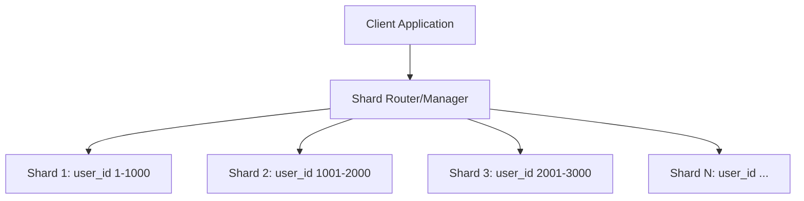
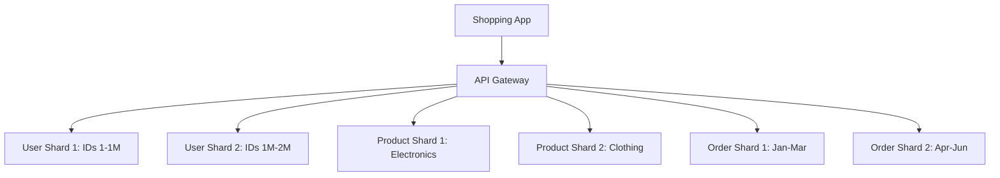

# Database Sharding

## Introduction

Database sharding is a technique used to scale databases horizontally by breaking a large database into smaller, more manageable pieces called "shards." Each shard contains a subset of the total data and operates as an independent database, though together they form a single logical database.

As applications grow and their data volumes increase, a single database server may struggle to handle the load. Sharding allows you to distribute this load across multiple servers, significantly improving performance, availability, and scalability.

## Why Shard a Database?

Before diving into how sharding works, let's understand why you might consider sharding:

1. **Scalability**: Handle more data and traffic by adding more shards.
2. **Performance**: Queries run faster because each shard contains less data to search through.
3. **Availability**: If one shard fails, others continue to function.
4. **Geolocation optimizations**: Place shards closer to users in different regions.

## How Sharding Works

At its core, sharding involves:

1. Dividing data into partitions
2. Distributing these partitions across multiple servers
3. Ensuring the application knows which shard to query for specific data

Let's explore a visual representation of this concept:



## Sharding Strategies

There are several ways to decide how data should be distributed across shards:

### 1. Key-Based (Hash) Sharding

In this approach, we apply a hash function to a key column (like `user_id`) to determine which shard should store the data.

```javascript
// Simplified example of hash-based sharding
function determineShard(userId, totalShards) {
  return userId % totalShards;
}

// Example usage
const userId = 5421;
const totalShards = 4;
const shardNumber = determineShard(userId, totalShards); // Returns 1
console.log(`User ${userId} data is in shard ${shardNumber}`);
```

**Pros:**
- Distributes data evenly
- Simple to implement

**Cons:**
- Difficult to add new shards (requires redistribution)
- Cannot support range queries efficiently

### 2. Range-Based Sharding

With range-based sharding, data is divided based on ranges of a key value.

```sql
-- Example range-based sharding setup
-- Shard 1: Users with IDs 1-1000
CREATE TABLE users_shard_1 (
  user_id INT PRIMARY KEY CHECK (user_id BETWEEN 1 AND 1000),
  username VARCHAR(50),
  email VARCHAR(100)
);

-- Shard 2: Users with IDs 1001-2000
CREATE TABLE users_shard_2 (
  user_id INT PRIMARY KEY CHECK (user_id BETWEEN 1001 AND 2000),
  username VARCHAR(50),
  email VARCHAR(100)
);
```

**Pros:**
- Supports range queries
- Adding new shards is simpler

**Cons:**
- Risk of uneven data distribution (hotspots)
- Requires good understanding of data access patterns

### 3. Directory-Based Sharding

In this approach, we maintain a lookup service that maps keys to shards.

```python
# Simplified directory-based sharding lookup
shard_directory = {
    "user_1": "shard_3",
    "user_2": "shard_1",
    "user_3": "shard_2",
    # ...more mappings
}

def get_shard_for_user(user_id):
    return shard_directory.get(f"user_{user_id}")
    
# Example usage
user_id = 2
shard = get_shard_for_user(user_id)
print(f"User {user_id} is in {shard}")  # Output: User 2 is in shard_1
```

**Pros:**
- Flexible data distribution
- Can adapt to changing access patterns

**Cons:**
- Lookup service becomes a bottleneck
- More complex to maintain

## Implementing Sharding: A Practical Example

Let's walk through how we might implement sharding for a users table in a social media application using Node.js and MySQL:

```javascript
// Example Node.js implementation connecting to sharded MySQL databases

const mysql = require('mysql2/promise');

// Configure connection to each shard
const shardConfigs = [
  {
    host: 'shard1.example.com',
    user: 'app_user',
    password: 'password',
    database: 'social_app'
  },
  {
    host: 'shard2.example.com',
    user: 'app_user',
    password: 'password',
    database: 'social_app'
  },
  {
    host: 'shard3.example.com',
    user: 'app_user',
    password: 'password',
    database: 'social_app'
  }
];

// Create connection pools for each shard
const shardPools = shardConfigs.map(config => mysql.createPool(config));

// Function to determine which shard a user belongs to
function getUserShardIndex(userId) {
  return userId % shardPools.length;
}

// Function to get user data
async function getUserById(userId) {
  const shardIndex = getUserShardIndex(userId);
  
  try {
    const connection = await shardPools[shardIndex].getConnection();
    
    try {
      const [rows] = await connection.query(
        'SELECT * FROM users WHERE user_id = ?', 
        [userId]
      );
      
      return rows[0];
    } finally {
      connection.release();
    }
  } catch (error) {
    console.error(`Error fetching user ${userId} from shard ${shardIndex}:`, error);
    throw error;
  }
}

// Example usage
async function displayUserProfile(userId) {
  try {
    const user = await getUserById(userId);
    console.log(`Found user: ${user.username} (Email: ${user.email})`);
  } catch (error) {
    console.error('Failed to retrieve user profile');
  }
}

// Call the function to retrieve user with ID 42
displayUserProfile(42);
```

## Challenges and Solutions

### 1. Joins Across Shards

One of the biggest challenges with sharding is performing joins across different shards.

**Problem:** If user data is in one shard and their posts are in another, how do you join them?

**Solutions:**
- Denormalize data to avoid cross-shard joins
- Use application-level joins (retrieve data from multiple shards and join in your application)
- Consider a federated query system

### 2. Maintaining Global Unique IDs

When data is distributed, generating unique IDs becomes challenging.

**Solutions:**
- UUID/GUID generation
- Central ID service
- Twitter's Snowflake algorithm

```javascript
// Example of a simple Snowflake-inspired ID generator
class IdGenerator {
  constructor(datacenterIdBits, machineIdBits) {
    this.datacenterIdBits = datacenterIdBits;
    this.machineIdBits = machineIdBits;
    this.sequence = 0;
    this.lastTimestamp = -1;
    
    // For demo purposes
    this.datacenterId = 1;
    this.machineId = 2;
  }
  
  nextId() {
    let timestamp = Date.now();
    
    if (timestamp < this.lastTimestamp) {
      throw new Error('Clock moved backwards!');
    }
    
    if (timestamp === this.lastTimestamp) {
      this.sequence = (this.sequence + 1) & 4095; // 12 bits for sequence
      if (this.sequence === 0) {
        // Wait until next millisecond
        timestamp = this.waitNextMillis(this.lastTimestamp);
      }
    } else {
      this.sequence = 0;
    }
    
    this.lastTimestamp = timestamp;
    
    // Combine bits: timestamp (41 bits) | datacenter (5 bits) | machine (5 bits) | sequence (12 bits)
    return (
      ((timestamp - 1288834974657) << (this.datacenterIdBits + this.machineIdBits + 12)) |
      (this.datacenterId << (this.machineIdBits + 12)) |
      (this.machineId << 12) |
      this.sequence
    );
  }
  
  waitNextMillis(lastTimestamp) {
    let timestamp = Date.now();
    while (timestamp <= lastTimestamp) {
      timestamp = Date.now();
    }
    return timestamp;
  }
}

// Usage
const generator = new IdGenerator(5, 5);
console.log(generator.nextId()); // Generates a unique ID
```

### 3. Rebalancing Shards

As data grows unevenly, you may need to rebalance shards.

**Solutions:**
- Consistent hashing
- Dynamic resharding systems
- Pre-splitting (creating empty shards in anticipation of growth)

## Real-World Applications

### E-commerce Platform

Imagine an e-commerce platform with millions of products and users:

- **Customer data** might be sharded by customer ID
- **Product data** might be sharded by product category
- **Order history** might be sharded by order date ranges



### Social Media Platform

For a social network:

- User profiles might be sharded by user ID
- Posts might be sharded by creation date
- Friend relationships might be duplicated across shards for fast access

## When to Consider Sharding

Sharding adds complexity, so consider it when:

1. Your database size exceeds what a single server can efficiently handle
2. Read/write throughput exceeds single-server capacity
3. Network bandwidth becomes a bottleneck
4. Data locality is required for geographic optimization

## When to Avoid Sharding

Not every database needs sharding. Consider alternatives when:

1. Your data volume is manageable on a single server
2. Vertical scaling (upgrading your server) is still feasible
3. Read replicas could solve your performance issues
4. You don't have the operational expertise to manage a sharded system

## Sharding in Popular Databases

Different database systems handle sharding differently:

### MongoDB

MongoDB provides native sharding capabilities:

```javascript
// MongoDB sharding setup example
// Run on mongos (MongoDB's query router)
sh.enableSharding("myDatabase")

// Shard a collection based on a key
sh.shardCollection(
  "myDatabase.users",
  { "userId": 1 }  // Shard key
)
```

### MySQL

MySQL typically requires custom sharding solutions:
- MySQL Cluster
- ProxySQL
- Custom application-level sharding

### PostgreSQL

PostgreSQL offers several options:
- Citus (extension for distributed PostgreSQL)
- PostgreSQL Sharding by CitusData
- Custom application-level sharding

## Summary

Database sharding is a powerful technique for scaling databases horizontally by distributing data across multiple servers. While it adds complexity to your architecture, it enables applications to scale beyond the limitations of a single database server.

Key takeaways:
- Sharding splits a database into smaller pieces called shards
- Common sharding strategies include hash-based, range-based, and directory-based approaches
- Implementing sharding requires careful planning around data access patterns
- Challenges include cross-shard joins, ID generation, and shard rebalancing
- Many databases offer built-in sharding capabilities or extensions

## Exercises

1. Design a sharding strategy for a message application where users frequently query their recent messages.
2. Implement a simple hash-based sharding function for a user table with 1 million users across 5 shards.
3. Compare the pros and cons of range-based vs. hash-based sharding for an e-commerce product catalog.
4. Consider a blog platform - how would you shard the database to optimize for both writing new posts and reading existing ones?

## Additional Resources

- Books:
  - "Designing Data-Intensive Applications" by Martin Kleppmann
  - "Database Internals" by Alex Petrov
- Online tutorials:
  - MongoDB's documentation on sharding
  - MySQL Cluster documentation
  - PostgreSQL partitioning guide
- Tools:
  - Vitess (YouTube's MySQL sharding solution)
  - Citus (PostgreSQL extension for distributed tables)
  - ShardingSphere (Apache project for database clusters)