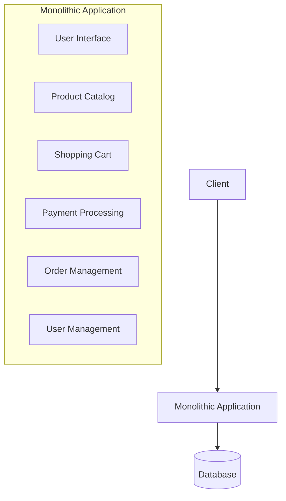
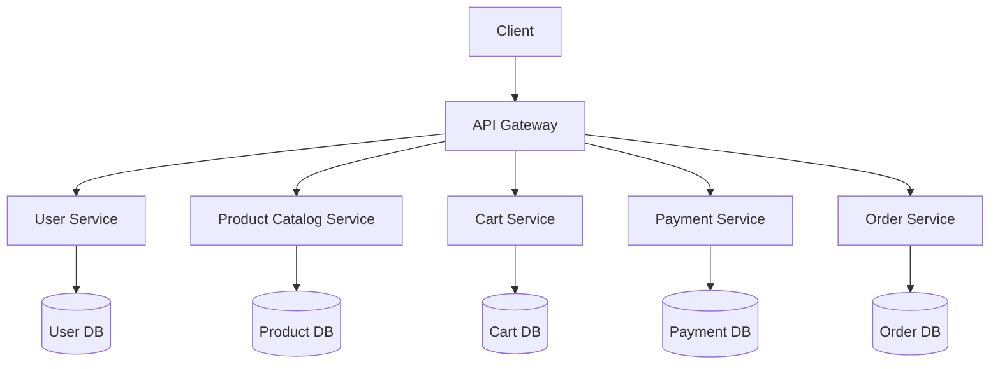
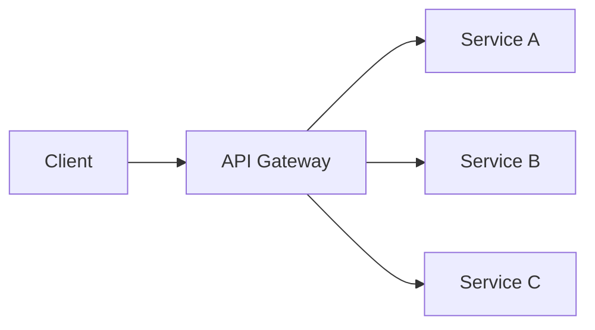
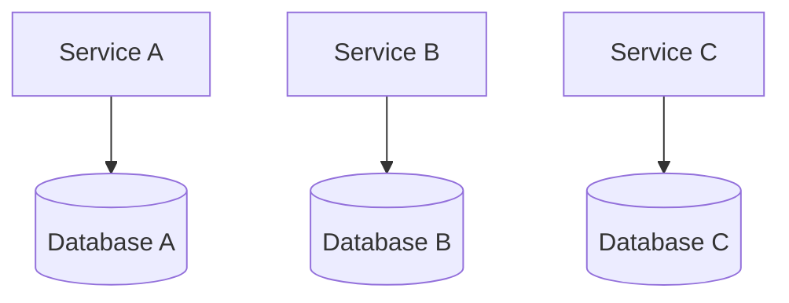

# Microservices Architecture

## Introduction

Microservices architecture is an approach to software design where an application is built as a collection of small, independent services that communicate with each other. Each service focuses on a specific business capability and can be developed, deployed, and scaled independently. This architectural style has gained popularity as organizations seek more agile and scalable methods to build complex applications.

In this guide, we'll explore the fundamentals of microservices architecture, compare it with traditional monolithic architecture, and discuss implementation patterns, benefits, and challenges.

## Understanding Microservices vs. Monolithic Architecture

### Monolithic Architecture

In a monolithic architecture, an application is built as a single, unified unit:

- All components are interconnected and interdependent
- The entire application is developed, deployed, and scaled as one unit
- A single codebase contains all functionality

Here's a simplified representation of a monolithic e-commerce application:



### Microservices Architecture

In contrast, a microservices architecture breaks down an application into a collection of loosely coupled services:

- Each service implements a specific business capability
- Services can be developed, deployed, and scaled independently
- Different services can use different technologies and programming languages
- Services communicate through well-defined APIs (typically RESTful or messaging)

The same e-commerce application as microservices:



## Key Principles of Microservices Architecture

1. **Single Responsibility**: Each service should focus on a specific business capability
2. **Independence**: Services can be developed, deployed, and scaled independently
3. **Decentralization**: Avoid centralized governance; teams own their services end-to-end
4. **Resilience**: Failure in one service shouldn't cascade to others
5. **Automated Deployment**: CI/CD pipelines for quick delivery of new features
6. **Domain-Driven Design**: Services are organized around business domains
7. **Smart Endpoints, Dumb Pipes**: Logic resides in the services, not the communication layer

## Communication Between Microservices

Microservices need to communicate with each other. There are two primary patterns:

### Synchronous Communication (Request/Response)

Services communicate directly, typically using REST or gRPC:

```javascript
// Example: Product service fetching user information from User service
async function getProductWithUserInfo(productId, userId) {
  const product = await database.getProduct(productId);
  
  // Synchronous HTTP request to User service
  const userResponse = await fetch(`http://user-service/users/${userId}`);
  const userData = await userResponse.json();
  
  return {
    ...product,
    user: userData
  };
}
```

### Asynchronous Communication (Event-Driven)

Services communicate through events published to a message broker:

```javascript
// Example: Order service publishing an event when a new order is created
async function createOrder(orderData) {
  // Save order to database
  const order = await database.saveOrder(orderData);
  
  // Publish an event to message broker
  await messageBroker.publish('orders.created', {
    orderId: order.id,
    userId: order.userId,
    amount: order.totalAmount,
    timestamp: new Date()
  });
  
  return order;
}
```

## Implementation Patterns

### Service Discovery

Services need to find each other. This can be done through:

1. **Client-side discovery**: Clients query a service registry
2. **Server-side discovery**: A load balancer routes requests

```javascript
// Example: Service registration with a service registry (Consul)
const consul = require('consul')();

// Register service
consul.agent.service.register({
  name: 'product-service',
  id: 'product-service-1',
  address: 'product-service.example.com',
  port: 3000,
  tags: ['api', 'products'],
  check: {
    http: 'http://product-service.example.com:3000/health',
    interval: '10s'
  }
});
```

### API Gateway

An API Gateway serves as a single entry point for clients:



Example of an API Gateway using Node.js and Express:

```javascript
const express = require('express');
const { createProxyMiddleware } = require('http-proxy-middleware');
const app = express();

// Proxy requests to respective services
app.use('/users', createProxyMiddleware({ 
  target: 'http://user-service', 
  changeOrigin: true 
}));

app.use('/products', createProxyMiddleware({ 
  target: 'http://product-service', 
  changeOrigin: true 
}));

app.use('/orders', createProxyMiddleware({ 
  target: 'http://order-service', 
  changeOrigin: true 
}));

app.listen(8080);
```

### Database Per Service

Each microservice should have its own database to ensure loose coupling:



### Circuit Breaker Pattern

Prevents cascading failures when a service is down:

```javascript
const CircuitBreaker = require('opossum');

// Configure the circuit breaker
const circuitOptions = {
  failureThreshold: 50,
  resetTimeout: 10000,
  timeout: 3000
};

// Create a circuit breaker for the user service API call
const getUserCircuit = new CircuitBreaker(getUserFromService, circuitOptions);

// Add event listeners
getUserCircuit.on('open', () => console.log('Circuit breaker opened'));
getUserCircuit.on('close', () => console.log('Circuit breaker closed'));
getUserCircuit.on('halfOpen', () => console.log('Circuit breaker half-open'));

// Function to get user with circuit breaker protection
async function getUserWithRetry(userId) {
  try {
    return await getUserCircuit.fire(userId);
  } catch (error) {
    console.error('Service unavailable, using fallback');
    return getDefaultUserProfile(userId);
  }
}
```

## Real-World Example: E-commerce Platform

Let's explore how a simple e-commerce platform might be implemented using microservices:

### 1. Service Identification

We'll break down our application into these services:

- **User Service**: Manages user accounts and authentication
- **Product Service**: Handles product catalog and inventory
- **Cart Service**: Manages shopping carts
- **Order Service**: Processes and manages orders
- **Payment Service**: Handles payment processing
- **Notification Service**: Sends emails and notifications

### 2. Implementation of Product Service

```javascript
// server.js - Product Service
const express = require('express');
const mongoose = require('mongoose');
const app = express();

// Connect to the product service database
mongoose.connect('mongodb://localhost:27017/product-service');

// Define product schema
const productSchema = new mongoose.Schema({
  name: String,
  description: String,
  price: Number,
  category: String,
  inventory: Number
});

const Product = mongoose.model('Product', productSchema);

app.use(express.json());

// Get all products
app.get('/products', async (req, res) => {
  try {
    const products = await Product.find();
    res.json(products);
  } catch (error) {
    res.status(500).json({ error: error.message });
  }
});

// Get product by ID
app.get('/products/:id', async (req, res) => {
  try {
    const product = await Product.findById(req.params.id);
    if (!product) return res.status(404).json({ message: 'Product not found' });
    res.json(product);
  } catch (error) {
    res.status(500).json({ error: error.message });
  }
});

// Create a new product
app.post('/products', async (req, res) => {
  try {
    const product = new Product(req.body);
    await product.save();
    res.status(201).json(product);
  } catch (error) {
    res.status(400).json({ error: error.message });
  }
});

app.listen(3001, () => {
  console.log('Product service running on port 3001');
});
```

### 3. Communication Between Order and Inventory Services

When an order is placed, the Order Service needs to update inventory:

```javascript
// orderService.js
const express = require('express');
const axios = require('axios');
const app = express();

app.use(express.json());

// Create a new order
app.post('/orders', async (req, res) => {
  try {
    const { userId, items } = req.body;
    
    // Create the order
    const order = {
      userId,
      items,
      status: 'pending',
      createdAt: new Date()
    };
    
    // Save order to database (simplified)
    const savedOrder = await saveOrderToDatabase(order);
    
    // Update inventory for each product
    for (const item of items) {
      try {
        // Call Product Service to update inventory
        await axios.put(`http://product-service:3001/products/${item.productId}/inventory`, {
          adjustment: -item.quantity
        });
      } catch (error) {
        console.error(`Failed to update inventory for product ${item.productId}`, error);
        // In a real system, you might want to implement compensating transactions here
      }
    }
    
    // Publish order created event (simplified)
    publishEvent('order.created', savedOrder);
    
    res.status(201).json(savedOrder);
  } catch (error) {
    res.status(500).json({ error: error.message });
  }
});

app.listen(3002, () => {
  console.log('Order service running on port 3002');
});
```

## Benefits of Microservices Architecture

1. **Independent Deployment**: Services can be updated without affecting the entire system
2. **Technology Diversity**: Different teams can use different technologies
3. **Scalability**: Services can be scaled independently based on demand
4. **Resilience**: Failure in one service doesn't bring down the entire system
5. **Team Organization**: Teams can be organized around business capabilities
6. **Development Speed**: Smaller codebases are easier to understand and modify

## Challenges of Microservices Architecture

1. **Distributed System Complexity**: Debugging and tracing issues across services
2. **Data Consistency**: Maintaining consistency across services is challenging
3. **Network Latency**: Communication between services adds latency
4. **Operational Overhead**: Managing multiple services requires robust DevOps
5. **Service Boundaries**: Designing proper service boundaries requires domain expertise
6. **Testing**: End-to-end testing becomes more complex

## When to Use Microservices

Microservices are not always the right choice. Consider them when:

- Your application is complex with distinct business domains
- You need independent scaling of components
- You have multiple teams working on different parts of the application
- You need to use different technologies for different parts
- You need high resilience and fault isolation

For simpler applications, a monolith might be a better starting point.

## Best Practices

1. **Start Monolithic, Extract Microservices**: Begin with a monolith and extract services as needed
2. **Design Around Business Capabilities**: Services should align with business domains
3. **Implement Proper Monitoring**: Use centralized logging and distributed tracing
4. **Automate Deployment**: Implement CI/CD pipelines for all services
5. **Design for Failure**: Assume services will fail and design accordingly
6. **Use Containerization**: Docker and Kubernetes help manage microservices
7. **Implement API Versioning**: Allow services to evolve independently

## Summary

Microservices architecture offers a powerful approach to building complex, scalable applications by breaking them down into smaller, independent services. While it brings numerous benefits like independent deployment, scalability, and team autonomy, it also introduces challenges related to distributed systems.

Understanding when and how to implement microservices is crucial for success. By following best practices and utilizing appropriate patterns, you can leverage the strengths of microservices architecture while mitigating its complexities.

## Exercises

1. Design a microservices architecture for a social media platform. Identify the services and their responsibilities.
2. Implement a simple product service and user service that communicate with each other using REST APIs.
3. Refactor a monolithic application into microservices, starting with identifying service boundaries.
4. Implement a circuit breaker pattern for a microservice to handle failures gracefully.
5. Design and implement an event-driven communication between two microservices using a message broker.

## Additional Resources

- Books:
  - "Building Microservices" by Sam Newman
  - "Microservices Patterns" by Chris Richardson
  - "Domain-Driven Design" by Eric Evans

- Online Resources:
  - Martin Fowler's articles on microservices
  - The Twelve-Factor App methodology
  - Spring Cloud documentation for Java developers
  - Express.js and Node.js for JavaScript microservices