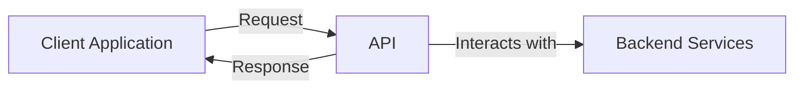

# API Design

## Introduction

An API (Application Programming Interface) serves as the contract between different software components, defining how they should interact. Good API design is crucial as it directly impacts developer experience, application performance, and long-term maintainability. 

In this guide, we'll explore the principles of effective API design, common patterns, and best practices that will help you create APIs that developers love to use.

## What is an API?

An API defines the methods and data formats that applications can use to communicate with each other. Think of it as a menu in a restaurant - it presents all available options (endpoints) and explains what you'll get when you order (request) something.



APIs can take many forms:

- **Web APIs**: REST, GraphQL, SOAP
- **Library APIs**: Functions and methods exposed by a code library
- **Operating System APIs**: Interfaces for interacting with OS functionality
- **Database APIs**: Ways to query and manipulate data in a database

For this guide, we'll focus primarily on Web APIs, as they're the most common in modern application development.

## Key Principles of Good API Design

### 1. Consistency

Consistency in naming conventions, error handling, and response structures makes your API predictable and easier to learn.

```javascript
// Consistent endpoint naming
GET /api/users       // Get all users
GET /api/users/123   // Get a specific user
POST /api/users      // Create a user
PUT /api/users/123   // Update a user
DELETE /api/users/123 // Delete a user

// Inconsistent naming (avoid this)
GET /api/users       // Get all users
GET /api/user/123    // Get a specific user
POST /api/createUser // Create a user
```

### 2. Simplicity

Keep your API as simple as possible. Hide complex implementation details behind a clean interface.

### 3. Documentation

Well-documented APIs are easier to understand and use. Include examples, explanations of parameters, and possible errors.

### 4. Versioning

Plan for change from the beginning by implementing versioning in your API.

```
https://api.example.com/v1/users
https://api.example.com/v2/users
```

### 5. Security

Always consider security implications in your API design, including authentication, authorization, and data validation.

## REST API Design

REST (Representational State Transfer) is an architectural style for designing networked applications. RESTful APIs use HTTP requests to perform CRUD operations (Create, Read, Update, Delete).

### Resource-Oriented Design

In REST, everything is a resource identified by a URL:

```
/users           // Collection of users
/users/123       // Specific user
/users/123/posts // Posts by a specific user
```

### HTTP Methods

REST uses standard HTTP methods to operate on resources:

| Method | Purpose | Example |
|--------|---------|---------|
| GET | Retrieve data | `GET /users` (retrieve all users) |
| POST | Create data | `POST /users` (create a new user) |
| PUT | Update data (full update) | `PUT /users/123` (update user 123) |
| PATCH | Update data (partial update) | `PATCH /users/123` (update parts of user 123) |
| DELETE | Delete data | `DELETE /users/123` (delete user 123) |

### Example REST API Endpoint

```javascript
// Request
GET /api/users/123

// Response
{
  "id": 123,
  "name": "John Doe",
  "email": "john@example.com",
  "created_at": "2023-10-15T14:30:00Z",
  "links": {
    "self": "/api/users/123",
    "posts": "/api/users/123/posts"
  }
}
```

### Status Codes

Use appropriate HTTP status codes to indicate the result of operations:

- 200: OK
- 201: Created
- 400: Bad Request
- 401: Unauthorized
- 404: Not Found
- 500: Internal Server Error

## GraphQL API Design

GraphQL is a query language for APIs that allows clients to request exactly the data they need.

### Schema Definition

GraphQL APIs start with a schema that defines available data types and operations:

```graphql
type User {
  id: ID!
  name: String!
  email: String!
  posts: [Post!]
}

type Post {
  id: ID!
  title: String!
  content: String!
  author: User!
}

type Query {
  user(id: ID!): User
  users: [User!]!
}

type Mutation {
  createUser(name: String!, email: String!): User!
  updateUser(id: ID!, name: String, email: String): User!
}
```

### Example GraphQL Query

```graphql
# Query
query {
  user(id: "123") {
    name
    email
    posts {
      title
    }
  }
}

# Response
{
  "data": {
    "user": {
      "name": "John Doe",
      "email": "john@example.com",
      "posts": [
        { "title": "Getting Started with GraphQL" },
        { "title": "API Design Principles" }
      ]
    }
  }
}
```

## API Design Patterns

### Pagination

For endpoints that return large collections, implement pagination:

```javascript
// Request
GET /api/users?page=2&limit=10

// Response
{
  "data": [
    { "id": 11, "name": "User 11" },
    // ... more users
  ],
  "pagination": {
    "total": 45,
    "pages": 5,
    "current_page": 2,
    "limit": 10
  }
}
```

### Filtering and Sorting

Allow clients to filter and sort results:

```
GET /api/users?status=active
GET /api/users?sort=created_at:desc
```

### Error Handling

Provide clear error messages:

```javascript
// Response for an error
{
  "error": {
    "code": "INVALID_PARAMETER",
    "message": "Email must be a valid email address",
    "field": "email"
  }
}
```

## Practical Examples

### Building a RESTful Blog API

Let's design a simple blog API:

```javascript
// Blog API Endpoints

// Get all posts
// GET /api/posts
// Response:
{
  "data": [
    {
      "id": 1,
      "title": "Getting Started with APIs",
      "excerpt": "Learn the basics of API design...",
      "author": {
        "id": 123,
        "name": "John Doe"
      },
      "links": {
        "self": "/api/posts/1",
        "author": "/api/users/123"
      }
    },
    // More posts...
  ],
  "pagination": {
    "total": 25,
    "current_page": 1,
    "per_page": 10
  }
}

// Create a new post
// POST /api/posts
// Request body:
{
  "title": "API Design Best Practices",
  "content": "When designing APIs, it's important to...",
  "author_id": 123
}
// Response (201 Created):
{
  "id": 26,
  "title": "API Design Best Practices",
  "content": "When designing APIs, it's important to...",
  "created_at": "2023-10-15T15:30:00Z",
  "author": {
    "id": 123,
    "name": "John Doe"
  }
}
```

### A Weather API Service

Let's design a simple weather API service:

```javascript
// Get current weather
// GET /api/weather/current?city=new-york
// Response:
{
  "city": "New York",
  "temperature": {
    "current": 72,
    "feels_like": 75,
    "min": 68,
    "max": 77,
    "unit": "F"
  },
  "conditions": "Partly Cloudy",
  "humidity": 65,
  "wind": {
    "speed": 8,
    "direction": "NE"
  },
  "updated_at": "2023-10-15T16:30:00Z"
}

// Get forecast
// GET /api/weather/forecast?city=new-york&days=3
// Response:
{
  "city": "New York",
  "forecast": [
    {
      "date": "2023-10-16",
      "temperature": {
        "min": 65,
        "max": 75,
        "unit": "F"
      },
      "conditions": "Sunny"
    },
    // More days...
  ]
}
```

## Best Practices for API Design

### 1. Use Nouns, Not Verbs for Resource Names

```
// Good
GET /api/users

// Avoid
GET /api/getUsers
```

### 2. Use Nested Resources for Relationships

```
GET /api/users/123/posts
```

### 3. Use HATEOAS (Hypermedia as the Engine of Application State)

Include links to related resources in responses to guide clients:

```javascript
{
  "id": 123,
  "name": "John Doe",
  "links": {
    "self": "/api/users/123",
    "posts": "/api/users/123/posts",
    "followers": "/api/users/123/followers"
  }
}
```

### 4. Keep Security in Mind

- Use HTTPS for all API endpoints
- Implement proper authentication and authorization
- Validate all input data
- Be cautious about exposing sensitive information

### 5. Rate Limiting

Implement rate limiting to prevent abuse:

```
HTTP/1.1 429 Too Many Requests
X-Rate-Limit-Limit: 100
X-Rate-Limit-Remaining: 0
X-Rate-Limit-Reset: 1508280300
```

## Common API Design Mistakes to Avoid

1. **Inconsistent naming**: Mixing plural and singular resource names
2. **Exposing database structure**: Your API should abstract away implementation details
3. **Not versioning from the start**: Makes future changes difficult
4. **Poor error messages**: Makes debugging difficult
5. **Ignoring CORS**: Makes integrating with web applications harder
6. **Not using HTTP methods correctly**: Using GET for data modifications

## Building an API - Step by Step

Let's go through the process of designing a simple library API:

### 1. Identify Resources

- Books
- Authors
- Borrowers

### 2. Define Endpoints

```
/books
/books/{id}
/authors
/authors/{id}
/borrowers
/borrowers/{id}
/books/{id}/borrow
/books/{id}/return
```

### 3. Define Data Models

```javascript
// Book Model
{
  "id": "string",
  "title": "string",
  "isbn": "string",
  "published_date": "date",
  "genre": "string",
  "author_id": "string",
  "available": "boolean"
}

// Author Model
{
  "id": "string",
  "name": "string",
  "bio": "string"
}
```

### 4. Map HTTP Methods to Actions

- `GET /books` - List all books
- `POST /books` - Add a new book
- `GET /books/{id}` - Get book details
- `PUT /books/{id}` - Update a book
- `DELETE /books/{id}` - Remove a book
- `POST /books/{id}/borrow` - Borrow a book
- `POST /books/{id}/return` - Return a book

### 5. Define Response Formats

```javascript
// Success Response
{
  "data": {
    // Resource data
  },
  "meta": {
    // Pagination, etc.
  }
}

// Error Response
{
  "error": {
    "code": "string",
    "message": "string"
  }
}
```

## Summary

Good API design is essential for creating systems that are easy to use, maintain, and extend. By following consistent patterns and best practices, you can create APIs that developers will love to work with.

Remember the key principles:
- Consistency in naming and structure
- Simplicity and intuitiveness
- Comprehensive documentation
- Proper error handling
- Security-first mindset
- Versioning from the start

Whether you choose REST, GraphQL, or another architecture, these principles will help you create APIs that stand the test of time.

## Exercises

1. Design a RESTful API for a todo list application.
2. Convert the library API example to use GraphQL instead of REST.
3. Take an existing API you've created and evaluate it against the best practices discussed.
4. Create documentation for one of your APIs using OpenAPI/Swagger.

## Additional Resources

- [REST API Design Rulebook](https://oreil.ly/8NzWu)
- [GraphQL Official Documentation](https://graphql.org/learn/)
- [OpenAPI Specification](https://swagger.io/specification/)
- [API Design Patterns](https://www.manning.com/books/api-design-patterns)