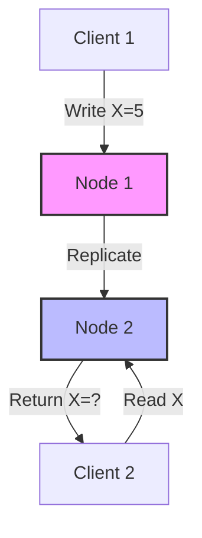
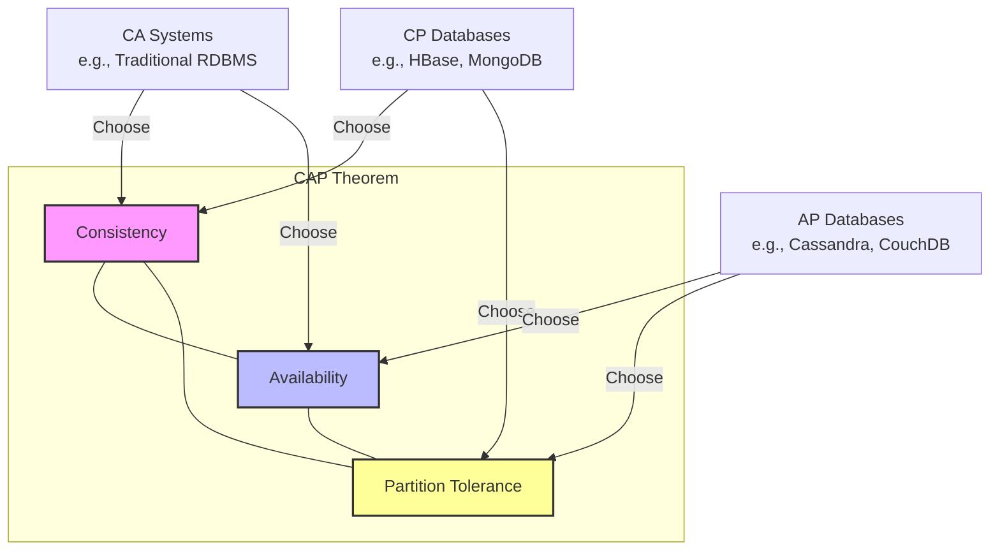
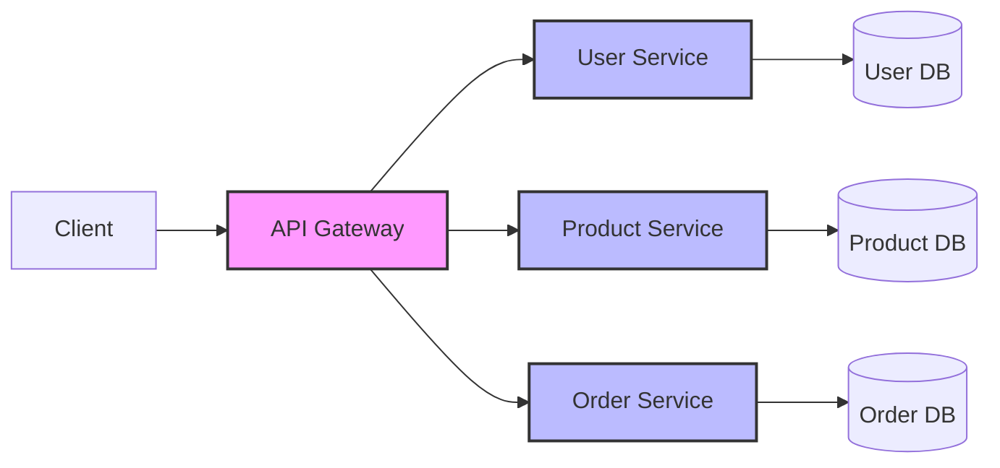
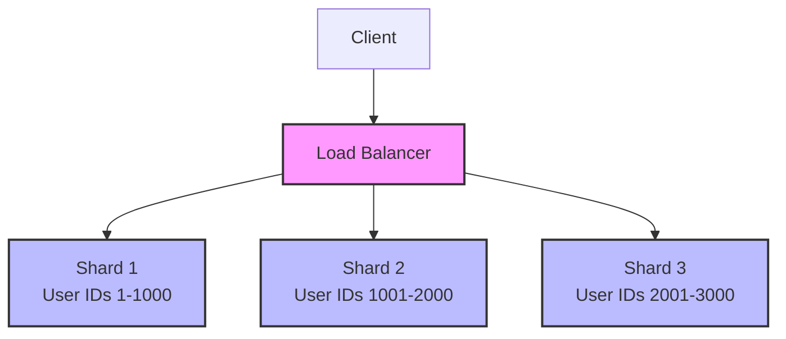
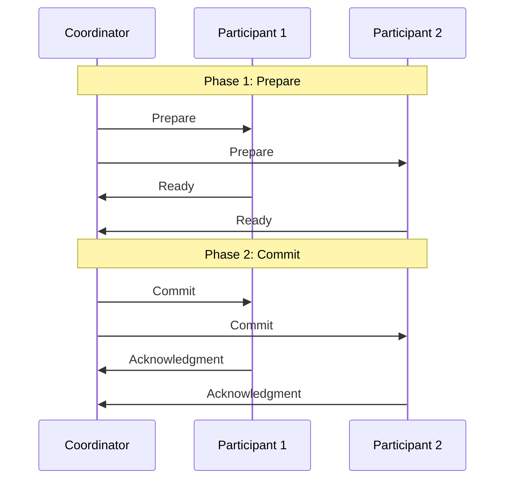

# Distributed Systems

## Introduction

A distributed system is a collection of independent computers that appear to users as a single coherent system. These computers communicate with each other over a network to achieve a common goal. Distributed systems have become increasingly important in modern software development, powering everything from search engines and social media platforms to banking systems and e-commerce websites.

In this tutorial, we'll explore the fundamental concepts of distributed systems, understand their advantages and challenges, and look at some real-world applications.

## Why Distributed Systems?

Traditional single-server systems have several limitations:

- **Limited scalability**: A single server can only handle a certain amount of load
- **Single point of failure**: If the server goes down, the entire system becomes unavailable
- **Resource constraints**: Memory, CPU, and storage are limited to what a single machine can provide

Distributed systems address these limitations by distributing data and computations across multiple machines, offering:

- **Scalability**: Add more machines to handle increased load
- **Fault tolerance**: System continues to function even if some components fail
- **Higher performance**: Parallel processing across multiple machines
- **Geographic distribution**: Place servers closer to users for lower latency

## Key Characteristics of Distributed Systems

### 1. Resource Sharing

Multiple computers share resources like hardware, software, and data.

### 2. Openness

Systems use standard interfaces that allow different components to work together.

### 3. Concurrency

Multiple processes execute simultaneously across different machines.

### 4. Scalability

The system can grow by adding more resources to handle increased load.

### 5. Fault Tolerance

The system continues to function correctly despite failures of components.

### 6. Transparency

The complexity of the system is hidden from the end-user, making multiple machines appear as a single system.

## Challenges in Distributed Systems

Distributed systems introduce several challenges that don't exist in single-system applications:

### Network Failures

Networks are inherently unreliable. Messages can be lost, delayed, or delivered out of order.

```javascript
// Example: Simple network request with retry logic
async function fetchWithRetry(url, maxRetries = 3) {
  let retries = 0;
  
  while (retries < maxRetries) {
    try {
      const response = await fetch(url);
      return await response.json();
    } catch (error) {
      console.log(`Request failed, attempt ${retries + 1}/${maxRetries}`);
      retries++;
      
      if (retries === maxRetries) {
        throw new Error('Maximum retries reached');
      }
      
      // Wait before retrying (exponential backoff)
      await new Promise(resolve => setTimeout(resolve, 1000 * Math.pow(2, retries)));
    }
  }
}

// Usage
fetchWithRetry('https://api.example.com/data')
  .then(data => console.log('Data received:', data))
  .catch(error => console.error('Failed to fetch data:', error));

/* Output:
If successful on first try:
Data received: {id: 1, name: "example"}

If failing twice before succeeding:
Request failed, attempt 1/3
Request failed, attempt 2/3
Data received: {id: 1, name: "example"}

If all attempts fail:
Request failed, attempt 1/3
Request failed, attempt 2/3
Request failed, attempt 3/3
Failed to fetch data: Error: Maximum retries reached
*/
```

### Latency

Communication between distributed components takes time, which can affect overall system performance.

### Partial Failures

Some parts of the system may fail while others continue to function, making it difficult to determine the system's state.

### Consistency

Ensuring that all nodes in the system see the same data at the same time is challenging.



### Clock Synchronization

Different machines have different clocks, which can cause timing issues in distributed algorithms.

## CAP Theorem

The CAP theorem, formulated by Eric Brewer, states that a distributed system cannot simultaneously provide more than two of the following guarantees:

- **Consistency**: All nodes see the same data at the same time
- **Availability**: Every request receives a response (success or failure)
- **Partition Tolerance**: The system continues to operate despite network partitions

This fundamental theorem guides the design decisions in distributed systems.



## Key Concepts in Distributed Systems

### Distributed Computing Models

#### Client-Server

The most common model where clients request services from servers.

```javascript
// Server-side code (Node.js)
const http = require('http');

const server = http.createServer((req, res) => {
  res.writeHead(200, {'Content-Type': 'application/json'});
  res.end(JSON.stringify({
    message: 'Hello from the server!',
    timestamp: new Date()
  }));
});

server.listen(3000, () => {
  console.log('Server running on port 3000');
});

// Client-side code
fetch('http://localhost:3000')
  .then(response => response.json())
  .then(data => console.log(data))
  .catch(error => console.error('Error:', error));

/* Output (client):
{
  message: "Hello from the server!",
  timestamp: "2025-03-17T14:30:45.123Z"
}
*/
```

#### Peer-to-Peer (P2P)

Nodes act as both clients and servers, sharing resources directly without a central server.

#### Microservices

Applications are built as collections of loosely coupled services that communicate over a network.



### Replication

Maintaining copies of data across multiple nodes to improve reliability and performance.

#### Types of Replication:

1. **Active Replication**: All replicas process each request
2. **Passive Replication**: One primary node processes requests and updates backups

### Consistency Models

Different approaches to handling data consistency:

#### Strong Consistency

All reads reflect the most recent write. This provides the most intuitive behavior but can impact availability and performance.

#### Eventual Consistency

System will eventually become consistent if no new updates are made. This improves availability but may return stale data.

```javascript
// Example: Simple in-memory data store with eventual consistency
class DistributedCache {
  constructor(nodeId, peers = []) {
    this.nodeId = nodeId;
    this.peers = peers;
    this.data = {};
    this.versionMap = {}; // Track versions of each key
  }

  // Write data locally and propagate to peers
  async set(key, value) {
    const version = (this.versionMap[key] || 0) + 1;
    this.data[key] = value;
    this.versionMap[key] = version;
    
    console.log(`[Node ${this.nodeId}] Set ${key}=${value} (version ${version})`);
    
    // Asynchronously propagate to peers (eventual consistency)
    this.peers.forEach(peer => {
      // Simulate network delay
      setTimeout(() => {
        peer.receiveUpdate(key, value, version, this.nodeId);
      }, Math.random() * 200); // Random delay up to 200ms
    });
    
    return true;
  }

  // Receive updates from peers
  receiveUpdate(key, value, version, fromNodeId) {
    const currentVersion = this.versionMap[key] || 0;
    
    // Only update if the received version is newer
    if (version > currentVersion) {
      this.data[key] = value;
      this.versionMap[key] = version;
      console.log(`[Node ${this.nodeId}] Updated ${key}=${value} (version ${version}) from Node ${fromNodeId}`);
    } else {
      console.log(`[Node ${this.nodeId}] Ignored update for ${key} (received version ${version}, current version ${currentVersion})`);
    }
  }

  // Read data from local store
  get(key) {
    const value = this.data[key];
    const version = this.versionMap[key] || 0;
    console.log(`[Node ${this.nodeId}] Get ${key}=${value} (version ${version})`);
    return value;
  }
}

// Example usage
const node1 = new DistributedCache(1);
const node2 = new DistributedCache(2);
const node3 = new DistributedCache(3);

// Set up the peer relationships
node1.peers = [node2, node3];
node2.peers = [node1, node3];
node3.peers = [node1, node2];

// Demonstrate eventual consistency
async function demo() {
  await node1.set('user', 'Alice');
  
  // Immediately after setting, nodes might be inconsistent
  console.log('Immediate state:');
  console.log(`Node 1: ${node1.get('user')}`);
  console.log(`Node 2: ${node2.get('user')}`);
  console.log(`Node 3: ${node3.get('user')}`);
  
  // Wait for eventual consistency
  await new Promise(resolve => setTimeout(resolve, 500));
  
  console.log('After synchronization:');
  console.log(`Node 1: ${node1.get('user')}`);
  console.log(`Node 2: ${node2.get('user')}`);
  console.log(`Node 3: ${node3.get('user')}`);
}

demo();

/* Example Output:
[Node 1] Set user=Alice (version 1)
Immediate state:
[Node 1] Get user=Alice (version 1)
Alice
[Node 2] Get user=undefined (version 0)
undefined
[Node 3] Get user=undefined (version 0)
undefined
[Node 2] Updated user=Alice (version 1) from Node 1
[Node 3] Updated user=Alice (version 1) from Node 1

After synchronization:
[Node 1] Get user=Alice (version 1)
Alice
[Node 2] Get user=Alice (version 1)
Alice
[Node 3] Get user=Alice (version 1)
Alice
*/
```

#### Causal Consistency

If one process reads a value and then writes a new value, any process that sees the new value will also see the previous value.

### Partitioning (Sharding)

Dividing data across multiple nodes to improve scalability and performance.



### Consensus Algorithms

Ensuring that all nodes in a distributed system agree on a single value or decision.

#### Paxos and Raft

Popular consensus algorithms that ensure agreement among distributed nodes even in the presence of failures.

### Distributed Transactions

Maintaining ACID properties (Atomicity, Consistency, Isolation, Durability) across multiple systems.

#### Two-Phase Commit (2PC)

A protocol that ensures all participants in a distributed transaction either commit or abort the transaction.



## Real-World Distributed Systems Examples

### 1. Google's Search Engine

Google's search engine is a massive distributed system that indexes billions of web pages and processes millions of search queries per second.

Key components:
- **Crawler**: Distributed system that finds and downloads web pages
- **Indexer**: Processes and stores information about web pages
- **Query processor**: Handles user searches and returns relevant results

### 2. Amazon's E-commerce Platform

Amazon's platform handles millions of customers, products, and transactions using a distributed architecture.

- **Product catalog**: Distributed database storing millions of products
- **Order processing**: Distributed system handling transactions
- **Recommendation system**: Analyzes user behavior across multiple systems

### 3. Banking Systems

Modern banking systems use distributed architectures to handle transactions across multiple branches and ATMs.

- **Transaction processing**: Ensuring consistency across distributed nodes
- **Replication**: Maintaining data integrity and availability
- **Fault tolerance**: Ensuring the system continues to work even if some components fail

## Building a Simple Distributed Calculator

Let's implement a simple distributed calculator system where different servers handle different operations.

```javascript
// math-service.js - A simple distributed calculator service

const express = require('express');
const axios = require('axios');
const app = express();
app.use(express.json());

// Service registry - in a real system, this would be a separate service
const serviceRegistry = {
  addition: 'http://localhost:3001',
  subtraction: 'http://localhost:3002',
  multiplication: 'http://localhost:3003',
  division: 'http://localhost:3004'
};

// Gateway service - routes requests to appropriate services
app.post('/calculate', async (req, res) => {
  try {
    const { operation, a, b } = req.body;
    
    if (!serviceRegistry[operation]) {
      return res.status(400).json({ error: `Unsupported operation: ${operation}` });
    }
    
    console.log(`Routing ${operation} request to ${serviceRegistry[operation]}`);
    
    const response = await axios.post(`${serviceRegistry[operation]}/compute`, { a, b });
    res.json({ result: response.data.result });
  } catch (error) {
    console.error('Error processing request:', error.message);
    res.status(500).json({ error: 'Service unavailable' });
  }
});

// Addition service
const additionService = express();
additionService.use(express.json());
additionService.post('/compute', (req, res) => {
  const { a, b } = req.body;
  console.log(`Addition service: ${a} + ${b}`);
  res.json({ result: a + b });
});

// Subtraction service
const subtractionService = express();
subtractionService.use(express.json());
subtractionService.post('/compute', (req, res) => {
  const { a, b } = req.body;
  console.log(`Subtraction service: ${a} - ${b}`);
  res.json({ result: a - b });
});

// Start services
app.listen(3000, () => console.log('Gateway service running on port 3000'));
additionService.listen(3001, () => console.log('Addition service running on port 3001'));
subtractionService.listen(3002, () => console.log('Subtraction service running on port 3002'));

/* Usage:
POST http://localhost:3000/calculate
{
  "operation": "addition",
  "a": 5,
  "b": 3
}

Response:
{
  "result": 8
}
*/
```

This simple example demonstrates several distributed system concepts:
- **Service discovery**: The gateway knows where to find each service
- **Load distribution**: Different services handle different operations
- **Failure isolation**: If one service fails, others can still function

## Best Practices for Distributed Systems

### 1. Design for Failure

Assume components will fail and design your system to handle these failures gracefully.

### 2. Implement Retry Logic

When services fail, implement retry logic with exponential backoff to avoid overwhelming the system.

### 3. Use Circuit Breakers

Prevent cascading failures by using circuit breakers that stop requests to failing services.

```javascript
// Example: Circuit Breaker pattern
class CircuitBreaker {
  constructor(service, options = {}) {
    this.service = service;
    this.failureThreshold = options.failureThreshold || 5;
    this.resetTimeout = options.resetTimeout || 30000; // 30 seconds
    this.state = 'CLOSED'; // CLOSED, OPEN, HALF-OPEN
    this.failureCount = 0;
    this.lastFailureTime = null;
  }
  
  async call(request) {
    if (this.state === 'OPEN') {
      // Check if it's time to try again
      const timeSinceLastFailure = Date.now() - this.lastFailureTime;
      if (timeSinceLastFailure > this.resetTimeout) {
        this.state = 'HALF-OPEN';
        console.log('Circuit half-open, attempting request');
      } else {
        console.log('Circuit open, failing fast');
        throw new Error('Service unavailable (circuit open)');
      }
    }
    
    try {
      const response = await this.service(request);
      
      // If successful in HALF-OPEN state, reset the circuit
      if (this.state === 'HALF-OPEN') {
        this.state = 'CLOSED';
        this.failureCount = 0;
        console.log('Request succeeded, circuit closed');
      }
      
      return response;
    } catch (error) {
      this.recordFailure();
      throw error;
    }
  }
  
  recordFailure() {
    this.failureCount++;
    this.lastFailureTime = Date.now();
    
    if (this.state === 'HALF-OPEN' || this.failureCount >= this.failureThreshold) {
      this.state = 'OPEN';
      console.log(`Circuit opened after ${this.failureCount} failures`);
    }
  }
}

// Example usage
const userService = new CircuitBreaker(
  async (userId) => {
    // Simulate a service that sometimes fails
    if (Math.random() < 0.3) {
      throw new Error('Service error');
    }
    return { id: userId, name: 'User ' + userId };
  },
  { failureThreshold: 3, resetTimeout: 10000 }
);

async function getUserData(userId) {
  try {
    return await userService.call(userId);
  } catch (error) {
    console.error(`Error fetching user ${userId}: ${error.message}`);
    return null;
  }
}

// Test the circuit breaker
async function testCircuitBreaker() {
  for (let i = 1; i <= 10; i++) {
    console.log(`Request ${i}:`);
    const result = await getUserData(i);
    console.log(result);
    await new Promise(resolve => setTimeout(resolve, 1000));
  }
}

testCircuitBreaker();

/* Example Output:
Request 1:
{ id: 1, name: 'User 1' }
Request 2:
Error fetching user 2: Service error
null
Request 3:
Error fetching user 3: Service error
null
Request 4:
Error fetching user 4: Service error
Circuit opened after 3 failures
null
Request 5:
Error fetching user 5: Service unavailable (circuit open)
null
...
*/
```

### 4. Implement Health Checks

Regularly check the health of your services and take appropriate actions when they're unhealthy.

### 5. Monitor and Log Everything

Use comprehensive monitoring and logging to understand the behavior of your distributed system.

### 6. Use Asynchronous Communication When Possible

Asynchronous communication helps decouple services and improve resilience.

## Summary

Distributed systems offer significant advantages in terms of scalability, reliability, and performance, but they also introduce new challenges related to consistency, failure handling, and complexity.

Key points to remember:
- Distributed systems consist of multiple independent computers working together
- They provide benefits like scalability, fault tolerance, and performance
- The CAP theorem states that we can only guarantee two of: consistency, availability, and partition tolerance
- Common patterns include replication, partitioning, and consensus algorithms
- Real-world applications include search engines, e-commerce platforms, and banking systems

By understanding these fundamental concepts, you're now better equipped to design and work with distributed systems in your own applications.

## Further Learning

To deepen your understanding of distributed systems, consider exploring:

1. **Distributed databases** like Cassandra, MongoDB, and CockroachDB
2. **Message queues** like RabbitMQ and Apache Kafka
3. **Container orchestration** with Kubernetes
4. **Service mesh** technologies like Istio

## Exercises

1. Design a simple distributed key-value store that replicates data across three nodes
2. Implement a basic load balancer that distributes requests across multiple servers
3. Create a simple distributed chat application using WebSockets
4. Experiment with different consistency models and observe their trade-offs
5. Implement a circuit breaker pattern for a REST API client