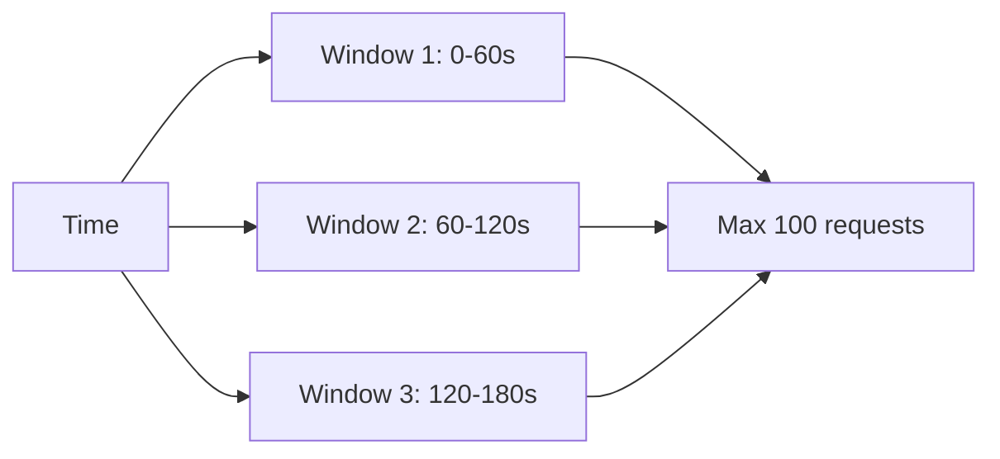
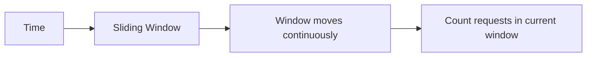
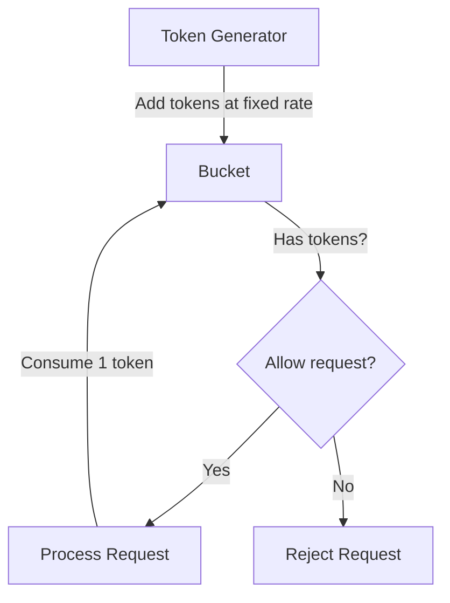
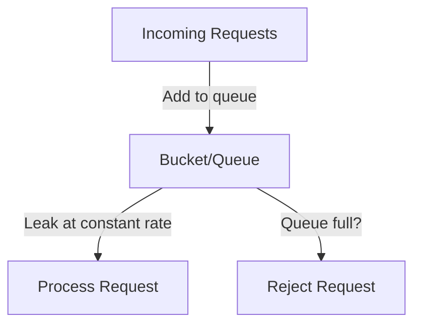

# Rate Limiting

## Introduction

Rate limiting is a critical strategy used in system design to control the amount of requests a client can make to a service within a given timeframe. It acts as a traffic cop for your application, ensuring that resources are used fairly and protected from excessive use, whether intentional or accidental.

In today's world of distributed systems and microservices, rate limiting has become an essential technique for:

- Preventing denial-of-service (DoS) attacks
- Ensuring fair resource usage among clients
- Protecting backend services from being overwhelmed
- Managing costs associated with API calls to third-party services
- Maintaining system stability during traffic spikes

In this guide, we'll explore rate limiting concepts, algorithms, implementation strategies, and real-world examples that will help you incorporate this vital pattern into your own applications.

## Core Concepts

### What is Rate Limiting?

Rate limiting restricts how many requests a client can make to an API or service within a specified time window. When a client exceeds their allowed limit, the server typically:

1. Rejects the request
2. Returns a specific HTTP status code (usually `429 Too Many Requests`)
3. Includes headers that inform the client about their limits and remaining allowance

### Key Components

Any rate limiting system consists of these fundamental components:

- **Client identifier**: A way to uniquely identify who is making the request (IP address, API key, user ID, etc.)
- **Counter**: Tracks how many requests each client has made
- **Time window**: Defines the period over which requests are counted
- **Limit**: The maximum number of requests allowed in the time window
- **Action**: What happens when a client exceeds their limit

## Rate Limiting Algorithms

Let's explore the most common algorithms used to implement rate limiting:

### 1. Fixed Window

The fixed window algorithm divides time into fixed intervals (e.g., 1 minute) and allows a maximum number of requests in each interval.



**Pros:**
- Simple to understand and implement
- Requires minimal memory

**Cons:**
- Can allow bursts at window boundaries (e.g., 100 requests at the end of one window and 100 more at the beginning of the next)

**Implementation example:**

```python
class FixedWindowRateLimiter:
    def __init__(self, max_requests, window_size_seconds):
        self.max_requests = max_requests
        self.window_size = window_size_seconds
        self.counters = {}  # {client_id: (timestamp, count)}
    
    def is_allowed(self, client_id):
        current_time = int(time.time())
        window_start_time = current_time - (current_time % self.window_size)
        
        # If this is a new window or new client, reset the counter
        if client_id not in self.counters or self.counters[client_id][0] < window_start_time:
            self.counters[client_id] = (window_start_time, 1)
            return True
        
        timestamp, count = self.counters[client_id]
        if count < self.max_requests:
            self.counters[client_id] = (timestamp, count + 1)
            return True
        
        return False
```

### 2. Sliding Window

The sliding window algorithm tracks requests over a continuous moving time window, providing a smoother rate limiting experience.



**Pros:**
- More accurate than fixed window
- Prevents bursts at window boundaries

**Cons:**
- More complex to implement
- Requires more memory to track timestamps

**Implementation example:**

```python
class SlidingWindowRateLimiter:
    def __init__(self, max_requests, window_size_seconds):
        self.max_requests = max_requests
        self.window_size = window_size_seconds
        self.client_requests = {}  # {client_id: [(timestamp1), (timestamp2), ...]}
    
    def is_allowed(self, client_id):
        current_time = time.time()
        window_start_time = current_time - self.window_size
        
        # Initialize if this is a new client
        if client_id not in self.client_requests:
            self.client_requests[client_id] = []
        
        # Remove timestamps outside the current window
        self.client_requests[client_id] = [
            timestamp for timestamp in self.client_requests[client_id] 
            if timestamp > window_start_time
        ]
        
        # Check if client has exceeded the rate limit
        if len(self.client_requests[client_id]) < self.max_requests:
            self.client_requests[client_id].append(current_time)
            return True
        
        return False
```

### 3. Token Bucket

The token bucket algorithm imagines a bucket that continuously fills with tokens at a steady rate. Each request consumes one token, and requests without available tokens are rejected.



**Pros:**
- Allows for bursts of traffic up to the bucket size
- Provides a consistent rate over time

**Cons:**
- Slightly more complex to understand and implement

**Implementation example:**

```python
class TokenBucketRateLimiter:
    def __init__(self, capacity, refill_rate):
        self.capacity = capacity  # Maximum tokens in the bucket
        self.refill_rate = refill_rate  # Tokens added per second
        self.tokens = {}  # {client_id: (last_update_time, tokens_remaining)}
    
    def is_allowed(self, client_id):
        current_time = time.time()
        
        # Initialize new client
        if client_id not in self.tokens:
            self.tokens[client_id] = (current_time, self.capacity)
            return True
        
        last_update, tokens_remaining = self.tokens[client_id]
        
        # Calculate how many tokens to add since the last update
        time_passed = current_time - last_update
        new_tokens = time_passed * self.refill_rate
        
        # Update tokens (capped at capacity)
        current_tokens = min(tokens_remaining + new_tokens, self.capacity)
        
        # Check if request can be processed
        if current_tokens >= 1:
            self.tokens[client_id] = (current_time, current_tokens - 1)
            return True
        else:
            self.tokens[client_id] = (current_time, current_tokens)
            return False
```

### 4. Leaky Bucket

The leaky bucket algorithm processes requests at a constant rate, queuing them if they arrive too quickly.



**Pros:**
- Ensures consistent processing rate
- Good for smoothing out traffic spikes

**Cons:**
- Adds latency as requests wait in the queue
- Complexity in managing the queue

**Implementation example:**

```python
class LeakyBucketRateLimiter:
    def __init__(self, capacity, leak_rate):
        self.capacity = capacity  # Maximum queue size
        self.leak_rate = leak_rate  # Requests processed per second
        self.buckets = {}  # {client_id: (last_leak_time, queue_size)}
    
    def is_allowed(self, client_id):
        current_time = time.time()
        
        # Initialize new client
        if client_id not in self.buckets:
            self.buckets[client_id] = (current_time, 0)
        
        last_leak, queue_size = self.buckets[client_id]
        
        # Calculate leaks since last update
        time_passed = current_time - last_leak
        leaks = time_passed * self.leak_rate
        
        # Update queue size after leaking (minimum 0)
        current_size = max(queue_size - leaks, 0)
        
        # Check if new request fits in the bucket
        if current_size < self.capacity:
            self.buckets[client_id] = (current_time, current_size + 1)
            return True
        else:
            self.buckets[client_id] = (current_time, current_size)
            return False
```

## Implementation Considerations

### Where to Place Rate Limiting

Rate limiting can be implemented at different layers of your architecture:

1. **API Gateway Level**: Most common place, centralized control for all APIs
2. **Load Balancer Level**: Distributed control before requests reach servers  
3. **Application Level**: Fine-grained control within the application
4. **Database Level**: Protection for database resources

### Client Identification Strategies

How you identify clients affects the fairness and security of your rate limiting:

- **IP Address**: Simple but can be problematic with shared IPs or proxies
- **API Key/User ID**: More accurate but requires authentication
- **Combination**: Multiple factors for more sophisticated rules

### Response Headers

When implementing rate limiting, include these standard HTTP headers in your responses:

```
X-RateLimit-Limit: 100           # Total requests allowed
X-RateLimit-Remaining: 75        # Requests remaining in window
X-RateLimit-Reset: 1620000000    # Timestamp when limit resets
Retry-After: 30                  # Seconds until retry is allowed (when limited)
```

These headers help clients understand their limits and adapt their request patterns accordingly.

## Real-World Examples

### Example 1: API Rate Limiting in Express.js

Here's how you could implement a simple rate limiter in an Express.js application using the popular `express-rate-limit` middleware:

```javascript
const rateLimit = require('express-rate-limit');

// Create a limiter that allows 100 requests per 15 minutes
const apiLimiter = rateLimit({
  windowMs: 15 * 60 * 1000, // 15 minutes
  max: 100, // limit each IP to 100 requests per windowMs
  standardHeaders: true, // Return rate limit info in the RateLimit-* headers
  legacyHeaders: false, // Disable the X-RateLimit-* headers
  message: 'Too many requests, please try again after 15 minutes'
});

// Apply the rate limiting middleware to API calls
app.use('/api/', apiLimiter);

// Create a stricter limiter for login attempts
const loginLimiter = rateLimit({
  windowMs: 60 * 60 * 1000, // 1 hour
  max: 5, // 5 login attempts per hour
  message: 'Too many login attempts, please try again after an hour'
});

// Apply the stricter rate limiter to the login endpoint
app.use('/api/login', loginLimiter);
```

### Example 2: Redis-Based Distributed Rate Limiting

For a distributed system, you might use Redis to implement rate limiting across multiple servers:

```python
import redis
import time

class RedisRateLimiter:
    def __init__(self, redis_client, max_requests, window_size_seconds, key_prefix="rate_limit:"):
        self.redis = redis_client
        self.max_requests = max_requests
        self.window_size = window_size_seconds
        self.key_prefix = key_prefix
    
    def is_allowed(self, client_id):
        key = f"{self.key_prefix}{client_id}"
        current_time = int(time.time())
        
        # Create a transaction pipeline
        pipe = self.redis.pipeline()
        
        # Remove counts outside the current window
        pipe.zremrangebyscore(key, 0, current_time - self.window_size)
        
        # Count existing requests in the current window
        pipe.zcard(key)
        
        # Add the current timestamp to the sorted set
        pipe.zadd(key, {current_time: current_time})
        
        # Set the expiration to clean up old data
        pipe.expire(key, self.window_size)
        
        # Execute pipeline
        results = pipe.execute()
        
        # Get the count of requests within window (before adding the current one)
        count = results[1]
        
        # Check if the client has exceeded the rate limit
        return count < self.max_requests

# Usage example
redis_client = redis.Redis(host='localhost', port=6379, db=0)
rate_limiter = RedisRateLimiter(redis_client, 100, 60)  # 100 requests per minute

def process_request(client_id, request_data):
    if rate_limiter.is_allowed(client_id):
        # Process the request
        return {"status": "success", "data": "Request processed"}
    else:
        # Return rate limit exceeded response
        return {"status": "error", "message": "Rate limit exceeded"}
```

### Example 3: Rate Limiting Third-Party API Calls

When your application depends on external APIs with their own limits, you can implement client-side rate limiting:

```javascript
class ThirdPartyApiClient {
  constructor(baseUrl, apiKey, requestsPerMinute) {
    this.baseUrl = baseUrl;
    this.apiKey = apiKey;
    this.requestsPerMinute = requestsPerMinute;
    this.tokenBucket = {
      tokens: requestsPerMinute,
      lastRefill: Date.now()
    };
  }

  async makeRequest(endpoint, method = 'GET', data = null) {
    // Check if we have a token available
    if (!this._getToken()) {
      throw new Error('Rate limit exceeded. Please try again later.');
    }
    
    // Make the actual API request
    const response = await fetch(`${this.baseUrl}${endpoint}`, {
      method,
      headers: {
        'Content-Type': 'application/json',
        'Authorization': `Bearer ${this.apiKey}`
      },
      body: data ? JSON.stringify(data) : null
    });
    
    // Handle rate limit errors from the API
    if (response.status === 429) {
      const retryAfter = response.headers.get('Retry-After') || 60;
      throw new Error(`API rate limit exceeded. Retry after ${retryAfter} seconds.`);
    }
    
    return response.json();
  }
  
  _getToken() {
    const now = Date.now();
    const timePassed = (now - this.tokenBucket.lastRefill) / 1000; // in seconds
    
    // Refill tokens based on time passed
    this.tokenBucket.tokens = Math.min(
      this.requestsPerMinute,
      this.tokenBucket.tokens + timePassed * (this.requestsPerMinute / 60)
    );
    this.tokenBucket.lastRefill = now;
    
    // Check if we have at least 1 token
    if (this.tokenBucket.tokens >= 1) {
      this.tokenBucket.tokens -= 1;
      return true;
    }
    
    return false;
  }
}

// Usage
const weatherApiClient = new ThirdPartyApiClient('https://api.weather.com', 'your-api-key', 60);

async function getWeatherForCity(cityName) {
  try {
    return await weatherApiClient.makeRequest(`/current?city=${cityName}`);
  } catch (error) {
    console.error(`Failed to get weather: ${error.message}`);
    return null;
  }
}
```

## Advanced Rate Limiting Strategies

### Dynamic Rate Limiting

Instead of fixed limits, you can adjust limits based on system load or user behavior:

```python
class DynamicRateLimiter:
    def __init__(self, redis_client, base_limit, key_prefix="dynamic_rate:"):
        self.redis = redis_client
        self.base_limit = base_limit
        self.key_prefix = key_prefix
    
    def is_allowed(self, client_id, system_load):
        # Adjust limit based on current system load (0.0 to 1.0)
        adjusted_limit = int(self.base_limit * (1 - system_load * 0.5))
        
        # Minimum of 10% of base limit even under high load
        adjusted_limit = max(adjusted_limit, int(self.base_limit * 0.1))
        
        # Use regular rate limiting logic with the adjusted limit
        key = f"{self.key_prefix}{client_id}"
        count = self.redis.incr(key)
        
        # Set expiry if this is the first request in the window
        if count == 1:
            self.redis.expire(key, 60)  # 1-minute window
        
        return count <= adjusted_limit
```

### User Tiers

Implement different rate limits for different user tiers:

```javascript
const userTiers = {
  free: { requestsPerMinute: 10, burstCapacity: 15 },
  premium: { requestsPerMinute: 60, burstCapacity: 100 },
  enterprise: { requestsPerMinute: 600, burstCapacity: 1000 }
};

function getRateLimit(user) {
  const tier = user.tier || 'free';
  return userTiers[tier] || userTiers.free;
}

app.use((req, res, next) => {
  const user = req.user;
  const limits = getRateLimit(user);
  
  // Apply custom rate limiting based on user tier
  const rateLimiter = new TokenBucketRateLimiter(
    limits.burstCapacity,
    limits.requestsPerMinute / 60  // Tokens per second
  );
  
  if (rateLimiter.isAllowed(user.id)) {
    next();
  } else {
    res.status(429).json({
      error: 'Rate limit exceeded',
      tier: user.tier,
      limit: limits.requestsPerMinute,
      message: `You are allowed ${limits.requestsPerMinute} requests per minute`
    });
  }
});
```

## Common Challenges and Solutions

### Challenge: Distributed Systems

**Problem**: When your application runs on multiple servers, each server has its own rate limiter.

**Solution**: Use a centralized data store like Redis to track rate limits across all servers.

### Challenge: Fairness in Multi-Tenant Systems

**Problem**: One tenant (customer) consumes all available rate limit capacity.

**Solution**: Implement hierarchical rate limiting:

```python
def is_request_allowed(tenant_id, user_id):
    # First check the tenant-level rate limit
    tenant_limiter = get_tenant_rate_limiter(tenant_id)
    if not tenant_limiter.is_allowed():
        return False
    
    # Then check the user-level rate limit
    user_limiter = get_user_rate_limiter(tenant_id, user_id)
    return user_limiter.is_allowed()
```

### Challenge: Cold Starts and Burst Traffic

**Problem**: After a period of inactivity, sudden bursts of traffic are rejected.

**Solution**: Use algorithms like Token Bucket that allow bursts up to a configurable limit.

## Summary

Rate limiting is an essential technique for building robust, scalable systems. By controlling the flow of requests, you can protect your services from overload, ensure fair resource allocation, and maintain system stability.

We've covered:

- The fundamental concepts of rate limiting
- Different algorithms (Fixed Window, Sliding Window, Token Bucket, Leaky Bucket)
- Implementation considerations and best practices
- Real-world examples for various scenarios
- Advanced strategies for complex systems

When implementing rate limiting in your applications, consider your specific requirements:
- Do you need to allow bursts of traffic?
- Is your system distributed across multiple servers?
- Do you have different classes of users with different limits?

Choosing the right approach will help you build systems that remain responsive and reliable even under heavy load.

## Additional Resources

Here are some exercises to help you practice rate limiting concepts:

1. **Basic Rate Limiter**: Implement a simple fixed window rate limiter and test it with a simulated traffic pattern.

2. **Token Bucket Exploration**: Experiment with different token bucket sizes and refill rates to see how they affect request patterns.

3. **Distributed Challenge**: Design a rate limiting solution for a system running on multiple containers or servers.

4. **Performance Testing**: Create a test harness to compare the performance of different rate limiting algorithms under various traffic patterns.