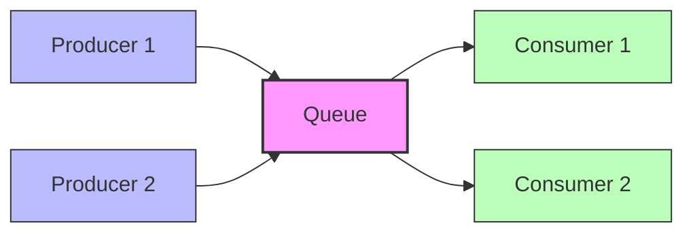
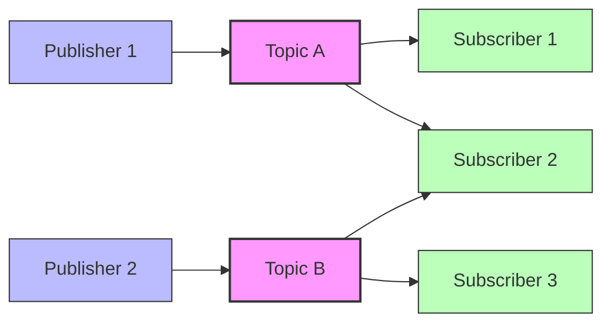

# Message Queues and Pub/Sub

## Introduction

In modern distributed systems, components often need to communicate with each other. Direct communication between components can lead to tight coupling, making the system difficult to scale and maintain. This is where **Message Queues** and **Publish-Subscribe (Pub/Sub)** patterns come in. They provide mechanisms for asynchronous communication between different parts of a system, enabling loose coupling and improved scalability.

This guide will help you understand:
- What message queues and pub/sub systems are
- How they differ from each other
- When and why you should use them
- How to implement them with code examples
- Real-world applications and use cases

## Message Queues: The Basics

A message queue is a form of asynchronous service-to-service communication. Messages are stored in a queue until they are processed and deleted. Each message is processed only once, by a single consumer.

### Core Concepts

1. **Producer**: An application that creates messages and sends them to the queue
2. **Queue**: A buffer that stores messages
3. **Consumer**: An application that connects to the queue and processes messages

### Visual Representation



### Key Characteristics

- **Point-to-Point**: Each message is delivered to exactly one consumer
- **Durability**: Messages persist in the queue until processed
- **Ordering**: Messages are typically processed in the order they are received (FIFO)
- **Decoupling**: Producers and consumers don't need to know about each other

## Publish-Subscribe (Pub/Sub): The Basics

The Pub/Sub pattern is an asynchronous messaging pattern where publishers categorize published messages into topics, and subscribers express interest in one or more topics. Unlike message queues, in a pub/sub system, a message can be received by multiple subscribers.

### Core Concepts

1. **Publisher**: An application that creates messages and publishes them to specific topics
2. **Topic**: A named channel for distributing messages
3. **Subscriber**: An application that subscribes to topics and receives all messages published to those topics

### Visual Representation



### Key Characteristics

- **One-to-Many**: Messages are delivered to all interested subscribers
- **Topic-Based**: Subscribers receive messages based on topics they subscribe to
- **Loose Coupling**: Publishers don't know which subscribers (if any) will receive the messages
- **Real-time**: Messages are typically delivered immediately to all active subscribers

## Message Queues vs. Pub/Sub: Key Differences

| Feature | Message Queues | Pub/Sub |
|---------|---------------|---------|
| Message Consumption | Each message consumed by one consumer | Each message consumed by multiple subscribers |
| Use Case | Work distribution, load balancing | Event broadcasting, notifications |
| Message Retention | Until processed | Typically short-lived or configurable |
| Scalability | Horizontal (add more consumers) | Both publishers and subscribers can scale independently |
| Example Systems | RabbitMQ, ActiveMQ | Apache Kafka, Google Cloud Pub/Sub |

## Implementing a Simple Message Queue

Let's see how we might implement a basic message queue using Node.js and RabbitMQ:

### Producer Code

```javascript
const amqp = require('amqplib');

async function sendToQueue() {
  try {
    // Connect to RabbitMQ server
    const connection = await amqp.connect('amqp://localhost');
    const channel = await connection.createChannel();
    
    // Declare a queue
    const queueName = 'task_queue';
    await channel.assertQueue(queueName, { durable: true });
    
    // Send messages
    const message = 'Task ' + Math.floor(Math.random() * 100);
    channel.sendToQueue(queueName, Buffer.from(message), { persistent: true });
    console.log(`[x] Sent: ${message}`);
    
    // Close the connection
    setTimeout(() => {
      connection.close();
    }, 500);
  } catch (error) {
    console.error(error);
  }
}

sendToQueue();
```

### Consumer Code

```javascript
const amqp = require('amqplib');

async function receiveFromQueue() {
  try {
    // Connect to RabbitMQ server
    const connection = await amqp.connect('amqp://localhost');
    const channel = await connection.createChannel();
    
    // Declare the same queue
    const queueName = 'task_queue';
    await channel.assertQueue(queueName, { durable: true });
    
    // Only get one message at a time
    channel.prefetch(1);
    
    console.log('[*] Waiting for messages. To exit press CTRL+C');
    
    // Consume messages
    channel.consume(queueName, (msg) => {
      if (msg !== null) {
        const message = msg.content.toString();
        console.log(`[x] Received: ${message}`);
        
        // Simulate processing time
        const processingTime = message.split(' ')[1] * 100;
        setTimeout(() => {
          console.log(`[x] Done processing: ${message}`);
          channel.ack(msg); // Acknowledge message processing
        }, processingTime);
      }
    });
  } catch (error) {
    console.error(error);
  }
}

receiveFromQueue();
```

**Expected Output:**

Producer:
```
[x] Sent: Task 42
```

Consumer:
```
[*] Waiting for messages. To exit press CTRL+C
[x] Received: Task 42
[x] Done processing: Task 42
```

## Implementing a Simple Pub/Sub System

Now, let's implement a basic pub/sub system using Node.js and RabbitMQ:

### Publisher Code

```javascript
const amqp = require('amqplib');

async function publishMessage() {
  try {
    // Connect to RabbitMQ server
    const connection = await amqp.connect('amqp://localhost');
    const channel = await connection.createChannel();
    
    // Declare an exchange
    const exchangeName = 'logs';
    await channel.assertExchange(exchangeName, 'fanout', { durable: false });
    
    // Publish message to the exchange
    const message = 'Info: System update at ' + new Date().toISOString();
    channel.publish(exchangeName, '', Buffer.from(message));
    console.log(`[x] Published: ${message}`);
    
    // Close the connection
    setTimeout(() => {
      connection.close();
    }, 500);
  } catch (error) {
    console.error(error);
  }
}

publishMessage();
```

### Subscriber Code

```javascript
const amqp = require('amqplib');

async function subscribeToMessages() {
  try {
    // Connect to RabbitMQ server
    const connection = await amqp.connect('amqp://localhost');
    const channel = await connection.createChannel();
    
    // Declare the same exchange
    const exchangeName = 'logs';
    await channel.assertExchange(exchangeName, 'fanout', { durable: false });
    
    // Create a temporary queue
    const q = await channel.assertQueue('', { exclusive: true });
    
    // Bind the queue to the exchange
    await channel.bindQueue(q.queue, exchangeName, '');
    
    console.log('[*] Waiting for messages. To exit press CTRL+C');
    
    // Consume messages
    channel.consume(q.queue, (msg) => {
      if (msg !== null) {
        console.log(`[x] Received: ${msg.content.toString()}`);
      }
    }, { noAck: true });
  } catch (error) {
    console.error(error);
  }
}

subscribeToMessages();
```

**Expected Output:**

Publisher:
```
[x] Published: Info: System update at 2023-09-15T14:35:27.455Z
```

Subscriber (multiple instances will receive the same message):
```
[*] Waiting for messages. To exit press CTRL+C
[x] Received: Info: System update at 2023-09-15T14:35:27.455Z
```

## Real-World Use Cases

### Message Queues

1. **Task Distribution**: Distributing tasks across multiple worker processes
   ```javascript
   // Task producer
   taskQueue.sendTask({ id: 'task-123', type: 'image-processing', data: 'image.jpg' });
   
   // Worker
   taskQueue.processTask((task) => {
     if (task.type === 'image-processing') {
       processImage(task.data);
     }
   });
   ```

2. **Order Processing System**: Processing user orders in e-commerce
   ```javascript
   // When user places an order
   orderQueue.sendToQueue({
     orderId: 'ORD-123456',
     userId: 'user-789',
     items: [{ id: 'item-1', quantity: 2 }, { id: 'item-2', quantity: 1 }],
     totalAmount: 59.98
   });
   
   // Order processing service
   orderQueue.consume((order) => {
     verifyPayment(order.totalAmount)
       .then(() => updateInventory(order.items))
       .then(() => sendConfirmationEmail(order.userId, order.orderId))
       .then(() => markOrderAsProcessed(order.orderId));
   });
   ```

### Pub/Sub Systems

1. **Real-time Analytics**: Tracking user activities across a platform
   ```javascript
   // User activity publisher
   activityPublisher.publish('user-activity', {
     userId: 'user-123',
     action: 'page-view',
     page: '/products/shoes',
     timestamp: Date.now()
   });
   
   // Analytics subscribers
   analyticsService.subscribe('user-activity', (activity) => {
     updateRealTimeMetrics(activity);
   });
   
   recommendationService.subscribe('user-activity', (activity) => {
     updateUserPreferences(activity.userId, activity.page);
   });
   ```

2. **Chat Application**: Broadcasting messages to multiple users
   ```javascript
   // Message sender
   chatPublisher.publish('chat-room-42', {
     senderId: 'user-789',
     content: 'Hello everyone!',
     timestamp: Date.now()
   });
   
   // Client subscribers
   chatClient.subscribe('chat-room-42', (message) => {
     displayMessage(message.senderId, message.content);
   });
   ```

## Popular Message Queue and Pub/Sub Technologies

### Message Queues
- RabbitMQ
- ActiveMQ
- Amazon SQS
- Microsoft Azure Queue Storage

### Pub/Sub Systems
- Apache Kafka
- Google Cloud Pub/Sub
- Redis Pub/Sub
- AWS SNS (Simple Notification Service)

## When to Use Which Pattern

### Choose Message Queues When:
- You need to ensure each message is processed exactly once
- You want to distribute work among multiple workers
- You need persistent messages until they're processed
- You need ordered processing of messages

### Choose Pub/Sub When:
- You need to broadcast messages to multiple subscribers
- You need real-time event notifications
- You have a system where components need to react to events
- You want to decouple event producers from consumers

## Advantages of Using Message Queues and Pub/Sub

1. **Decoupling**: Components don't need direct knowledge of each other
2. **Scalability**: Easy to add more producers or consumers
3. **Resilience**: System can continue operating even if some components fail
4. **Asynchronous Processing**: No need to wait for immediate responses
5. **Load Leveling**: Handle spikes in traffic without overwhelming services

## Common Challenges and Solutions

### Challenges
1. **Message Ordering**: Ensuring messages are processed in the correct order
2. **Duplicate Messages**: Handling the same message arriving multiple times
3. **Message Persistence**: Dealing with service restarts or crashes
4. **Monitoring**: Tracking message flow and identifying bottlenecks

### Solutions
1. Use sequence numbers for ordering
2. Implement idempotent consumers
3. Use durable queues and persistent messages
4. Implement proper logging and monitoring systems

## Implementation Best Practices

1. **Error Handling**: Implement dead-letter queues for failed messages
2. **Message Structure**: Define clear schemas for message structures
3. **Scaling Considerations**: Design for horizontal scaling from the start
4. **Security**: Implement proper authentication and authorization
5. **Testing**: Create comprehensive tests for producers and consumers

## Summary

Message Queues and Pub/Sub systems are powerful patterns for building scalable, decoupled systems. Message Queues excel at distributing work among consumers with each message processed once, while Pub/Sub systems are perfect for broadcasting events to multiple interested parties.

By understanding the differences and appropriate use cases for each pattern, you can design more resilient and maintainable distributed systems. As your applications grow in complexity, these patterns will become essential tools in your system design toolkit.

## Practice Exercises

1. Implement a simple task queue using RabbitMQ or another message queue technology
2. Create a real-time notification system using a pub/sub pattern
3. Design a system that combines both patterns for a hypothetical e-commerce application
4. Benchmark the performance of different message queue systems with varying loads
5. Implement error handling and retry logic for a message processing system

## Additional Resources

- [RabbitMQ Tutorials](https://www.rabbitmq.com/getstarted.html)
- [Apache Kafka Documentation](https://kafka.apache.org/documentation/)
- [AWS SQS Developer Guide](https://docs.aws.amazon.com/AWSSimpleQueueService/latest/SQSDeveloperGuide/welcome.html)
- [Google Cloud Pub/Sub Documentation](https://cloud.google.com/pubsub/docs)
- [Redis Pub/Sub Documentation](https://redis.io/topics/pubsub)
- "Enterprise Integration Patterns" by Gregor Hohpe and Bobby Woolf