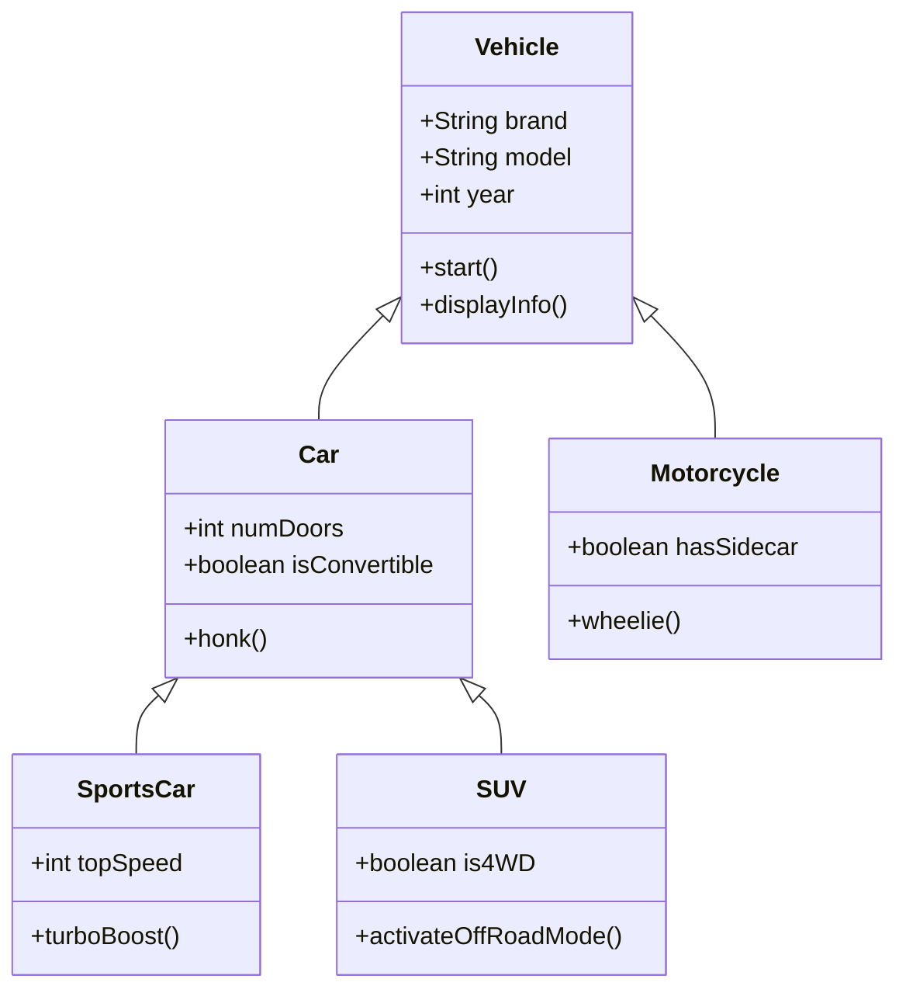
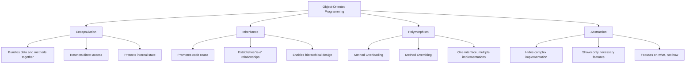

# OOP Principles

## Introduction

Object-Oriented Programming (OOP) is a programming paradigm that uses "objects" to design applications and computer programs. It utilizes several techniques like inheritance, polymorphism, encapsulation, and abstraction. These principles help developers create modular, reusable, and easier-to-maintain code.

In this guide, we'll explore the four main principles of OOP that form the foundation of object-oriented design:

1. Encapsulation
2. Inheritance
3. Polymorphism
4. Abstraction

Let's dive into each principle with clear explanations and practical examples.

## Encapsulation

### What is Encapsulation?

Encapsulation is the bundling of data and methods that operate on that data within a single unit (class). It restricts direct access to an object's components and prevents unintended interference.

Think of encapsulation as a protective wrapper that:
- Keeps the data and code safe from outside interference
- Prevents misuse
- Makes maintenance easier

### How Encapsulation Works

Encapsulation typically involves:
1. Making fields private to prevent direct access
2. Providing public getter and setter methods to access and modify these fields

### Code Example

```java
// Without encapsulation
class StudentBad {
    public String name;
    public int age;
    public double grade;
}

// With encapsulation
class Student {
    // Private attributes
    private String name;
    private int age;
    private double grade;
    
    // Constructor
    public Student(String name, int age) {
        this.name = name;
        this.setAge(age); // Using setter for validation
        this.grade = 0.0;
    }
    
    // Getter methods
    public String getName() {
        return name;
    }
    
    public int getAge() {
        return age;
    }
    
    public double getGrade() {
        return grade;
    }
    
    // Setter methods
    public void setName(String name) {
        this.name = name;
    }
    
    public void setAge(int age) {
        // Validation logic
        if (age > 0 && age < 120) {
            this.age = age;
        } else {
            throw new IllegalArgumentException("Invalid age");
        }
    }
    
    public void setGrade(double grade) {
        if (grade >= 0 && grade <= 100) {
            this.grade = grade;
        } else {
            throw new IllegalArgumentException("Grade must be between 0 and 100");
        }
    }
}
```

### Real-World Example

In a banking application, a `BankAccount` class would encapsulate account details and balance. It would provide methods like `deposit()` and `withdraw()` while keeping the actual balance private to prevent direct manipulation.

```java
class BankAccount {
    private String accountNumber;
    private double balance;
    private String ownerName;
    
    // Constructor and getters omitted for brevity
    
    public void deposit(double amount) {
        if (amount > 0) {
            balance += amount;
            System.out.println("Deposited: $" + amount);
            System.out.println("New balance: $" + balance);
        } else {
            throw new IllegalArgumentException("Cannot deposit negative amount");
        }
    }
    
    public void withdraw(double amount) {
        if (amount > 0 && amount <= balance) {
            balance -= amount;
            System.out.println("Withdrawn: $" + amount);
            System.out.println("Remaining balance: $" + balance);
        } else {
            throw new IllegalArgumentException("Invalid withdrawal amount");
        }
    }
}
```

## Inheritance

### What is Inheritance?

Inheritance is a mechanism where a new class (subclass/derived class) is derived from an existing class (superclass/base class). The subclass inherits attributes and methods from the superclass, enabling code reuse and establishing a relationship between classes.

### Benefits of Inheritance

- **Code Reusability**: Reuse fields and methods of the existing class
- **Extensibility**: Add new features without modifying existing code
- **Hierarchical Classification**: Create a logical structure for your classes

### Code Example

```java
// Base class
class Vehicle {
    protected String brand;
    protected String model;
    protected int year;
    
    public Vehicle(String brand, String model, int year) {
        this.brand = brand;
        this.model = model;
        this.year = year;
    }
    
    public void displayInfo() {
        System.out.println("Brand: " + brand);
        System.out.println("Model: " + model);
        System.out.println("Year: " + year);
    }
    
    public void start() {
        System.out.println("The vehicle is starting...");
    }
}

// Derived class
class Car extends Vehicle {
    private int numDoors;
    private boolean isConvertible;
    
    public Car(String brand, String model, int year, int numDoors, boolean isConvertible) {
        super(brand, model, year); // Call to parent constructor
        this.numDoors = numDoors;
        this.isConvertible = isConvertible;
    }
    
    // Override parent method
    @Override
    public void displayInfo() {
        super.displayInfo(); // Call parent method
        System.out.println("Number of doors: " + numDoors);
        System.out.println("Convertible: " + (isConvertible ? "Yes" : "No"));
    }
    
    // New method specific to Car
    public void honk() {
        System.out.println("Beep beep!");
    }
}
```

### Usage Example

```java
public class Main {
    public static void main(String[] args) {
        // Create a Car object
        Car myCar = new Car("Toyota", "Corolla", 2022, 4, false);
        
        // Use methods from parent class
        myCar.start();
        
        // Use overridden method
        myCar.displayInfo();
        
        // Use method specific to Car
        myCar.honk();
    }
}
```

**Output:**
```
The vehicle is starting...
Brand: Toyota
Model: Corolla
Year: 2022
Number of doors: 4
Convertible: No
Beep beep!
```

### Inheritance Hierarchies

You can create multi-level inheritance hierarchies to represent complex relationships:



## Polymorphism

### What is Polymorphism?

Polymorphism means "many forms" and occurs when we have many classes related to each other by inheritance. It allows us to perform a single action in different ways.

There are two types of polymorphism:
1. **Compile-time (Method Overloading)**: Same method name with different parameters
2. **Runtime (Method Overriding)**: Subclass provides a specific implementation of a method defined in its parent class

### Method Overloading Example

```java
class Calculator {
    // Method with 2 integer parameters
    public int add(int a, int b) {
        return a + b;
    }
    
    // Method with 3 integer parameters
    public int add(int a, int b, int c) {
        return a + b + c;
    }
    
    // Method with 2 double parameters
    public double add(double a, double b) {
        return a + b;
    }
}
```

### Method Overriding Example

```java
// Base class
class Animal {
    public void makeSound() {
        System.out.println("Animal makes a sound");
    }
}

// Derived classes
class Dog extends Animal {
    @Override
    public void makeSound() {
        System.out.println("Dog barks: Woof Woof!");
    }
}

class Cat extends Animal {
    @Override
    public void makeSound() {
        System.out.println("Cat meows: Meow Meow!");
    }
}

class Cow extends Animal {
    @Override
    public void makeSound() {
        System.out.println("Cow moos: Moo Moo!");
    }
}
```

### Real-World Application

```java
public class Main {
    public static void main(String[] args) {
        // Array of Animal references
        Animal[] animals = new Animal[3];
        animals[0] = new Dog();
        animals[1] = new Cat();
        animals[2] = new Cow();
        
        // Polymorphic behavior
        for (Animal animal : animals) {
            animal.makeSound(); // Each animal makes its own sound
        }
    }
}
```

**Output:**
```
Dog barks: Woof Woof!
Cat meows: Meow Meow!
Cow moos: Moo Moo!
```

### Benefits of Polymorphism

- **Code Flexibility**: Write methods that can work with parent or any child class
- **Extensibility**: Add new implementations without changing existing code
- **Simplified Code**: Less code duplication and better organization

## Abstraction

### What is Abstraction?

Abstraction is the concept of hiding complex implementation details and showing only the necessary features of an object. It reduces complexity by hiding unnecessary details from the user.

### Ways to Achieve Abstraction

1. **Abstract Classes**: Cannot be instantiated but can be subclassed
2. **Interfaces**: Contract that classes must implement
3. **Encapsulation**: Hiding internal state and requiring all interaction to be performed through well-defined methods

### Abstract Class Example

```java
// Abstract class
abstract class Shape {
    protected String color;
    
    public Shape(String color) {
        this.color = color;
    }
    
    // Abstract method (no implementation)
    public abstract double calculateArea();
    
    // Concrete method
    public void displayColor() {
        System.out.println("Color: " + color);
    }
}

// Concrete classes
class Circle extends Shape {
    private double radius;
    
    public Circle(String color, double radius) {
        super(color);
        this.radius = radius;
    }
    
    @Override
    public double calculateArea() {
        return Math.PI * radius * radius;
    }
}

class Rectangle extends Shape {
    private double length;
    private double width;
    
    public Rectangle(String color, double length, double width) {
        super(color);
        this.length = length;
        this.width = width;
    }
    
    @Override
    public double calculateArea() {
        return length * width;
    }
}
```

### Interface Example

```java
// Interface
interface Drawable {
    void draw(); // By default, interface methods are abstract
    
    // Default method (Java 8+)
    default void display() {
        System.out.println("Displaying the drawable object");
    }
}

// Classes implementing the interface
class Circle implements Drawable {
    private double radius;
    
    public Circle(double radius) {
        this.radius = radius;
    }
    
    @Override
    public void draw() {
        System.out.println("Drawing a circle with radius: " + radius);
    }
}

class Rectangle implements Drawable {
    private double length;
    private double width;
    
    public Rectangle(double length, double width) {
        this.length = length;
        this.width = width;
    }
    
    @Override
    public void draw() {
        System.out.println("Drawing a rectangle with length: " + length + " and width: " + width);
    }
}
```

### Real-World Example: Drawing Application

```java
public class DrawingApp {
    public static void main(String[] args) {
        // Create an array of Drawable objects
        Drawable[] shapes = new Drawable[3];
        shapes[0] = new Circle(5.0);
        shapes[1] = new Rectangle(4.0, 6.0);
        shapes[2] = new Circle(3.5);
        
        // Draw all shapes
        for (Drawable shape : shapes) {
            shape.draw();
        }
    }
}
```

**Output:**
```
Drawing a circle with radius: 5.0
Drawing a rectangle with length: 4.0 and width: 6.0
Drawing a circle with radius: 3.5
```

## Putting It All Together: The Four Pillars

Let's visualize how the four principles of OOP work together:



## Benefits of OOP Principles

When used correctly, OOP principles provide numerous benefits:

1. **Modularity**: Systems can be broken down into smaller, manageable parts
2. **Reusability**: Code can be reused through inheritance
3. **Maintainability**: Easier to modify and maintain code
4. **Security**: Data hiding through encapsulation
5. **Flexibility and Extensibility**: Add new features without modifying existing code
6. **Problem Solving**: Models real-world entities and their relationships

## Real-World Application: Library Management System

Let's see how OOP principles would apply to a simple library management system:

- **Encapsulation**: Book class encapsulates details like title, author, ISBN
- **Inheritance**: Different types of resources (Book, Journal, DVD) inherit from a base LibraryItem class
- **Polymorphism**: Different checkout procedures for different item types
- **Abstraction**: Hide complex processes like database interactions behind simple methods

**Class Structure:**

```java
// Abstract base class
abstract class LibraryItem {
    private String title;
    private String itemId;
    private boolean checkedOut;
    
    // Constructor, getters and setters...
    
    public abstract int getLoanPeriod(); // Different items have different loan periods
    
    public void checkOut() {
        if (!checkedOut) {
            checkedOut = true;
            System.out.println("Item " + itemId + " has been checked out.");
            System.out.println("Return within " + getLoanPeriod() + " days.");
        } else {
            System.out.println("Item is already checked out.");
        }
    }
    
    public void returnItem() {
        if (checkedOut) {
            checkedOut = false;
            System.out.println("Item " + itemId + " has been returned.");
        } else {
            System.out.println("Item was not checked out.");
        }
    }
}

// Derived classes
class Book extends LibraryItem {
    private String author;
    private int pages;
    private String isbn;
    
    @Override
    public int getLoanPeriod() {
        return 21; // Books can be borrowed for 21 days
    }
}

class DVD extends LibraryItem {
    private int duration; // in minutes
    private String director;
    
    @Override
    public int getLoanPeriod() {
        return 7; // DVDs can be borrowed for 7 days
    }
}

class Journal extends LibraryItem {
    private int volume;
    private int issue;
    
    @Override
    public int getLoanPeriod() {
        return 14; // Journals can be borrowed for 14 days
    }
}
```

## Summary

Object-Oriented Programming principles provide a powerful framework for designing software that's modular, reusable, and maintainable. The four main principles are:

1. **Encapsulation**: Bundling data and methods that operate on the data within a single unit and restricting direct access to some of an object's components.

2. **Inheritance**: A mechanism where a new class is derived from an existing class, promoting code reuse and establishing a relationship between classes.

3. **Polymorphism**: The ability to present the same interface for different underlying forms (data types), allowing objects of different classes to be treated as objects of a common superclass.

4. **Abstraction**: The concept of hiding complex implementation details and showing only the necessary features of an object.

By understanding and applying these principles, you can write code that is better organized, easier to maintain, and more closely models the real world.

## Exercises

1. Create a simple `Person` class that demonstrates encapsulation by keeping personal details private with appropriate getters and setters.

2. Design a `Vehicle` hierarchy with at least three levels of inheritance (e.g., Vehicle → Car → SportsCar).

3. Implement a shape calculator that uses polymorphism to calculate the area of different shapes (Circle, Rectangle, Triangle).

4. Design an abstract `Employee` class and create concrete implementations for different types of employees (FullTime, PartTime, Contractor).

5. Create a simple banking system that demonstrates all four OOP principles working together.

## Additional Resources

- **Books**:
  - "Clean Code" by Robert C. Martin
  - "Head First Design Patterns" by Eric Freeman & Elisabeth Robson
  - "Effective Java" by Joshua Bloch

- **Online Tutorials**:
  - Object-Oriented Programming in [your favorite language]
  - Design Patterns for OOP
  - SOLID Principles (an extension of OOP principles)

- **Practice**:
  - Try to identify OOP principles in applications you use daily
  - Refactor an existing procedural program to use OOP principles