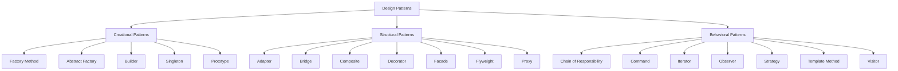

# Design Patterns Overview

## Introduction

Design patterns are proven solutions to common problems that occur in software design. They represent best practices that have evolved over time as developers have found effective ways to solve recurring design challenges. Think of design patterns as templates for how to solve a problem that can be used in many different situations.

Design patterns help you build software that is:
- Flexible and easy to maintain
- Reusable and robust
- Easier to understand and communicate with other developers

## Why Learn Design Patterns?

As a beginner programmer, you might wonder why you should invest time in learning design patterns. Here are some compelling reasons:

1. **Avoid reinventing the wheel** - These patterns represent solutions that experienced developers have refined over many years
2. **Improve code quality** - Following established patterns leads to cleaner, more maintainable code
3. **Develop a common vocabulary** - Understanding design patterns gives you terminology to communicate complex design ideas quickly
4. **Prepare for real-world development** - Design patterns are widely used in professional software development

## Categories of Design Patterns

Design patterns typically fall into three main categories:

### 1. Creational Patterns

These patterns deal with object creation mechanisms, trying to create objects in a manner suitable to the situation.

### 2. Structural Patterns

These patterns focus on how classes and objects are composed to form larger structures.

### 3. Behavioral Patterns

These patterns are concerned with algorithms and the assignment of responsibilities between objects.

Let's visualize these categories:



## Common Design Patterns for Beginners

Let's explore a few of the most commonly used design patterns that are especially useful for beginners:

### Singleton Pattern (Creational)

The Singleton pattern ensures a class has only one instance and provides a global point of access to it.

#### Example in JavaScript:

```javascript
class DatabaseConnection {
  constructor() {
    if (DatabaseConnection.instance) {
      return DatabaseConnection.instance;
    }
    
    this.connectionString = "mongodb://localhost:27017/myapp";
    this.isConnected = false;
    DatabaseConnection.instance = this;
  }

  connect() {
    if (!this.isConnected) {
      console.log(`Connecting to database: ${this.connectionString}`);
      this.isConnected = true;
    } else {
      console.log("Already connected to database!");
    }
  }
}

// Usage example
const connection1 = new DatabaseConnection();
const connection2 = new DatabaseConnection();

console.log(connection1 === connection2); // Output: true

connection1.connect(); // Output: Connecting to database: mongodb://localhost:27017/myapp
connection2.connect(); // Output: Already connected to database!
```

**When to use:** Use the Singleton pattern when you need exactly one instance of a class that is accessible from many parts of your application (like database connections, configuration managers, or logging services).

### Factory Method Pattern (Creational)

The Factory Method pattern defines an interface for creating an object but lets subclasses decide which class to instantiate.

#### Example in Python:

```python
from abc import ABC, abstractmethod

# Product interface
class Button(ABC):
    @abstractmethod
    def render(self):
        pass
    
    @abstractmethod
    def on_click(self):
        pass

# Concrete products
class HTMLButton(Button):
    def render(self):
        return "<button>HTML Button</button>"
    
    def on_click(self):
        return "HTML button clicked!"

class WindowsButton(Button):
    def render(self):
        return "[Windows Button]"
    
    def on_click(self):
        return "Windows button clicked!"

# Creator
class Dialog(ABC):
    @abstractmethod
    def create_button(self) -> Button:
        pass
    
    def render(self):
        # Call factory method to create a button
        button = self.create_button()
        return f"Dialog rendering: {button.render()}"

# Concrete creators
class HTMLDialog(Dialog):
    def create_button(self) -> Button:
        return HTMLButton()

class WindowsDialog(Dialog):
    def create_button(self) -> Button:
        return WindowsButton()

# Client code
def client_code(dialog: Dialog):
    print(dialog.render())
    button = dialog.create_button()
    print(button.on_click())

# Usage example
if __name__ == "__main__":
    print("App: Launched with HTML dialog.")
    client_code(HTMLDialog())
    print("App: Launched with Windows dialog.")
    client_code(WindowsDialog())

# Output:
# App: Launched with HTML dialog.
# Dialog rendering: <button>HTML Button</button>
# HTML button clicked!
#
# App: Launched with Windows dialog.
# Dialog rendering: [Windows Button]
# Windows button clicked!
```

**When to use:** Use the Factory Method when you don't know beforehand the exact types and dependencies of the objects your code should work with, or when you want to provide users of your library or framework a way to extend its internal components.

### Observer Pattern (Behavioral)

The Observer pattern defines a one-to-many dependency between objects so that when one object changes state, all its dependents are notified and updated automatically.

#### Example in Java:

```java
import java.util.ArrayList;
import java.util.List;

// Subject interface
interface Subject {
    void registerObserver(Observer observer);
    void removeObserver(Observer observer);
    void notifyObservers();
}

// Observer interface
interface Observer {
    void update(String message);
}

// Concrete Subject
class NewsPublisher implements Subject {
    private List<Observer> observers = new ArrayList<>();
    private String latestNews;

    public void registerObserver(Observer observer) {
        observers.add(observer);
    }

    public void removeObserver(Observer observer) {
        observers.remove(observer);
    }

    public void notifyObservers() {
        for (Observer observer : observers) {
            observer.update(latestNews);
        }
    }

    public void publishNews(String news) {
        this.latestNews = news;
        notifyObservers();
    }
}

// Concrete Observer
class NewsSubscriber implements Observer {
    private String name;

    public NewsSubscriber(String name) {
        this.name = name;
    }

    public void update(String message) {
        System.out.println(name + " received news: " + message);
    }
}

// Usage example
public class ObserverPatternDemo {
    public static void main(String[] args) {
        NewsPublisher publisher = new NewsPublisher();
        
        NewsSubscriber subscriber1 = new NewsSubscriber("Subscriber 1");
        NewsSubscriber subscriber2 = new NewsSubscriber("Subscriber 2");
        NewsSubscriber subscriber3 = new NewsSubscriber("Subscriber 3");
        
        publisher.registerObserver(subscriber1);
        publisher.registerObserver(subscriber2);
        publisher.registerObserver(subscriber3);
        
        publisher.publishNews("Breaking News: Design Patterns are awesome!");
        
        // Output:
        // Subscriber 1 received news: Breaking News: Design Patterns are awesome!
        // Subscriber 2 received news: Breaking News: Design Patterns are awesome!
        // Subscriber 3 received news: Breaking News: Design Patterns are awesome!
        
        publisher.removeObserver(subscriber2);
        
        publisher.publishNews("Update: You should learn the Observer pattern first!");
        
        // Output:
        // Subscriber 1 received news: Update: You should learn the Observer pattern first!
        // Subscriber 3 received news: Update: You should learn the Observer pattern first!
    }
}
```

**When to use:** Use the Observer pattern when changes to the state of one object may require changing other objects, and the actual set of objects is unknown beforehand or changes dynamically.

### Strategy Pattern (Behavioral)

The Strategy pattern defines a family of algorithms, encapsulates each one, and makes them interchangeable. Strategy lets the algorithm vary independently from clients that use it.

#### Example in TypeScript:

```typescript
// Strategy interface
interface PaymentStrategy {
    pay(amount: number): void;
}

// Concrete strategies
class CreditCardPayment implements PaymentStrategy {
    private cardNumber: string;
    private name: string;
    private cvv: string;
    private dateOfExpiry: string;
    
    constructor(cardNumber: string, name: string, cvv: string, dateOfExpiry: string) {
        this.cardNumber = cardNumber;
        this.name = name;
        this.cvv = cvv;
        this.dateOfExpiry = dateOfExpiry;
    }
    
    pay(amount: number): void {
        console.log(`${amount} paid with credit card ending with ${this.cardNumber.slice(-4)}`);
    }
}

class PayPalPayment implements PaymentStrategy {
    private email: string;
    private password: string;
    
    constructor(email: string, password: string) {
        this.email = email;
        this.password = password;
    }
    
    pay(amount: number): void {
        console.log(`${amount} paid using PayPal account: ${this.email}`);
    }
}

class BitcoinPayment implements PaymentStrategy {
    private address: string;
    
    constructor(address: string) {
        this.address = address;
    }
    
    pay(amount: number): void {
        console.log(`${amount} paid to Bitcoin address: ${this.address}`);
    }
}

// Context
class ShoppingCart {
    private items: { name: string; price: number }[] = [];
    
    addItem(name: string, price: number): void {
        this.items.push({ name, price });
    }
    
    calculateTotal(): number {
        return this.items.reduce((total, item) => total + item.price, 0);
    }
    
    checkout(paymentStrategy: PaymentStrategy): void {
        const amount = this.calculateTotal();
        paymentStrategy.pay(amount);
    }
}

// Usage example
const cart = new ShoppingCart();
cart.addItem("Item 1", 100);
cart.addItem("Item 2", 50);

// Pay with different strategies
cart.checkout(new CreditCardPayment("1234567890123456", "John Doe", "123", "12/2025"));
// Output: 150 paid with credit card ending with 3456

cart.checkout(new PayPalPayment("john.doe@example.com", "password"));
// Output: 150 paid using PayPal account: john.doe@example.com

cart.checkout(new BitcoinPayment("1A1zP1eP5QGefi2DMPTfTL5SLmv7DivfNa"));
// Output: 150 paid to Bitcoin address: 1A1zP1eP5QGefi2DMPTfTL5SLmv7DivfNa
```

**When to use:** Use the Strategy pattern when you want to define a family of algorithms, encapsulate each one, and make them interchangeable. Strategy lets the algorithm vary independently from clients that use it.

## Benefits of Using Design Patterns

By incorporating design patterns into your code, you can enjoy several benefits:

1. **Code reusability**: Design patterns provide templates that can be repeated in different contexts
2. **Established solutions**: They solve common problems that have been encountered by many developers
3. **Scalable architecture**: Well-designed patterns help your application scale as requirements grow
4. **Improved team communication**: Patterns give developers a shared vocabulary to discuss design
5. **Reduced complexity**: Good patterns simplify complex interactions in your software

## Common Anti-Patterns to Avoid

While learning design patterns, it's also useful to understand anti-patterns - common approaches that appear to be beneficial but end up creating more problems:

1. **Singleton Overuse**: Using singletons for everything, creating global state that's difficult to manage
2. **The God Object**: Creating a class that knows or does too much
3. **Spaghetti Code**: Writing tangled, unstructured code without clear separation of concerns
4. **Reinventing the Wheel**: Building custom solutions for problems that existing patterns already solve well

## How to Learn and Apply Design Patterns

Here are some practical steps for beginners to become proficient with design patterns:

1. **Start with the basics**: Focus on understanding a few patterns thoroughly before trying to learn all of them
2. **Look for patterns in existing code**: Examine open-source projects to see how patterns are used in real code
3. **Practice implementing patterns**: The best way to learn is by building small projects using different patterns
4. **Refactor existing code**: Try to identify places where you can apply patterns to improve your code
5. **Discuss with others**: Join communities where you can discuss and get feedback on your pattern implementations

## Summary

Design patterns are essential tools for any programmer looking to write maintainable, reusable, and elegant code. By understanding the problems each pattern solves and when to apply them, you'll be able to make better design decisions and communicate more effectively with other developers.

Remember that patterns are guidelines, not strict rules. Always evaluate whether a pattern truly solves your specific problem before implementing it. Sometimes a simpler solution might be more appropriate than applying a complex pattern.

## Exercises

1. Identify a real-world scenario where the Singleton pattern would be appropriate and implement it in your preferred language.
2. Refactor a piece of code that creates objects directly to use the Factory Method pattern instead.
3. Implement the Observer pattern to create a simple weather station that notifies multiple display devices when the weather changes.
4. Choose an application you use daily and try to identify which design patterns might have been used in its development.
5. Create a simple text editor that uses the Strategy pattern to implement different text formatting options.

## Further Resources

- "Design Patterns: Elements of Reusable Object-Oriented Software" by Erich Gamma, Richard Helm, Ralph Johnson, and John Vlissides (the "Gang of Four")
- "Head First Design Patterns" by Eric Freeman and Elisabeth Robson
- "Refactoring to Patterns" by Joshua Kerievsky
- Online platforms like Refactoring Guru (refactoring.guru) that provide detailed explanations of design patterns with examples